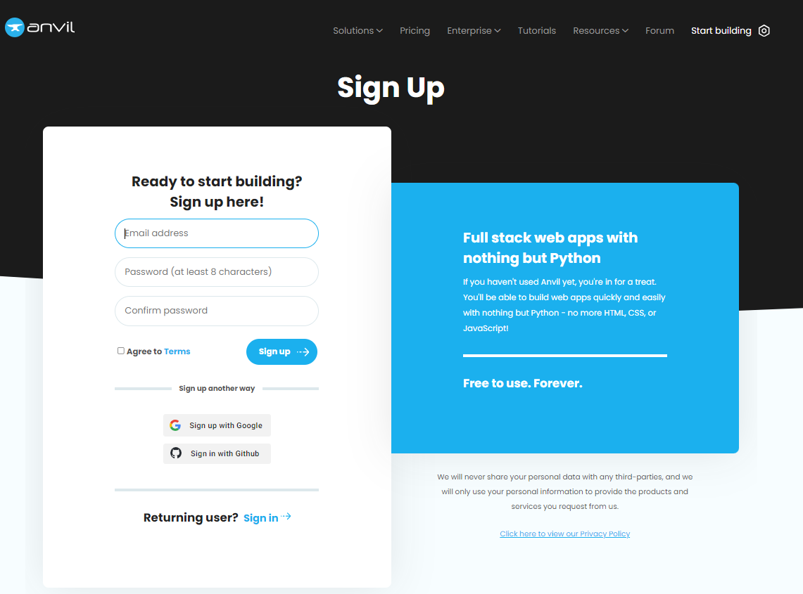

====================================================
Anvil Introduction
====================================================

Sign up
------------------------------

Sign up for free at Anvil:
Go to https://anvil.works/login
Click: Sign up for free, create a login and click: Sign up.

----

App editor
------------------------------

| The build page will open after signing in: https://anvil.works/build
| Click: Create a new app to start building a new app.

----

Key references:
---------------------

| docs: https://anvil.works/docs/overview
| anvil module: https://anvil.works/docs/api/anvil
| quick start: https://anvil.works/docs/client/quickstart
| user interface: https://anvil.works/docs/client/ui
| client side python: https://anvil.works/docs/client/python
| anvil components and events: https://anvil.works/docs/client/components

