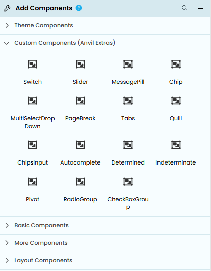
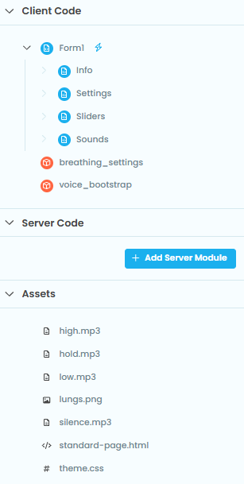
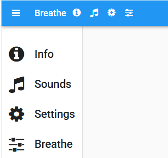
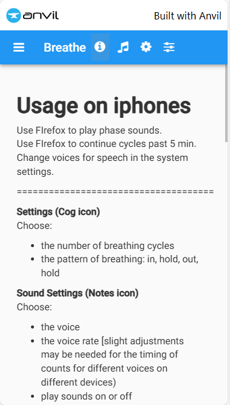
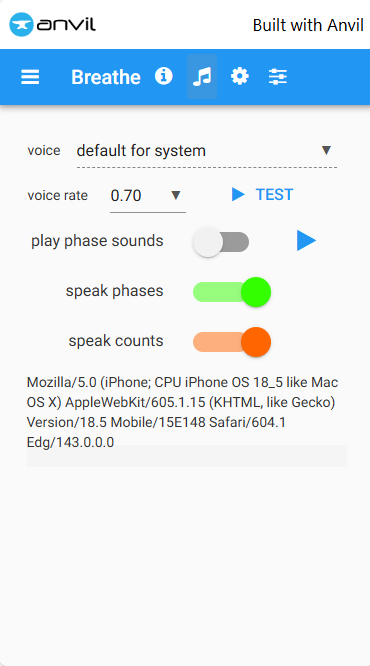
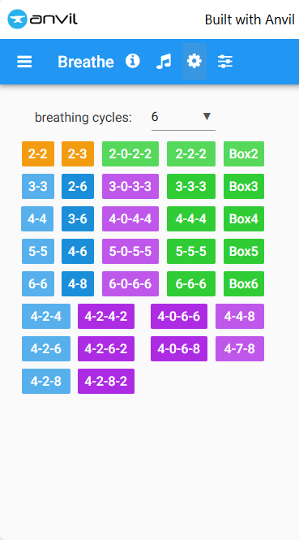
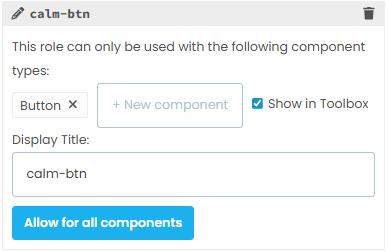

====================================================
Breathe
====================================================

| This app provides timers for breath training.

.. image:: images/breathe/sliders.png
    :scale: 100

----

App Theme
--------------

| Go to `<https://anvil.works/build>`_
| Click Create a new app.
| Choose the Material Design theme.

----

Settings
--------------

| In General Settings set the App Name to "Breathe" and add a logo that has ot be first added to assets.
| In Settings: Dependencies, in order to get the switch and slider components from Anvil extras,  add:
| dependency: C6ZZPAPN4YYF5NVJ
| package name: anvil-extras

The anvil extras components will now be available in the toolbox.

----

Assets
-----------

| The html and css are added to the assets folder on creating the app.
| The other assets used in this app are shown below.
| They are added by hovering over the three dots button to the right of Assets in the sidebar menu.
| The png file is used as a logo.
| The mp3 files are short 1 seconds long sound files for the inhale and exhale sounds.

----

Forms and modules
--------------------

| Create the forms and modules shown above.

----

From1
----------------

| Form1 is the main form for the app.
| The design view of Form1 is shown below.
| The components are links with icons set and click event handlers added.

| The python code for Form1 is shown below.
| The import of the sound module is to load voices for windows users.

.. literalinclude:: pythonfiles/breathe/Form1.py
   :language: python
   :linenos:

----

Info form
----------------

| The design view of Info form is shown below.

| The markdown text for the info text is shown below.

.. literalinclude:: pythonfiles/breathe/info.md
   :language: markdown
   :linenos:

----

Sounds form
----------------

| Use the sounds form to set speech voice on windows. On iphones, go so system settings to set voice.
| Set the voice rate to suit your device.
| Breathing phase sounds can only work on windows devices and Firefox browser on iphone or ipad.
| Choose whether to speak the inhale and exhale prompts and the breathing counts.

| The design view of Sounds form is shown below.
| Use an XY panel to place the labels, dropdown and switches precisely.
| The switches have custom css to modify their appearance from the anvil extras default.

| The python code for Sounds is shown below.

.. literalinclude:: pythonfiles/breathe/sounds.py
   :language: python
   :linenos:

----

Settings form
----------------

| Use the settings form to set the number of breathing cycles and the durations of the inhale, hold and exhale phases.

| The design view of Settings form is shown below.
| Use an XY panel to place the labels, dropdown and buttons precisely.
| The buttons and the dropdown have click event handlers as shown in the python below.
| The buttons have custom roles and css to modify their appearance.

| The python code for Settings is shown below.

.. literalinclude:: pythonfiles/breathe/settings.py
   :language: python
   :linenos:

----

Sliders form
----------------

| Use the sliders form to set the manually adjust the the durations of the inhale, hold and exhale phases.
| Use the sliders form to start, pause and stop the breathing slider animations.

| The design view of Sliders form is shown below.
| Use an XY panel to place the labels, dropdown and buttons precisely.
| The buttons have custom roles and css to modify their appearance.

.. image:: images/breathe/sliders.png
    :scale: 100

| The python code for Sliders is shown below.

.. literalinclude:: pythonfiles/breathe/sliders.py
   :language: python
   :linenos:

----

breathing_settings module
-------------------------------

| Use breathing_settings module to store and retrieve the breathing settings for the app.
| The python code for breathing_settings is shown below.

.. literalinclude:: pythonfiles/breathe/breathing_settings.py
   :language: python
   :linenos:

----

voice_bootstrap module
-------------------------------

| Use voice_bootstrap module to set the voice and rate for speech.
| The python code for voice_bootstrap is shown below.

.. literalinclude:: pythonfiles/breathe/voice_bootstrap.py
   :language: python
   :linenos:

----

Theme: Roles
--------------

| To customize button colours efficiently add roles via the Theme Editor.
| The names of new roles appear in the role dropdowns for components to easily assign them for custom css.
| An example is shown below.

Custom css
-----------------

| Custom css for the roles is added into a theme css file in the assets folder.
| Custom css for the sliders and switches from anvil extras is also added here.

.. literalinclude:: pythonfiles/breathe/roles.css
   :language: css
   :linenos:

