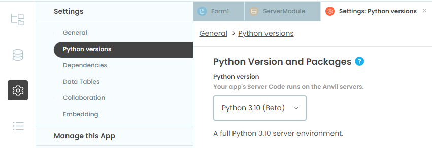
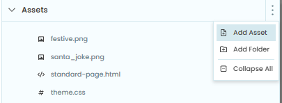
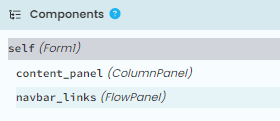
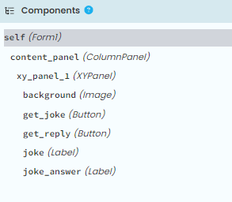
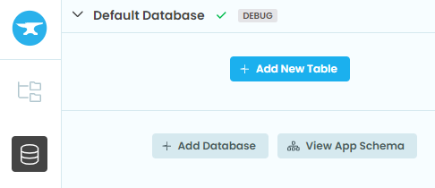
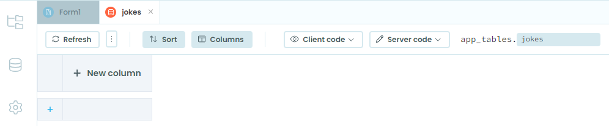
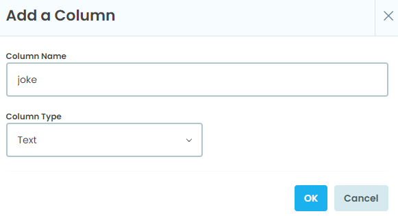
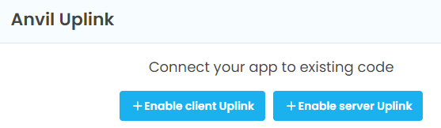
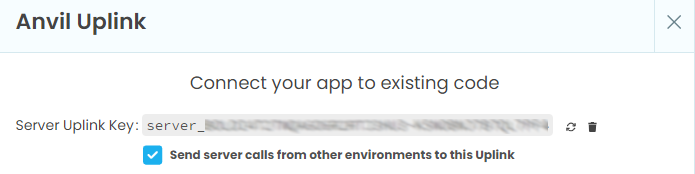
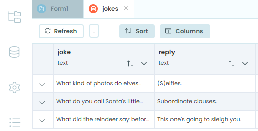

====================================================
Christmas Jokes
====================================================

| This app displays christmas themed jokes.
| It uses a data table created by python using an uplink.

----

App Theme
--------------

| Go to `<https://anvil.works/build>`_
| Click Create a new app.
| In the Choose Theme window choose Material Design 3.
| Set the python environment to the latest version.

----

Assets
-----------

| Add image files to assets. First click on the 3 vertical dots to reveal the menu and choose **Add Asset**. In the Add Asset window, click **Choose file** and navigate to the image file to add.
| Add an image to be used as the background.
| festive.png is the image shown in the assets below.
| Add an image to be used as the favicon in the browser tab.
| santa_joke.png is the image shown in the assets below.

Components
----------------

The initial components are shown below.

| Delete the navbar_links FlowPanel.
| Add the components below.
| The final components are shown below.

| Add an XYPanel to the content_panel. Set this width to 320 and height to 400.
| Add an image, then 2 buttons and 2 labels to the XYPanel.

| In the image properties name it (self.)back_image.
| Set its display_mode to zoom_to_fill.
| Set the source to _/theme/festive.png
| Set its width to 300, with x set to 0, and y set to 0.

| Add a button. Name it (self.)get_joke.
| Set its text property to "Get a new joke".
| Set its role to filled-button.
| Set its font size to 24.
| Set its width to 300, with x set to 0, and y set to 0.
| In its events property, set click to be "get_joke_click".

| Add a button. Name it (self.)get_reply.
| Set its text property to "Get reply".
| Set its role to tonal-button.
| Set its font size to 24.
| Set its width to 300, with x set to 0, and y set to 200.
| In its events property, set click to be "get_joke_reply_click".

| Add a text label. Name it (self.)joke.
| Set its foreground to theme:On Primary.
| Set its font size to 20.
| Set its width to 300, with x set to 0, and y set to 60.

| Add a text label. Name it (self.)joke_reply.
| Set its foreground to theme:On Secondary.
| Set its font size to 20.
| Set its width to 300, with x set to 0, and y set to 255.

----

Table of jokes
------------------

Create a new database table and name it "jokes".

| Set Client code access to search this table.
| Server code should be set to search, edit and delete.

| Add 2 New Columns.
| Name them "joke" and "reply".
| Set their column type to text in the **Add a Column** window.

| Enable the Uplink in the Anvil IDE using these steps.
| Click the + button in the sidebar menu and select Uplink.
| Click Enable Server Uplink.

| Copy the Server Uplink key and paste into a python script on your local machine.

| Run this code on your local machine. Make sure to have pasted in your server uplink key for ANVIL_UPLINK_KEY.
| Adjust the file path to the jokes file: ``file_path = 'christmas_jokes.txt'``

.. code-block:: python

    import anvil.server
    import csv
    from anvil.tables import app_tables

    # Specify the path to your tab-delimited text file
    file_path = 'christmas_jokes.txt'

    # Replace with your Anvil Uplink key
    ANVIL_UPLINK_KEY = "server_EK....................................F4"

    # Connect to the Anvil server

    anvil.server.connect(ANVIL_UPLINK_KEY)
    print("Uplink connected successfully.")  # Confirm connection

    @anvil.server.callable
    def add_joke_to_database(joke, reply):
        """
        Adds a joke and its reply to the Anvil database.
        """
        app_tables.jokes.add_row(joke=joke, reply=reply)

    def read_jokes_from_file(file_path):
        """
        Reads jokes and replies from a tab-delimited file and returns them as a list of tuples.
        """
        jokes = []
        with open(file_path, 'r', encoding='utf-8') as file:
            reader = csv.reader(file, delimiter='\t')
            for row in reader:
                if len(row) >= 2:  # Ensure the row has at least 2 columns
                    jokes.append((row[0], row[1]))
        return jokes

    def upload_jokes(file_path):
        """
        Reads jokes from a file and uploads them to the Anvil database.
        """
        jokes = read_jokes_from_file(file_path)
        for joke, reply in jokes:
            anvil.server.call('add_joke_to_database', joke, reply)
            print(f"Uploaded joke: {joke}")

    # Upload jokes to the database
    upload_jokes(file_path)

| The jokes table will now be filled with jokes.

----

Client Code first version
----------------------------

| Place the code below in the Form1 code.
| Run the code to check that it works.
| This code makes a call to the server for each new joke.

.. code-block:: python

    from ._anvil_designer import Form1Template
    from anvil import *
    import anvil.tables as tables
    import anvil.tables.query as q
    from anvil.tables import app_tables
    import anvil.server
    import random

    class Form1(Form1Template):
        def __init__(self, **properties):
            # Set Form properties and Data Bindings.
            self.init_components(**properties)
            self.joke_text = None
            self.joke_reply_text = None
            self.get_random_joke()

        def get_random_joke(self):
            # Fetch all jokes from the jokes table
            jokes = app_tables.jokes.search()
            # Select a random joke
            random_joke = random.choice(list(jokes))
            # Get the joke and reply from the selected row
            self.joke_text = random_joke['joke']
            self.joke_reply_text = random_joke['reply']
            # Display the joke
            self.place_joke(self.joke_text)

        def get_joke_click(self, **event_args):
            self.get_random_joke()

        def get_joke_reply_click(self, **event_args):
            self.place_joke_reply()

        def place_joke(self, joke_text):
            self.joke.text = joke_text
            self.joke_reply.text = ""

        def place_joke_reply(self):
            self.joke_reply.text = self.joke_reply_text

Code Notes
-----------------

1. Search Result Type: ``jokes = app_tables.jokes.search()``. Returns a search iterator, not a dictionary or list. You can iterate over it like a generator.

2. Lazy Evaluation: The search iterator fetches rows lazily, making it efficient for large datasets.

3. Converting to a List: ``jokes_list = list(app_tables.jokes.search())``

4. Random Row Example: ``random_joke = random.choice(jokes_list)``

5. Accessing Rows:  ``random_joke['joke'], random_joke['reply']``. Each row is dictionary-like.

----

Client Code final version
----------------------------

| Place the code below in the Form1 code.
| Run the code to check that it works.
| This code makes one call to the server to get all the jokes.
| It shuffles all the jokes and after all have been shown, reshuffles them.
| This guarantees no repeats until all jokes have been shown.

.. code-block:: python

    from ._anvil_designer import Form1Template
    from anvil import *
    import anvil.tables as tables
    import anvil.tables.query as q
    from anvil.tables import app_tables
    import anvil.server
    import random

    class Form1(Form1Template):
        def __init__(self, **properties):
            self.init_components(**properties)

            # Load all jokes into memory ONCE
            self.all_jokes = list(app_tables.jokes.search())

            # Create a shuffled deck of jokes
            self.shuffle_jokes()

            # Index of the next joke in the deck
            self.deck_index = 0

            # Current joke
            self.current_joke = None
            self.current_reply = None

            # Preloaded next joke
            self.next_joke = None
            self.next_reply = None

            # Preload and show first joke
            self.preload_next_joke()
            self.show_next_joke()

        # -----------------------------
        # SHUFFLE THE JOKES (no repeats)
        # -----------------------------
        def shuffle_jokes(self):
            self.joke_deck = self.all_jokes[:]   # copy
            random.shuffle(self.joke_deck)
            self.deck_index = 0

        # -----------------------------
        # PRELOAD NEXT JOKE (from deck)
        # -----------------------------
        def preload_next_joke(self):
            # If we've reached the end, reshuffle
            if self.deck_index >= len(self.joke_deck):
                self.shuffle_jokes()

            row = self.joke_deck[self.deck_index]
            self.deck_index += 1

            self.next_joke = row['joke']
            self.next_reply = row['reply']

        # -----------------------------
        # SHOW THE PRELOADED JOKE
        # -----------------------------
        def show_next_joke(self):
            self.current_joke = self.next_joke
            self.current_reply = self.next_reply

            self.joke.text = self.current_joke
            self.joke_reply.text = ""

            # Preload the next one immediately
            self.preload_next_joke()

        # -----------------------------
        # BUTTON HANDLERS
        # -----------------------------
        def get_joke_click(self, **event_args):
            self.show_next_joke()

        def get_joke_reply_click(self, **event_args):
            self.joke_reply.text = self.current_reply

