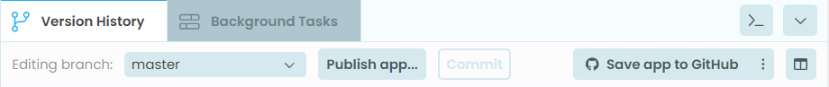

====================================================
Cloning via git
====================================================

Cloning an app via github
----------------------------

- In the Anvil app editor, click the **Version History**.
- On the right, click **Save app to GitHub**.
- A dialog will ask you to sign in to your GitHub account.
- In the **Choose account dialog** that follows, click **Choose account**.
- In the following **Choose account dialog** that follows, click **Public Repository** and **MIT licence**.
- In the following **Choose name dialog** that follows, type a suitable name for the GitHub repository.
- In the browser, log in at GitHub and navigate to the newly saved GitHub repository, open it and copy its url.
- In Anvil, go to `<https://anvil.works/build>`_. Under **Create a new app**, click **Clone form Github**.
- In the **Clone app from git** window that follows, paste in the copied github url.
- Under Authentication, in the same window, choose **Github Account**. Click **CLone App*.

----

Cloning an earlier version of an app in Anvil
------------------------------------------------------------

**1. Open the Anvil Editor and Load Your App**

- Go to [Anvil's website](`<https://anvil.works>`_).
- Log in to your account.
- Open the app you want to work with.

**2. Access Version History**

- In the app editor, find the **Version History** option:
  - This is usually represented by a clock icon in the sidebar menu.
  - Click on the clock icon to view the **Version History** of your app.
- Browse through the versions listed. Each version will have a timestamp and a commit message (if provided).
- Select the version you want to clone by clicking on it.

**3. Clone the Selected Version**

- After selecting the version, look for the **"Clone with Git"** option:
  - This is typically located in the **Version History** section or in the app settings.
  - Click on **"Clone with Git"** to generate a Git clone URL for that specific version of the app.
  - Copy the Git clone command provided.

**4. Set Up a New App**

  1. **Use Git to Clone the Selected Version**

     - Ensure you have Git installed on your local machine. If not, [download and install Git](`<https://git-scm.com/>`_).
     - Open a terminal or command prompt.
     - Navigate to the folder where you want to clone the app:

    .. code-block:: python

       cd /path/to/your/folder

     - Run the Git clone command for you copied:

    .. code-block:: terminal

       git clone `<https://your-anvil-app.git>`_

  2. **Push to the New App's Repository**:
     - After cloning, navigate into the cloned repository:

    .. code-block:: terminal

       cd your-anvil-app

     - Update the remote repository to the newly created app:

    .. code-block:: terminal

       git remote set-url origin `<https://new-anvil-app.git>`_

     - Push the cloned version to the new app:

    .. code-block:: terminal

       git push -u origin main

  3. **Create a New App**:
     - In the Anvil Editor, click **"Create New App"** to set up a new app.
     - Choose a template for the app. This is just a placeholder for now; you’ll overwrite this with your cloned version.

