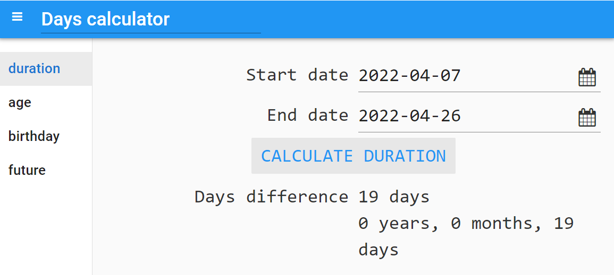
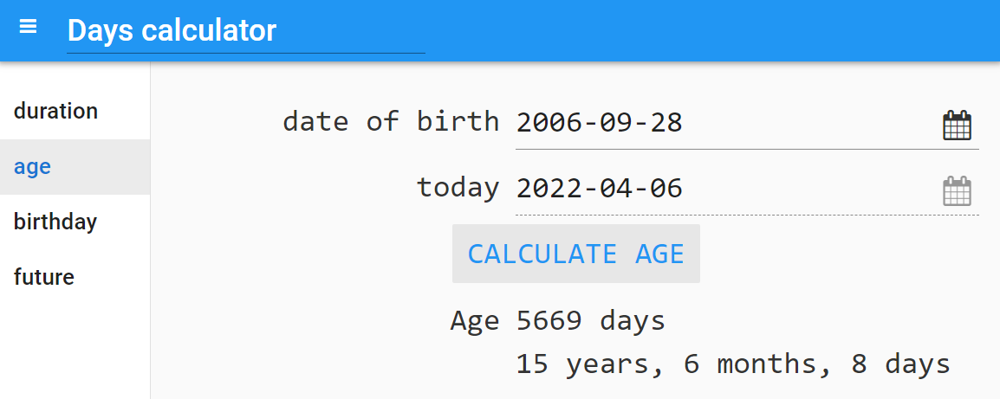
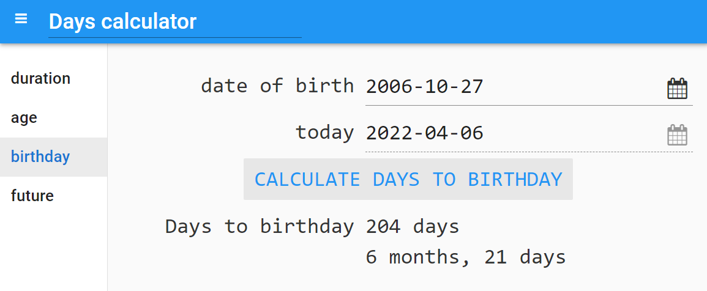
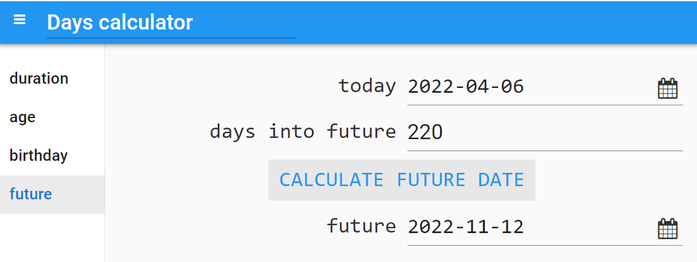

====================================================
Days Calculator
====================================================

This builds a days calculator to find the difference in days between 2 dates.

----

References
------------------------------

#. Python date time: `<https://www.w3schools.com/python/python_datetime.asp>`_
#. Python date differences: `<https://docs.python.org/3/library/datetime.html#examples-of-usage-timedelta>`_
#. Duration calculator: `<https://www.timeanddate.com/date/durationresult.html?d1=6&m1=4&y1=2018&d2=2&m2=4&y2=2022>`_
#. Future date calculator: `<https://www.timeanddate.com/date/dateadded.html?d1=8&m1=3&y1=2022&type=add&ay=&am=02&aw=&ad=3&rec=>`_

----

Design
---------

| Use the sidebar to navigate to 4 panels for different calculations.
| Here is the design for the 4 panels.

Get started
------------------------------

#. Go to: `<https://anvil.works/new-build>`_
#. Click: Blank App.
#. Choose: Material Design

----

Settings
------------------------------

| Enter the settings for app.

#. Click on the cog icon to show the settings tab.
#. Enter an App name. Days calculator
#. Enter an App title. Days calculator
#. Enter an App description. Calculate the number of days between dates.
#. Close the settings tab.

-----

| Click on **Client Code**. Click on the 3 vertical dots symbol **⋮**
| Add a module.
| Name it DateCalc.
| Paste in the code below to be used for the calculations.

DateCalc module code:
------------------------------

| Paste in the code below into the DateCalc module.
| The purpose of the module is to provide a function to calculate the difference in 2 dates in terms of the years, months, days difference. This is not provided by the python datetime module so is included here for convenience.
| The **calculate_years_months_days** function will take in 2 dates and return a tuple of the years, months, days difference.

.. code-block:: python

    import anvil.server
    import anvil.tables as tables
    import anvil.tables.query as q
    from anvil.tables import app_tables

    from datetime import date

    """calculate_years_months_days(d1, d2)
    e.g calculate_years_months_days(date(2006, 1, 1), date.today()) """

    # Number of days per month (except for February in leap years)
    mdays = [0, 31, 28, 31, 30, 31, 30, 31, 31, 30, 31, 30, 31]

    def isleap(year):
        """Return True for leap years, False for non-leap years."""
        return year % 4 == 0 and (year % 100 != 0 or year % 400 == 0)

    def number_of_days_in_month(date):
        """Return number of days (28-31) for year, month."""
        ndays = mdays[date.month] + (date.month == 2 and isleap(date.year))
        return ndays

    def end_month(date):
        date_end_month = date.replace(day=number_of_days_in_month(date))
        return date_end_month

    def start_month(date):
        date_start_of_month = date.replace(day=1)
        return date_start_of_month

    class DateCalc:

        def calculate_years_months_days(self, d1, d2):
            """d1 is the start date, d2 is the end date"""
            if d1 > d2:
                return (0, 0, 0)   # for convenience

            d1_end_month = end_month(d1)
            d2_start_month = start_month(d2)

            if d1.day > d2.day:
                years = d2_start_month.year - d1_end_month.year
                months = d2_start_month.month - d1_end_month.month - 1  # -1 since not full month
                days = (d1_end_month.day - d1.day) + (d2.day - d2_start_month.day) + 1  #+1 due to using end of month instead of next day
            else:
                years = d2.year - d1.year
                months = d2.month - d1.month
                days = d2.day - d1.day
            if months < 0:
                months += 12
                years -= 1
            return (years, months, days)

----

Sidebar
--------------------

| Place a column panel in the left sidebar.
| Add 4 link components.
| Set teh name of teh first to duration_link and its text to duration.

| Drag and drop a *link* component onto the column panel.
| In the properties panel: set the name to ``feedback_box``.
| In the properties panel: set the placeholder to ``Feedback here``.

