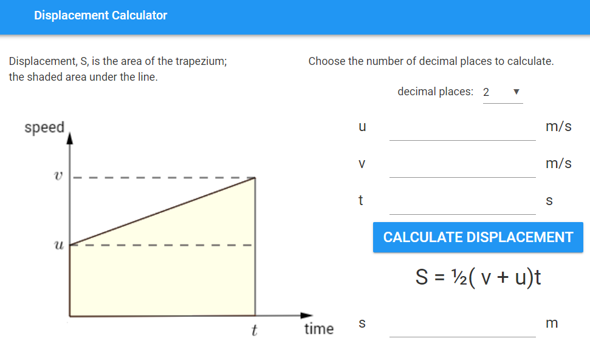
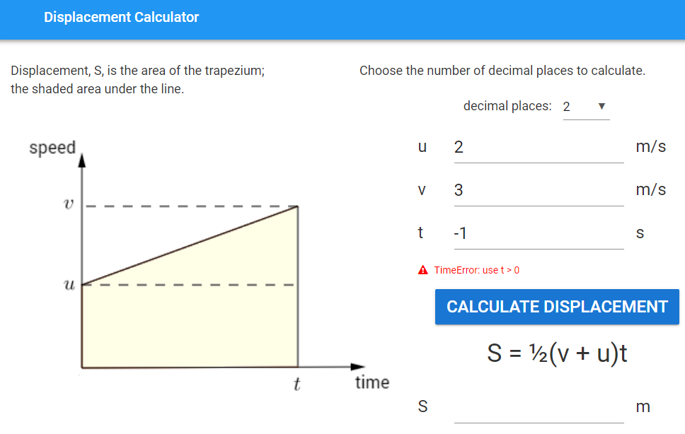

====================================================
Displacement calculator
====================================================

This app calculates the displacement, S, given u, v, and t.

| Working app at: https://pc-displacement-calculator.anvil.app

    
----

Get started
------------------------------

#. Go to: https://anvil.works/new-build
#. Click: Blank App.
#. Choose: Material Design

----

Design
------------------------------

| Use the diagram: :download:`Speed_time_graph <images/kinematics/Speed_time_graph.png>`
| Use a spacer to the right of the dropdown so it is spaced from the right edge.
| Display the formula: S = ½(v + u)t
| Use a capital S for displacement.

----

Key components
~~~~~~~~~~~~~~~~~~~~~~~~

| Name the input textboxes: **u**, **v** and **t**.
| Set each of the input textbox property **type** settings to **number**.

----

Decimal Places Dropdown 
~~~~~~~~~~~~~~~~~~~~~~~~

| Name the dropdown: **decimal_places**.
| Set the dropdown items using: ``self.decimal_places.items = ['0', '1', '2', '3', '4']``
| The dropdown items list needs to be of strings. [0, 1, 2, 3, 4] can't be used.
| Set the initial decimal_places to '2' using: ``self.decimal_places.selected_value = '2'``
| Create an instance variable, **self.dp**, the number of decimal places to use for formatting the output.
| The int function is needed to turn the string into an integer.

.. code-block:: python

    class Form1(Form1Template):

    def __init__(self, **properties):
        # Set Form properties and Data Bindings.
        self.init_components(**properties)
        self.decimal_places.items = ['0', '1', '2', '3', '4']   #requires list of strings
        self.decimal_places.selected_value = '2'
        self.dp = int(self.decimal_places.selected_value)
        
| In the properties panel: Events section, click on the blue icon to the right of the **change** label.
| This will add a default script, **decimal_places_change**, to the code.
| Add the code below to update **self.dp** when the dropdown is used.

.. code-block:: python

    def decimal_places_change(self, **event_args):
        self.dp = int(self.decimal_places.selected_value)

----

Error field
~~~~~~~~~~~~~~~~~~~

| Drag and drop a *label* component to just above the Calculate button.
| In the properties panel: name section, set the **name** to **error**.
| In the properties panel: text section, set the **font_size** to 16.
| In the properties panel: appearance section, set the **foreground_color** to **#ff0000**.
| In the properties panel: icon section, set the **icon** to **fa:exclamation-triangle**.

| Code to hide or show error field takes the **error** parameter.
| An error will be shown if **error** is a text string.
| Passing **None** as the **error** parameter hides and clears the error field.

.. code-block:: python

    def do_error(self, error):
        # check for error and display it if present
        if error:
            self.error.text = error
            self.error.visible = True
        else:
            # hide error and clear it
            self.error.text = ""
            self.error.visible = False

----

Calculation
--------------------

| A try-except block is used to make sure an **error** output is given when the inputs are not valid.
| Any time values of 0 or less are then detected: ``self.t.text < 0:``.
| Negative values for u and v are possible, as well as a negative final value for S.
| A negative S is equivalent to more area below the X axis then above it.

| f-stings allow convenient formatting to 2 decimal places.
| e.g. ``self.S.text = f'{val:.2f}'``
| Instead of using a fixed number, as in **.2f**, the dropdown value, **self.dp**,  can be used.
| i.e. ``self.S.text = f'{S:.{self.dp}f}'`` 

.. code-block:: python

        def calculate_click(self, **event_args):
            try:
                S = 0.5 * (self.u.text + self.v.text) * self.t.text
            except TypeError as error:
                self.S.text = None
                self.do_error('TypeError: enter numbers for u, v and t')
            else:
                if self.t.text < 0:
                    self.S.text = None
                    self.do_error('TimeError: use t > 0')
                else:
                    self.S.text = f'{S:.{self.dp}f}'
                    self.do_error(None)

----

Final  Code 
--------------------

| The full code is below.

.. code-block:: python

    from ._anvil_designer import Form1Template
    from anvil import *
    import anvil.tables as tables
    import anvil.tables.query as q
    from anvil.tables import app_tables

    class Form1(Form1Template):

        def __init__(self, **properties):
            # Set Form properties and Data Bindings.
            self.init_components(**properties)
            self.decimal_places.items = ['0', '1', '2', '3', '4']   #requires list of strings
            self.decimal_places.selected_value = '2'
            self.dp = int(self.decimal_places.selected_value)
            # hide error field
            self.error.visible = False
            
        def decimal_places_change(self, **event_args):
            self.dp = int(self.decimal_places.selected_value)

        def calculate_click(self, **event_args):
            try:
                S = 0.5 * (self.u.text + self.v.text) * self.t.text
            except TypeError as error:
                self.S.text = None
                self.do_error('TypeError: enter numbers for u, v and t')
            else:
                if self.t.text < 0:
                    self.S.text = None
                    self.do_error('TimeError: use t > 0')
                else:
                    self.S.text = f'{S:.{self.dp}f}'
                    self.do_error(None)

        def do_error(self, error):
            # check for error and display it if present
            if error:
                self.error.text = error
                self.error.visible = True
            else:
                # hide error and clear it
                self.error.text = ""
                self.error.visible = False

----

.. admonition:: Tasks

    #. Write an app to calculate the acceleration given initial velocity, final velocity, and time.

