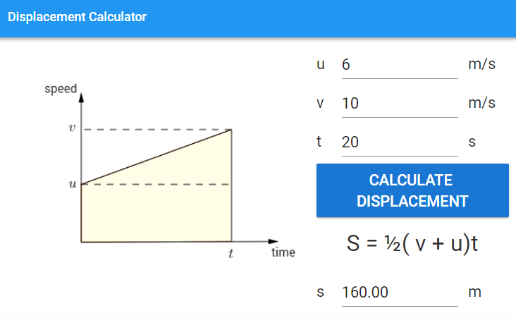

====================================================
Displacement calculator
====================================================

This app calculates the area of a rectangle, given the length and width.

| Use a XY panel for the diagram region, so that the text labels can be placed over the diagram.

See :download:`rectangle diagram <images/kinematics/Speed_time_graph.png>`

----

Get started
------------------------------

#. Go to: https://anvil.works/new-build
#. Click: Blank App.
#. Choose: Material Design

----

Key components
-------------------

| Name the input textboxes: **length** and **width**.
| Set both input textbox property **type** settings to **number**.
| Name the labels on the diagram: **diagram_length** and **diagram_width**.

----

Event Code 
--------------------

| Both the clicking the calculate button and pressing enter in the input textboxes attempts to produce the output.

.. code-block:: python

    def calculate_click(self, **event_args):
        self.do_calculation()

    def angle_pressed_enter(self, **event_args):
        self.do_calculation()

    def force_pressed_enter(self, **event_args):
        self.do_calculation()

| Changing the length or width inputs triggers the placement of those values on the diagram.

.. code-block:: python

    def length_change(self, **event_args):
        self.diagram_length.text = self.length.text

    def width_change(self, **event_args):
        self.diagram_width.text = self.width.text

----

Calculation
--------------------

| A try-except block is used to make sure an **error** output is given when the inputs are not valid.
| Any values of 0 or less are then detected: ``if val <= 0 or self.length.text <= 0 or self.width.text <= 0:``.
| While the input fields only accept numbers, some python numbers include the use of ``e`` for powers of 10.
| These can be handed with the float function.

| f-stings allow convenient formatting to 2 decimal places.
| e.g. ``self.area.text = f'{val:.2f}''``

.. code-block:: python

    def calculate_area(self):
        try:
            val = self.length.text * self.width.text
        except TypeError as error:
            self.area.text = 'error'
        except BaseException as error:
            self.area.text = 'error''
        else:
            if val <= 0 or self.length.text <= 0 or self.width.text <= 0:
                self.area.text = 'error'
            else:
                self.area.text = f'{val:.2f}'

----

Final  Code 
--------------------

| The full code is below.

.. code-block:: python

    from ._anvil_designer import Form1Template
    from anvil import *
    import anvil.tables as tables
    import anvil.tables.query as q
    from anvil.tables import app_tables

    class Form1(Form1Template):

        def __init__(self, **properties):
            # Set Form properties and Data Bindings.
            self.init_components(**properties)

        def Calculate_click(self, **event_args):
            self.calculate_area()
        
        def calculate_area(self):
            try:
                val = self.length.text * self.width.text
            except TypeError as error:
                self.area.text = 'error'
            except BaseException as error:
                self.area.text = 'error''
            else:
                if val <= 0 or self.length.text <= 0 or self.width.text <= 0:
                    self.area.text = 'error'
                else:
                    self.area.text = f'{val:.2f}'

        def width_pressed_enter(self, **event_args):
            self.calculate_area()

        def length_pressed_enter(self, **event_args):
            self.calculate_area()

        def length_change(self, **event_args):
            self.diagram_length.text = self.length.text

        def width_change(self, **event_args):
            self.diagram_width.text = self.width.text

