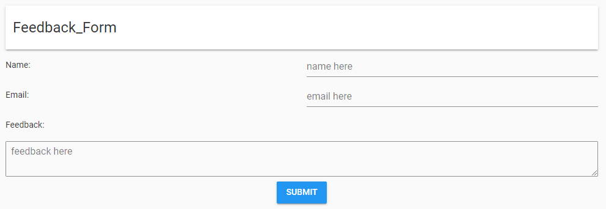
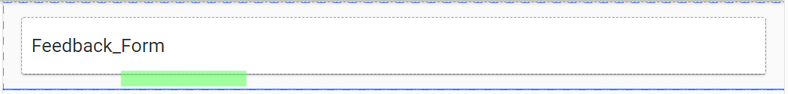
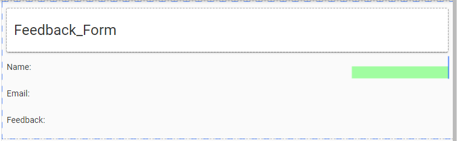
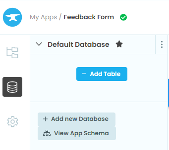
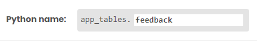
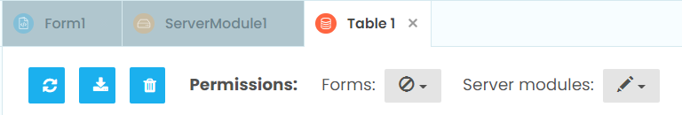
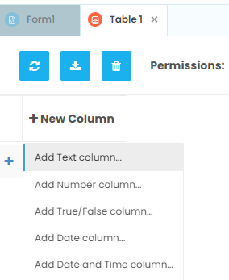
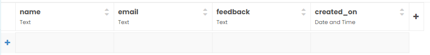
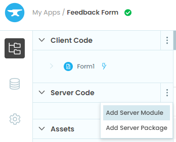

====================================================
Feedback Form
====================================================

| This builds a feedback form that uses full stack: client side and server side code in python.
| The references add an email capability but email has account quotas, so it will not be included below.

| Working app at: `<https://pc-feedback-form.anvil.app>`_

References
------------------------------

#. Youtube guide to create the app: `<https://www.youtube.com/watch?v=liZThmkIwys>`_
#. Official Anvil guide with screenshots and animated gifs: `<https://anvil.works/learn/tutorials/feedback-form>`_

----

Get started
------------------------------

#. Go to: `<https://anvil.works/new-build>`_
#. Click: Blank App.
#. Choose: Material Design

----

Settings
------------------------------

#. Click on the cog icon to show the settings tab.
#. Enter an App name. Feedback_Form
#. Enter an App title. Feedback_Form
#. Enter an App description. Feedback_Form using server side code and a PGSQL database.
#. Get a feedback icon to upload such as: `<https://pics.freeicons.io/uploads/icons/png/121888721582994865-512.png>`_
#. Click Change Image to upload an App logo.
#. Close the settings tab.

----

Build first part of interface
------------------------------

| Build the following interface by dragging and dropping components and setting their properties.

| Drag and drop the *card* component from the right toolbox onto Form1.

| Drag and drop the *label* component onto card_1.
| In the properties panel: text section, set the text to ``Feedback Form``.
| In the properties panel: appearance section, set the role to ``Headline``.

| Drag and drop three *label* components onto card_1 below the Feedback Form label, one below the other.

| A horizontal blue line will indicate that you are in the right place to drop it.
| In the properties panel: set their text to ``Name:``, ``Email:`` and ``Feedback:``.

| Drag and drop a *text box* component onto card_1 to the right of the Name label.

| In the properties panel: set the name to ``name_box``.
| In the properties panel: set the placeholder to ``Name here``.

| Drag and drop a *text box* component onto card_1 to the right of the Email label.
| In the properties panel: set the name to ``email_box``.
| In the properties panel: set the placeholder to ``Email here``.

| Drag and drop a *text area* component onto card_1 below the Feedback label.
| In the properties panel: set the name to ``feedback_box``.
| In the properties panel: set the placeholder to ``Feedback here``.

| Drag and drop a *button* component onto card_1 below the Feedback text area.
| In the properties panel: set the text to ``Submit``.
| In the properties panel: set the name to ``submit_button``.
| In the properties panel: set the role to ``primary-colour``.

----

Build Data Table
------------------------------

| In the left sidebar, click on the data icon.
| Under default database, click ``Add Table``.

| On the top right, name the table ``feeedback``.

| The permissions are set to allow search and edit by server modules.

| Click on the ``+ New Column`` button.

| Choose ``Add Text Column``.
| Change the column name from Column0 to ``name``.

| Click on the ``+`` button.
| Choose ``Add Text Column``.
| Change the column name from Column1 to ``email``.

| Click on the ``+`` button.
| Choose ``Add Text Column``.
| Change the column name from Column2 to ``feedback``.

| Click on the ``+`` button.
| Choose ``Add date and Time Column``.
| Change the column name from Column3 to ``created_on``.

----

Build the Server Code
------------------------------

| In the left sidebar, click on the top app icon.
| Under Server Code, click ``Add Server Module``.

| Enter the code to add a data table row.
| Import the datetime module so the created_on value can be gotten.
| ``@anvil.server.callable`` is a decorator. Placing it before the following definition modifes it so it is callable from the client form.
| ``add_feedback`` will pass in name, email, and feedback values from the form to add them to the data table.
| ``datetime.now()`` will get the date and time. e.g. 2022-04-01 20:30:11.532646

.. code-block:: python

    import anvil.tables as tables
    import anvil.tables.query as q
    from anvil.tables import app_tables
    import anvil.server

    from datetime import datetime

    @anvil.server.callable
    def add_feedback(name, email, feedback):
        app_tables.feedback.add_row(name=name,
                                    email=email,
                                    feedback=feedback,
                                    created_on=datetime.now())

----

Build the Submit Code
------------------------------

| Click on the Form1 tab.
| Double click the Submit button. This adds default code for it.
| The text from each feedback field needs to be stored in a variable.
| The text property is used to get the text. e.g ``name = self.name_box.text``

.. code-block:: python

    def submit_button_click(self, **event_args):
        name = self.name_box.text
        email = self.email_box.text
        feedback = self.feedback_box.text

| Now use ``anvil.server.call`` to call ``add_feedback`` in the server module, passing the 3 variables, ``name, email, feedback``, to be added to the table.
| i.e, ``anvil.server.call('add_feedback', name, email, feedback)``
| A notification can be added is desired: ``Notification("Feedback submitted.").show()``
| See: `<https://anvil.works/docs/client/python/alerts-and-notifications#notifications>`_

.. code-block:: python

    def submit_button_click(self, **event_args):
        name = self.name_box.text
        email = self.email_box.text
        feedback = self.feedback_box.text

        anvil.server.call('add_feedback', name, email, feedback)
        Notification("Feedback submitted.").show()

| The feedback form then needs clearing.
| Create a separate method: ``clear_inputs(self, **event_args)``
| Set the text property of each field to the empty string.
| e.g. ``self.name_box.text = ""``

.. code-block:: python

    def submit_button_click(self, **event_args):
        name = self.name_box.text
        email = self.email_box.text
        feedback = self.feedback_box.text

        anvil.server.call('add_feedback', name, email, feedback)
        Notification("Feedback submitted.").show()
        self.clear_inputs()

    def clear_inputs(self, **event_args):
        self.name_box.text = ""
        self.email_box.text = ""
        self.feedback_box.text = ""

----

Form Code
------------------------------

| The complete form code is below.

.. code-block:: python

    from ._anvil_designer import Form1Template
    from anvil import *
    import anvil.server
    import anvil.tables as tables
    import anvil.tables.query as q
    from anvil.tables import app_tables

    class Form1(Form1Template):

    def __init__(self, **properties):
        # Set Form properties and Data Bindings.
        self.init_components(**properties)

    def submit_button_click(self, **event_args):
        name = self.name_box.text
        email = self.email_box.text
        feedback = self.feedback_box.text

        anvil.server.call('add_feedback', name, email, feedback)
        Notification("Feedback submitted.").show()
        self.clear_inputs()

    def clear_inputs(self, **event_args):
        self.name_box.text = ""
        self.email_box.text = ""
        self.feedback_box.text = ""

