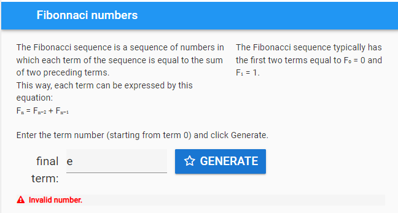

====================================================
Fibonacci numbers
====================================================

| The Fibonacci sequence is a sequence of numbers in which each term of the sequence is equal to the sum of two preceding terms. 
| This way, each term can be expressed by this equation:
| Fₙ = Fₙ₋₂ + Fₙ₋₁
| The Fibonacci sequence typically has the first two terms equal to F₀ = 0 and F₁ = 1. 

See working app at: ********************

----

References
------------------------------

#. https://www.omnicalculator.com/math/fibonacci
#. https://www.calculatorsoup.com/calculators/discretemathematics/fibonacci-calculator.php

----

Design
---------

| Use a Column panel.
| Use 3 label fields to display the information content.
| Add a text box for the term number.
| Add a button to generate the fibonacci numbers.
| Add a text area to display the fibonacci numbers.

.. image:: images/*************************
    :scale: 60

----

Get started
------------------------------

#. Go to: https://anvil.works/new-build
#. Click: Blank App.
#. Choose: Material Design

----

Settings
------------------------------

#. Click on the cog icon to show the settings tab.
#. Enter an App name. **Fibonacci_numbers**
#. Enter an App title. **Fibonacci_numbers**
#. Enter an App description. **Fibonacci_numbers are a sequence of odd and even positive integers.**
#. Close the settings tab.

----

Build interface
-------------------

Title
~~~~~~~~~~~~~~~~~~~

| Drag and drop a *label* component onto the **Drop title here** container.
| In the properties panel: name section, set the **name** to **title**.
| In the properties panel: text section, set the **text** to **Fibonacci numbers**.
| In the properties panel: text section, set the **font_size** to 24.

----

Column panel
~~~~~~~~~~~~~~~~~~~

| Drag and drop a *column panel* component onto the form.

----

Info
~~~~~~~~~~~~~~~~~~~

| Drag and drop a *label* component onto the column panel.
| In the properties panel: name section, set the **name** to **info**.
| In the properties panel: text section, set the **font_size** to 18.
| In the properties panel: text section, set the **text** to the text below.

.. code-block::
    
    Fibonacci numbers are a sequence of odd and even positive integers.
    The values typically rise and fall, like a Fibonacci inside a cloud.
    e.g. 6, 3, 10, 5, 16, 8, 4, 2, 1

----

Rules
~~~~~~~~~~~~~~~~~~~

| Drag and drop a *label* component onto the column panel to the right of the **info** label.
| In the properties panel: name section, set the **name** to **rules**.
| In the properties panel: text section, set the **font_size** to 18.

----

Directions
~~~~~~~~~~~~~~~~~~~

| Drag and drop a *label* component onto the column panel.
| In the properties panel: name section, set the **name** to **directions**.
| In the properties panel: text section, set the **font_size** to 18.

----

Fibonacci_start 
~~~~~~~~~~~~~~~~~~~

| Drag and drop a *TextBox* component onto the column panel.
| In the properties panel: name section, set the **name** to **Fibonacci_start**.
| In the properties panel: properties section, set the **placeholder** to **start number**.
| In the properties panel: properties section, set the **type** to **number**.
| In the properties panel: text section, set the **font_size** to 24.
| In the properties panel: Events section, click on the blue icon to the right of the **pressed_enter** label.
| This will add a default script, **Fibonacci_start_pressed_enter**, to the code. This will be coded later with the **Generate** button code.

----

Generate_Fibonacci button
~~~~~~~~~~~~~~~~~~~~~~~~~~~

| Drag and drop a *Button* component onto the column panel to the right of the Fibonacci_start textbox.
| In the properties panel: name section, set the **name** to **generate_Fibonacci**.
| In the properties panel: text section, set the **font_size** to 16.
| In the properties panel: text section, set the **text** to **Generate**.
| In the properties panel: appearance section, set the **role** to **primary-color**.
| In the properties panel: icon section, set the **icon** to **fa:star-o**.
| In the properties panel: Events section, click on the blue icon to the right of the **click** label.
| This will add a default script, **generate_click**, to the code. This will be coded later to generate the Fibonacci numbers.

----

Error field
~~~~~~~~~~~~~~~~~~~

| Drag and drop a *label* component onto the column panel below the start number textbox.
| In the properties panel: name section, set the **name** to **error**.
| In the properties panel: text section, set the **font_size** to 16.
| In the properties panel: appearance section, set the **foreground_color** to **#ff0000**.
| In the properties panel: icon section, set the **icon** to **fa:exclamation-triangle**.

----

Length_label
~~~~~~~~~~~~~~~~~~~

| Drag and drop a *label* component onto the column panel.
| In the properties panel: name section, set the **name** to **length_label**.
| In the properties panel: text section, set the **font_size** to 18.
| In the properties panel: text section, set the **text** to **Length:**.

----

Length
~~~~~~~~~~~~~~~~~~~

| Drag and drop a *label* component onto the column panel to the right of the **length_label** label.
| Control click and drag the divider on the left of the label to the left to minimize the length_label.
| In the properties panel: name section, set the **name** to **length**.
| In the properties panel: text section, set the **font_size** to 18.
| In the properties panel: text section, set the **text** to **Length:**.

----

Start_label
~~~~~~~~~~~~~~~~~~~

| Drag and drop a *label* component onto the column panel.
| In the properties panel: name section, set the **name** to **start_label**.
| In the properties panel: text section, set the **font_size** to 24.
| In the properties panel: text section, set the **text** to **start:**.

----

Fibonacci_numbers
~~~~~~~~~~~~~~~~~~~

| Drag and drop a *TextArea* component onto the column panel.
| In the properties panel: name section, set the **name** to **Fibonacci_numbers**.
| In the properties panel: text section, set the **font_size** to 24.
| In the properties panel: properties section, set the **placeholder** to **Fibonacci numbers**.

----

Initial Code 
--------------------

| Hide the **error** field by setting its **visible** property to **False**.
| Hide the length fields the and Fibonacci list field. Use a separate function for this with a parameter to set the visibility of each of the 3 fields:  **length_label**, **length**, **Fibonacci_numbers**.

.. code-block:: python

    class Form1(Form1Template):

        def __init__(self, **properties):
            # Set Form properties and Data Bindings.
            self.init_components(**properties)
            # hide error field and output fields
            self.error.visible = False
            self.set_main_field_vis(False)

        def set_main_field_vis(self, vis_bool):
            self.length_label.visible = vis_bool
            self.length.visible = vis_bool
            self.Fibonacci_numbers.visible = vis_bool

----

Event Code 
--------------------

| Both the button click and pressing enter need to generate the Fibonacci list.
| Place **self.generate()** in the body of both functions.

.. code-block:: python

    def generate_click(self, **event_args):
        self.generate()
        
    def Fibonacci_start_pressed_enter(self, **event_args):
        self.generate()

----

Fibonacci Code 
--------------------

| The **Fibonacci** function takes the parameter, **num**.
| The list is set to this value: **Fibonacci_list = [num]**.
| The **while num > 1:** loop runs while **num** is greater than 1. If the **num** value is 1, the Fibonacci_list, **[1]**, is immediately returned.
| In the while loop, the last value is checked, Fibonacci_list[-1]. If the last value is 1, then the Fibonacci_list is returned.
| **Fibonacci_list[-1] % 2 == 0** is used to check whether the last number is an even number. 
| If it is even, the last value is halved.
| If it is odd, the last value is multiplied by three and 1 is added.

.. code-block:: python

    def Fibonacci(self, num):
        # return list of numbers
        Fibonacci_list = [num]
        while num > 1:
            if Fibonacci_list[-1] == 1:
                return Fibonacci_list
            else:
                if Fibonacci_list[-1] % 2 == 0:
                    new_num = int(Fibonacci_list[-1] / 2)
                else:
                    new_num = (Fibonacci_list[-1] * 3) + 1
                Fibonacci_list.append(new_num)
        return Fibonacci_list

----

Checking the input
--------------------

| The **test_integer** function checks the input, **Fibonacci_start**, and sets the **Fibonacci_seed** value if it is a positive integer.
| If not, a string is returned to display in the error field.

.. code-block:: python

    def test_integer(self):
        # str(invalid entries) give the string 'None'
        if str(self.Fibonacci_start.text) == 'None':
            return "Invalid number."
        # invalid entries give False, so not False is True
        if not self.Fibonacci_start.text:
            return "Not a valid start number."
        # catch 0, negative ints and floats below 1
        if self.Fibonacci_start.text < 1:
            return "Enter a whole number above 0."
        # floats
        if self.Fibonacci_start.text != int(self.Fibonacci_start.text):
            return "Positive Integers, not floats are needed."
        # have an int, no error
        return None

----

Generate Code 
--------------------

| The **generate** function uses the **test_integer** and **Fibonacci** functions to get the Fibonacci list.
| It also takes care of displaying any errors and displaying the Fibonacci values if they are generated.

.. code-block:: python

    def generate(self):
        # hide error and clear it
        self.error.visible = False
        self.error.text = ""
        # check for error and display it if present
        error = self.test_integer()
        if error:
            self.error.text = error
            self.error.visible = True
            self.length.text = ""
            self.Fibonacci_numbers.text = ""
            self.set_output_field_vis(False)
            return
        # continue if no error
        hns = self.Fibonacci(self.Fibonacci_start.text)
        self.Fibonacci_numbers.text = hns
        self.length.text = len(hns)
        self.set_output_field_vis(True)
        
    def test_integer(self):
        # str(invalid entries) give the string 'None'
        if str(self.Fibonacci_start.text) == 'None':
            return "Invalid number."
        # invalid entries give False, so not False is True
        if not self.Fibonacci_start.text:
            return "Not a valid start number."
        # catch 0, negative ints and floats below 1
        if self.Fibonacci_start.text < 1:
            return "Enter a whole number above 0."
        # floats
        if self.Fibonacci_start.text != int(self.Fibonacci_start.text):
            return "Positive Integers, not floats are needed."
        # have an int, no error
        return None

    def Fibonacci(self, num):
        # return list of numbers
        Fibonacci_list = [num]
        while num > 1:
            if Fibonacci_list[-1] == 1:
                return Fibonacci_list
            else:
                if Fibonacci_list[-1] % 2 == 0:
                    new_num = int(Fibonacci_list[-1] / 2)
                else:
                    new_num = (Fibonacci_list[-1] * 3) + 1
                Fibonacci_list.append(new_num)
        return Fibonacci_list

----

Final  Code 
--------------------

| The full code is below.

.. code-block:: python

    from anvil import *
    import anvil.tables as tables
    import anvil.tables.query as q
    from anvil.tables import app_tables

    class Form1(Form1Template):

        def __init__(self, **properties):
            # Set Form properties and Data Bindings.
            self.init_components(**properties)
            # hide error field and output fields
            self.error.visible = False
            self.set_output_field_vis(False)
            
        def set_output_field_vis(self, vis_bool):
            self.length_label.visible = vis_bool
            self.length.visible = vis_bool
            self.Fibonacci_numbers.visible = vis_bool
            
        def Fibonacci_start_change(self, **event_args):
            if self.Fibonacci_start.text:
                self.Fibonacci_start.text = min(100000, self.Fibonacci_start.text)
        
        def generate_click(self, **event_args):
            self.generate()
            
        def Fibonacci_start_pressed_enter(self, **event_args):
            self.generate()
            
        def generate(self):
            # hide error and clear it
            self.error.visible = False
            self.error.text = ""
            # check for error and display it if present
            error = self.test_integer()
            if error:
                self.error.text = error
                self.error.visible = True
                self.length.text = ""
                self.Fibonacci_numbers.text = ""
                self.set_output_field_vis(False)
                return
            # continue if no error
            hns = self.Fibonacci(self.Fibonacci_start.text)
            self.Fibonacci_numbers.text = hns
            self.length.text = len(hns)
            self.set_output_field_vis(True)
            
        def test_integer(self):
            # str(invalid entries) give the string 'None'
            if str(self.Fibonacci_start.text) == 'None':
                return "Invalid number."
            # invalid entries give False, so not False is True
            if not self.Fibonacci_start.text:
                return "Not a valid start number."
            # catch 0, negative ints and floats below 1
            if self.Fibonacci_start.text < 1:
                return "Enter a whole number above 0."
            # floats
            if self.Fibonacci_start.text != int(self.Fibonacci_start.text):
                return "Positive Integers, not floats are needed."
            # have an int, no error
            return None

        def Fibonacci(self, num):
            # return list of numbers
            Fibonacci_list = [num]
            while num > 1:
                if Fibonacci_list[-1] == 1:
                    return Fibonacci_list
                else:
                    if Fibonacci_list[-1] % 2 == 0:
                        new_num = int(Fibonacci_list[-1] / 2)
                    else:
                        new_num = (Fibonacci_list[-1] * 3) + 1
                    Fibonacci_list.append(new_num)
            return Fibonacci_list

----

.. admonition:: Tasks

    #. Limit the initial input to under 100000.
 
    .. dropdown::
        :icon: codescan
        :color: primary
        :class-container: sd-dropdown-container

        .. tab-set::

            .. tab-item:: Q1

                Limit the initial input to under 100000.

                .. code-block:: python

                    def Fibonacci_start_change(self, **event_args):
                        if self.Fibonacci_start.text:
                            self.Fibonacci_start.text = min(100000, self.Fibonacci_start.text)

----

.. admonition:: Tasks

     #. The longest sequence is 351 for Fibonacci(77031) for numbers <100,000. Find another Fibonacci number under 100000 with a sequence length over 200.
     #. Advanced: Create a list of multipliers to replace the 3 multiplier. Add a textbox to enable the user to enter the multiplier. Restrict the values to 1, 3, 5, 7 or 9. e.g **3, 5** or **1, 3, 7**. Randomly choose form this list when generating each new number in the Fibonacci sequence.

    .. dropdown::
        :icon: codescan
        :color: primary
        :class-container: sd-dropdown-container

        .. tab-set::

            .. tab-item:: Q1

                The longest sequence is 351 for Fibonacci(77031) for numbers <100,000. Find another Fibonacci number under 100000 with a sequence length over 200.

                Look at the sequence for Fibonacci(77031) and find the the next number under 100000. It has a sequence length of 206.

            .. tab-item:: Q2

                Advanced: Create a list of multipliers to replace the 3 multiplier. Add a textbox to enable the user to enter the multiplier. Restrict the values to 1, 3, 5, 7 or 9. e.g **3, 5** or **1, 3, 7**. Randomly choose form this list when generating each new number in the Fibonacci sequence.

                Working app at: https://pc-Fibonacci-random-multipliers.anvil.app

                .. code-block:: python

                    # code to allow random choice from a list

                    from random import choice

                    # code to insert in def generate(self):

                    def generate(self):
                        ...
                        # check for error in multiplier and display it if present
                        error = self.test_multiplier()
                        if error:
                        self.error.text = error
                        self.error.visible = True
                        self.length.text = ""
                        self.Fibonacci_numbers.text = ""
                        self.set_output_field_vis(False)
                        return
                        ...

                    # code to text multiplier input

                     def test_multiplier(self):
                        try:
                        multiplier_list = self.multiplier.text
                        multiplier_list = multiplier_list.split(",")
                        multiplier_list = [int(x) for x in multiplier_list if int(x) % 2 == 1 and int(x) < 10 and int(x) > 0]
                        if len(multiplier_list) == 0: 
                            multiplier_list = [3]
                            self.multiplier_list = multiplier_list
                            self.multiplier.text = str(multiplier_list).strip('[]')
                            print(self.multiplier.text)
                            return None
                        except ValueError as error:
                            self.multiplier_list = None
                            return "multiplier requires positive integers separated by commas."
                        except IndexError as error:
                            self.multiplier_list = None
                            return "multiplier requires positive integers separated by commas."

                    # code to generate Fibonacci using **choice(self.multiplier_list)**

                    def Fibonacci(self, num):
                        # return list of numbers
                        Fibonacci_list = [num]
                        while num > 1:
                            if Fibonacci_list[-1] == 1:
                                return Fibonacci_list
                            else:
                                if Fibonacci_list[-1] % 2 == 0:
                                    new_num = int(Fibonacci_list[-1] / 2)
                                else:
                                    multiplier = choice(self.multiplier_list)
                                    new_num = (Fibonacci_list[-1] * multiplier) + 1
                                Fibonacci_list.append(new_num)
                                if len(Fibonacci_list) > 1000:
                                    return Fibonacci_list
                        return Fibonacci_list
                    