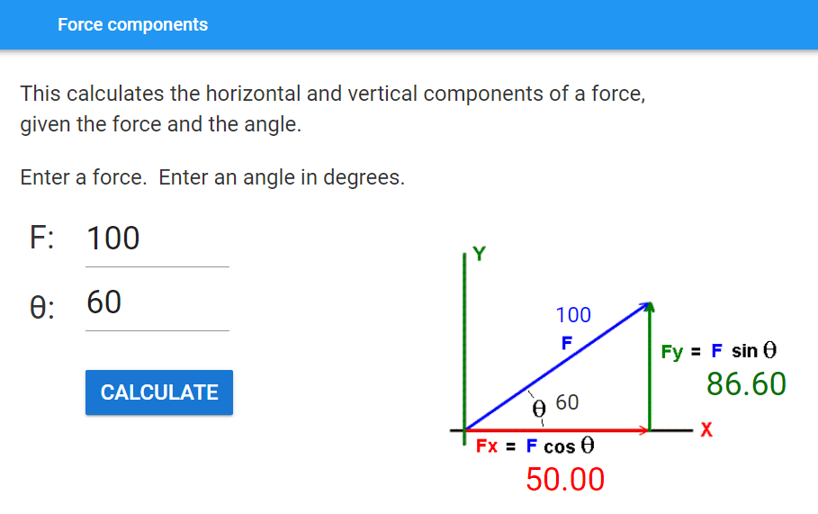

====================================================
Force components
====================================================

This app calculates the horizontal and vertical components of a force at a given angle.

| Working app at: https://pc-force-components.anvil.app

| Use the image above to build the interface, using textboxes for the inputs and labels for other text fields.
| Use a XY panel for the diagram region, so that the text labels can be placed over the force diagram.

| Download the diagram file :download:`force_diagram <images/forces/force_diagram.png>`.

----

Get started
------------------------------

#. Go to: https://anvil.works/new-build
#. Click: Blank App.
#. Choose: Material Design

----

Key components
-------------------

| Name the input textboxes: **force** and **angle**.
| Set both input textbox property **type** settings to **number**.
| Name the labels on the diagram: **diagram_force** and **diagram_angle**.
| Name the output labels on the diagram: **Fx** and **Fy**.
| Set the foreground color of the **diagram_force** label to #0811fc.
| Set the foreground color of the **Fy** label to #007200.
| Set the foreground color of the **Fx** label to #ff0000.
| Name the error label : **error**.

----

Error field
~~~~~~~~~~~~~~~~~~~

| Drag and drop a *label* component onto the column panel below the width textbox.
| In the properties panel: name section, set the **name** to **error**.
| In the properties panel: text section, set the **font_size** to 16.
| In the properties panel: appearance section, set the **foreground_color** to **#ff0000**.
| In the properties panel: icon section, set the **icon** to **fa:exclamation-triangle**.

| Code to hide or show error field takes the **error** parameter.
| An error will be shown if **error** is a text string.
| Passing **None** as the **error** parameter hides and clears the error field.

.. code-block:: python

    def do_error(self, error):
        # check for error and display it if present
        if error:
            self.error.text = error
            self.error.visible = True
        else:
            # hide error and clear it
            self.error.text = ""
            self.error.visible = False

----

Event Code 
--------------------

| Both the clicking the calculate button and pressing enter in the input textboxes attempts to produce the output.

.. code-block:: python

    def calculate_click(self, **event_args):
        self.do_calculation()

    def angle_pressed_enter(self, **event_args):
        self.do_calculation()

    def force_pressed_enter(self, **event_args):
        self.do_calculation()

| Changing the force or angle inputs triggers the placement of those values on the diagram.

.. code-block:: python

    def force_change(self, **event_args):
        self.diagram_force.text = self.force.text

    def angle_change(self, **event_args):
        self.diagram_angle.text = self.angle.text

----

Calculation
--------------------

| The input angle needs to be converted from degrees to radians for the cos and sin functions.
| i.e ``angle = self.angle.text * (pi / 180)``

| Instead of importing the whole math library, the cos, sin and pi methods can be selectively imported via: ``from math import cos, sin, pi``.

| f-stings allow convenient formatting to 2 decimal places.
| e.g. ``self.Fx.text = f'{fx:.2f}'``

.. code-block:: python

    from math import cos, sin, pi

    def do_calculation(self):
        try:
            # angle in degrees, convert to radians
            force = self.force.text
            angle = self.angle.text * (pi / 180)
            fx = force * cos(angle)
            fy = force * sin(angle)
        except TypeError as error:
            self.Fx.text = None
            self.Fy.text = None
            self.do_error('use positive values')
        else:
            if fx <= 0 or fy <= 0:
                self.Fx.text = None
                self.Fy.text = None
                self.do_error('use positive values')
            else:
                self.Fx.text = f'{fx:.2f}'
                self.Fy.text = f'{fy:.2f}'
                self.do_error(None)

----

Final  Code 
--------------------

| The full code is below.

.. code-block:: python

    from ._anvil_designer import Form1Template
    from anvil import *
    import anvil.tables as tables
    import anvil.tables.query as q
    from anvil.tables import app_tables

    from math import cos, sin, pi

    class Form1(Form1Template):

        def __init__(self, **properties):
            # Set Form properties and Data Bindings.
            self.init_components(**properties)
            # hide error field
            self.error.visible = False

        def calculate_click(self, **event_args):
            self.do_calculation()

        def angle_pressed_enter(self, **event_args):
            self.do_calculation()

        def force_pressed_enter(self, **event_args):
            self.do_calculation()

        def force_change(self, **event_args):
            self.diagram_force.text = self.force.text

        def angle_change(self, **event_args):
            self.diagram_angle.text = self.angle.text

        def do_calculation(self):
            try:
                # angle in degrees, convert to radians
                force = self.force.text
                angle = self.angle.text * (pi / 180)
                fx = force * cos(angle)
                fy = force * sin(angle)
            except TypeError as error:
                self.Fx.text = None
                self.Fy.text = None
                self.do_error('use positive values')
            else:
                if fx <= 0 or fy <= 0:
                    self.Fx.text = None
                    self.Fy.text = None
                    self.do_error('use positive values')
                else:
                    self.Fx.text = f'{fx:.2f}'
                    self.Fy.text = f'{fy:.2f}'
                    self.do_error(None)

        def do_error(self, error):
            # check for error and display it if present
            if error:
                self.error.text = error
                self.error.visible = True
            else:
                # hide error and clear it
                self.error.text = ""
                self.error.visible = False

----

.. admonition:: Tasks

    #. Add a dropdown to specify the number of decimal places in the output values.
    #. Create a force calculator that calculates the force and the angle given the 2 components, Fx and Fy.
