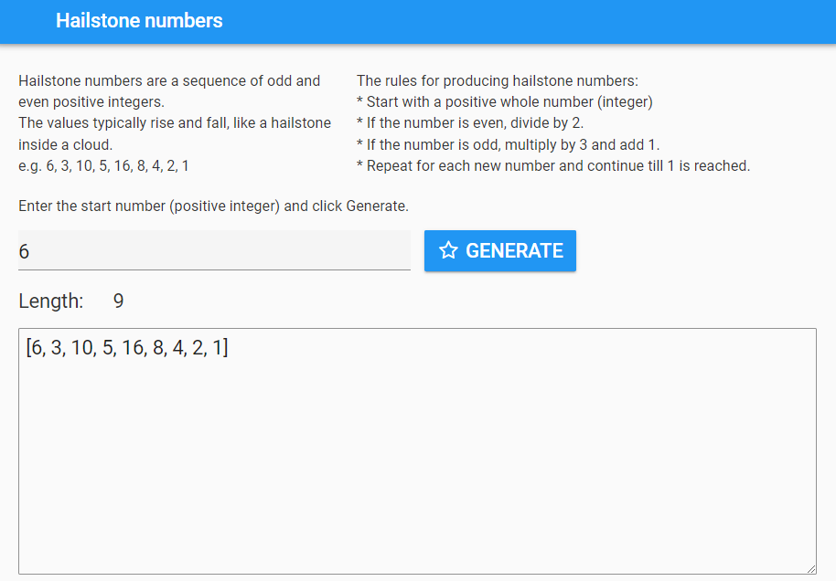

====================================================
Hailstone numbers
====================================================

A sequence is called a hailstone sequence because the values typically rise and fall, somewhat analogously to a hailstone inside a cloud.

----

References
------------------------------

#. https://www.dcode.fr/collatz-conjecture
#. https://goodcalculators.com/collatz-conjecture-calculator/
#. https://en.wikipedia.org/wiki/Collatz_conjecture

----

Design
---------

| Use a Column panel.
| Use 3 label fields to display the information content.
| Add a text box for the start number.
| Add a button to generate the hailstone numbers.
| Add a text area to display the hailstone numbers.

----

Get started
------------------------------

#. Go to: https://anvil.works/new-build
#. Click: Blank App.
#. Choose: Material Design

----

Settings
------------------------------

#. Click on the cog icon to show the settings tab.
#. Enter an App name. **Hailstone_numbers**
#. Enter an App title. **Hailstone_numbers**
#. Enter an App description. **Hailstone_numbers are a sequence of odd and even positive integers.**
#. Close the settings tab.

----

Build interface
-------------------

Title
~~~~~~~~~~~~~~~~~~~

| Drag and drop a *label* component onto the **Drop title here** container.
| In the properties panel: name section, set the **name** to **title**.
| In the properties panel: text section, set the **text** to **Hailstone numbers**.
| In the properties panel: text section, set the **font_size** to 24.

----

Column panel
~~~~~~~~~~~~~~~~~~~

| Drag and drop a *column panel* component onto the form.

----

Info
~~~~~~~~~~~~~~~~~~~

| Drag and drop a *label* component onto the column panel.
| In the properties panel: name section, set the **name** to **info**.
| In the properties panel: text section, set the **font_size** to 18.
| In the properties panel: text section, set the **text** to the text below.

.. code-block::
    
    Hailstone numbers are a sequence of odd and even positive integers.
    The values typically rise and fall, like a hailstone inside a cloud.
    e.g. 6, 3, 10, 5, 16, 8, 4, 2, 1

----

Rules
~~~~~~~~~~~~~~~~~~~

| Drag and drop a *label* component onto the column panel to the right of the **info** label.
| In the properties panel: name section, set the **name** to **rules**.
| In the properties panel: text section, set the **font_size** to 18.
| In the properties panel: text section, set the **text** to the text below.

.. code-block::
    
    The rules for producing hailstone numbers:
    * Start with a positive whole number (integer)
    * If the number is even, divide by 2.
    * If the number is odd, multiply by 3 and add 1.
    * Repeat for each new number and continue till 1 is reached.

----

Directions
~~~~~~~~~~~~~~~~~~~

| Drag and drop a *label* component onto the column panel.
| In the properties panel: name section, set the **name** to **directions**.
| In the properties panel: text section, set the **font_size** to 18.
| In the properties panel: text section, set the **text** to the text below.

.. code-block::
    
    Enter the start number (positive integer) and click Generate.

----

Hailstone_start 
~~~~~~~~~~~~~~~~~~~

| Drag and drop a *TextBox* component onto the column panel.
| In the properties panel: name section, set the **name** to **hailstone_start**.
| In the properties panel: properties section, set the **placeholder** to **start number**.
| In the properties panel: properties section, set the **type** to **number**.
| In the properties panel: text section, set the **font_size** to 24.
| In the properties panel: Events section, click on the blue icon to the right of the **pressed_enter** label.
| This will add a default script, **hailstone_start_pressed_enter**, to the code. This will be coded later with the **Generate** button code.

----

Generate_hailstone button
~~~~~~~~~~~~~~~~~~~~~~~~~~~

| Drag and drop a *Button* component onto the column panel to the right of the hailstone_start textbox.
| In the properties panel: name section, set the **name** to **generate_hailstones**.
| In the properties panel: text section, set the **font_size** to 16.
| In the properties panel: text section, set the **text** to **Generate**.
| In the properties panel: appearance section, set the **role** to **primary-color**.
| In the properties panel: icon section, set the **icon** to **fa:star-o**.
| In the properties panel: Events section, click on the blue icon to the right of the **click** label.
| This will add a default script, **generate_click**, to the code. This will be coded later to generate the hailstone numbers.

----

Error field
~~~~~~~~~~~~~~~~~~~

| Drag and drop a *label* component onto the column panel.
| In the properties panel: name section, set the **name** to **error**.
| In the properties panel: text section, set the **font_size** to 16.
| In the properties panel: icon section, set the **icon** to **fa:exclamation-triangle**.

----

Length_label
~~~~~~~~~~~~~~~~~~~

| Drag and drop a *label* component onto the column panel.
| In the properties panel: name section, set the **name** to **length_label**.
| In the properties panel: text section, set the **font_size** to 18.
| In the properties panel: text section, set the **text** to **Length:**.

----

Length
~~~~~~~~~~~~~~~~~~~

| Drag and drop a *label* component onto the column panel to the right of the **length_label** label.
| Control click and drag the divider on the left of the label to the left to minimize the length_label.
| In the properties panel: name section, set the **name** to **length**.
| In the properties panel: text section, set the **font_size** to 18.
| In the properties panel: text section, set the **text** to **Length:**.

----

Hailstone_numbers
~~~~~~~~~~~~~~~~~~~

| Drag and drop a *TextArea* component onto the column panel.
| In the properties panel: name section, set the **name** to **hailstone_numbers**.
| In the properties panel: text section, set the **font_size** to 24.
| In the properties panel: properties section, set the **placeholder** to **Hailstone numbers**.

----

Initial Code 
--------------------

| Use the instance variable, **self.hailstone_seed**, for the hailstone start number.
| Set **self.hailstone_seed** to **1** so it has an intial value.
| Hide the **error** field by setting its **visible** property to **False**.
| Hide the length and hailstone list fields. Use a separate function for this with a pararmeter to set the visibility of each of the 3 fields:  **length_label**, **length**, **hailstone_numbers**.

.. code-block:: python

    class Form1(Form1Template):

        def __init__(self, **properties):
            # Set Form properties and Data Bindings.
            self.init_components(**properties)
            self.hailstone_seed = 1
            self.error.visible = False
            self.set_main_field_vis(False)

        def set_main_field_vis(self, vis_bool):
            self.length_label.visible = vis_bool
            self.length.visible = vis_bool
            self.hailstone_numbers.visible = vis_bool

----

Event Code 
--------------------

| Both the button click and pressing enter need to generate the hailstone list.
| Place **self.generate()** in the body of both functions.

.. code-block:: python

    def generate_click(self, **event_args):
        self.generate()
        
    def hailstone_start_pressed_enter(self, **event_args):
        self.generate()

----

Hailstone Code 
--------------------

| The **hailstone** function takes the **hailstone_seed** as its parameter, **num**.
| The list is set to this value: **hailstone_list = [num]**.
| The **while num > 1:** loop runs while **num** is greater than 1. If the **hailstone_seed** value is 1, the hailstone_list, **[1]**, is immediatley returned.
| In the while loop, the last value is checked, hailstone_list[-1]. If hte last value is 1, then the hailstone_list is returned.
| **hailstone_list[-1] % 2** is used to check whether the last number is an even number. 
| If it is even, the new_num to add to the list is halved.
| If it is odd, the new_num to add to the list is multiplied by three and 1 is added.

.. code-block:: python

    def hailstone(self, num):
        # return list of numbers
        hailstone_list = [num]
        while num > 1:
            if hailstone_list[-1] == 1:
                return hailstone_list
            else:
                if hailstone_list[-1] % 2 == 0:
                    new_num = int(hailstone_list[-1] / 2)
                else:
                    new_num = (hailstone_list[-1] * 3) + 1
                hailstone_list.append(new_num)
        return hailstone_list

----

Checking the input
--------------------

| The **test_integer** function checks the input, **hailstone_start**, and sets the **hailstone_seed** value if it is a positive integer.
| If not, a string is returned to display in the error field.

.. code-block:: python

    def test_integer(self):
        if not self.hailstone_start.text:
            return "A positive integer is required."
        try:
            self.hailstone_seed = int(self.hailstone_start.text)
        except ValueError as error:
            return "Enter a whole number above 0."
        except Exception as error:
            return "Enter a whole number above 0."
        if self.hailstone_seed < 1:
            return "Enter a whole number above 0."
        return None

----

Generate Code 
--------------------

| The **generate** function uses the **test_integer** and **hailstone** functions to get the hailstone list.
| It also takes care of displaying any errors and displaying the hailstone values if they are generated.

.. code-block:: python

    def generate(self):
        self.error.visible = False
        self.error.text = " "
        error = self.test_integer()
        if error:
            self.error.text = error
            self.error.visible = True
            self.length.text = ""
            self.hailstone_numbers.text = ""
            self.set_main_field_vis(False)
            return
        hns = self.hailstone(self.hailstone_seed)
        self.hailstone_numbers.text = hns
        length = len(hns)
        self.length.text = length
        self.set_main_field_vis(True)
        
    def test_integer(self):
        if not self.hailstone_start.text:
            return "A positive integer is required."
        try:
            self.hailstone_seed = int(self.hailstone_start.text)
        except ValueError as error:
            return "Enter a whole number above 0."
        except Exception as error:
            return "Enter a whole number above 0."
        if self.hailstone_seed < 1:
            return "Enter a whole number above 0."
        return None

    def hailstone(self, num):
        # return list of numbers
        hailstone_list = [num]
        while num > 1:
            if hailstone_list[-1] == 1:
                return hailstone_list
            else:
                if hailstone_list[-1] % 2 == 0:
                    new_num = int(hailstone_list[-1] / 2)
                else:
                    new_num = (hailstone_list[-1] * 3) + 1
                hailstone_list.append(new_num)
        return hailstone_list

----

Final  Code 
--------------------

| The full code is below.

.. code-block:: python

    from anvil import *
    import anvil.tables as tables
    import anvil.tables.query as q
    from anvil.tables import app_tables

    class Form1(Form1Template):

        def __init__(self, **properties):
            # Set Form properties and Data Bindings.
            self.init_components(**properties)
            self.hailstone_seed = 1
            self.error.visible = False
            self.set_main_field_vis(False)
            
        def set_main_field_vis(self, vis_bool):
            self.length_label.visible = vis_bool
            self.length.visible = vis_bool
            self.hailstone_numbers.visible = vis_bool
            
        def generate_click(self, **event_args):
            self.generate()
            
        def hailstone_start_pressed_enter(self, **event_args):
            self.generate()
            
        def generate(self):
            self.error.visible = False
            self.error.text = " "
            error = self.test_integer()
            if error:
                self.error.text = error
                self.error.visible = True
                self.length.text = ""
                self.hailstone_numbers.text = ""
                self.set_main_field_vis(False)
                return
            hns = self.hailstone(self.hailstone_seed)
            self.hailstone_numbers.text = hns
            length = len(hns)
            self.length.text = length
            self.set_main_field_vis(True)
            
        def test_integer(self):
            if not self.hailstone_start.text:
                return "A positive integer is required."
            try:
                self.hailstone_seed = int(self.hailstone_start.text)
            except ValueError as error:
                return "Enter a whole number above 0."
            except Exception as error:
                return "Enter a whole number above 0."
            if self.hailstone_seed < 1:
                return "Enter a whole number above 0."
            return None

        def hailstone(self, num):
            # return list of numbers
            hailstone_list = [num]
            while num > 1:
                if hailstone_list[-1] == 1:
                    return hailstone_list
                else:
                    if hailstone_list[-1] % 2 == 0:
                        new_num = int(hailstone_list[-1] / 2)
                    else:
                        new_num = (hailstone_list[-1] * 3) + 1
                    hailstone_list.append(new_num)
            return hailstone_list

----

.. admonition:: Tasks

    #. Create a random compliment maker.

