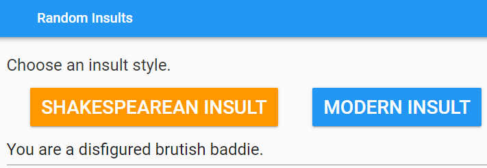
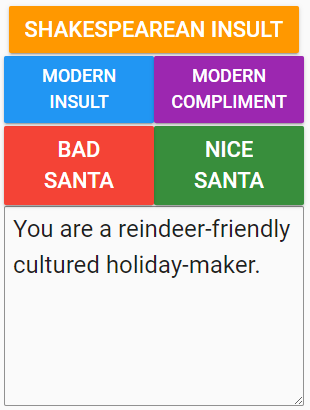
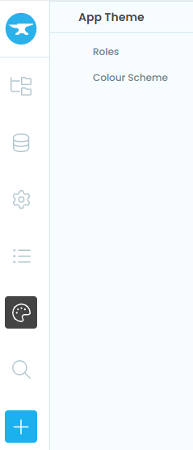
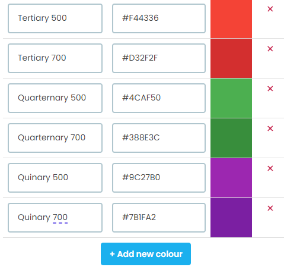
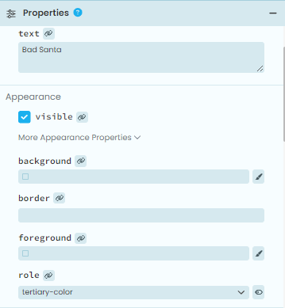

====================================================
Insult generator
====================================================

This app generates a random insult.

A useful tool for formatting long lists is at: `<https://www.xhcode.com/pythonformat/>`_

| Working app at: `<https://total-tough-keep.anvil.app>`_

----

Design
---------

| Use a Column panel.
| Use a label field, 2 buttons and a textbox.

----

Get started
------------------------------

#. Go to: `<https://anvil.works/new-build>`_
#. Click: Blank App.
#. Choose: Material Design

----

Settings
------------------------------

#. Click on the cog icon to show the settings tab.
#. Enter an App name. **Insult generator**
#. Enter an App title. **Insult generator**
#. Enter an App description. **This app generates a random insult.**
#. Close the settings tab.

----

Build interface
-------------------

Title
~~~~~~~~~~~~~~~~~~~

| Drag and drop a *label* component onto the **Drop title here** container.
| In the properties panel: name section, set the **name** to **title**.
| In the properties panel: text section, set the **text** to **Random Insults**.

----

Column panel
~~~~~~~~~~~~~~~~~~~

| Drag and drop a **column panel** component onto the form.

----

Instructions
~~~~~~~~~~~~~~~~~~~

| Drag and drop a **label** component onto the column panel.
| In the properties panel: name section, set the **name** to **instructions**.
| In the properties panel: text section, set the **text** to text below.

.. code-block::

    Choose an insult style.

----

Buttons
~~~~~~~~~~~~~~~~~~~~~~~~~~~

| Drag and drop a *Button* component onto the column panel.
| In the properties panel: name section, set the **name** to **get_old_insult**.
| In the properties panel: text section, set the **text** to **Shakespearean Insult**.
| In the properties panel: text section, set the **font_size** to **28**.
| In the properties panel: appearance section, set the **role** to **secondary-color**.
| In the properties panel: Events section, click on the blue icon to the right of the **click** label.
| This will add a default script, **get_old_insult_click**, to the code. This will be coded later to generate the output.

| Drag and drop a *Button* component onto the column panel.
| In the properties panel: name section, set the **name** to **get_insult**.
| In the properties panel: text section, set the **text** to **Modern Insult**.
| In the properties panel: text section, set the **font_size** to **28**.
| In the properties panel: appearance section, set the **role** to **primary-color**.
| In the properties panel: Events section, click on the blue icon to the right of the **click** label.
| This will add a default script, **get_insult_click**, to the code. This will be coded later to generate the output.

----

Output
~~~~~~~~~~~~~~~~~~~

| Drag and drop a *TextBox* component onto the column panel to the right of the label.
| Click and drag the divider between the label and textbox to resize them.
| In the properties panel: name section, set the **name** to **output**.
| In the properties panel: text section, set the **font_size** to **24**.

----

Initial Code & Event Code
---------------------------

| The event, **get_old_insult_click**, calls the **make_old_insult** function.
| The event, **get_insult_click**, calls the **make_insult** function.

.. code-block:: python

    from ._anvil_designer import Form1Template
    from anvil import *
    import anvil.tables as tables
    import anvil.tables.query as q
    from anvil.tables import app_tables
    from random import choice

    class Form1(Form1Template):

        def __init__(self, **properties):
            # Set Form properties and Data Bindings.
            self.init_components(**properties)

        def get_old_insult_click(self, **event_args):
            self.make_old_insult()

        def get_insult_click(self, **event_args):
            self.make_insult()

----

Insult maker
---------------------------

| **make_old_insult** places a random Shakespearean insult in the output textbox.
| **choice(insult1)** picks a random element from the list, **insult1**.

.. code-block:: python

    def make_old_insult(self):
        insult1 = ['artless', 'bawdy', 'beslubbering', 'bootless',
            'burly-boned', 'caluminous', 'churlish', 'clouted',
            'cockered', 'craven', 'cullionly', 'currish', 'dankish',
            'dissembling', 'droning', 'errant', 'fawning', 'fishified',
            'fobbing', 'frothy', 'froward', 'fusty', 'gleeking',
            'goatish', 'gorbellied', 'impertinent', 'infectious',
            'jarring', 'loggerheaded', 'lumpish', 'mammering', 'mangled',
            'mewling', 'misbegotten', 'odiferous', 'paunchy', 'poisonous',
            'pribbling', 'puking', 'puny', 'qualling', 'rank', 'reeky',
            'roguish', 'ruttish', 'saucy', 'spleeny', 'spongy', 'surly',
            'tottering', 'unmuzzled', 'vain', 'venomed', 'villainous',
            'warped', 'Wart-necked', 'wayward', 'weedy', 'wimpled',
            'yeasty'
        ]
        insult2 = ['base-court', 'bat-fowling', 'beef-witted',
            'beetle-headed', 'boil-brained', 'brazen-faced',
            "bunch-back'd", 'clapper-clawed', 'clay-brained',
            'common-kissing', 'crook-pated', 'dismal-dreaming',
            'dizzy-eyed', 'doghearted', 'dread-bolted', 'earth-vexing',
            'elf-skinned', 'fat-kidneyed', 'fen-sucked', 'flap-mouthed',
            'fly-bitten', 'folly-fallen', 'fool-born', 'full-gorged',
            'guts-griping', 'half-faced', 'hasty-witted', 'hedge-born',
            'hell-hated', 'idle-headed', 'ill-breeding', 'ill-nurtured',
            'knotty-pated', 'leaden-footed', 'lily-livered',
            'malmsey-nosed', 'milk-livered', 'motley-minded',
            'muddy-mettled', 'onion-eyed', "pigeon-liver'd",
            'plume-plucked', 'pottle-deep', 'pox-marked', 'rampallian',
            'reeling-ripe', 'rough-hewn', 'rude-growing', 'rump-fed',
            'scale-sided', 'scurvy-valiant', 'shard-borne',
            'sheep-biting', 'spur-galled', 'swag-bellied', 'tardy-gaited',
            'tickle-brained', 'toad-spotted', 'unchin-snouted',
            "unwash'd", 'weather-bitten', 'whoreson'
        ]
        insult3 = ['apple-john', 'baggage', 'barnacle', 'Basket-Cockle',
            'bladder', 'blind-worm', 'boar-pig', 'bugbear', 'bum-bailey',
            'canker-blossom', 'clack-dish', 'clotpole', 'codpiece',
            'coxcomb', 'death-token', 'devil-monk', 'dewberry',
            'flap-dragon', 'flax-wench', 'flirt-gill', 'foot-licker',
            'fustilarian', 'giglet', 'gudgeon', 'haggard', 'harpy',
            'hedge-pig', 'horn-beast', 'hugger-mugger', 'joithead',
            'jolt-head', 'knave', 'lewdster', 'lout', 'maggot-pie',
            'malcontent', 'malt-worm', 'mammet', 'measle', 'minnow',
            'miscreant', 'moldwarp', 'mumble-news', 'nut-hook',
            'pigeon-egg', 'pignut', 'popinjay', 'pumpion', 'puttock',
            'rascal', 'ratsbane', 'scullian', 'scut', 'skainsmate',
            'strumpet', 'toad', 'varlot', 'vassal', 'wagtail',
            'whey-face'
        ]
        self.output.text = ("Thou art a " + choice(insult1) + " " +
            choice(insult2) + " " + choice(insult3) + ".")

| **make_insult** places a random insult in the output textbox.
| **choice(insult1)** picks a random element from the list, **insult1**.

.. code-block:: python

    def make_insult(self):
        insult1 = ['animalistic', 'appalling', 'awful', 'bad-looking',
            'beastly', 'deformed', 'disfigured', 'foul', 'frightful',
            'grisly', 'gross', 'grotesque', 'hard-featured', 'hideous',
            'horrid', 'ill-favored', 'loathsome', 'misshapen',
            'monstrous', 'not much to look at', 'repelling', 'repugnant',
            'repulsive', 'revolting', 'unbeautiful', 'uncomely',
            'uninviting', 'unlovely', 'unsightly',
        ]
        insult2 = ['abrupt', 'abusive', 'bad-mannered', 'barbaric',
            'barbarous', 'blunt', 'boorish', 'brusque', 'brutish',
            'cheeky', 'churlish', 'coarse', 'crabbed', 'crude', 'curt',
            'discourteous', 'graceless', 'gross', 'gruff', 'ignorant',
            'illiterate', 'impertinent', 'impolite', 'impudent',
            'inconsiderate', 'insolent', 'insulting', 'intrusive',
            'loutish', 'obscene', 'raw', 'savage', 'scurrilous', 'surly',
            'uncivil', 'uncivilized', 'uncouth', 'uncultured',
            'uneducated', 'ungracious', 'unmannerly', 'unpolished',
            'unrefined', 'vulgar', 'wild',
        ]
        insult3 = ['bad guy', 'bad person', 'baddie', 'baddy',
            'black marketeer', 'blackmailer', 'blockhead', 'bonehead',
            'clodpoll', 'con', 'convict', 'cretin', 'crook', 'culprit',
            'delinquent', 'desperado', 'deuce', 'dimwit', 'dork',
            'dumbbell', 'dunce', 'evildoer', 'ex-con', 'felon', 'fool',
            'fugitive', 'gangster', 'guerilla', 'hood', 'hoodlum',
            'hooligan', 'hustler', 'ignoramus', 'imbecile',
            'inside person', 'jailbird', 'jerk', 'lawbreaker',
            'malefactor', 'mobster', 'moron', 'mug', 'muttonhead',
            'nincompoop', 'ninny', 'nitwit', 'offender', 'outlaw',
            'pinhead', 'racketeer', 'simpleton', 'sinner', 'slippery eel',
            'thug', 'tomfool', 'twit', 'wrongdoer', 'yardbird',
        ]
        self.output.text = ("You are a " + choice(insult1) + " " +
            choice(insult2) + " " + choice(insult3)+ ".")

----

Final  Code
--------------------

| The full code is below.

.. code-block:: python

    from ._anvil_designer import Form1Template
    from anvil import *
    import anvil.tables as tables
    import anvil.tables.query as q
    from anvil.tables import app_tables
    from random import choice

    class Form1(Form1Template):

        def __init__(self, **properties):
            # Set Form properties and Data Bindings.
            self.init_components(**properties)

        def get_old_insult_click(self, **event_args):
            self.make_old_insult()

        def get_insult_click(self, **event_args):
            self.make_insult()

        def make_old_insult(self):
            insult1 = ['artless', 'bawdy', 'beslubbering', 'bootless',
                'burly-boned', 'caluminous', 'churlish', 'clouted',
                'cockered', 'craven', 'cullionly', 'currish', 'dankish',
                'dissembling', 'droning', 'errant', 'fawning', 'fishified',
                'fobbing', 'frothy', 'froward', 'fusty', 'gleeking',
                'goatish', 'gorbellied', 'impertinent', 'infectious',
                'jarring', 'loggerheaded', 'lumpish', 'mammering', 'mangled',
                'mewling', 'misbegotten', 'odiferous', 'paunchy', 'poisonous',
                'pribbling', 'puking', 'puny', 'qualling', 'rank', 'reeky',
                'roguish', 'ruttish', 'saucy', 'spleeny', 'spongy', 'surly',
                'tottering', 'unmuzzled', 'vain', 'venomed', 'villainous',
                'warped', 'Wart-necked', 'wayward', 'weedy', 'wimpled',
                'yeasty'
            ]
            insult2 = ['base-court', 'bat-fowling', 'beef-witted',
                'beetle-headed', 'boil-brained', 'brazen-faced',
                "bunch-back'd", 'clapper-clawed', 'clay-brained',
                'common-kissing', 'crook-pated', 'dismal-dreaming',
                'dizzy-eyed', 'doghearted', 'dread-bolted', 'earth-vexing',
                'elf-skinned', 'fat-kidneyed', 'fen-sucked', 'flap-mouthed',
                'fly-bitten', 'folly-fallen', 'fool-born', 'full-gorged',
                'guts-griping', 'half-faced', 'hasty-witted', 'hedge-born',
                'hell-hated', 'idle-headed', 'ill-breeding', 'ill-nurtured',
                'knotty-pated', 'leaden-footed', 'lily-livered',
                'malmsey-nosed', 'milk-livered', 'motley-minded',
                'muddy-mettled', 'onion-eyed', "pigeon-liver'd",
                'plume-plucked', 'pottle-deep', 'pox-marked', 'rampallian',
                'reeling-ripe', 'rough-hewn', 'rude-growing', 'rump-fed',
                'scale-sided', 'scurvy-valiant', 'shard-borne',
                'sheep-biting', 'spur-galled', 'swag-bellied', 'tardy-gaited',
                'tickle-brained', 'toad-spotted', 'unchin-snouted',
                "unwash'd", 'weather-bitten', 'whoreson'
            ]
            insult3 = ['apple-john', 'baggage', 'barnacle', 'Basket-Cockle',
                'bladder', 'blind-worm', 'boar-pig', 'bugbear', 'bum-bailey',
                'canker-blossom', 'clack-dish', 'clotpole', 'codpiece',
                'coxcomb', 'death-token', 'devil-monk', 'dewberry',
                'flap-dragon', 'flax-wench', 'flirt-gill', 'foot-licker',
                'fustilarian', 'giglet', 'gudgeon', 'haggard', 'harpy',
                'hedge-pig', 'horn-beast', 'hugger-mugger', 'joithead',
                'jolt-head', 'knave', 'lewdster', 'lout', 'maggot-pie',
                'malcontent', 'malt-worm', 'mammet', 'measle', 'minnow',
                'miscreant', 'moldwarp', 'mumble-news', 'nut-hook',
                'pigeon-egg', 'pignut', 'popinjay', 'pumpion', 'puttock',
                'rascal', 'ratsbane', 'scullian', 'scut', 'skainsmate',
                'strumpet', 'toad', 'varlot', 'vassal', 'wagtail',
                'whey-face'
            ]
            self.output.text = ("Thou art a " + choice(insult1) + " " +
                choice(insult2) + " " + choice(insult3) + ".")

        def make_insult(self):
            insult1 = ['animalistic', 'appalling', 'awful', 'bad-looking',
                'beastly', 'deformed', 'disfigured', 'foul', 'frightful',
                'grisly', 'gross', 'grotesque', 'hard-featured', 'hideous',
                'horrid', 'ill-favored', 'loathsome', 'misshapen',
                'monstrous', 'not much to look at', 'repelling', 'repugnant',
                'repulsive', 'revolting', 'unbeautiful', 'uncomely',
                'uninviting', 'unlovely', 'unsightly',
            ]
            insult2 = ['abrupt', 'abusive', 'bad-mannered', 'barbaric',
                'barbarous', 'blunt', 'boorish', 'brusque', 'brutish',
                'cheeky', 'churlish', 'coarse', 'crabbed', 'crude', 'curt',
                'discourteous', 'graceless', 'gross', 'gruff', 'ignorant',
                'illiterate', 'impertinent', 'impolite', 'impudent',
                'inconsiderate', 'insolent', 'insulting', 'intrusive',
                'loutish', 'obscene', 'raw', 'savage', 'scurrilous', 'surly',
                'uncivil', 'uncivilized', 'uncouth', 'uncultured',
                'uneducated', 'ungracious', 'unmannerly', 'unpolished',
                'unrefined', 'vulgar', 'wild',
            ]
            insult3 = ['bad guy', 'bad person', 'baddie', 'baddy',
                'black marketeer', 'blackmailer', 'blockhead', 'bonehead',
                'clodpoll', 'con', 'convict', 'cretin', 'crook', 'culprit',
                'delinquent', 'desperado', 'deuce', 'dimwit', 'dork',
                'dumbbell', 'dunce', 'evildoer', 'ex-con', 'felon', 'fool',
                'fugitive', 'gangster', 'guerilla', 'hood', 'hoodlum',
                'hooligan', 'hustler', 'ignoramus', 'imbecile',
                'inside person', 'jailbird', 'jerk', 'lawbreaker',
                'malefactor', 'mobster', 'moron', 'mug', 'muttonhead',
                'nincompoop', 'ninny', 'nitwit', 'offender', 'outlaw',
                'pinhead', 'racketeer', 'simpleton', 'sinner', 'slippery eel',
                'thug', 'tomfool', 'twit', 'wrongdoer', 'yardbird',
            ]
            self.output.text = ("You are a " + choice(insult1) + " " +
                choice(insult2) + " " + choice(insult3)+ ".")

----

.. admonition:: Tasks

    #. Create a random compliment maker. Use the lists below as a starting point.

        .. code-block:: python

            term1 = ['affectionate', 'altruistic', 'amiable', 'amicable',
                'beneficent', 'benevolent', 'bounteous', 'charitable',
                'compassionate', 'congenial', 'considerate', 'cordial',
                'courteous', 'friendly', 'gentle', 'good-hearted', 'gracious',
                'humane', 'humanitarian', 'kindhearted', 'kindly', 'loving',
                'neighborly', 'obliging', 'philanthropic', 'softhearted',
                'sympathetic', 'tenderhearted', 'thoughtful', 'tolerant',
                'understanding'
            ]
            term2 = ['able', 'adept', 'agile', 'alert', 'astute',
                'bold', 'brainy', 'bright', 'brilliant', 'brisk', 'canny',
                'clever', 'consummate', 'cool', 'crafty', 'cultivated',
                'effective', 'eggheaded', 'expert', 'fresh', 'genius',
                'gifted', 'good', 'hip', 'ingenious', 'keen', 'knowing',
                'masterly', 'nimble', 'on the ball', 'polished', 'practiced',
                'proficient', 'quick', 'quick-witted', 'ready', 'resourceful',
                'sassy', 'savvy', 'sharp', 'shrewd', 'skillful', 'slick',
                'talented', 'wise', 'wised up', 'with it'
            ]
            term3 = ['academician', 'architect', 'author', 'brain', 'builder',
                'child genius', 'creator', 'designer', 'egghead', 'Einstein',
                'experimenter', 'founder', 'freak', 'genius', 'good egg',
                'good guy', 'good person', 'highbrow', 'innovator',
                'intellect', 'intellectual', 'maker', 'person of his word',
                'person of honor', 'marvel', 'mastermind', 'miracle',
                'moonwalker', 'natural', 'nice guy', 'one in a million',
                'originator', 'phenomenon', 'pioneer', 'polished person',
                'prodigy', 'rarity', 'refined person', 'rocket scientist',
                'sage', 'scholar', 'sensation', 'spectacle', 'star person',
                'stunner', 'talent', 'whiz', 'whiz kid', 'wizard', 'wonder',
                'wonder child', 'wunderkind'
            ]

----

Adding Bad and Nice Santa
--------------------------

| Restructure and add to the app to build the one below.

----

| The XYpanel will allow easy sizing of the components.
| In Design mode, add an XYpanel from the Layout Components, into the Form1. Set its height to 400 and width to 300.

| Drag all buttons into the XYpanel for resizing later.
| Delete all other components: the content panel, the instructions, the output, the navbar_links, the title.
| Add a text area component to the XYpanel. In properties, name it self.output. Give it a height of 200, width of 300, x of 0, y of 200, font_size of 24.
| Copy one of the buttons and paste it in again so that there are 5 buttons in total.
| Set their text property to match those in the picture.
| Each of the buttons need to be set up in a similar pattern to the first: Shakespearean.

Shakespearean pattern
~~~~~~~~~~~~~~~~~~~~~~~

| In the properties panel: name section, set the **name** to **get_old_insult**.
| In the properties panel: text section, set the **text** to **Shakespearean Insult**.
| In the properties panel: text section, set the **font_size** to **22**.
| In the properties panel: appearance section, set the **role** to **secondary-color**.
| In the properties panel: Events section, click on the blue icon to the right of the **click** label.
| This will add a default script, **get_old_insult_click**, to the code. This will be coded later to generate the output.

| Name the other buttons: get_insult, get_compliment, get_badsanta, get_nicesanta.
| Make sure each click event for these follows the name pattern with "_click" appended.
| i.e. get_insult_click, get_compliment_click, get_badsanta_click, get_nicesanta_click.

| Set these button widths to 150. Set their x values to 0 or 150. Adjust their y values to fit.

| Create code for each button following the patterns above. Obtain lists christmas themes insults or compliments use AI.

----

Themes, Roles, Colour Schemes and theme.css
----------------------------------------------

| Colouring the new buttons to work like the Shakespearean Insult button requires lots of work.

Colour Scheme panel
~~~~~~~~~~~~~~~~~~~~~~

| Start by adding colours to the Colour Scheme panel.

| Click **Add new colour** at the bottom of the Colour Scheme panel.
| Add the color names and colors as shown in the image below.

Roles panel
~~~~~~~~~~~~~~~~~~~~~~

| Now add the roles that will use these colors and be selectable in the button properties roles property in the properties appearance group.
| An example of a new roles is below.
| In the Roles panel click the blue button near the top labelled **Add new role**.
| Name it as shown below. In the input field (+ New component name) type in **Button** and click the check box to the right (Show in Toolbox).

 .. image:: images/insults/tertiary_color_scheme.png
    :scale: 80

| Repeat for quarternary-color and quinary-color.

App Assets theme.css
~~~~~~~~~~~~~~~~~~~~~~~~~~~

| Edit the css so the role colors will be applied to the buttons.

| Navigate to the place in the css where these selectors are found for the secondary color.
| Add these.

.. code-block:: css

    .anvil-role-tertiary-color > .btn, .anvil-role-tertiary-color.file-loader>label {
        color: white;
        background-color: %color:Tertiary 500%;
    }

    .anvil-role-quarternary-color > .btn, .anvil-role-quarternary-color.file-loader>label {
        color: white;
        background-color: %color:Quarternary 500%;
    }

    .anvil-role-quinary-color > .btn, .anvil-role-quinary-color.file-loader>label {
        color: white;
        background-color: %color:Quinary 500%;
    }

| Navigate to the place in the css where these selectors are found for the secondary color.
| Add these.

.. code-block:: css

    .anvil-role-tertiary-color > .btn:hover, .anvil-role-tertiary-color > .btn:active, .anvil-role-tertiary-color > .btn:focus {
        color: white;
        background-color: %color:Tertiary 700%;
    }

    .anvil-role-quarternary-color > .btn:hover, .anvil-role-quarternary-color > .btn:active, .anvil-role-quarternary-color > .btn:focus {
        color: white;
        background-color: %color:Quarternary 700%;
    }

    .anvil-role-quinary-color > .btn:hover, .anvil-role-quinary-color > .btn:active, .anvil-role-quinary-color > .btn:focus {
        color: white;
        background-color: %color:Quinary 700%;
    }

| Navigate to the place in the css where these selectors are found.
| Modify it by adding in the new selectors for the 3 new colours.
| e.g .anvil-role-tertiary-color > .btn:active

.. code-block:: css

    /* modified for new colors */
    .anvil-role-raised > .btn:active,
    .anvil-role-primary-color > .btn:active,
    .anvil-role-secondary-color > .btn:active,
    .anvil-role-tertiary-color > .btn:active,
    .anvil-role-quarternary-color > .btn:active,
    .anvil-role-quinary-color > .btn:active,
    .btn-primary:active, .btn-success:active, .btn-info:active, .btn-warning:active, .btn-danger:active {
        /* 8dp */ box-shadow: 0 8px 10px 1px rgba(0, 0, 0, 0.14), 0 3px 14px 2px rgba(0, 0, 0, 0.12), 0 5px 5px -3px rgba(0, 0, 0, 0.2);
        top: -1px;
    }

Apply roles to buttons
~~~~~~~~~~~~~~~~~~~~~~~~~~~

| Select each new button to apply the new colours.
| In the properties panel: appearance section, set the **role** to **tertiary-color**.
| Choose a different role for each button so they have different colours.

