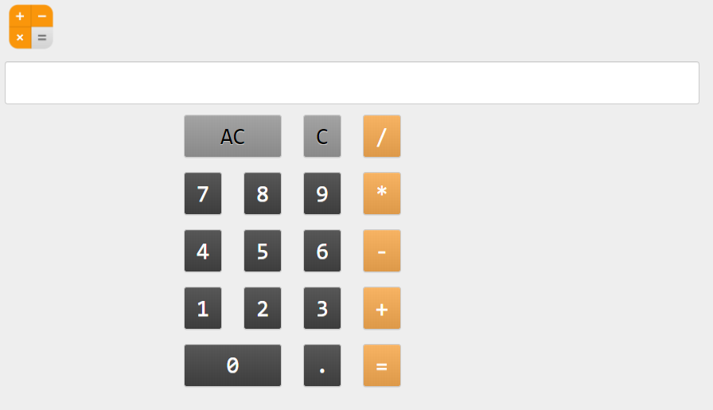
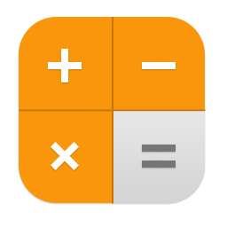
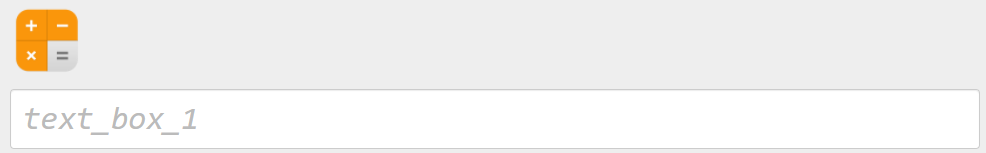

====================================================
iPhone Calculator
====================================================

| This builds a simple calculator using code to add the buttons.
| It is based on, with slight variations to suit, the the iphone calculator with a grid of 5 rows and 4 columns.

| Working app at: https://pc-iphone-calculator.anvil.app

----

References
------------------------------

#. Youtube guide for using code to create the components: https://www.youtube.com/watch?v=NiQdsK3H57Y
#. Anvil events: https://anvil.works/docs/client/components
#. Python try-except: https://www.w3schools.com/python/python_try_except.asp
#. Python eval: https://www.w3schools.com/python/ref_func_eval.asp
#. Python enumerate: https://www.w3schools.com/python/ref_func_enumerate.asp
#. Colour hex values: https://www.w3schools.com/colors/colors_picker.asp?colorhex=85b185
#. Calculator icon: https://icons.iconarchive.com/icons/tristan-edwards/sevenesque/256/Calculator-icon.png
#. Grid panel syntax: https://anvil.works/docs/api/anvil#GridPanel
#. Button syntax: https://anvil.works/docs/api/anvil#Button

----

Get started
------------------------------

#. Go to: https://anvil.works/new-build
#. Click: Blank App.
#. Choose: Custom HTML
#. Choose: Blank Panel

----

Settings
------------------------------

#. Click on the cog icon to show the settings tab.
#. Enter an App name. iPhone_Calculator
#. Enter an App title. iPhone_Calculator
#. Enter an App description. iPhone_Calculator using code to build the buttons
#. Get a calculator icon to upload such as: https://icons.iconarchive.com/icons/tristan-edwards/sevenesque/256/Calculator-icon.png
#. Click Change Image to upload an App logo.
#. Close the settings tab.

----

Build first part of interface
------------------------------

#. Drag and drop the *image* component from the right toolbox onto Form1.
#. In the properties panel: height section, set the height to ``75``.
#. Drag and drop the *textbox* component from the right toolbox onto Form1 below the image.
#. In the properties panel: text section, set the align to ``left``, the font to ``Consolas`` and the font_size to ``32``.
#. Click below on the form itself.
#. In the properties panel: appearance section, set the background to grey: ``#eee``.

----

Add code for buttons
------------------------------

| Add a ``chars`` list that has the button text to be shown.
| Use whitespace to layout the list as it will appear so it will be easier to work out the rows needed later in the code.

.. code-block:: python

    class Form1(Form1Template):
    def __init__(self, **properties):
        # Set Form properties and Data Bindings.
        self.init_components(**properties)

        # Any code you write here will run when the form opens.
        # add btn text list
        chars = ["AC", "C", "/",
                "7", "8", "9", "*",
                "4", "5", "6", "-",
                "1", "2", "3", "+",
                "0",".", "="]

----

Code for buttons step 1
------------------------------

| Add code to the end of the init method to create buttons.
| See Grid panel syntax: https://anvil.works/docs/api/anvil#GridPanel
| The grid panel has rows specified by letters: A, B, C...
| The grid panel has 12 columns specified by numbers: 0, 1, 2, ....11
| See Button syntax: https://anvil.works/docs/api/anvil#Button

| Use ``self.btn = {}`` to set up the button dictionary which will store each button object with the button text as the key.
| Use ``gp = GridPanel()`` to set up an empty Grid panel to which the buttons will be added.
| Use ``enumerate(chars)`` to turn the list into a dictionary like object where each button has a key starting from 0, and the button text is the dictionary value.
| Loop through the enumerate object using: ``for idx,i in enumerate(chars):``, where ``idx`` is the key and ``i`` is the button text.
| Set some default values for the button variables to be adjusted later: ``row``, background colour ``bg_col``, foreground colour ``fg_col``, and button width ``btn_width``.
| Create each button ``self.btn[i]``. The self prefix is required since this is an object in a class, ``Form1``.
| Add each button to the Grid panel using: ``gp.add_component()``.
| Add the Grid panel to the form using ``self.add_component(gp)``.
| Add a spacer at the bottom of the form to fill the screen.
| Specify the spacer height first using ``self.space = Spacer(height=500)``.
| Then add it to the form using ``self.add_component(self.space)``.

.. code-block:: python

        self.btn = {}
        gp = GridPanel()

        for idx,i in enumerate(chars):

            #temporary values to be replaced with button specific values
            row = 'A'
            bg_col = "#999999"
            fg_col = "#000000"
            btn_width = 1

            #create btns
            self.btn[i] = Button(align="full", text=i, font="Consolas", font_size=32, bold=False, foreground=fg_col,background=bg_col)
            gp.add_component(self.btn[i], row=row, col_xs=3, width_xs=btn_width)

            # display grid panel
            self.add_component(gp)
            # add a spacer after grid panel to fill the bottom of the screen
            self.space = Spacer(height=500)
            self.add_component(self.space)

----

Code for buttons step 2
------------------------------

| Replace the default value for the button row based on the enumerate index, ``idx``.
| The ``chars`` list has been set out as it will appear on screen, with 3, 4, 4, 4, 3 buttons per row.
| These values are used to create the if, elif, else block in which the rows are specified from A to E.

.. code-block:: python

        # enumerate buttons
        for idx,i in enumerate(chars):

            #btn row
            if idx < 3:
                row = 'A'
            elif 3 <= idx < 7:
                row = 'B'
            elif 7 <= idx < 11:
                row = 'C'
            elif 11 <= idx < 15:
                row = 'D'
            else:
                row = 'E'

----

Code for buttons step 3
------------------------------

| Replace the default values for the button colours with those
| based on the text value, ``i in enumerate(chars)``.
| See Colour hex values: https://www.w3schools.com/colors/colors_picker.asp?colorhex=85b185

.. code-block:: python

        # enumerate buttons
        for idx,i in enumerate(chars):

            #btn colour
            if i in ["AC", "C"]:
                bg_col = "#999999"
                fg_col = "#000000"
            elif i in ["=", "+", "-", "*", "/"]:
                bg_col = "#f6aa51"
                fg_col = "#FFFFFF"
            else:
                bg_col = "#444444"
                fg_col = "#FFFFFF"

----

Code for buttons step 4
------------------------------

| Replace the default values for the button width with those based on the text value, ``i enumerate(chars)``.
| The width value is the number of columns for the button to be spread out across.
| All the buttons are to take up only 1 column, except for the ``AC`` and ``0`` buttons which will take up 2 columns.

.. code-block:: python

        # enumerate buttons
        for idx,i in enumerate(chars):

            #btn width
            if i in ["AC", "0"]:
                btn_width = 2
            else:
                btn_width = 1

----

Code for buttons click method
------------------------------

| See: https://anvil.works/docs/client/components
| Define a click method to determine what happens to the calculator text box.
| Use the arguments: ``(self, **event_args)``.
| ``event_args`` has an index ``['sender']`` from which the button text can be found using the tab.name property, which is set when the button was created.
| The ``tag.name`` property will be set to the text of the button in code to be added later in step 5 below.
| Get the button text using: ``val = event_args['sender'].tag.name``
| To add the button text to the end of the text box use: ``self.text_box_1.text += val``.
| If the AC button, all clear, is pressed, clear the text box with: ``self.text_box_1.text = ""``.
| If the C button, clear last entry, is pressed, clear the last character of the text box with: ``self.text_box_1.text = self.text_box_1.text[:-1]``.
| When the ``=`` button is pressed, use the ``eval`` function to convert the expression in the text box to a value.
| This needs to be placed in a try except block to handle cases in which the maths string can't be evaluated. e.g "4+/*3"

.. code-block:: python

    # click method for btns
    def click(self, **event_args):
        val = event_args['sender'].tag.name
        if val == "=":
            try:
                self.text_box_1.text = eval(self.text_box_1.text)
            except:
                self.text_box_1.text  += " error"
        elif val == "AC":
            self.text_box_1.text = ""
        elif val == "C":
            self.text_box_1.text = self.text_box_1.text[:-1]
        else:
            self.text_box_1.text += val

----

Code for buttons step 5
------------------------------

| Now that the button click method has been coded, each button needs to have the event handler added to their properties.
| Set the button tag.name property to the button text using: ``self.btn[i].tag.name = i``.
| Add the click event to the button properties using: ``self.btn[i].set_event_handler('click', self.click)``

.. code-block:: python

    #create btns
    self.btn[i] = Button(align="full", text=i, font="Consolas", font_size=32, bold=False, foreground=fg_col,background=bg_col)
    # to collect the tag name when clicked
    self.btn[i].tag.name = i
    # handle the click event and attach the click method to the event
    self.btn[i].set_event_handler('click', self.click)
    gp.add_component(self.btn[i], row=row, col_xs=3, width_xs=btn_width)

----

Final code
------------------------------

.. code-block:: python

    class Form1(Form1Template):
        def __init__(self, **properties):
            # Set Form properties and Data Bindings.
            self.init_components(**properties)

            # Any code you write here will run when the form opens.
            # add btn text list
            chars = ["AC", "C", "/",
                    "7", "8", "9", "*",
                    "4", "5", "6", "-",
                    "1", "2", "3", "+",
                    "0",".", "="]

            self.btn = {}
            gp = GridPanel()

            # enumerate buttons
            for idx,i in enumerate(chars):
                #btn row
                if idx < 3:
                    row = 'A'
                elif 3 <= idx < 7:
                    row = 'B'
                elif 7 <= idx < 11:
                    row = 'C'
                elif 11 <= idx < 15:
                    row = 'D'
                else:
                    row = 'E'

                #btn colour
                if i in ["AC", "C"]:
                    bg_col = "#999999"
                    fg_col = "#000000"
                elif i in ["=", "+", "-", "*", "/"]:
                    bg_col = "#f6aa51"
                    fg_col = "#FFFFFF"
                else:
                    bg_col = "#444444"
                    fg_col = "#FFFFFF"

                #btn width
                if i in ["AC", "0"]:
                    btn_width = 2
                else:
                    btn_width = 1

                #create btns
                self.btn[i] = Button(align="full", text=i, font="Consolas", font_size=32, bold=False, foreground=fg_col,background=bg_col)
                # to collect the tag name when clicked
                self.btn[i].tag.name = i
                # handle the click event and attach the click method to the event
                self.btn[i].set_event_handler('click', self.click)
                gp.add_component(self.btn[i], row=row, col_xs=3, width_xs=btn_width)

                # display grid panel
                self.add_component(gp)
                # add a spacer after grid panel to fill the bottom of the screen
                self.space = Spacer(height=500)
                self.add_component(self.space)

        # click method for btns
        def click(self, **event_args):
            val = event_args['sender'].tag.name
            if val == "=":
                try:
                    self.text_box_1.text = eval(self.text_box_1.text)
                except:
                    self.text_box_1.text  += " error"
            elif val == "AC":
                self.text_box_1.text = ""
            elif val == "C":
                self.text_box_1.text = self.text_box_1.text[:-1]
            else:
                self.text_box_1.text += val

----

.. admonition:: Tasks

    #. The keyboard can also be used instead of the buttons. Try it out.
    #. Try adding some maths function buttons in another row. e.g. x^2 which squares the text box. e.g. sqrt which takes the square root.
    #. Try adding some maths function buttons in another row by importing the maths library. See: https://docs.python.org/3/library/math.html

