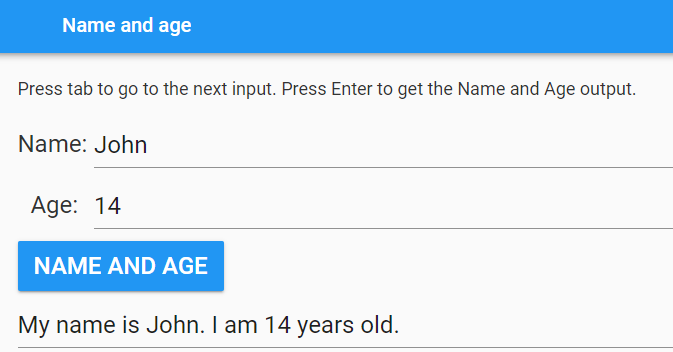

====================================================
Name and age
====================================================

This app takes inputs of the name and age and outputs a string containing that info.

| Working app at: `<https://pc-name-and-age.anvil.app>`_

----

Design
---------

| Use a Column panel.
| Use 3 label fields, 3 textboxes and 1 button.

----

Get started
------------------------------

#. Go to: `<https://anvil.works/new-build>`_
#. Click: Blank App.
#. Choose: Material Design

----

Settings
------------------------------

#. Click on the cog icon to show the settings tab.
#. Enter an App name. **name_and_age**
#. Enter an App title. **name_and_age**
#. Enter an App description. **Output a string containing your name and age.**
#. Close the settings tab.

----

Build interface
-------------------

| Navigation from one textbox field to the next is automatic. Press TAB or SHIFT-TAB
| Buttons are also navigated to using TAB.

Title
~~~~~~~~~~~~~~~~~~~

| Drag and drop a *label* component onto the **Drop title here** container.
| In the properties panel: name section, set the **name** to **title**.
| In the properties panel: text section, set the **text** to **Name and Age**.
| In the properties panel: text section, set the **font_size** to 24.

----

Column panel
~~~~~~~~~~~~~~~~~~~

| Drag and drop a *column panel* component onto the form.

----

Instructions
~~~~~~~~~~~~~~~~~~~

| Drag and drop a *label* component onto the column panel.
| In the properties panel: name section, set the **name** to **instructions**.
| In the properties panel: text section, set the **text** to text below.
| In the properties panel: text section, set the **font_size** to 18.

.. code-block::

    Press tab to go to the next input. Press Enter to get the Name and Age output.

----

Name
~~~~~~~~~~~~~~~~~~~

| Drag and drop a *label* component onto the column panel.
| In the properties panel: name section, set the **name** to **name_label**.
| In the properties panel: text section, set the **text** to **Name:**.
| In the properties panel: text section, set the **font_size** to 24.

| Drag and drop a *TextBox* component onto the column panel to the right of the label.
| Click and drag the divider between the label and textbox to resize them. Control click and drag for finer control.
| In the properties panel: name section, set the **name** to **name**.
| In the properties panel: text section, set the **font_size** to 24.
| In the properties panel: Events section, click on the blue icon to the right of the **pressed_enter** label.
| This will add a default script, **name_pressed_enter**, to the code.

----

Age
~~~~~~~~~~~~~~~~~~~

| Drag and drop a *label* component onto the column panel.
| In the properties panel: name section, set the **name** to **age_label**.
| In the properties panel: text section, set the **text** to **Age:**.
| In the properties panel: text section, set the **font_size** to 24.

| Drag and drop a *TextBox* component onto the column panel to the right of the label.
| Click and drag the divider between the label and textbox to resize them. Control click and drag for finer control.
| In the properties panel: name section, set the **name** to **age**.
| In the properties panel: text section, set the **font_size** to 24.
| In the properties panel: Events section, click on the blue icon to the right of the **pressed_enter** label.
| This will add a default script, **age_pressed_enter**, to the code.

----

Name And Age button
~~~~~~~~~~~~~~~~~~~~~~~~~~~

| Drag and drop a *Button* component onto the column panel to the right of the hailstone_start textbox.
| In the properties panel: name section, set the **name** to **name_age**.
| In the properties panel: text section, set the **text** to **Name and age**.
| In the properties panel: text section, set the **font_size** to 24.
| In the properties panel: appearance section, set the **role** to **primary-color**.
| In the properties panel: Events section, click on the blue icon to the right of the **click** label.
| This will add a default script, **name_age_click**, to the code. This will be coded later to generate the output.

----

Output Code
--------------------

| The **get_name_age** function has 2 parameters: **name** and **age**.
| It will be called using: **self.get_name_age(self.name.text, self.age.text)**.
| It checks to see that both the name and age have been input and returns **None** if not.
| It returns an f-string containing the **name** and **age**.

| The **do_output** function places the output text.

.. code-block:: python

    def get_name_age(self, name, age):
        if name == "" or age == "":
            return None
        else:
            return f'My name is {name}. I am {age} years old.'

    def do_output(self):
        self.output.text = self.get_name_age(self.name.text, self.age.text)

----

Event Code
--------------------

| Both the button click and pressing enter in an input textbox attempts to produce the output.

.. code-block:: python

    def name_age_click(self, **event_args):
        self.do_output()

    def name_pressed_enter(self, **event_args):
        self.do_output()

    def age_pressed_enter(self, **event_args):
        self.do_output()

----

Final  Code
--------------------

| The full code is below.

.. code-block:: python

    from ._anvil_designer import Form1Template
    from anvil import *
    import anvil.tables as tables
    import anvil.tables.query as q
    from anvil.tables import app_tables

        class Form1(Form1Template):

        def __init__(self, **properties):
            # Set Form properties and Data Bindings.
            self.init_components(**properties)

        def get_name_age(self, name, age):
            if name == "" or age == "":
                return None
            else:
                return f'My name is {name}. I am {age} years old.'

        def do_output(self):
            self.output.text = self.get_name_age(self.name.text, self.age.text)

        def name_age_click(self, **event_args):
            self.do_output()

        def name_pressed_enter(self, **event_args):
            self.do_output()

        def age_pressed_enter(self, **event_args):
            self.do_output()

----

.. admonition:: Tasks

    #. Add an error textbox field and provide error messages: for missing an age or name, for entering text instead of a number for age, and entering a number instead of text for the name.
    #. Add a third input textbox field and add its information to the output string. e.g. Favourite sport.

