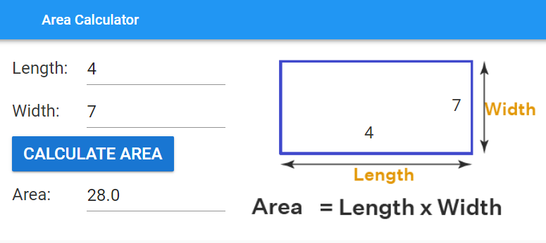
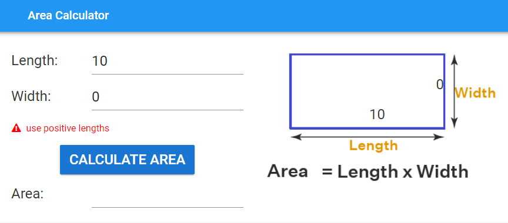

====================================================
Rectangle area
====================================================

This app calculates the area of a rectangle, given the length and width.

| Working app at: https://pc-rectangle-area.anvil.app

    
| Use a XY panel for the diagram region, so that the text labels can be placed over the diagram.

| Download the diagram file :download:`rectangle diagram <images/area/rectangle.png>`.

----

Get started
------------------------------

#. Go to: https://anvil.works/new-build
#. Click: Blank App.
#. Choose: Material Design

----

Key components
-------------------

| Name the input textboxes: **length** and **width**.
| Set both input textbox property **type** settings to **number**.
| Name the labels on the diagram: **diagram_length** and **diagram_width**.

----

Error field
~~~~~~~~~~~~~~~~~~~

| Drag and drop a *label* component onto the column panel below the width textbox.
| In the properties panel: name section, set the **name** to **error**.
| In the properties panel: text section, set the **font_size** to 16.
| In the properties panel: appearance section, set the **foreground_color** to **#ff0000**.
| In the properties panel: icon section, set the **icon** to **fa:exclamation-triangle**.

| Code to hide or show error field takes the **error** parameter.
| An error will be shown if **error** is a text string.
| Passing **None** as the **error** parameter hides and clears the error field.

.. code-block:: python

    def do_error(self, error):
        # check for error and display it if present
        if error:
            self.error.text = error
            self.error.visible = True
        else:
            # hide error and clear it
            self.error.text = ""
            self.error.visible = False

----

Event Code 
--------------------

| Both clicking the calculate button and pressing enter in the input textboxes produces the output.

.. code-block:: python

    def calculate_click(self, **event_args):
        self.do_calculation()

    def angle_pressed_enter(self, **event_args):
        self.do_calculation()

    def force_pressed_enter(self, **event_args):
        self.do_calculation()

| Changing the length or width inputs triggers the placement of those values on the diagram.

.. code-block:: python

    def length_change(self, **event_args):
        self.diagram_length.text = self.length.text

    def width_change(self, **event_args):
        self.diagram_width.text = self.width.text

----

Calculation
--------------------

| A try-except block is used to make sure an **error** output, **use positive lengths**, is given when the inputs are not valid.
| Testing with invalid inputs shows that **TypeError** is the only error type to put in the try-except block.
| Any values of 0 or less are then detected: 
| ``if val <= 0 or self.length.text <= 0 or self.width.text <= 0:``.

| f-stings allow convenient formatting to 2 decimal places.
| e.g. ``self.area.text = f'{val:.2f}''``

.. code-block:: python

    def calculate_area(self):
        try:
            val = self.length.text * self.width.text
        except TypeError as error:
            self.area.text = None
            self.do_error('use positive lengths')
        else:
            if val <= 0 or self.length.text <= 0 or self.width.text <= 0:
                self.area.text = None
                self.do_error('use positive lengths')
            else:
                self.area.text = f'{val:.2f}'
                self.do_error(None)

----

Final  Code 
--------------------

| The full code is below.

.. code-block:: python

    from ._anvil_designer import Form1Template
    from anvil import *
    import anvil.tables as tables
    import anvil.tables.query as q
    from anvil.tables import app_tables

    class Form1(Form1Template):

        def __init__(self, **properties):
            # Set Form properties and Data Bindings.
            self.init_components(**properties)

        def Calculate_click(self, **event_args):
            self.calculate_area()

        def width_pressed_enter(self, **event_args):
            self.calculate_area()

        def length_pressed_enter(self, **event_args):
            self.calculate_area()

        def length_change(self, **event_args):
            self.diagram_length.text = self.length.text

        def width_change(self, **event_args):
            self.diagram_width.text = self.width.text

        def calculate_area(self):
            try:
                val = self.length.text * self.width.text
            except TypeError as error:
                self.area.text = None
                self.do_error('use positive lengths')
            else:
                if val <= 0 or self.length.text <= 0 or self.width.text <= 0:
                    self.area.text = None
                    self.do_error('use positive lengths')
                else:
                    self.area.text = f'{val:.2f}'
                    self.do_error(None)

        def do_error(self, error):
            # check for error and display it if present
            if error:
                self.error.text = error
                self.error.visible = True
            else:
                # hide error and clear it
                self.error.text = ""
                self.error.visible = False

----

.. admonition:: Tasks

    #. Add a dropdown to specify the number of decimal places in the output values.
    #. Write an app to calculate the area of a circle.
    #. Write an app to calculate the area of a triangle.
    #. Write an app to calculate the area of a trapezium.
