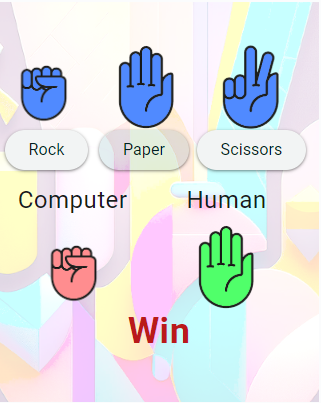
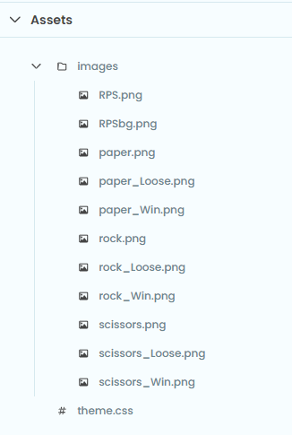
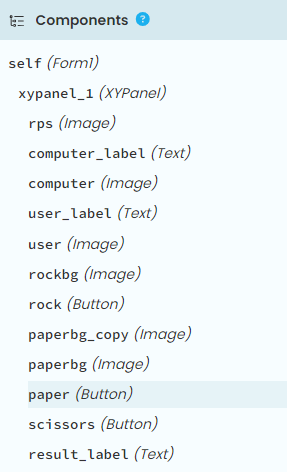

====================================================
Rock paper scissors
====================================================

| This app is a computer versus human game of rock paper scissors.

| Try it out at: `<https://pc-rps.anvil.app>`_

----

App Theme
--------------

| Go to `<https://anvil.works/build>`_
| Click Create a new app.
| In the Choose Theme window choose Material Design 3.
| Set the python environment to the latest version.

----

Assets
-----------

| Add image files to assets. Use a folder for the images via **Add Folder**. First click on the 3 vertical dots to reveal the menu and choose **Add Asset**. In the Add Asset window, click **Choose file** and navigate to the image file to add.
| Add coloured images for each of rock, paper and scissors to represent a tie, a win and a loss.

----

Components
----------------

The required components are shown below.

| Delete the initial components in the Form1.
| Add an XYPanel to the content_panel. Set this width to 320 and height to 400.
| Add an image for the background, then 3 buttons and 3 text labels and 5 images to the XYPanel.

----

Client Code
------------

| Place the code below in the Form1 code.
| Run the code to check that it works.
| **self.images** is a dictionary of image paths.
| **self.user.source** and **self.computer.source** will have their image path updated during each play.

.. code-block:: python

    from ._anvil_designer import Form1Template
    from anvil import *
    import random
    import time

    class Form1(Form1Template):
        def __init__(self, **properties):
            self.init_components(**properties)
            self.images = {
                "Rock_Win": "_/theme/images/rock_Win.png",
                "Rock_Loose": "_/theme/images/rock_Loose.png",
                "Paper_Win": "_/theme/images/paper_Win.png",
                "Paper_Loose": "_/theme/images/paper_Loose.png",
                "Scissors_Win": "_/theme/images/scissors_Win.png",
                "Scissors_Loose": "_/theme/images/scissors_Loose.png",
                "Rock_Tie": "_/theme/images/rock.png",
                "Paper_Tie": "_/theme/images/paper.png",
                "Scissors_Tie": "_/theme/images/scissors.png"
            }
            self.images_list = list(self.images.values())
            self.choices = ["Rock", "Paper", "Scissors"]

        def rock_click(self, **event_args):
            self.play("Rock")

        def paper_click(self, **event_args):
            self.play("Paper")

        def scissors_click(self, **event_args):
            self.play("Scissors")

        def play(self, user_choice):
            self.result_label.text = None
            computer_choice = random.choice(self.choices)
            computer_result, user_result = self.determine_winner(user_choice, computer_choice)
            self.user.source = self.get_image_source(user_choice, user_result)
            self.computer.source = self.get_image_source(computer_choice, computer_result)
            self.result_label.text = user_result

        def determine_winner(self, user, computer):
            #computer_result, user_result
            if user == computer:
                return "Tie", "Tie"
            elif (user == "Rock" and computer == "Scissors") or \
                (user == "Paper" and computer == "Rock") or \
                (user == "Scissors" and computer == "Paper"):
                return "Loose", "Win"
            else:
                return "Win", "Loose"

        def get_image_source(self, choice, result):
            if result == "Tie":
                return self.images[f"{choice}_Tie"]
            elif result == "Win":
                return self.images[f"{choice}_Win"]
            else:
                return self.images[f"{choice}_Loose"]

----

.. admonition:: Tasks

    #. Add a scoring system.

