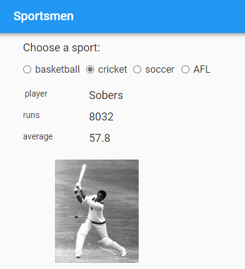
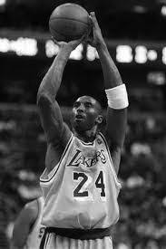
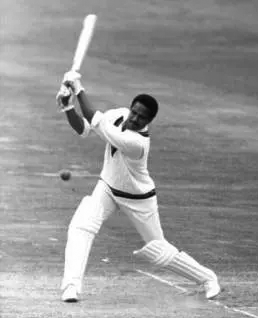
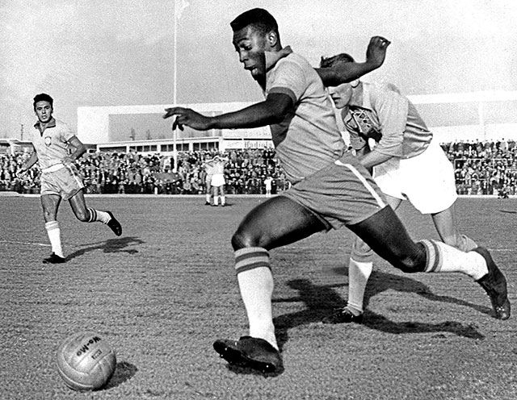
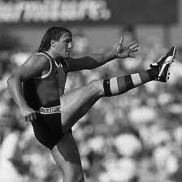

====================================================
Sportsmen
====================================================

This uses nested dictionaries to display chosen information from nested dictionaries.

| Working app at: https://pc-sportsmen.anvil.app

----

References
------------------------------

#. https://anvil.works/docs/media/image-manipulation
#. https://www.geeksforgeeks.org/python-nested-dictionary/

----

Design
---------

| Use an XY panel for easy resizing and placement of fields.
| Use a label field to display instructions.
| Use 4 radio buttons to choose the information to display.
| Use 3 label fields to display the information type.
| Use 3 label fields to display the information content.
| Add text information in a nested dictionary.
| Upload Images to 4 image objects and hide them.

----

Instructions
~~~~~~~~~~~~~~~~~~~

| Drag and drop a *label* component onto the column panel.
| In the properties panel: name section, set the **name** to **instructions**.
| In the properties panel: text section, set the **text** to text below.
| In the properties panel: text section, set the **font_size** to 18.

.. code-block::
    
    Press a sport option button to show a famous player.

----

Radio buttons
~~~~~~~~~~~~~~~~~~~

| Place the radio buttons together in a horizontal line at the top.
| Use the properties panel to set their names and their text property to "basketball", "cricket", "soccer", "AFL".
| Resize them to just fit the text.
| Click the XY panel and drag its right handle to resize it horizontally to comfortably fit the radio buttons text. Suggested width is about 400.

----

Information type 
~~~~~~~~~~~~~~~~~~~

| Place 3 label fields in a vertical line at the left below the first radio button.
| Name the label fields: "player_label", "score_label" and "average_label".
| Resize them to a width of 108 using the container properties width property.

----

Information content 
~~~~~~~~~~~~~~~~~~~

| Place 3 label fields in a vertical line at the left below the second radio button.
| Name the label fields: "player", "score" and "average".
| Resize them to a width of 295 using the container properties width property.

----

Images 
~~~~~~~~~~~~~~~~~~~

| Place 4 image objects below the other fields, 1 at a time.
| Name the images one at a time: "img_basketball", "img_cricket", "img_soccer", "img_AFL".
| Click the current image that is being added. In the properties panel, click the black up arrow to the right of the source property field to Upload an image from the laptop.

| Add the 4 images across the screen, overlapping somewhat so they are roughly in line with their radio button.

    

| The images should have heights of about 200 and widths around 130 to 140. These can be set in the properties panel.
| Hide the images by unchecking the visible checkbox for each image using the properties appearance section.

----

Code 
--------------------

| Add content info via a nested dictionary.
| For basketball: player = Bryant; points = 33643; goals per game= 25.0
| For cricket: player = Sobers; runs = 8032; average= 57.8
| For Soccer: player = Pele; goals = 775; goals_per_game = 0.92
| For AFL: player = Locket; goals = 1360; goals_per_game = 4.84

.. admonition:: Tasks

    #. Write code for the nested dictionary.   

    .. dropdown::
            :icon: codescan
            :color: primary
            :class-container: sd-dropdown-container

            .. tab-set::

                .. tab-item:: Q1

                    Write code for the nested dictionary. 

                    .. code-block:: python

                        sportsmen_dict = {
                            "cricket": {
                                "player": "Sobers",
                                "score_label": "runs",
                                "score": "8032",
                                "average_label": "average",
                                "average": "57.8",
                                "image_filename": "Sobers.png",
                            },
                            "AFL": {
                                "player": "Locket",
                                "score_label": "goals",
                                "score": "1360",
                                "average_label": "goals per game",
                                "average": "4.84",
                                "image_filename": "Locket.png",
                            },
                            "soccer": {
                                "player": "Pele",
                                "score_label": "goals",
                                "score": "775",
                                "average_label": "goals per game",
                                "average": "0.92",
                                "image_filename": "Pele.png",
                            },
                            "basketball": {
                                "player": "Bryant",
                                "score_label": "points ",
                                "score": "33643",
                                "average_label": "goals per game",
                                "average": "25.0",
                                "image_filename": "Bryant.png",
                            },
                        
                        }

----

radio button click handler 
-------------------------------

| To each of the 4 radio buttons add a clicked event by clicking in the blue icon for the clicked field in the events section of the properties panel. 
| e.g. "basketball_clicked",  "cricket_clicked",  "soccer_clicked", and "AFL_clicked". 

----

Code 
--------------------

| Use code to pick out parts of the nested dictionary.

.. admonition:: Tasks

    #. Write code for each radio button click event.   
    #. Write a **place_info** method that puts text into the 6 label fields and shows the image for the chosen sport.   
    #. Write a **show_sport_image** method that shows the image for the chosen sport, after first hiding all 4 images.   

    .. dropdown::
            :icon: codescan
            :color: primary
            :class-container: sd-dropdown-container

            .. tab-set::

                .. tab-item:: Q1

                    Write code for each radio button click event. 

                    .. code-block:: python

                        def basketball_clicked(self, **event_args):
                            choice = 'basketball'
                            self.place_info(choice)

                .. tab-item:: Q2

                    Write a **place_info** method that puts text into the 6 label fields and shows the image for that sport. 

                    .. code-block:: python

                        def place_info(self, choice):
                            self.player_label.text = 'player'
                            self.player.text = self.sportsmen_dict[choice]['player']
                            self.score_label.text = self.sportsmen_dict[choice]['score_label']
                            self.score.text = self.sportsmen_dict[choice]['score']
                            self.average_label.text = self.sportsmen_dict[choice]['average_label']
                            self.average.text = self.sportsmen_dict[choice]['average']
                            self.show_sport_image(choice)

                .. tab-item:: Q3

                    Write a **show_sport_image** method that shows the image for the chosen sport, after first hiding all 4 images. 

                    .. code-block:: python

                        def show_sport_image(self, choice):
                            self.img_afl.visible = False
                            self.img_basketball.visible = False
                            self.img_soccer.visible = False
                            self.img_cricket.visible = False
                            if choice == 'AFL': 
                                self.img_afl.visible = True
                            elif choice == 'basketball': 
                                self.img_basketball.visible = True
                            elif choice == 'soccer': 
                                self.img_soccer.visible = True
                            elif choice == 'cricket': 
                                self.img_cricket.visible = True

----

Final Code 
--------------------

| The final code is shown below.

.. code-block:: python

    from ._anvil_designer import Form1Template
    from anvil import *
    import anvil.tables as tables
    import anvil.tables.query as q
    from anvil.tables import app_tables
    import anvil.image

    class Form1(Form1Template):

        def __init__(self, **properties):
            # Set Form properties and Data Bindings.
            self.init_components(**properties)

            
        sportsmen_dict = {
            "cricket": {
                "player": "Sobers",
                "score_label": "runs",
                "score": "8032",
                "average_label": "average",
                "average": "57.8",
                "image_filename": "Sobers.png",
            },
            "AFL": {
                "player": "Locket",
                "score_label": "goals",
                "score": "1360",
                "average_label": "goals per game",
                "average": "4.84",
                "image_filename": "Locket.png",
            },
            "soccer": {
                "player": "Pele",
                "score_label": "goals",
                "score": "775",
                "average_label": "goals per game",
                "average": "0.92",
                "image_filename": "Pele.png",
            },
            "basketball": {
                "player": "Bryant",
                "score_label": "points ",
                "score": "33643",
                "average_label": "goals per game",
                "average": "25.0",
                "image_filename": "Bryant.png",
            },
        
        }
        
        def place_info(self, choice):
            # player = self.sportsmen_dict[choice]['player']
            # player_img = self.sportsmen_dict[choice]['image_filename']
            self.player_label.text = 'player'
            self.player.text = self.sportsmen_dict[choice]['player']
            self.score_label.text = self.sportsmen_dict[choice]['score_label']
            self.score.text = self.sportsmen_dict[choice]['score']
            self.average_label.text = self.sportsmen_dict[choice]['average_label']
            self.average.text = self.sportsmen_dict[choice]['average']
            self.show_sport_image(choice)
            
        def show_sport_image(self, choice):
            self.img_afl.visible = False
            self.img_basketball.visible = False
            self.img_soccer.visible = False
            self.img_cricket.visible = False
            if choice == 'AFL': 
                self.img_afl.visible = True
            elif choice == 'basketball': 
                self.img_basketball.visible = True
            elif choice == 'soccer': 
                self.img_soccer.visible = True
            elif choice == 'cricket': 
                self.img_cricket.visible = True
        
        def AFL_clicked(self, **event_args):
            choice = 'AFL'
            self.place_info(choice)

        def soccer_clicked(self, **event_args):
            choice = 'soccer'
            self.place_info(choice)

        def cricket_clicked(self, **event_args):
            choice = 'cricket'
            self.place_info(choice)
            
        def basketball_clicked(self, **event_args):
            choice = 'basketball'
            self.place_info(choice)

----

.. admonition:: Tasks

    #. Add a fifth sport. e.g. tennis.
