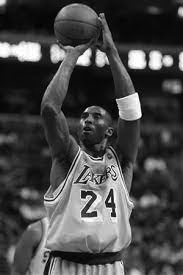
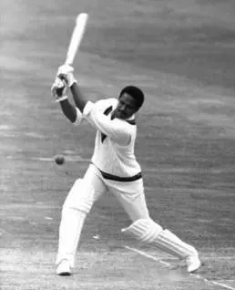
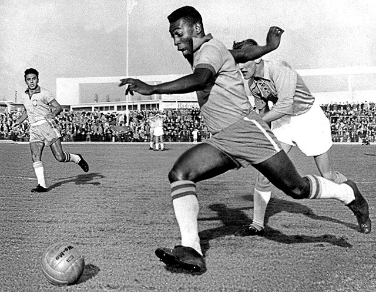
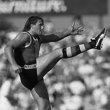

====================================================
Sportsmen
====================================================

This uses nested dictionaries to display chosen information from nested dictionaries.

----

References
------------------------------

#. https://anvil.works/docs/media/image-manipulation

----

Design
---------

| Use an XY panel for easy resizing and placement of fields.
| Use 4 radio buttons to choose the information to display.
| Use 3 label fields to display the information type.
| Use 3 label fields to display the information content.
| Add text information in a nested dictionary.
| Upload Images to 4 image objects and hide them.

----

Radio buttons
----------------

| Place the radio buttons together in a horizontal line at the top.
| Use the properties panel to set their names and their text property to "basketball", "cricket", "soccer", "AFL".
| Resize them to just fit the text.
| Click the XY panel and drag its right handle to resize it horizontally to comfortably fit the radio buttons text. Suggested width is about 400.

----

Information type 
------------------

| Place 3 label fields in a vertical line at the left below the first radio button.
| Name the label fields: "player_label", "score_label" and "average_label".
| Resize them to a width of 108 using the container properties width poerty.

----

Information content 
--------------------

| Place 3 label fields in a vertical line at the left below the second radio button.
| Name the label fields: "player", "score" and "average".
| Resize them to a width of 295 using the container properties width poerty.

----

Images 
--------------------

| Place 4 image objects below the other fields, 1 at a time.
| Name the images one at a time: "img_basketball", "img_cricket", "img_soccer", "img_AFL".
| Click the current image that is being added. In the properties panel, click the black up arrow to the right of the source property field to Upload an image from the laptop.

| Add the 4 images across the screen, overlapping somewhat so they are roughly in line with their radio button.

    

| The images should have heights of about 200 and widths around 130 to 140. These can be set in the properties panel.
| Hide teh images by unchecking the visible checkbox for each image using the properties appearance section.

----

Code 
--------------------

| Add content info via a nested dictioary.

.. code-block:: python

    sportsmen_dict = {
        "cricket": {
            "player": "Sobers",
            "score_label": "runs",
            "score": "8032",
            "average_label": "average",
            "average": "57.8",
            "image_filename": "Sobers.png",
        },
        "AFL": {
            "player": "Locket",
            "score_label": "goals",
            "score": "1360",
            "average_label": "goals per game",
            "average": "4.84",
            "image_filename": "Locket.png",
        },
        "soccer": {
            "player": "Pele",
            "score_label": "goals",
            "score": "775",
            "average_label": "goals per game",
            "average": "0.92",
            "image_filename": "Pele.png",
        },
        "basketball": {
            "player": "Bryant",
            "score_label": "points ",
            "score": "33643",
            "average_label": "goals per game",
            "average": "25.0",
            "image_filename": "Bryant.png",
        },
    
    }