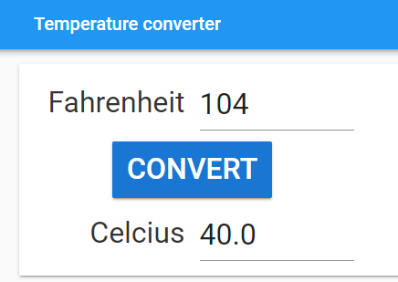
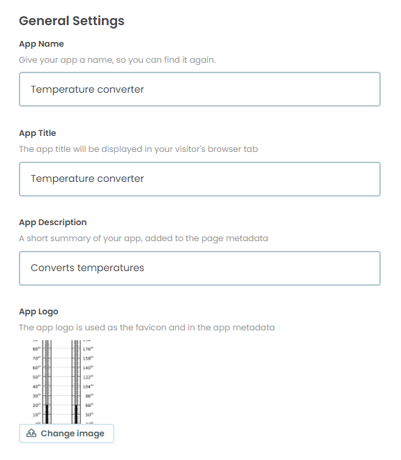
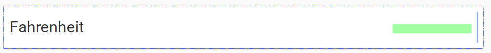
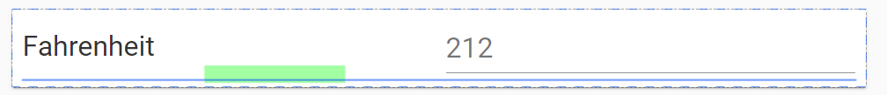

====================================================
Temperature converter
====================================================

This builds a simple temperature converter.

| Working app at: `<https://pc-temperature-converter-1.anvil.app>`_

----

Get started
------------------------------

#. Go to: `<https://anvil.works/new-build>`_
#. Click: Blank App.
#. Choose: Material Design

----

Settings
------------------------------

| Enter the settings for the app.

#. Click on the cog icon to show the settings tab.
#. Enter an App name. Temperature converter
#. Enter an App title. Temperature converter
#. Enter an App description. Converts temperatures
#. Get a thermometer icon to upload such as: `<https://upload.wikimedia.org/wikipedia/commons/thumb/1/1e/Fahrenheit_Celsius_scales.svg/240px-Fahrenheit_Celsius_scales.svg.png>`_
#. Click Change Image to upload an App logo.
#. Close the settings tab.

----

Build the first part of the interface
----------------------------------------

| Drag and drop a *label* component onto the **Drop title here** container.
| In the properties panel: name section, set the **name** to **title**.
| In the properties panel: text section, set the **text** to **Temperature_converter**.
| In the properties panel: text section, set the **font_size** to 24.

----

Card panel
~~~~~~~~~~~~~~~~~~~

| Drag and drop a *card panel* component onto the form.

----

Fahrenheit
~~~~~~~~~~~~~~~~~~~

| Drag and drop a *label* component onto card_1.
| In the properties panel: name section, set the **name** to **label_F**.
| In the properties panel: text section, set the **text** to **Fahrenheit**.
| In the properties panel: text section, set the **font_size** to 32.
| In the properties panel: text section, set the **text_align** to **right**.

| Drag and drop the *textbox* component onto card_1 to the right of the Fahrenheit label.
| A vertical blue line will indicate that you are in the right place to drop it.
| In the properties panel: name section, set the **name** to **fahrenheit** (lower case).
| In the properties panel: text section, set the **font_size** to 32.
| In the properties panel: properties section, set the **type** to **number**.
| This restricts user input to numbers.

----

Celsius
~~~~~~~~~~~~~~~~~~~

| Drag and drop the *label* component onto card_1 below the Fahrenheit label.
| A horizontal blue line will indicate that you are in the right place to drop it.
| In the properties panel: name section, set the **name** to **label_C**.
| In the properties panel: text section, set the **text** to **Celsius**.
| In the properties panel: text section, set the **font_size** to 32.
| In the properties panel: text section, set the **text_align** to **right**.

| Drag and drop the *text-box* component onto card_1 to the right of the Celsius label.
| A vertical blue line will indicate that you are in the right place to drop it.
| In the properties panel: name section, set the **name** to **celsius** (lower case).
| In the properties panel: text section, set the **font_size** to 32.

----

Convert button
~~~~~~~~~~~~~~~~~~~

| Drag and drop the *button* component onto card_1 above the Celsius label.
| A horizontal blue line will indicate that you are in the right place to drop it.
| In the properties panel: name section, set the **name** to **convert**.
| In the properties panel: text section, set the **text** to **Convert**.
| In the properties panel: text section, set the **font_size** to 32.
| In the properties panel: appearance section, set the **role** to **primary-color**.
| In the properties panel: Events section, click on the blue icon to the right of the **click** label.
| This will add a default script, **convert_click**, to the code.

----

Code
------------------------------

| See: `<https://reference.yourdictionary.com/resources/what-s-the-easiest-way-to-convert-fahrenheit-to-celsius.html>`_

| Edit the code, **convert_click**,  to calculate the temperature in Celsius.
| The formula to use is: ``celsius = (fahrenheit - 32) / 1.8``
| ``fahrenheit = self.fahrenheit.text`` can be used to get the Fahrenheit temperature.
| ``if self.fahrenheit.text:`` evaluates to True if a number has been entered or False if the text-box is empty.
| ``self.celsius.text = f'{celsius:.1f}'`` can be used to place the calculated value formatted to 1 decimal place.
| Use a **try-except** block to catch any invalid numbers in the fahrenheit entry.
| Form testing invalid entries, TypeErrors are produced, so ``except TypeError as error:`` is used to clear the celsius value via: ``self.celsius.text = None``.

.. code-block:: python

  def convert_click(self, **event_args):
      try:
        fahrenheit = self.fahrenheit.text
        celsius = (fahrenheit - 32) / 1.8
        self.celsius.text = f'{celsius:.1f}'
      except TypeError as error:
        self.celsius.text = None

----

Final  Code
--------------------

| The full code is below.

.. code-block:: python

    from ._anvil_designer import Form1Template
    from anvil import *
    import anvil.tables as tables
    import anvil.tables.query as q
    from anvil.tables import app_tables

    class Form1(Form1Template):

        def __init__(self, **properties):
            # Set Form properties and Data Bindings.
            self.init_components(**properties)

        def convert_click(self, **event_args):
            try:
                fahrenheit = self.fahrenheit.text
                celsius = (fahrenheit - 32) / 1.8
                self.celsius.text = f'{celcius:.1f}'
            except TypeError as er:
                self.celcius.text = None

----

.. admonition:: Tasks

    #. Limit the fahrenheit input to a minimum of -459.67 (absolute zero).
    #. Limit the fahrenheit input to a maximum of 7.2 trillion degrees (Large Hadron Collider).

    .. dropdown::
        :icon: codescan
        :color: primary
        :class-container: sd-dropdown-container

        .. tab-set::

            .. tab-item:: Q1

                Limit the fahrenheit input to a minimum of -459.67 (absolute zero).

                .. code-block:: python

                    def fahrenheit_change(self, **event_args):
                        if self.fahrenheit.text:
                            self.fahrenheit.text = max(-459.67, self.fahrenheit.text)

            .. tab-item:: Q2

                Limit the fahrenheit input to a maximum of 7.2 trillion degrees (Large Hadron Collider).

                .. code-block:: python

                    def fahrenheit_change(self, **event_args):
                        if self.fahrenheit.text:
                            self.fahrenheit.text = min(7200000000, self.fahrenheit.text)

----

.. admonition:: Tasks

    #. Add error checking with feedback. While the input filed has been restricted to numbers, typing a double negative sign is still possible. So make sure that en error message is shown if this is attempted.
    #. Try making a distance converter such as miles to km or inches to cm.
    #. Try making a mass converter such as lbs to kg.
    #. Try making a volume converter such as gallons to litres.
