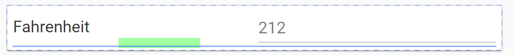
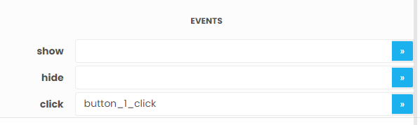

====================================================
Temperature converter
====================================================

This builds a simple temperature converter.

.. image:: images/temperature/Temperature_converter_layout.png
    :scale: 60%

----

Get started
------------------------------

#. Go to: https://anvil.works/new-build
#. Click: Blank App.
#. Choose: Material Design

----

Settings
------------------------------

| Enter the settings for the app.

.. image:: images/temperature/Temperature_converter_settings.png
    :scale: 80%

#. Click on the cog icon to show the settings tab.
#. Enter an App name. Temperature converter
#. Enter an App title. Temperature converter
#. Enter an App description. Converts temperatures
#. Get a thermometer icon to upload such as: https://upload.wikimedia.org/wikipedia/commons/thumb/1/1e/Fahrenheit_Celsius_scales.svg/240px-Fahrenheit_Celsius_scales.svg.png 
#. Click Change Image to upload an App logo.
#. Close the settings tab.

.. image:: images/temperature/Fahrenheit_Celsius_scales.png
    :scale: 10%

----

Build first part of the interface
----------------------------------

| Add a Title at the top in the blue header.
| Drag and drop the *label* component onto ``Drop title here``.
| In the properties panel: text section, set the text to ``Temperature_convertere``.

| Build the following interface by dragging and dropping components and setting their properties.

.. image:: images/temperature/Temperature_converter_layout.png
    :scale: 60%

| Drag and drop the *card* component from the right toolbox onto Form1.

| Drag and drop the *label* component onto card_1.
| In the properties panel: text section, set the text to ``Fahrenheit`` and the font_size to ``32``.

| Drag and drop the *textbox* component onto card_1 to the right of the Fahrenheit label. 
| A vertical blue line will indicate that you are in the right place to drop it.
| In the properties panel: set the text to ``212`` and the font_size to ``32``.

.. image:: images/temperature/Temperature_converter_Add_textbox_to_right.png
    :scale: 60%

| Drag and drop the *label* component onto card_1 below the Fahrenheit label.
| A horizontal blue line will indicate that you are in the right place to drop it.
| In the properties panel: text section, set the text to ``Celcius`` and the font_size to ``32``.

| Drag and drop the *textbox* component onto card_1 to the right of the Celcius label.
| In the properties panel: set the text to ``100`` and the font_size to ``32``.

| Drag and drop the *button* component onto card_1 below the Celcius label.
| In the properties panel: set the text to ``Convert`` and the font_size to ``32``.

----

Code
------------------------------

| See: https://reference.yourdictionary.com/resources/what-s-the-easiest-way-to-convert-fahrenheit-to-celsius.html
| Click on the Convert button.
| In the properties panel: Events section, click on the blue icon to the right of the ``click`` label.
| This will add a default script to the code.
| Edit the code to calculate the temperature in Celcius.
| Confirm in the Design tab that the Fahrenheit text box is text_box_1.
| ``fahrenheit = float(self.text_box_1.text)`` can be used to get the Fahrenheit temperature as a float.

.. admonition:: Question

    #. Why is float needed instead of int?

| Find out the simplest formula to use: https://reference.yourdictionary.com/resources/what-s-the-easiest-way-to-convert-fahrenheit-to-celsius.html

.. admonition:: Question

    #. What is the simplest formula to convert F to C?

| Confirm in the Design tab that the Celcius text box is text_box_2.
| ``self.text_box_2.text = celcius`` can be used to place the calculated value.

.. code-block:: python

    class Form1(Form1Template):
        def __init__(self, **properties):
            # Set Form properties and Data Bindings.
            self.init_components(**properties)

            # Any code you write here will run when the form opens.

        def button_1_click(self, **event_args):
            fahrenheit = float(self.text_box_1.text)
            celcius = (fahrenheit - 32) / 1.8
            self.text_box_2.text = celcius

----

.. admonition:: Tasks

    #. Add try except to the button_1_click function so that non numerical entries are handled. See the use of this in the calculator code.
    #. Use placeholder text instead of text values of 212 and 100. Adjust the button_1_click code to check if the text is empty and if it is, use the placeholder value instead (self.text_box_1.placeholder).
    #. Use an f-string to format the celcius temeprature to 1 decimal place. e.g ``f'{celcius:.1f}'``.
    #. Give appropriate names to the fields and buttons so that the default names are replaced with meaningful names. e.g. **text_box_1** becomes **fahrenheit**. e.g **button_1** becomes **convert_FtoC**. Make all the necessary replacements in the code to account for these changes.
    #. Add Kelvin as a another temperature to be displayed.
    #. Try making a distance converter such as miles to km or inches to cm.
    #. Try making a mass converter such as lbs to kg.
    #. Try making a volume converter such as gallons to litres.
