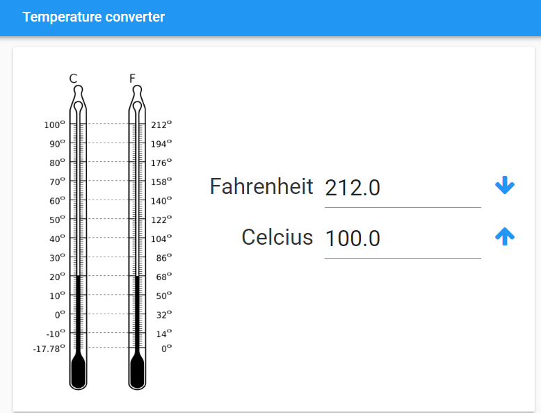
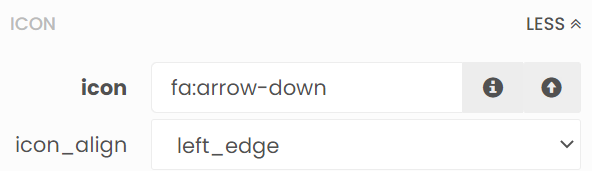

====================================================
Temperature converter2
====================================================

This enhances the temperature converter.

| Working app at: `<https://pc-temperature-converter-2.anvil.app>`_

----

References
------------------------------

#. Python f-strings: `<https://docs.python.org/3/tutorial/inputoutput.html#tut-f-strings>`_
#. Python f-string number formatting: `<https://docs.python.org/3/library/string.html#formatspec>`_

----

Key components
------------------------------

| Name the input textboxes: **fahrenheit** and **celsius**.
| Name the convert buttons that use arrows: **FtoC** and **CtoF**.
| Set the icon for **FtoC** to **fa:arrow-down**.
| Set the icon for **FtoC** to **fa:arrow-up**.

----

Add image to left
------------------------------

| Get a thermometer icon to upload such as: `<https://upload.wikimedia.org/wikipedia/commons/thumb/1/1e/Fahrenheit_Celsius_scales.svg/240px-Fahrenheit_Celsius_scales.svg.png>`_
| Drag and drop the *image* component onto the left of card_1.
| A vertical blue line will indicate that you are in the right place to drop it.
| In the properties panel: text section, set the display_mode to **shrink_to_fit** and set the height to **500**.

----

Vertically Centre the temperature fields
--------------------------------------------

| Drag and drop the *spacer* component onto card_1 above the Fahrenheit label.
| At first, a full length blue line appears. Drag down to move the blue line down as in the image below.
| A vertical blue line will indicate that you are in the right place to drop it.
| In the properties panel: set the height to **150**.

-----

Change Convert button to an icon button
-----------------------------------------

| Use an icon instead of text for the convert button and reposition it.
| Click on the Convert button.
| Name the convert buttons to: **FtoC**
| In the properties panel: icon section, click the **i** select an icon button.
| Search for **arrow**. Scroll and choose a down arrow.
| So the icon for button **FtoC** is now **fa:arrow-down**.

| In the properties panel: icon section, set the icon_align to left_edge.
| Click and drag this convert button (now a down arrow) to the right of the fahrenheit temperature.
| Hover over the vertical dividing lines between the fahrenheit temperature and the convert button and resize them to fit nicely. Control click and drag for finer control.

----

Create CtoF up arrow button
-----------------------------------------

| Creatw another button to convert C to F.
| Name the button **CtoF**.
| Set the icon for **CtoF** to **fa:arrow-up**.
| Position is below the **FtoC** button.

----

Refactor code to calculate F to C
---------------------------------------

| Modify the code from Temperature Converter 1 to use **calculate_FtoC** to do the conversion.
| Then call this when the **FtoC** button is clicked.

.. code-block:: python

    def calculate_FtoC(self):
        try:
            fahrenheit = self.fahrenheit.text
            fahrenheit = float(fahrenheit)
            celsius = (fahrenheit - 32) / 1.8
            self.celsius.text = f'{celsius:.1f}'
        except TypeError as error:
            self.celsius.text = None

    def FtoC_click(self, **event_args):
        self.calculate_FtoC()

-----

Add Code for Fahrenheit enter key
-----------------------------------

| Click the Fahrenheit text box.
| In the properties panel: events section, click the blue icon for the **pressed_enter** event.
| This adds starter code for pressing the enter key after typing in a Fahrenheit temperature.
| Add code to convert F to C.

.. code-block:: python

    def fahrenheit_pressed_enter(self, **event_args):
        self.calculate_FtoC()

-----

Create code to calculate C to F
---------------------------------------

| Copy the function, **calculate_FtoC**,  and paste it in again and rename it: **calculate_CtoF**.
| Swap **fahrenheit** and **celsius**.
| Change the formula based on: F = (C * 1.8) + 32

.. code-block:: python

    def calculate_CtoF(self):
        try:
            celsius = self.celsius.text
            celsius = float(celsius)
            fahrenheit = (celsius * 1.8) + 32
            self.fahrenheit.text =  f'{fahrenheit:.1f}'
        except TypeError as error:
            self.fahrenheit.text = None

    def CtoF_click(self, **event_args):
        self.calculate_CtoF()

-----

Add Code for celsius enter key
-----------------------------------

| This opens up the opportunity to do the reverse calculation form C to F using the enter key.
| Click the celsius text box.
| In the properties panel: events section, click the blue icon for the pressed_enter event.
| This adds starter code for pressing the enter key after typing in a celsius temperature.

.. code-block:: python

  def celsius_pressed_enter(self, **event_args):
    self.calculate_CtoF()

----

Final code
------------------------------

.. code-block:: python

    from ._anvil_designer import Form1Template
    from anvil import *
    import anvil.tables as tables
    import anvil.tables.query as q
    from anvil.tables import app_tables

    class Form1(Form1Template):

        def __init__(self, **properties):
            # Set Form properties and Data Bindings.
            self.init_components(**properties)

        def calculate_FtoC(self):
            try:
                fahrenheit = self.fahrenheit.text
                fahrenheit = float(fahrenheit)
                celsius = (fahrenheit - 32) / 1.8
                self.celsius.text = f'{celsius:.1f}'
            except TypeError as error:
                self.celsius.text = None

        def calculate_CtoF(self):
            try:
                celsius = self.celsius.text
                celsius = float(celsius)
                fahrenheit = (celsius * 1.8) + 32
                self.fahrenheit.text =  f'{fahrenheit:.1f}'
            except TypeError as error:
                self.fahrenheit.text = None

        def FtoC_click(self, **event_args):
            self.calculate_FtoC()

        def fahrenheit_pressed_enter(self, **event_args):
            self.calculate_FtoC()

        def CtoF_click(self, **event_args):
            self.calculate_CtoF()

        def celsius_pressed_enter(self, **event_args):
            self.calculate_CtoF()

----

.. admonition:: Tasks

    #. Add code to restrict temperature entries so that they cannot be below absolute zero.
    #. Replace Fahrenheit with Kelvin and adjust the display and the code to work.

