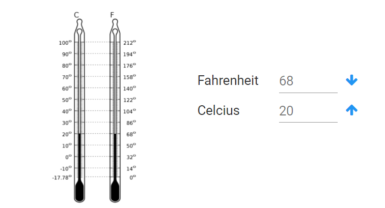
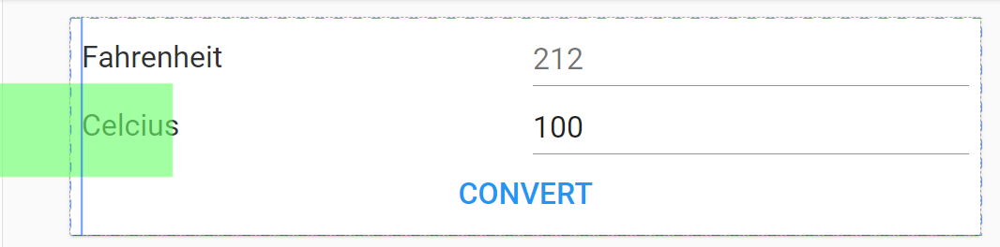
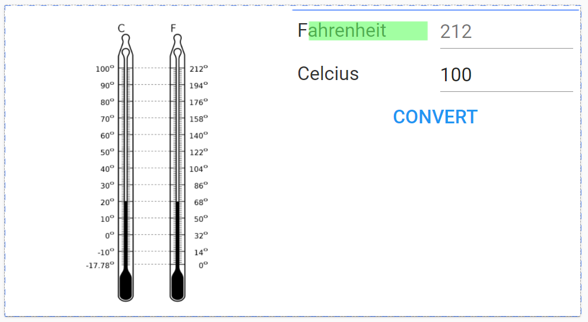
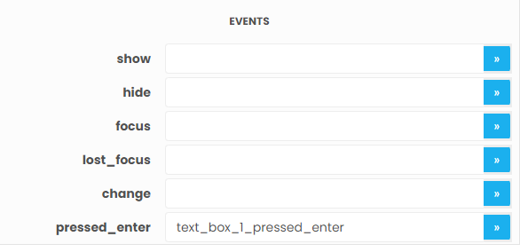
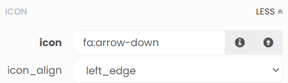
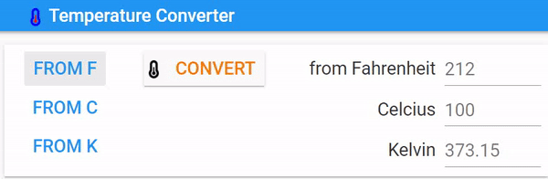

====================================================
Temperature converter2
====================================================

This enhances the temperature converter.

----

References
------------------------------

#. Python f-strings: https://docs.python.org/3/tutorial/inputoutput.html#tut-f-strings
#. Python f-string number formatting: https://docs.python.org/3/library/string.html#formatspec

----

Add image to left
------------------------------

| Get a thermometer icon to upload such as: https://upload.wikimedia.org/wikipedia/commons/thumb/1/1e/Fahrenheit_Celsius_scales.svg/240px-Fahrenheit_Celsius_scales.svg.png 
| Drag and drop the *image* component onto the left of card_1.
| A vertical blue line will indicate that you are in the right place to drop it.
| In the properties panel: text section, set the display_mode to ``shrink_to_fit`` and set the height to ``500``.

----

Centre the temperature fields
------------------------------

| Drag and drop the *spacer* component onto card_1 above the Fahrenheit label. 
| At first, a full length blue line appears. Drag down to move the blue line down as in the image below.
| A vertical blue line will indicate that you are in the right place to drop it.
| In the properties panel: set the height to ``150``.

----

Use placeholder text and type
------------------------------

| Click the Fahrenheit text box. 
| In the properties panel: text section, set the placeholder text to ``68`` and the text to empty.
| In the properties panel: text section, set the type to ``number`` so only numbers can be entered.

| Click the Celcius text box. 
| In the properties panel: text section, set the placeholder text to ``20`` and the text to empty.
| In the properties panel: text section, set the type to ``number`` so only numbers can be entered.

-----

Adjust Code for placeholder
------------------------------

| Adjust the code so that the placeholder text is used if no entry is made.
| With the text box set to the number type, text property returns None when no numbers have been entered.
| Test for empty string or None type using: ``if fahrenheit == '' or fahrenheit == None``

.. code-block:: python

        def button_1_click(self, **event_args):
            fahrenheit = self.text_box_1.text
            if fahrenheit == '' or fahrenheit == None:
                fahrenheit = self.text_box_1.placeholder
            fahrenheit = float(fahrenheit)
            celcius = (fahrenheit - 32) / 1.8
            self.text_box_2.text = celcius
----

Format to 1 dp
------------------------------

| Adjust the code so that only 1 decimal place is given.
| Use and f-string and use the formatting code ``:.1f`` to cause 1dp.
| Use ``self.text_box_2.text = f'{celcius:.1f}'``

.. code-block:: python

        def button_1_click(self, **event_args):
            fahrenheit = self.text_box_1.text
            if fahrenheit == '' or fahrenheit == None:
                fahrenheit = self.text_box_1.placeholder
            fahrenheit = float(fahrenheit)
            celcius = (fahrenheit - 32) / 1.8
            self.text_box_2.text = f'{celcius:.1f}'

-----

Add Code for Fahrenheit enter key
-----------------------------------

| Click the Fahrenheit text box.
| In the properties panel: events section, click the blue icon for the pressed_enter event.
| This adds starter code for pressing the enter key after typing in a Fahrenheit temperature.

.. code-block:: python

    def text_box_1_pressed_enter(self, **event_args):
        """This method is called when the user presses Enter in this text box"""
        pass

-----

Refactor code to calculate F to C
---------------------------------------

| Since similar code is need for this as well as the convert button, create a new function, ``calculateFtoC``,  to reuse for both click events.

.. code-block:: python       

    def calculateFtoC(self):
        fahrenheit = self.text_box_1.text
        if fahrenheit == '' or fahrenheit == None:
            fahrenheit = self.text_box_1.placeholder
        fahrenheit = float(fahrenheit)
        celcius = (fahrenheit - 32) / 1.8
        self.text_box_2.text = f'{celcius:.1f}'

    def button_1_click(self, **event_args):
        self.calculateFtoC()

    def text_box_1_pressed_enter(self, **event_args):
        self.calculateFtoC()

-----

Add Code for Celcius enter key
-----------------------------------

| This opens up the opportunity to do the reverse calculation form C to F using the enter key.
| Click the Celcius text box.
| In the properties panel: events section, click the blue icon for the pressed_enter event.
| This adds starter code for pressing the enter key after typing in a Celcius temperature.

.. code-block:: python

    def text_box_2_pressed_enter(self, **event_args):
        """This method is called when the user presses Enter in this text box"""
        pass
        

-----

Create code to calculate C to F
---------------------------------------

| Copy the function, ``calculateFtoC``,  and paste it in again and rename it: ``calculateCtoF``.
| Swap ``fahrenheit`` and ``celcius``.
| Swap ``text_box_1`` and ``text_box_2``.
| Change the formula. F = (C * 1.8) + 32

.. code-block:: python       

    def calculateCtoF(self):
        celcius = self.text_box_2.text
        if celcius == '' or celcius == None:
            celcius = self.text_box_2.placeholder
        celcius = float(celcius)
        fahrenheit = (celcius * 1.8) + 32
        self.text_box_1.text = f'{fahrenheit:.1f}'

----

Change Convert button to an icon button
-----------------------------------------

| Use an icon instead of text for the convert button and reposition it.
| Click on the Convert button.
| In the properties panel: icon section, click the ``i`` select an icon button. Search for arrow. Scroll and choose a down arrow.

    
| In the properties panel: text section, set the align to left.
| In the properties panel: icon section, set the icon_align to left_edge.
| Click and drag this convert button (now a down arrow) to the right of the fahrenheit temperature.
| Hover over the vertical dividing lines for fahrenheit temperature and the convert button and resize them to fit nicely.

----

Copy convert icon button
-----------------------------------------

| Click on the Convert button (down arrow icon).
| Copy it using Ctrl-C.
| Click at the bottom of the form and paste a copy using Ctrl-V. 

| In the properties panel: at the top click on pencil icon and rename the button to ``button_2``.
| In the properties panel: icon section, click the ``i`` select an icon button. Search for arrow. Scroll and choose an up arrow.

| Click and drag the button (now an up arrow) to the right of the celcius temperature.
| Hover over the vertical dividing lines for celcius temperature and the convert button and resize them to fit nicely.

| Click on the Convert button (up arrow icon).
| In the properties panel: Events section, click on the blue icon to the right of the ``click`` label.
| This will add a default script to the code.
| Edit the code to calculate the temperature in Fahrenheit.

.. code-block:: python

    def button_2_click(self, **event_args):
        self.calculateCtoF()

----

Final code
------------------------------

.. code-block:: python

    from ._anvil_designer import Form1Template
    from anvil import *
    import anvil.tables as tables
    import anvil.tables.query as q
    from anvil.tables import app_tables

    class Form1(Form1Template):

    def __init__(self, **properties):
        # Set Form properties and Data Bindings.
        self.init_components(**properties)

        # Any code you write here will run when the form opens.

    def calculateFtoC(self):
        fahrenheit = self.text_box_1.text
        if fahrenheit == '' or fahrenheit == None:
            fahrenheit = self.text_box_1.placeholder
        fahrenheit = float(fahrenheit)
        celcius = (fahrenheit - 32) / 1.8
        self.text_box_2.text = f'{celcius:.1f}'

    def calculateCtoF(self):
        celcius = self.text_box_2.text
        if celcius == '' or celcius == None:
            celcius = self.text_box_2.placeholder
        celcius = float(celcius)
        fahrenheit = (celcius * 1.8) + 32
        self.text_box_1.text =  f'{fahrenheit:.1f}'

    def button_1_click(self, **event_args):
        self.calculateFtoC()

    def button_2_click(self, **event_args):
        self.calculateCtoF()
        
    def text_box_1_pressed_enter(self, **event_args):
        self.calculateFtoC()

    def text_box_2_pressed_enter(self, **event_args):
        self.calculateCtoF()

----

.. admonition:: Tasks

    #. Add try except to calculation functions so that non numerical entries are handled. See the use of this in the calculator code.
    #. Replace Fahrenheit with Kelvin and adjust the display and the code to work.

----

Multi Temperature converter
------------------------------
 
| Make an new app that converts between F, C and K all at once.
| See gif to see it in action.

