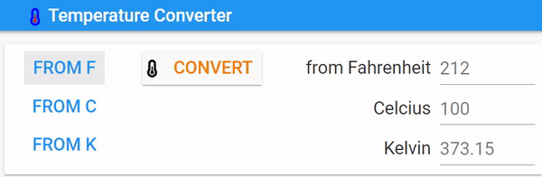
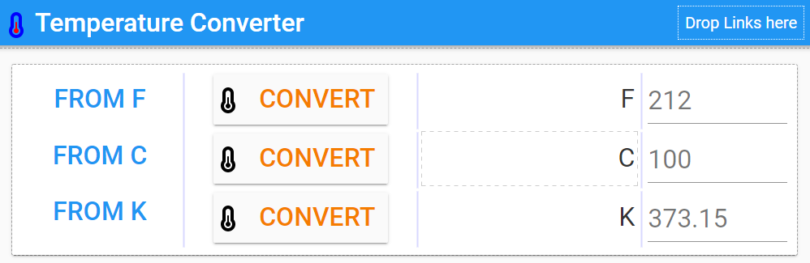

====================================================
Temperature converter3
====================================================

Multi Temperature converter
------------------------------

| Make an new app that converts between F, C and K all at once.

| Working app at: `<https://pc-temperature-converter-3.anvil.app>`_

| See gif to see it in action.

----

Design
---------

| Name the From buttons: **from_F**, **from_C** and **from_K**.
| Name the convert buttons: **convertF**, **convertC** and **convertK**.
| Name the input temperature text-boxes: **TF**, **TC** and **TK**.

| Layout the components:

| Search online for a temperature icon to use. Save it. Edit it. For use as an app logo, add it to the Assets, via the 3 vertical dots Add Assets and Upload File button. Add the icon to the convert buttons using the upload an image button in the properties panel icon section.
| Click on **From F**, **From C**, or **From K** to hide the other convert buttons, only showing the associated convert button.

----

Code
------------

.. admonition:: Tasks

    #. Write code to control the visibility of the Convert buttons and replace the temperature scale label to indicate which is being used for the conversion.
    #. Write code to carry out the conversions for each temperature scale.
    #. Write the full code.

    .. dropdown::
            :icon: codescan
            :color: primary
            :class-container: sd-dropdown-container

            .. tab-set::

                .. tab-item:: Q1

                    Write code to control the visibility of the Convert buttons and replace the temperature scale label to indicate which is being used for the conversion.

                    .. code-block:: python

                        from ._anvil_designer import Form1Template
                        from anvil import *
                        import anvil.tables as tables
                        import anvil.tables.query as q
                        from anvil.tables import app_tables

                        class Form1(Form1Template):

                            def __init__(self, **properties):
                                # Set Form properties and Data Bindings.
                                self.init_components(**properties)
                                # start with from F
                                self.from_F_click()

                            def from_F_click(self, **event_args):
                                self.TF_label.text = "from Fahrenheit"
                                self.TC_label.text = "Celsius"
                                self.TK_label.text = "Kelvin"
                                self.convertF.visible = True
                                self.convertC.visible = False
                                self.convertK.visible = False
                                self.TF.select()

                            def from_C_click(self, **event_args):
                                self.TF_label.text = "Fahrenheit"
                                self.TC_label.text = "from Celsius"
                                self.TK_label.text = "Kelvin"
                                self.convertF.visible = False
                                self.convertC.visible = True
                                self.convertK.visible = False
                                self.TC.select()

                            def from_K_click(self, **event_args):
                                self.TF_label.text = "Fahrenheit"
                                self.TC_label.text = "Celsius"
                                self.TK_label.text = "from Kelvin"
                                self.convertF.visible = False
                                self.convertC.visible = False
                                self.convertK.visible = True
                                self.TK.select()

                .. tab-item:: Q2

                    Write code to carry out the conversions for each temperature scale.

                    .. code-block:: python

                        from ._anvil_designer import Form1Template
                        from anvil import *
                        import anvil.tables as tables
                        import anvil.tables.query as q
                        from anvil.tables import app_tables

                        class Form1(Form1Template):

                            def convertF_click(self, **event_args):
                                self.f_calculate()

                            def convertC_click(self, **event_args):
                                self.c_calculate()

                            def convertK_click(self, **event_args):
                                self.k_calculate()

                            def f_calculate(self):
                                try:
                                    fahrenheit = self.TF.text
                                    fahrenheit = float(fahrenheit)
                                    celsius = (fahrenheit - 32) / 1.8
                                    self.TC.text = f'{celsius:.1f}'
                                    kelvin = celsius + 273.15
                                    self.TK.text = f'{kelvin:.1f}'
                                except TypeError as error:
                                    self.TC.text = None
                                    self.TK.text = None

                            def c_calculate(self):
                                try:
                                    celsius = self.TC.text
                                    celsius = float(celsius)
                                    fahrenheit = (celsius * 1.8) + 32
                                    self.TF.text =  f'{fahrenheit:.1f}'
                                    kelvin = celsius + 273.15
                                    self.TK.text = f'{kelvin:.1f}'
                                except TypeError as error:
                                    self.TC.text = None
                                    self.TK.text = None

                            def k_calculate(self):
                                try:
                                    kelvin = self.TK.text
                                    kelvin = float(kelvin)
                                    celsius = kelvin - 273.15
                                    self.TC.text = f'{celsius:.1f}'
                                    fahrenheit = (celsius * 1.8) + 32
                                    self.TF.text =  f'{fahrenheit:.1f}'
                                except TypeError as error:
                                    self.TC.text = None
                                    self.TK.text = None

                .. tab-item:: Q3

                    Write the full code.

                    .. code-block:: python

                        from ._anvil_designer import Form1Template
                        from anvil import *
                        import anvil.tables as tables
                        import anvil.tables.query as q
                        from anvil.tables import app_tables

                        class Form1(Form1Template):

                            def __init__(self, **properties):
                                # Set Form properties and Data Bindings.
                                self.init_components(**properties)
                                # start with from F
                                self.from_F_click()

                            def from_F_click(self, **event_args):
                                self.TF_label.text = "from Fahrenheit"
                                self.TC_label.text = "Celsius"
                                self.TK_label.text = "Kelvin"
                                self.convertF.visible = True
                                self.convertC.visible = False
                                self.convertK.visible = False
                                self.TF.select()

                            def from_C_click(self, **event_args):
                                self.TF_label.text = "Fahrenheit"
                                self.TC_label.text = "from Celsius"
                                self.TK_label.text = "Kelvin"
                                self.convertF.visible = False
                                self.convertC.visible = True
                                self.convertK.visible = False
                                self.TC.select()

                            def from_K_click(self, **event_args):
                                self.TF_label.text = "Fahrenheit"
                                self.TC_label.text = "Celsius"
                                self.TK_label.text = "from Kelvin"
                                self.convertF.visible = False
                                self.convertC.visible = False
                                self.convertK.visible = True
                                self.TK.select()

                            def convertF_click(self, **event_args):
                                self.f_calculate()

                            def convertC_click(self, **event_args):
                                self.c_calculate()

                            def convertK_click(self, **event_args):
                                self.k_calculate()

                            def f_calculate(self):
                                try:
                                    fahrenheit = self.TF.text
                                    fahrenheit = float(fahrenheit)
                                    celsius = (fahrenheit - 32) / 1.8
                                    self.TC.text = f'{celsius:.1f}'
                                    kelvin = celsius + 273.15
                                    self.TK.text = f'{kelvin:.1f}'
                                except TypeError as error:
                                    self.TC.text = None
                                    self.TK.text = None

                            def c_calculate(self):
                                try:
                                    celsius = self.TC.text
                                    celsius = float(celsius)
                                    fahrenheit = (celsius * 1.8) + 32
                                    self.TF.text =  f'{fahrenheit:.1f}'
                                    kelvin = celsius + 273.15
                                    self.TK.text = f'{kelvin:.1f}'
                                except TypeError as error:
                                    self.TC.text = None
                                    self.TK.text = None

                            def k_calculate(self):
                                try:
                                    kelvin = self.TK.text
                                    kelvin = float(kelvin)
                                    celsius = kelvin - 273.15
                                    self.TC.text = f'{celsius:.1f}'
                                    fahrenheit = (celsius * 1.8) + 32
                                    self.TF.text =  f'{fahrenheit:.1f}'
                                except TypeError as error:
                                    self.TC.text = None
                                    self.TK.text = None

