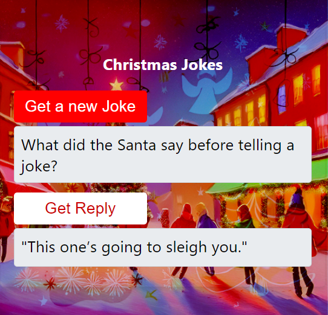
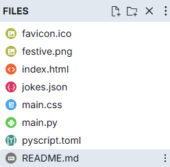

====================================================
Christmas Jokes
====================================================

| The details below are for a simple joke app.
| Demo app is at: `<https://gmc_ps.pyscriptapps.com/christmas-jokes-3/latest/>`_

----

Files
---------

The files used are listed below.

| The json file of jokes is not required but has been left here as a backup of the jokes used.

| The favicon.ico is optional. It shows as a small icon in the browser tab when the app is run.

| The festive.png is referenced in the css to make a background image.

.. image:: images/christmas_jokes/festive.png
    :scale: 50

----

toml configuration file
-------------------------------

| The toml configuration file contents is shown below.

.. code-block:: toml

    name = "Christmas jokes 3"
    description = "Christmas jokes"

    [files]
    "./festive.png" = "festive.png"

----

index.html
---------------------

| The HTML components are:

Buttons: Several buttons to interact with the jokes:

 - Get a new Joke: To fetch and display a new joke.
 - Get Reply: To fetch and display the reply to the joke.

Output Areas:

 - Loading Dialog: Displays a loading message while the PyScript is initializing.
 - Joke Display: An area to show the fetched joke.
 - Joke Reply Display: An area to show the reply to the joke.

| The html is below.

.. code-block:: html

    <!DOCTYPE html>
    <html lang="en">

    <head>
        <title>Christmas Jokes</title>
        <!-- Recommended meta tags -->
        <meta charset="UTF-8">
        <meta name="viewport" content="width=device-width,initial-scale=1.0">

        <!-- favicon to appear in browser tab -->
        <link rel="icon" href="favicon.ico" type="image/x-icon">

        <!-- PyScript CSS -->
        <link rel="stylesheet" href="https://pyscript.net/releases/2025.11.2/core.css">

        <!-- This script tag bootstraps PyScript -->
        

        <!-- custom CSS only -->
        <link rel="stylesheet" href="main.css">

        <!-- for splashscreen -->
        

    </head>

    <body>
        <dialog id="loading">
            <h1>Loading...</h1>
        </dialog>

        <section class="jokes">
            <h1>Christmas Jokes</h1>
            

                <button id="get_joke">Get a new Joke</button>
            

            

            

                <button id="get_joke_answer">Get Reply</button>
            

            

            
        </section>

        
    </body>
    </html>

----

loading html
----------------

This code snippet displays a loading dialog while PyScript is initializing. Once PyScript is ready, the loading dialog closes, providing users with a visual indication that the page is loading and preventing interaction until everything is ready.

HTML Structure and Styles
~~~~~~~~~~~~~~~~~~~~~~~~~~

.. code-block:: html

    <dialog id="loading">
        <h1>Loading...</h1>
    </dialog>

- This ``dialog`` element displays the loading message.
- The ``id="loading"`` allows it to be easily accessed and manipulated via JavaScript.

.. code-block:: html

    

- **outline: none**: Removes any outline around the dialog when focused.
- **border: none**: Removes any border around the dialog.
- **background: transparent**: Makes the background of the dialog transparent.

JavaScript for Splash Screen
~~~~~~~~~~~~~~~~~~~~~~~~~~~~~~~~~~~~

1. The HTML page loads and the ``<dialog>`` element with "Loading..." is displayed using ``loading.showModal()``.
2. The page continues to load, and PyScript initializes.
3. Once PyScript is fully loaded, it triggers the ``py:ready`` event.
4. The event listener for ``py:ready`` activates, and ``loading.close()`` closes the loading dialog.

.. code-block:: html

    

- ``<script type="module">``: Indicates the script is an ES6 module.

.. code-block:: html

      const loading = document.getElementById('loading');

 - This retrieves the dialog element with the id ``loading`` and stores it in the ``loading`` variable.

.. code-block:: html

    addEventListener('py:ready', () => loading.close());

- ``addEventListener('py:ready', ...)``: Listens for the ``py:ready`` event, triggered by PyScript once initialized.
- ``loading.close()``: Closes the loading dialog when the ``py:ready`` event is triggered.

.. code-block:: html

    loading.showModal();

- Shows the loading dialog as a modal, preventing user interaction with the page until closed.

----

main css:
--------------------

The custom css is below.

.. code-block:: css

    body {
        font-family: 'Segoe UI', Tahoma, Geneva, Verdana, sans-serif;
        font-size: 16px;
        background-image: url('festive.png');
        background-repeat: repeat;
        background-size: auto;
    }

    .jokes {
        max-width: 600px;
        margin: 50px auto;
        padding: 20px;
    /*     background-color: #ffffff; /* White background */ */
        border: 1px solid #dee2e6; /* Bootstrap border color */
        border-radius: 5px;
        box-shadow: 0 4px 8px rgba(0, 0, 0, 0.1);
    }

    .jokes h1 {
        color: #ffffff;
        text-align: center;
        margin-bottom: 20px;
    }

    .jokes button {
        display: inline-block; /* Ensure buttons are inline-block */
        width: 200px;
        padding: 10px;
        margin: 5px 0;
        color: #ffffff;
        border: none;
        border-radius: 5px;
        cursor: pointer;
        transition: background-color 0.3s;
        font-size: 24px;
    }

    /* First button */
    #get_joke {
        background-color: #ff0000; /* Santa red */
    }

    #get_joke:hover {
        background-color: #cc0000; /* Darker red */
    }

    /* Second button */
    #get_joke_answer {
        background-color: #ffffff; /* White */
        color: #ff0000; /* Red text */
    }

    #get_joke_answer:hover {
        background-color: #f0f0f0; /* Slightly darker white */
        color: #cc0000; /* Darker red text */
    }

    #joke, #joke_answer {
        margin-bottom: 10px;
        min-height: 36px;
        padding: 10px;
        background-color: #e9ecef; /* Bootstrap light gray background */
        border-radius: 5px;
        border: 1px solid #ced4da; /* Bootstrap border color */
        font-family: 'Segoe UI', Tahoma, Geneva, Verdana, sans-serif; /* Same font as buttons */
        font-size: 24px; /* Same size as buttons */
    }

----

main.py
------------------

| The python code is below.
| The jokes are hardcoded in a list of dictionaries to avoid the need for an external file.

.. code-block:: python

    import random
    from pyscript import display, when

    # Hardcoded jokes list (no external file needed)
    jokes = [
    {
        "question": "What do you get if you cross a snowman and a dog?",
        "answer": "Frostbite."
    },
    {
        "question": "Why did Santa go to music school?",
        "answer": "So he could improve his \"wrap\" skills."
    },
    {
        "question": "What do you call a greedy elf?",
        "answer": "Elfish."
    },
    {
        "question": "Why did the Christmas tree go to the barber?",
        "answer": "It needed a trim."
    },
    {
        "question": "What do you get when you cross a bell with a skunk?",
        "answer": "Jingle smells."
    },
    {
        "question": "What do you get if you eat Christmas decorations?",
        "answer": "Tinsilitis."
    },
    {
        "question": "Why did the elf put his bed into the fireplace?",
        "answer": "He wanted to sleep like a log."
    },
    {
        "question": "What do you call a snowman with a six-pack?",
        "answer": "An abdominal snowman."
    },
    {
        "question": "What do you call a cat on the beach at Christmas time?",
        "answer": "Sandy Claws."
    },
    {
        "question": "What do you get if you cross a Christmas tree with an apple?",
        "answer": "A pine-apple."
    },
    {
        "question": "Why did the Christmas lights go to school?",
        "answer": "They wanted to be brighter."
    },
    {
        "question": "What do you call a snowman party?",
        "answer": "A snowball."
    },
    {
        "question": "Why did Santa bring a ladder to the bar?",
        "answer": "He heard the drinks were on the house."
    },
    {
        "question": "Why did the Christmas ornament go to the doctor?",
        "answer": "It was feeling a bit off-color."
    },
    {
        "question": "What do you call a snowman with a temper tantrum?",
        "answer": "A meltdown."
    },
    {
        "question": "Why did the elf go to school?",
        "answer": "To learn the elf-abet."
    },
    {
        "question": "What do you get if you cross a snowman and a vampire?",
        "answer": "Frostbite."
    },
    {
        "question": "What do you call a reindeer with bad manners?",
        "answer": "Rude-olph."
    },
    {
        "question": "Why did the gingerbread man go to the doctor?",
        "answer": "He was feeling crumby."
    },
    {
        "question": "What do you call a snowman with a sunburn?",
        "answer": "A puddle."
    },
    {
        "question": "Why did Santa go to the beach?",
        "answer": "To be a \"sandy\" Claus."
    },
    {
        "question": "How do snowmen travel around?",
        "answer": "By riding an \"icicle.\""
    },
    {
        "question": "What do you get when you mix a snowman with a baker?",
        "answer": "Frosting."
    },
    {
        "question": "Why don’t Christmas trees sew?",
        "answer": "They always drop their needles."
    },
    {
        "question": "What do you call an old snowman?",
        "answer": "Water."
    },
    {
        "question": "What’s Santa’s favorite kind of music?",
        "answer": "Wrap music."
    },
    {
        "question": "What do you get if you cross an iPad and a Christmas tree?",
        "answer": "A pine-apple."
    },
    {
        "question": "What did one snowman say to the other snowman?",
        "answer": "\"Do you smell carrots?\""
    },
    {
        "question": "Why did the turkey join the band?",
        "answer": "Because it had the drumsticks."
    },
    {
        "question": "How does a snowman get around?",
        "answer": "By riding a snowmobile."
    },
    {
        "question": "What’s a sheep’s favorite Christmas song?",
        "answer": "\"Fleece Navidad.\""
    },
    {
        "question": "What kind of photos do elves take?",
        "answer": "(S)elfies."
    },
    {
        "question": "What do snowmen eat for breakfast?",
        "answer": "Frosted flakes."
    },
    {
        "question": "What do you call Santa’s little helpers?",
        "answer": "Subordinate clauses."
    },
    {
        "question": "What do you call a shark that delivers presents?",
        "answer": "Santa Jaws."
    },
    {
        "question": "What did the reindeer say before telling a joke?",
        "answer": "\"This one’s going to sleigh you.\""
    },
    {
        "question": "What did the Santa say before telling a joke?",
        "answer": "\"This one’s going to sleigh you.\""
    },
    {
        "question": "What do you call a Christmas wreath made of $100 bills?",
        "answer": "Aretha Franklin."
    },
    {
        "question": "How does Santa keep his suits wrinkle-free?",
        "answer": "He uses Claus-et space."
    },
    {
        "question": "What does Santa eat for breakfast?",
        "answer": "Ho-ho-ho-tcakes."
    },
    {
        "question": "What kind of cars do elves drive?",
        "answer": "Toy-otas."
    },
    {
        "question": "How does Frosty get around on Christmas?",
        "answer": "By riding a snowdrift."
    },
    {
        "question": "What wears a red suit and goes \"Oh, oh, oh\"?",
        "answer": "Santa walking backwards."
    },
    {
        "question": "What do you call a reindeer with no eyes?",
        "answer": "No-eye-deer."
    },
    {
        "question": "What do you get if you cross Santa with a detective?",
        "answer": "Santa Clues."
    },
    {
        "question": "Why does Santa go down the chimney on Christmas Eve?",
        "answer": "Because it \"soots\" him."
    },
    {
        "question": "Why did Santa get stuck in the chimney?",
        "answer": "He was Claus-trophobic."
    },
    {
        "question": "Why did Santa go down the chimney at the bakery?",
        "answer": "Because it was a piece of cake."
    },
    {
        "question": "What does Santa use to clean the chimney?",
        "answer": "Santa-tizer."
    },
    {
        "question": "What do snowmen like to do on the weekend?",
        "answer": "Chill out."
    },
    {
        "question": "What do elves do after school?",
        "answer": "Their gnome work."
    },
    {
        "question": "What’s the difference between Santa’s reindeer and a knight?",
        "answer": "One slays the dragon, and the other’s draggin’ the sleigh."
    },
    {
        "question": "Why was Santa’s little helper depressed?",
        "answer": "Because he had low elf esteem."
    },
    {
        "question": "What did the cow say on Christmas morning?",
        "answer": "Mooooey Christmas."
    },
    {
        "question": "What do monkeys sing at Christmas?",
        "answer": "Jungle bells, jungle bells."
    },
    {
        "question": "What do you sing at a snowman’s birthday party?",
        "answer": "Freeze a jolly good fellow."
    },
    {
        "question": "Why does Santa have three gardens?",
        "answer": "So he can hoe hoe hoe."
    },
    {
        "question": "When does Christmas come before Thanksgiving?",
        "answer": "In the dictionary."
    },
    {
        "question": "What’s the difference between the Christmas alphabet and the ordinary alphabet?",
        "answer": "The Christmas one has no L (noel)."
    },
    {
        "question": "What carol is most often heard in the dessert?",
        "answer": "Camel ye faithful."
    },
    {
        "question": "What do you get if Santa goes down the chimney when the fire is lit?",
        "answer": "Krisp Kringle."
    },
    {
        "question": "Why are turkeys smarter than chickens?",
        "answer": "Ever heard of Kentucky Fried Turkey?."
    },
    {
        "question": "What often falls at the North Pole but never gets hurt?",
        "answer": "Snow."
    },
    {
        "question": "Why is Santa so good at karate?",
        "answer": "Because he has a black belt."
    },
    {
        "question": "How much did Santa pay for his sleigh?",
        "answer": "Nothing, it was on the house."
    },
    {
        "question": "What do fish sing when Santa comes?",
        "answer": "Christmas Corals."
    },
    {
        "question": "What did the reindeer say when he saw an elf?",
        "answer": "Nothing, reindeer can’t talk."
    },
    {
        "question": "Which elf was the best singer?",
        "answer": "ELFis Presley."
    },
    {
        "question": "How does Santa take pictures?",
        "answer": "With his North Pole-aroid."
    },
    {
        "question": "What is invisible and smells like milk and cookies?",
        "answer": "Santa’s burps."
    },
    {
        "question": "What does Santa put on his head when he has a headache?",
        "answer": "A polar ice cap."
    },
    {
        "question": "What did Santa say when Mrs. Claus asked about the weather?",
        "answer": "Looks like rain, dear."
    },
    {
        "question": "Who is never hungry at Christmas?",
        "answer": "The turkey - he's always stuffed."
    },
    {
        "question": "What does Santa use to measure?",
        "answer": "Santameters."
    },
    {
        "question": "What should you give your parents at Christmas?",
        "answer": "A list of what you want."
    },
    {
        "question": "What do snowmen take when the sun gets too hot?",
        "answer": "A chill pill."
    },
    {
        "question": "What did one snowman say to another snowman?",
        "answer": "You’re cool."
    },
    {
        "question": "What kind of bug hates Christmas?",
        "answer": "A humbug."
    },
    {
        "question": "How does Christmas Day end?",
        "answer": "With the letter Y."
    },
    {
        "question": "Why did the turkey cross the road?",
        "answer": "Because it was the chicken’s day off."
    },
    {
        "question": "When is a boat just like snow?",
        "answer": "When it’s adrift."
    },
    {
        "question": "What is the best Christmas present in the world?",
        "answer": "A broken drum, you just can’t beat it."
    },
    {
        "question": "Who delivers presents to cats?",
        "answer": "Santa Paws."
    },
    {
        "question": "Why is it getting harder to buy Advent calendars?",
        "answer": "Their days are numbered."
    },
    {
        "question": "What kind of motorbike does Santa ride?",
        "answer": "A Holly Davidson."
    },
    {
        "question": "What do angry mice send to each other at Christmas?",
        "answer": "Cross-mouse cards."
    },
    {
        "question": "What did Adam say the day before Christmas?",
        "answer": "\"It’s Christmas, Eve.\""
    },
    {
        "question": "Why don't you ever see Santa in a public hospital?",
        "answer": "Because he has private elf care."
    },
    {
        "question": "What’s a child’s favorite king at Christmas?",
        "answer": "A stoc-king."
    },
    {
        "question": "What do you get if you cross Santa with a duck?",
        "answer": "A Christmas Quacker."
    },
    {
        "question": "What happened to the man who stole an Advent Calendar?",
        "answer": "He got 25 days."
    },
    {
        "question": "Why was the snowman looking through the carrots?",
        "answer": "He was picking his nose."
    },
    {
        "question": "What do you call buying a piano for the holidays?",
        "answer": "Christmas Chopin."
    },
    {
        "question": "What did the beaver say to the Christmas Tree?",
        "answer": "Nice gnawing you."
    },
    {
        "question": "What athlete is warmest in winter?",
        "answer": "A long jumper."
    },
    {
        "question": "What type of key do you need for a Nativity play?",
        "answer": "A don-key."
    },
    {
        "question": "What do snowmen wear on their heads?",
        "answer": "Ice caps."
    },
    {
        "question": "How do elves get to the top floor of Santa’s workshop?",
        "answer": "They use the elfelator."
    },
    {
        "question": "How did Santa describe the elf who refused to take a bath?",
        "answer": "He’s elfully smelly."
    },
    {
        "question": "What do sheep say to each other at Christmas?",
        "answer": "Merry Christmas to ewe."
    },
    {
        "question": "What color Christmas candle burns longer, a red candle or a green candle?",
        "answer": "Neither – candles always burn shorter."
    },
    {
        "question": "Which Christmas carol do parents like the most?",
        "answer": "Silent Night."
    },
    {
        "question": "What goes ho-ho whoosh, ho-ho whoosh?",
        "answer": "Santa caught in a revolving door."
    },
    {
        "question": "What does Santa do in his garden?",
        "answer": "He hoe hoe hoes."
    },
    {
        "question": "What do reindeer have that no other animals have?",
        "answer": "Baby reindeer."
    },
    {
        "question": "What type of potato chip is Santa’s favorite?",
        "answer": "Crisp Pringles."
    },
    {
        "question": "What is Santa’s favorite Olympic event?",
        "answer": "North Pole-vault."
    },
    {
        "question": "Why do reindeer tell such good stories?",
        "answer": "Because they all have tails."
    },
    {
        "question": "How do you make a slow reindeer fast?",
        "answer": "You don’t feed it."
    },
    {
        "question": "What’s the best thing to put into a Christmas pie?",
        "answer": "Your teeth."
    },
    {
        "question": "Where do you find reindeer?",
        "answer": "Depends where you left them."
    },
    {
        "question": "Noah: I thought we had two turkeys when we left?",
        "answer": "Noah’s Wife: Well, it is Christmas."
    },
    {
        "question": "What did the bald man say when he got a comb for Christmas?",
        "answer": "Thanks, I’ll never part with it."
    },
    {
        "question": "If a reindeer lost his tail, where would it go for a new one?",
        "answer": "A re-tail shop."
    },
    {
        "question": "What do you call it when Santa takes a break from delivering presents?",
        "answer": "Santa pause."
    },
    {
        "question": "What do you call it when Kris Kringle claps his hands?",
        "answer": "Santapplause."
    }
    ]

    joke = None
    joke_answer = None

    def get_joke_from_list():
        global joke, joke_answer
        selected = random.choice(jokes)
        joke = selected["question"]
        joke_answer = selected["answer"]
        return joke

    @when("click", "#get_joke")
    def get_joke(event):
        joke_text = get_joke_from_list()
        display(joke_text, target="#joke", append=False)
        display("", target="#joke_answer", append=False)

    @when("click", "#get_joke_answer")
    def get_joke_answer(event):
        global joke_answer
        display(joke_answer, target="#joke_answer", append=False)
