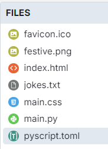

====================================================
Christmas Jokes
====================================================

| The details below are for a simple joke app.
| Demo app is at: https://gmc_ps.pyscriptapps.com/jokes/latest/

----

Files
---------

The files used are listed below.

| The favicon.ico is optional. It shows as a small icon in the browser tab when the app is run.

| The festive.png is referenced in the css to make a background image.

----

toml configuration file
-------------------------------

| The toml configuration file contents is shown below.
| The files section specifies that the file "./jokes.txt" is accessible within the PyScript environment as "jokes.txt".
| The jokes are on one line each with a tab between the joke and the reply.

.. code-block:: toml

    name = "Christmas jokes"
    description = "Christmas jokes"

    [files]
    "./jokes.txt" = "jokes.txt"
    "./festive.png" = "festive.png"

The favicon.ico is optional. It shows as a small icon in the browser tab when the pp is run.

----

index.html
---------------------

| The HTML components are:

Buttons: Several buttons to interact with the jokes:

 - Get a new Joke: To fetch and display a new joke.
 - Get Reply: To fetch and display the reply to the joke.

Output Areas:

 - Loading Dialog: Displays a loading message while the PyScript is initializing.
 - Joke Display: An area to show the fetched joke.
 - Joke Reply Display: An area to show the reply to the joke.

| The html is below.

.. code-block:: html

    <!DOCTYPE html>
    <html lang="en">

    <head>
        <title>Christmas Jokes</title>
        <!-- Recommended meta tags -->
        <meta charset="UTF-8">
        <meta name="viewport" content="width=device-width,initial-scale=1.0">

        <!-- favicon to appear in browser tab -->
        <link rel="icon" href="favicon.ico" type="image/x-icon>

        <!-- PyScript CSS -->
        <link rel="stylesheet" href="https://pyscript.net/releases/2024.11.1/core.css">

        <!-- This script tag bootstraps PyScript -->
        

        <!-- custom CSS only -->
        <link rel="stylesheet" href="main.css">

        <!-- for splashscreen -->
        
        
    </head>

    <body>
        <dialog id="loading">
            <h1>Loading...</h1>
        </dialog>

        <section class="jokes">
            <h1>Christmas Jokes</h1>
            

                <button id="get_joke"">Get a new Joke</button>
            

            

            

                <button id="get_joke_answer"">Get Reply</button>
            

            

            
        </section>

    </body>
    </html>

----

loading html
----------------

This code snippet displays a loading dialog while PyScript is initializing. Once PyScript is ready, the loading dialog closes, providing users with a visual indication that the page is loading and preventing interaction until everything is ready.

HTML Structure and Styles
~~~~~~~~~~~~~~~~~~~~~~~~~~

.. code-block:: html

    <dialog id="loading">
        <h1>Loading...</h1>
    </dialog>

- This ``dialog`` element displays the loading message.
- The ``id="loading"`` allows it to be easily accessed and manipulated via JavaScript.

.. code-block:: html

    

- **outline: none**: Removes any outline around the dialog when focused.
- **border: none**: Removes any border around the dialog.
- **background: transparent**: Makes the background of the dialog transparent.

JavaScript for Splash Screen
~~~~~~~~~~~~~~~~~~~~~~~~~~~~~~~~~~~~

1. The HTML page loads and the ``<dialog>`` element with "Loading..." is displayed using ``loading.showModal()``.
2. The page continues to load, and PyScript initializes.
3. Once PyScript is fully loaded, it triggers the ``py:ready`` event.
4. The event listener for ``py:ready`` activates, and ``loading.close()`` closes the loading dialog.

.. code-block:: html

    

- ``<script type="module">``: Indicates the script is an ES6 module.

.. code-block:: html

      const loading = document.getElementById('loading');

 - This retrieves the dialog element with the id ``loading`` and stores it in the ``loading`` variable.

.. code-block:: html

    addEventListener('py:ready', () => loading.close());

- ``addEventListener('py:ready', ...)``: Listens for the ``py:ready`` event, triggered by PyScript once initialized.
- ``loading.close()``: Closes the loading dialog when the ``py:ready`` event is triggered.

.. code-block:: html

    loading.showModal();

- Shows the loading dialog as a modal, preventing user interaction with the page until closed.

----

main css:
--------------------

The custom css is below.

.. code-block:: css

    body {
        font-family: 'Segoe UI', Tahoma, Geneva, Verdana, sans-serif;
        font-size: 16px;
        background-image: url('festive.png');
        background-repeat: repeat;
        background-size: auto;
    }

    .jokes {
        max-width: 600px;
        margin: 50px auto;
        padding: 20px;
    /*     background-color: #ffffff; /* White background */ */
        border: 1px solid #dee2e6; /* Bootstrap border color */
        border-radius: 5px;
        box-shadow: 0 4px 8px rgba(0, 0, 0, 0.1);
    }

    .jokes h1 {
        color: #ffffff;
        text-align: center;
        margin-bottom: 20px;
    }

    .jokes button {
        display: inline-block; /* Ensure buttons are inline-block */
        width: 200px;
        padding: 10px;
        margin: 5px 0;
        color: #ffffff;
        border: none;
        border-radius: 5px;
        cursor: pointer;
        transition: background-color 0.3s;
        font-size: 24px;
    }

    /* First button */
    #get_joke {
        background-color: #ff0000; /* Santa red */
    }

    #get_joke:hover {
        background-color: #cc0000; /* Darker red */
    }

    /* Second button */
    #get_joke_answer {
        background-color: #ffffff; /* White */
        color: #ff0000; /* Red text */
    }

    #get_joke_answer:hover {
        background-color: #f0f0f0; /* Slightly darker white */
        color: #cc0000; /* Darker red text */
    }

    #joke, #joke_answer {
        margin-bottom: 10px;
        min-height: 36px;
        padding: 10px;
        background-color: #e9ecef; /* Bootstrap light gray background */
        border-radius: 5px;
        border: 1px solid #ced4da; /* Bootstrap border color */
        font-family: 'Segoe UI', Tahoma, Geneva, Verdana, sans-serif; /* Same font as buttons */
        font-size: 24px; /* Same size as buttons */
    }

----

main.py
------------------

| The python code is below.

.. code-block:: python

    import os
    import random
    from pyscript import document
    from pyscript import display
    from pyscript import when

    # Function to convert Question tab Answer formatted text into a dictionary
    def convert_to_dict(file_path):
        qa_dict = {}
        if os.path.exists(file_path):
            with open(file_path, 'r') as file:
                for line in file:
                    if '\t' in line:
                        question, answer = line.strip().split('\t', 1)
                        qa_dict[question] = answer
        else:
            print(f"File not found: {file_path}")
        return qa_dict

    # Load the text file from the pyscript files folder
    file_path = 'jokes.txt'
    qa_dict = convert_to_dict(file_path)

    joke = None
    joke_answer = None

    def get_joke_from_dict():
        global joke, joke_answer
        joke, joke_answer = random.choice(list(qa_dict.items()))
        return joke

    @when('click', '#get_joke')
    def get_joke(event):
        joke = get_joke_from_dict()
        display(joke, target="#joke", append=False)

    @when('click', '#get_joke_answer')
    def get_joke_answer(event):
        global joke_answer
        display(joke_answer, target="#joke_answer", append=False)

