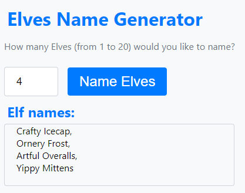
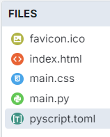

====================================================
Elves
====================================================

| The details below are for a simple elves name generator.
| Demo app is at: `<https://gmc_ps.pyscriptapps.com/elves/latest/>`_

----

Files
-------------

The files used are listed below.

The favicon.ico is optional. It shows as a small icon in the browser tab when the app is run.

----

toml configuration file
-------------------------------

| The toml configuration file contents is shown below.
| The name and description entries are metadata only and are for documentation purposes.

.. code-block:: toml

    name = "Elves"
    description = "An elf name generator"

----

index.html
---------------------

| The html is below.
| ``<link rel="icon" href="favicon.ico" type="image/x-icon">`` uses the favicon.ico placed in the files section in the pyscript editor so it shows in a browser tab.

.. code-block:: html

    <!-- GMC Dec 2024 -->
    <!DOCTYPE html>
    <html lang="en">
    <head>
        <title>20_Elves</title>
        <!-- Recommended meta tags -->
        <meta charset="UTF-8">
        <meta name="viewport" content="width=device-width,initial-scale=1.0">

        <!-- favicon to appear in browser tab -->
        <link rel="icon" href="favicon.ico" type="image/x-icon">

        <!-- PyScript CSS -->
        <link rel="stylesheet" href="https://pyscript.net/releases/2025.11.2/core.css">

        <!-- This script tag bootstraps PyScript -->
        

        <!-- CSS only -->
        <link rel="stylesheet" href="main.css">
    </head>
    <body>
        

            <h1>Elves Name Generator</h1>
            
How many Elves (from 1 to 20) would you like to name?

        

        

            <input type="number" min="1" max="20" id="elfnumber" placeholder="1">
            <button id="elf_generator">Name Elves</button>
        

        

            <h2>Elf names:</h2>
        

        

        

        
    </body>
    </html>

----

main css:
--------------------

The custom css is below.

.. code-block:: css

    body {
    font-family: 'Segoe UI', Tahoma, Geneva, Verdana, sans-serif;
    font-size: 16px;
    margin: 5px; /* Override margin */
    padding: 5px;
    background-color: #f8f9fa; /* Bootstrap gray-100 */
    }

    h1,
    h2 {
        color: #007bff;
        margin: 5px;
    }

    p {
        margin-bottom: 20px;
        color: #6c757d;
    }

    input[type="number"] {
        max-width: 50px; /* Increase the width */
        height: 28px; /* Increase the height */
        margin-right: 10px;
        padding: 10px 20px; /* Adjust padding as needed */
        border: 1px solid #ced4da;
        border-radius: 0.25rem;
        font-size: 18px; /* Increase the font size */
    }

    button {
        background-color: #007bff; /* Bootstrap primary */
        border: none;
        color: white;
        padding: 10px 20px; /* Adjust padding as needed */
        text-align: center;
        text-decoration: none;
        display: inline-block;
        font-size: 24px; /* Adjust font size as needed */
        margin: 0.375rem 0.375rem;
        cursor: pointer;
        border-radius: 0.25rem;
        transition: background-color 0.15s ease-in-out;
    }

    button:hover {
        background-color: #0056b3;
    }

    #elves {
        margin-top: 0px;
        border: 1px solid #ced4da;
        padding: 0 20px 20px;
        border-radius: 0.25rem;
        min-height: 50px;
        max-width: 350px; /* Increase the width */
    }

----

main.py
------------------

| The python code below generates random elf names based on user input. Here's a brief summary:

- Imports: It imports necessary modules from PyScript and the random module.
- Dictionaries: Two dictionaries, firstNames and lastNames, map initials to elf names.
- Function get_elves(num): Generates a specified number of random elf names by combining a random first name and last name from the dictionaries.
- Function validate_elfnumber(event): Validates the user input for the number of elves, ensuring it's between 1 and 20. If the input is invalid, it sets a default value. This function is called whenever there is an input event on the html element with the ID elfnumber. This ensures that the number of elves entered by the user is validated in real-time.
- Function elf_generator(event): This function is called when the element with the ID elf_generator is clicked. It calls validate_elfnumber to ensure the input is valid, generates the elf names using get_elves, and displays the result in the html element with the ID elves.
- display is not used in the code below but is ready for use if the " " is not needed in the output.

.. code-block:: python

    from pyscript import document
    from pyscript import display
    from pyscript import when
    import random

    firstNames = {
        'A': 'Artful', 'B': 'Bouncy', 'C': 'Crafty',
        'D': 'Doodly', 'E': 'Eager', 'F': 'Fizzy',
        'G': 'Giggly', 'H': 'Holly', 'I': 'Inventive',
        'J': 'Jolly', 'K': 'Kindly', 'L': 'Lively',
        'M': 'Mirthful', 'N': 'Noggy', 'O': 'Ornery',
        'P': 'Playful', 'Q': 'Quickfingers', 'R': 'Roly',
        'S': 'Sparkly', 'T': 'Tinkering', 'U': 'Unwrappy',
        'V': 'Vivid', 'W': 'Whimsical', 'X': 'Xylophoney',
        'Y': 'Yippy', 'Z': 'Zesty'
    }

    lastNames = {
        'A': 'Artisan', 'B': 'Buttons', 'C': 'Cobbler',
        'D': 'Doodles', 'E': 'Elfworthy', 'F': 'Frost',
        'G': 'Giftwrap', 'H': 'Hearth', 'I': 'Icecap',
        'J': 'Jollyboots', 'K': 'Knots', 'L': 'Lollipops',
        'M': 'Mittens', 'N': 'Nutmeg', 'O': 'Overalls',
        'P': 'Pinecone', 'Q': 'Quiltmaker', 'R': 'Rockinghorse',
        'S': 'Stockings', 'T': 'Toymaker', 'U': 'Umbrella',
        'V': 'Velvet', 'W': 'Workshop', 'X': 'Xylophone',
        'Y': 'Yarnspool', 'Z': 'Zingerbell'
    }

    def get_elves(num):
        elves = ""
        for i in range(num):
            firstInitial = random.choice(list(firstNames.keys()))
            lastInitial = random.choice(list(lastNames.keys()))
            elfName = firstNames [firstInitial] + " " + lastNames [lastInitial]
            if elves == "":
                elves = elfName
            else:
                elves = elves + ",  " + elfName
        return elves

    @when('input', '#elfnumber')
    def validate_elfnumber(event):
        input_text_element = document.getElementById("elfnumber")
        try:
            num = int(input_text_element.value)
            if num < 1 or num > 20:
                if num < 1:
                    num = 1
                    input_text_element.value = 1
                elif num > 20:
                    num = 20
                    input_text_element.value =20
        except ValueError:
            num = 1
            input_text_element.value = 1

    @when('click', '#elf_generator')
    def elf_generator(event):
        validate_elfnumber(event)
        input_text_element = document.getElementById("elfnumber")
        num = int(input_text_element.value)
        elves_text = get_elves(num)
        output_div_text = document.getElementById("elves")
        output_div_text.innerHTML = elves_text
        # display(elves_text, target="#elves", append=False) # doesn't render  
