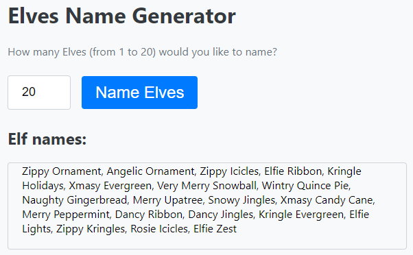

====================================================
Elves
====================================================

| The details below are for a simple elves name generator.
| Demo app is at: https://gmc_ps.pyscriptapps.com/elves/latest/

----

index.html
---------------------

The html below incudes javascript to validate the number entry for the number of elves.

.. code-block::

    

The html is below.

.. code-block::

    <!-- GMC Nov 2023 -->
    <!DOCTYPE html>
    <html lang="en">
    <head>
        <title>20_Elves</title>
        
        <!-- Recommended meta tags -->
        <meta charset="UTF-8">
        <meta name="viewport" content="width=device-width,initial-scale=1.0">

        <!-- PyScript CSS -->
        <link rel="stylesheet" href="https://pyscript.net/releases/2024.5.2/core.css">

        <!-- This script tag bootstraps PyScript -->
        
        
        <!-- CSS only -->
        <link rel="stylesheet" href="main.css">
    </head>
    <body>

        <h1>Elves Name Generator</h1>
        
How many Elves (from 1 to 20) would you like to name?

        <!-- validation via javascript to restrict typing to 1 to 20; min and max work on arrows without the script-->
        

            <input type="number" min="1" max="20" id="elfnumber" placeholder="1" oninput="validateInput(this)">
            
            <button py-click="elf_generator">Name Elves</button>
        

        
        <h2>Elf names:</h2>
        

        

        
        

    </body>
    </html>

----

main css:
--------------------

The custom css is below.

.. code-block::

    body {
    font-family: 'Segoe UI', Tahoma, Geneva, Verdana, sans-serif;
    padding: 20px;
    background-color: #f8f9fa;
    }

    h1, h2 {
    color: #343a40;
    }

    p {
    margin-bottom: 20px;
    color: #6c757d;
    }

    input[type="number"] {
    max-width: 50px; /* Increase the width */
    height: 28px; /* Increase the height */
    margin-right: 10px;
    padding: 10px 20px; /* Adjust padding as needed */
    border: 1px solid #ced4da;
    border-radius: .25rem;
    font-size: 18px; /* Increase the font size */
    }

    button {
    background-color: #007bff; /* Bootstrap primary */
    border: none;
    color: white;
    padding: 10px 20px; /* Adjust padding as needed */
    text-align: center;
    text-decoration: none;
    display: inline-block;
    font-size: 24px; /* Adjust font size as needed */
    margin: .375rem .375rem;
    cursor: pointer;
    border-radius: .25rem;
    transition: background-color 0.15s ease-in-out;
    }

    button:hover {
    background-color: #0056b3;
    }

    #elves {
    margin-top: 0px;
    border: 1px solid #ced4da;
    padding: 0 20px 20px;
    border-radius: .25rem;
    min-height: 50px;
    }

----

main.py
------------------

| The python code is below.

.. code-block:: python

    from pyscript import document
    from pyscript import display 
    import random

    firstNames = {
        'A':'Angelic', 'B':'Blustery', 'C':'Cheery',
        'D':'Dancy', 'E':'Elfie', 'F':'Festive',
        'G':'Glistening', 'H':'Happy', 'I':'Icy',
        'J':'Jolly', 'K':'Kringle', 'L':'Lucky',
        'M':'Merry', 'N':'Naughty', 'O':'Oily',
        'P':'Pointy', 'Q':'Quirky', 'R':'Rosie',
        'S':'Snowy', 'T':'Tinsel', 'U':'Unity',
        'V':'Very Merry', 'W':'Wintry', 'X':'Xmasy',
        'Y':'Yule', 'Z':'Zippy'
    }

    lastNames = {
        'A':'Angel', 'B':'Bells', 'C':'Candy Cane',
        'D':'Dash', 'E':'Evergreen', 'F':'Feet',
        'G':'Gingerbread', 'H':'Holidays', 'I':'Icicles',
        'J':'Jingles', 'K':'Kringles', 'L':'Lights',
        'M':'McSnowface', 'N':'Noel', 'O':'Ornament',
        'P':'Peppermint', 'Q':'Quince Pie', 'R':'Ribbon',
        'S':'Snowball', 'T':'Toes', 'U':'Upatree',
        'V':'Vixen', 'W':'Wonderland', 'X':'Xmas',
        'Y':'Yuletide', 'Z':'Zest'
    }

    def get_elves(num):
        elves = ""
        for i in range(num):
            firstInitial = random.choice(list(firstNames.keys()))
            lastInitial = random.choice(list(lastNames.keys()))
            elfName = firstNames [firstInitial] + " " + lastNames [lastInitial]
            if elves == "":
                elves = elfName
            else:
                elves = elves + ", " + elfName
        return elves

    def elf_generator(event):
        input_text_element = document.getElementById("elfnumber")
        try:
            num = int(input_text_element.value)
            if num < 1:
                num = 1
                input_text_element.innerText = 1
            elif num > 20:
                num = 20
                input_text_element.innerText = 20
        except ValueError:
            num = 1
        elves_text = get_elves(num)
        output_div_text = document.getElementById("elves")
        # output_div_text.innerText = elves_text
        display(elves_text, target="#elves", append=False)

