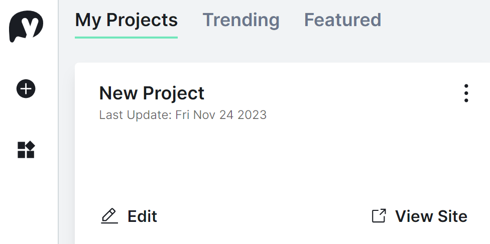

====================================================
Introduction to pyscript
====================================================

Key references:
---------------------

| Docs https://docs.pyscript.net/2024.5.2/
| User guide: https://docs.pyscript.net/2024.5.2/user-guide/
| Developer blog on latest update changes: https://jeff.glass/tags/pyscript/

| PyScript is designed to allow the running of Python in web browsers.
| PyScript apps can be hosted as a static web site. 

----

Sign up
----------

| Go to https://pyscript.com/ and sign up.

----

New project
-------------

| To start a new project, on the dashboard, click the new project (plus) button.

----

Project files
--------------

| Making a new project in pyscript starts with 3 files.

.. image:: images/new_project_files.png
    :scale: 50%

| The **index.html** file is served to your browser. It has the interface elements and links to python code.
| The **main.py** is for python code that defines how your application works.
| The **pyscript.toml** file is used to configure the project. e.g specifying python modules via   ``packages = ["numpy", "pandas"]``. It can be empty. 

| The **index.html** file starts as a basic template.
| The latest versions of the <link> and 
    </head>
    <body>
        
    </body>
    </html>

