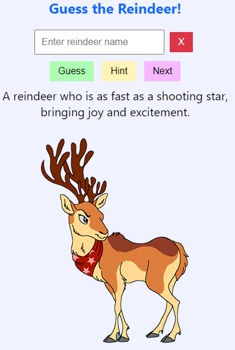
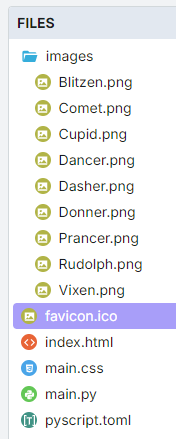
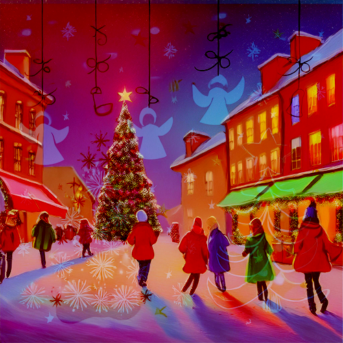

====================================================
Reindeer
====================================================

| The details below are for a guessing game for the names of santa's reindeers.
| Demo app is at: https://gmc_ps.pyscriptapps.com/reindeer/latest/

----

Game features
----------------

This game combines Python and HTML through PyScript to create a reindeer guessing game.

1. **PyScript Integration**: The game uses PyScript to interact with HTML elements and handle events. Modules like `document`, `display`, and `when` are imported from PyScript.

2. **Reindeer Data**: A list of reindeer names and a dictionary containing their images and descriptions are defined. This data is used to display information about each reindeer.

3. **Randomization**: The reindeer list is shuffled using `random.sample` to ensure a random order each time the game is played.

4. **Event Handling**: The game uses the `@when` decorator to handle various events:

   - **Start Again**: Resets the game, selects a new reindeer, and updates the display.
   - **Make Guess**: Handles guesses made by clicking a button or pressing the Enter key.
   - **Get Hint**: Provides hints by revealing the initial letters of the reindeer's name.
   - **Clear Guess**: Clears the input field for new guesses.

5. **Game Logic**: The main game logic includes:

   - **Starting the Game**: The `start_again` function initializes the game state and displays the first reindeer.
   - **Making Guesses**: The `guess_reindeer` function checks if the player's guess is correct and provides feedback.
   - **Providing Hints**: The `give_hint` function gives incremental hints based on the reindeer's name.
   - **Clearing Input**: The `clear_guess` function clears the input field for new guesses.

6. **Dynamic Display**: The game dynamically updates the HTML content to show reindeer images and descriptions, as well as feedback messages and hints.

7. **Global Variables**: Variables like `hint_count`, `chosen_reindeer`, `reindeer_index`, and `shuffled_reindeer_list` are used to maintain the game state across different functions.

----

Files
-------------

Add an image folder and add images of each reindeer.

| The santa_joke.png is used to make a favicon.ico for use in the browser tab.

| The festive.png is referenced in the css to make a background image.

The favicon.ico is optional. It shows as a small icon in the browser tab when the pp is run.

----

toml configuration file
-------------------------------

| The toml configuration file contents is shown below.
| The files section specifies that the file "./jokes.txt" is accessible within the PyScript environment as "jokes.txt".
| The jokes are on one line each with a tab between the joke and the reply.

.. code-block:: toml

    name = "Christmas jokes"
    description = "Christmas jokes"

    [files]
    "./jokes.txt" = "jokes.txt"
    "./festive.png" = "festive.png"

----

index.html
---------------------

| The HTML components are:

 - Input Field: An input box where players can type their guesses for the reindeer's name.

Buttons: Several buttons to interact with the game:

 - Start Again: To reset the game and start with a new reindeer.
 - Make Guess: To submit the player's guess.
 - Get Hint: To receive a hint about the reindeer's name.
 - Clear Guess: To clear the input field.

Output Areas:

 - Description: To show the description of the current reindeer.
 - Image Container: To display the image of the current reindeer.
 - Output: To show feedback messages and hints.

| The html is below.

.. code-block:: html

    <!-- GMC Dec 2024 -->
    <!DOCTYPE html>
    <html lang="en">
    <head>
        <title>Christmas Guessing Game</title>
        <!-- Recommended meta tags -->
        <meta charset="UTF-8">
        <meta name="viewport" content="width=device-width,initial-scale=1.0">

        <!-- favicon to appear in browser tab -->
        <link rel="icon" href="favicon.ico" type="image/x-icon">

        <!-- PyScript CSS -->
        <link rel="stylesheet" href="https://pyscript.net/releases/2024.11.1/core.css">

        <!-- This script tag bootstraps PyScript -->
        

        <!-- custom CSS -->
        <link rel="stylesheet" href="main.css">
    </head>

    <body id="screenshot-area">
        <h2>Guess the Reindeer!</h2>
        

            <input type="text" id="guess" placeholder="Enter reindeer name">
            <button id="clear_guess">X</button>
        

        

            <button id="make_guess">Guess</button>
            <button id="get_hint">Hint</button>
            <button id="start_again">Next</button>
        

        

        

  

        

        
    </body>
    </html>

----

main css:
--------------------

The custom css is below.

.. code-block:: css

    body {
        font-family: 'Segoe UI', Tahoma, Geneva, Verdana, sans-serif;
        font-size: 16px;
        margin: 5px; /* Override margin */
        padding: 5px;
        background-color: #f0f2ff;
        text-align: center;
    }

    div {
        margin: 5px;
    }

    #description {
        font-size: 20px;
    }

    #output {
        min-height: 22px;
    }

    h1, h2 {
        color: #0d6efd;
    }

    input {
        padding: 10px;
        font-size: 16px;
    }

    button {
        padding: 8px 14px;
        font-size: 16px;
        color: black;
        border: none;
    /*     cursor: pointer; */
        margin: 5px;
    }

    #clear_guess {
    background-color: #dc3545; /* Bootstrap danger */
    color: white;
    }

    #clear_guess:hover {
    background-color: #b02a37; /* Bootstrap danger-dark */
    }

    #make_guess {
        background-color: #affdb2; /* Green */
    }

    #make_guess:hover {
        background-color: #04a90a;
        color: white;
    }

    #get_hint {
        background-color: #fff4b8; /* Yellow */
    }

    #get_hint:hover {
        background-color: #ad8200;
        color: white;
    }

    #start_again {
        background-color: #f7b8ff;
    }

    #start_again:hover {
        background-color: #9900ad;
        color: white;
    }

----

main.py
------------------

The python code is below.

.. code-block:: python

    # Import the document and display modules from pyscript
    from pyscript import document
    from pyscript import display
    from pyscript import when
    import random
    import time

    reindeer_list = ["Blitzen", "Comet", "Cupid", "Dancer", "Dasher", "Donner", "Prancer", "Rudolph", "Vixen"]
    reindeer_info = {
                "Blitzen": ("Blitzen.png", "Known for his speed and lightning-fast abilities."),
                "Comet": ("Comet.png", "A reindeer who is as fast as a shooting star, bringing joy and excitement."),
                "Cupid": ("Cupid.png", "Spreads love and cheer during the holiday season."),
                "Dancer": ("Dancer.png", "Loves to dance and brings a lively spirit to the team."),
                "Dasher": ("Dasher.png", "The fastest reindeer, always leading the way."),
                "Donner": ("Donner.png", "Strong and dependable, often paired with Blitzen."),
                "Prancer": ("Prancer.png", "Graceful and elegant, always prancing with joy."),
                "Rudolph": ("Rudolph.png", "Famous for his glowing red nose, guiding Santa's sleigh through foggy nights."),
                "Vixen": ("Vixen.png", "Mischievous and playful, adding fun to the journey.")
            }

    shuffled_reindeer_list = random.sample(reindeer_list, len(reindeer_list))
    reindeer_index = 0

    @when("click", "#start_again")
    def start_again():
        global hint_count, chosen_reindeer, reindeer_index, shuffled_reindeer_list
        hint_count = 0
        # Select the next reindeer in the shuffled list
        chosen_reindeer = shuffled_reindeer_list[reindeer_index]
        reindeer_index += 1
        # Reshuffle the list if we've gone through all reindeers
        if reindeer_index >= len(shuffled_reindeer_list):
            shuffled_reindeer_list = random.sample(reindeer_list, len(reindeer_list))
            reindeer_index = 0
        # clear ouput, display description and image
        display(" ", target="#output", append=False)
        reindeer_img, reindeer_description = reindeer_info[chosen_reindeer]
        reindeer_img =  "images/" + reindeer_img
        display(reindeer_description, target="#description", append=False)
        image_container = document.querySelector("#image_container")
        image_container.innerHTML = f''
        clear_guess()

    @when("click", "#make_guess")
    def make_guess_by_click():
        guess_reindeer()

    @when("keypress", "#guess")
    def make_guess_by_enter(event):
        if event.key == "Enter":
            guess_reindeer()

    def guess_reindeer():
        global hint_count,chosen_reindeer
        guess = document.querySelector("#guess").value
        if guess.capitalize() == chosen_reindeer:
            if hint_count > 0:
                message = f"Correct! It was {chosen_reindeer}! You used {hint_count} hint(s)."
            else:
                message = f"Correct! It was {chosen_reindeer}!"
        else:
            message = f"That's not the right reindeer. Try again!"
        display(message, target="#output", append=False)

    @when("click", "#get_hint")
    def give_hint():
        global hint_count,chosen_reindeer
        if hint_count < len(chosen_reindeer) - 1:
            hint_count += 1
            hint = chosen_reindeer[:hint_count]
            display(f"Hint: The reindeer's name starts with '{hint}'.", target="#output", append=False)
        else:
            display("No more hints available!", target="#output", append=False)
        # always place hint
        guess_element = document.querySelector("#guess")
        guess_element.value = chosen_reindeer[:hint_count]
        guess_element.focus()

    @when("click", "#clear_guess")
    def clear_guess():
        guess_element = document.querySelector("#guess")
        guess_element.value = ""

    def main():
        # code to run when the page is loaded
        start_again()

    main()

----

.. admonition:: Tasks

    #. Add a scoring system.

