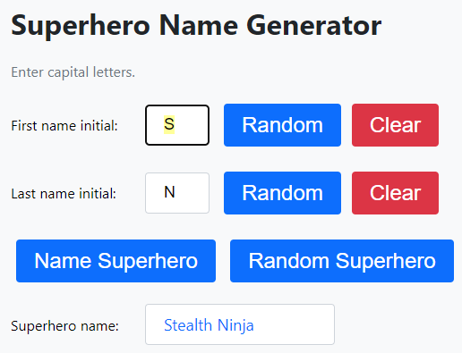
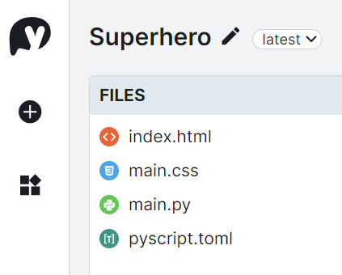

====================================================
Superheroes
====================================================

.. image:: images/superhero1.png
    :scale: 50%

| The details below are for a simple superhero name generator using initials as input.
| Demo app is at: https://gmc_ps.pyscriptapps.com/superhero1/latest/

----

Superhero Name Generator: simple version
-------------------------------------------

Making a new project in pyscript starts with 3 files.

.. image:: images/new_project_files.png
    :scale: 50%

| The **index.html** file is served to your browser. It has the interface elements and links to python code.
| The **main.py** is for python code that defines how your application works.
| The **pyscript.toml** file is used to configure the project. e.g specifying python modules via   ``packages = ["numpy"]``

----

pyscript.toml
------------------

| This file will be empty, since there are no needed modules in this simple version.

----

index.html
-----------------

| The body tag has the user interface for the web app.
| ``
`` is an HTML element that is used to group related form elements together. It is used here to the labels and input fields together.
| ``

`` has no text between the tags. It will be filled via python code when the button is clicked.
| ```` links to the ``main.py`` file. ``main`` could be renamed to suit.

.. code-block::

    <!-- GMC Nov 2023; no css; no custom js-->
    <!DOCTYPE html>
    <html lang="en">
    <head>
        <title>Superhero</title>
        <meta charset="UTF-8">
        <meta name="viewport" content="width=device-width,initial-scale=1">
        <link rel="stylesheet" href="https://pyscript.net/releases/2023.11.1/pyscript.css" />
        
    </head>
    <body>
        <h1>Superhero Name Generator</h1>
        
Enter initials.

        

            <label for="first_initial">First name initial:</label>
            <input type="text" id="first_initial" name="first_initial"">
        

        

            <label for="last_initial">Last name initial:</label>
            <input type="text" id="last_initial" name="last_initial">
        

        <button py-click="namegenerator">Generate Superhero</button> 
        

            <label for="superhero">Superhero name:</label>
            

        

        
    </body>
    </html>

----

main.py
------------

| The code is a program that generates and displays a superhero name based on the user input. It uses two dictionaries to store the possible first and last names for superheroes, and a function that returns a superhero name based on the first and last initials. It also uses another function that handles the user input and displays the superhero name or an error message if the input is not valid. The code uses the pyscript module to interact with the HTML elements of the web page. 

.. code-block:: python

    from pyscript import document, display

    # Define two dictionaries to store the possible first and last names for superheroes
    first_names = {
        "A": "Atomic", "B": "Blazing", "C": "Cosmic",
        "D": "Daring", "E": "Electric", "F": "Furious",
        "G": "Galactic", "H": "Hyper", "I": "Invincible",
        "J": "Justice", "K": "Kinetic", "L": "Legendary",
        "M": "Mighty", "N": "Noble", "O": "Omega",
        "P": "Polaris", "Q": "Quantum", "R": "Radiant",
        "S": "Stealth", "T": "Titan", "U": "Unstoppable",
        "V": "Vigilant", "W": "Warrior", "X": "Xeno",
        "Y": "Yieldless", "Z": "Zephyr",
    }

    last_names = {
        "A": "Avenger", "B": "Blade", "C": "Crusader",
        "D": "Defender", "E": "Eagle", "F": "Falcon",
        "G": "Guardian", "H": "Hawk", "I": "Inferno",
        "J": "Jaguar", "K": "Knight", "L": "Lion",
        "M": "Marvel", "N": "Ninja", "O": "Oracle",
        "P": "Phantom", "Q": "Quicksilver", "R": "Ranger",
        "S": "Specter", "T": "Thunder", "U": "Ultra",
        "V": "Viper", "W": "Wolf", "X": "Xiphos",
        "Y": "Youngstorm", "Z": "Zoom",
    }

    # Define a function that takes two initials as parameters and returns a superhero name
    def get_superhero(first_initial, last_initial):
        """Returns a superhero name based on the first and last initials.

        Args:
            first_initial (str): The first initial of the superhero name.
            last_initial (str): The last initial of the superhero name.

        Returns:
            str: The superhero name composed of the first and last names corresponding to the initials.
        """
        superhero_name = first_names[first_initial] + " " + last_names[last_initial]
        return superhero_name

        
    # Define a function that handles the user input and displays the superhero name
    def namegenerator(event):
        """Generates and displays a superhero name based on the user input.

        Args:
            event (Event): The event object that triggered the function.

        Returns:
            None
        """
        # Get the input elements for the first and last initials
        first_initial_element = document.querySelector("#first_initial")
        last_initial_element = document.querySelector("#last_initial")
        # Add validation for letters A to Z; random if empty
        validAZ = True
        first_initial = first_initial_element.value.upper()
        last_initial = last_initial_element.value.upper()
        # Check if the inputs are alphabetic characters
        if not first_initial.isalpha():
            validAZ = False
        if not last_initial.isalpha():
            validAZ = False
        # If the inputs are valid, generate and display the superhero name
        if validAZ:
            display(get_superhero(first_initial, last_initial), target="#superhero", append=False)
        # Otherwise, display an error message
        else:
            display("Enter initials.", target="#superhero", append=False)

----

Notes on getting and setting input and output elements
--------------------------------------------------------------------

| In general, you should use ``.value`` to get or set the value of an input element, and ``.innerText`` to get or set the text content of other types of elements.
| ``.value`` is used to get or set the value of an input element, such as a text input or a select element. For example, if you have an input element with an id of myInput, you can get its value using document.getElementById('myInput').value.
| ``.innerText`` is used to get or set the text content of an element, such as a 
 or a 
 element. For example, if you have a 
 element with an id of myDiv, you can get its text content using document.getElementById('myDiv').innerText.

| Pyscript recommends using the display function to output to the browser window.

.. py:function:: display(*values, target=None, append=True)

    *values (list) - the list of objects to be displayed. Can be any of the following MIME types:: "text/plain", "text/html", "image/png", "image/jpeg", "image/svg+xml", "application/json" or "application/javascript"

    target (str)- the ID of the html tag to output to. If none, output to the current <py-script> tag.

    append (boolean) if the output is going to be appended or not to the `target`ed element. It creates a 
 tag if True and a <py-script> tag with a random ID if False

----

Javascript improvements
----------------------------

| The appearance can be improved via custom css.
| The user interactions with the interface can be improved.
| Demo app is at: https://gmc_ps.pyscriptapps.com/superhero/latest/

----

Add a custom css file. Here it is named ``main.css``.

----

Improved index.html
---------------------

| Custom css has been added: ``<link rel="stylesheet" href="main.css">``
| ``<body onload="setFocus()">`` and its inline script were added to cause the insertion to be in hte first input ready for typing so that clicking there by the user is not needed.
| In the ``input type="text"`` tag, ``py-input="check_first_initial"`` was added to restrict input to capital letters.
| ``tabindex="1"`` and ``tabindex="2"`` were added to elements to control the navigation order via the tab key. 
| ``<button py-click="random_first_initial">Random</button>`` provides quick placement of a random letter.
| ``<button class="clear-button" py-click="clear_first_initial">Clear</button>`` provides convenient clearing of the input.

.. code-block::

    <!-- GMC Nov 2023; css, js, 2023.11.1/core.js -->
    <!DOCTYPE html>
    <html lang="en">
    <head>
        <title>Superhero</title>
        <meta charset="UTF-8">
        <meta name="viewport" content="width=device-width,initial-scale=1">
        <link rel="stylesheet" href="https://pyscript.net/releases/2023.11.1/pyscript.css" />
        <!-- CSS only -->
        <link rel="stylesheet" href="superhero.css">
        <!-- script only -->
        
    </head>
        
    <body>
        <h1>Superhero Name Generator</h1>
        
Enter capital letters.

        

            <label for="first_initial">First name initial:</label>
            <input type="text" id="first_initial" name="first_initial" title="Enter first initial" 
                py-input="check_first_initial" autocomplete="off" tabindex="1">
            <button py-click="random_first_initial">Random</button>
            <button class="clear-button" py-click="clear_first_initial">Clear</button>
        

        

            <label for="last_initial">Last name initial:</label>
            <input type="text" id="last_initial" name="last_initial" title="Enter last initial"
                py-input="check_last_initial" autocomplete="off" tabindex="2">
            <button py-click="random_last_initial">Random</button>
            <button class="clear-button" py-click="clear_last_initial">Clear</button>
        

        <button py-click="name_generator">Name Superhero</button>
        <button py-click="random_name">Random Superhero</button> 
        

            <label for="superhero">Superhero name:</label> 

        

        
    </body>
    </html>

----

Custom css:
--------------------

.. code-block::

    body {
        font-family: 'Segoe UI', Tahoma, Geneva, Verdana, sans-serif;
        padding: 20px;
        background-color: #f8f9fa; /* Bootstrap gray-100 */
    }

    h1, h2 {
        color: #212529; /* Bootstrap gray-900 */
    }

    p {
        margin-bottom: 20px;
        color: #6c757d; /* Bootstrap gray-600 */
    }

    .inline {
        display: inline;
    }

    .form-group {
        display: flex;
        align-items: center;
        margin-bottom: 1em;
    }
    .form-group label {
        width: 150px; /* adjust as needed */
    }

    #superhero {
        min-width: 170px; /* Increase the width */
        height: 24px; /* Increase the height */
        margin-right: 10px;
        padding: 10px 20px; /* Adjust padding as needed */
        border: 1px solid #ced4da; /* Bootstrap gray-400 */
        border-radius: .25rem;
        font-size: 18px; /* Increase the font size */
        background-color: white;
        color: #0d6efd; /* Bootstrap primary */
    }

    input[type="text"] {
        max-width: 30px; /* Increase the width */
        height: 24px; /* Increase the height */
        margin-right: 10px;
        padding: 10px 20px; /* Adjust padding as needed */
        border: 1px solid #ced4da; /* Bootstrap gray-400 */
        border-radius: .25rem;
        font-size: 18px; /* Increase the font size */
    }

    /* Move the ::selection pseudo-element outside the input[type="text"] selector */
    input[type="text"]::selection, ::selection {
        background-color: #ffff99; /* Light yellow */
        color: #000000; /* Black */
    }

    button {
        background-color: #0d6efd; /* Bootstrap primary */
        border: none;
        color: white;
        padding: 10px 20px; /* Adjust padding as needed */
        text-align: center;
        text-decoration: none;
        display: inline-block;
        font-size: 24px; /* Adjust font size as needed */
        margin: .375rem .375rem;
        cursor: pointer;
        border-radius: .25rem;
        transition: background-color 0.15s ease-in-out;
    }

    button:hover {
        background-color: #0a58ca; /* Bootstrap primary-dark */
    }

    .clear-button {
        background-color: #dc3545; /* Bootstrap danger */
        color: white;
    }

    .clear-button:hover {
        background-color: #b02a37; /* Bootstrap danger-dark */
    }

----

Improved main.py
------------------

| The python code has new code for random letters and input clearing.

.. code-block:: python

    # import the document and display modules from pyscript
    from pyscript import document
    from pyscript import display 
    # import the random module to generate random values
    import random 
    # import the string module to access string constants
    import string 

    # define a dictionary of possible first names for superheroes based on their initials
    first_names = {
        "A": "Atomic", "B": "Blazing", "C": "Cosmic",
        "D": "Daring", "E": "Electric", "F": "Furious",
        "G": "Galactic", "H": "Hyper", "I": "Invincible",
        "J": "Justice", "K": "Kinetic", "L": "Legendary",
        "M": "Mighty", "N": "Noble", "O": "Omega",
        "P": "Polaris", "Q": "Quantum", "R": "Radiant",
        "S": "Stealth", "T": "Titan", "U": "Unstoppable",
        "V": "Vigilant", "W": "Warrior", "X": "Xeno",
        "Y": "Yieldless", "Z": "Zephyr",
    }

    # define a dictionary of possible last names for superheroes based on their initials
    last_names = {
        "A": "Avenger", "B": "Blade", "C": "Crusader",
        "D": "Defender", "E": "Eagle", "F": "Falcon",
        "G": "Guardian", "H": "Hawk", "I": "Inferno",
        "J": "Jaguar", "K": "Knight", "L": "Lion",
        "M": "Marvel", "N": "Ninja", "O": "Oracle",
        "P": "Phantom", "Q": "Quicksilver", "R": "Ranger",
        "S": "Specter", "T": "Thunder", "U": "Ultra",
        "V": "Viper", "W": "Wolf", "X": "Xiphos",
        "Y": "Youngstorm", "Z": "Zoom",
    }

    def get_superhero(first_initial, last_initial):
        """Returns a superhero name based on the given initials.

        Args:
            first_initial (str): The first initial of the superhero name.
            last_initial (str): The last initial of the superhero name.

        Returns:
            str: The superhero name composed of the first and last names from the dictionaries.
        """
        # concatenate the first and last names from the dictionaries based on the initials
        superhero_name = first_names[first_initial] + " " + last_names[last_initial]
        return superhero_name

    def ranAZ():
        """Returns a random uppercase letter from A to Z.

        Returns:
            str: A random uppercase letter from A to Z.
        """
        # use the random module to choose a random letter from the string constant of uppercase letters
        return random.choice(string.ascii_uppercase)

    def random_first_initial(event):
        """Generates and displays a random first initial for the superhero name.

        Args:
            event (Event): The event object that triggered this function.
        """
        # get a random first initial by calling the ranAZ function
        first_initial = ranAZ()
        # set the value of the input element with id "first_initial" to the random first initial
        set_first_initial_input_text(first_initial)
        # set the focus back to the input element with id "first_initial"
        set_first_initial_focus()

    def check_first_initial(event):
        """Checks first initial, convert to uppercase and only keep first character if A to Z

        Args:
            event (Event): The event object that triggered this function.
        """
        # select the input element with id "first_initial"
        first_initial_element = document.querySelector("#first_initial") 
        # check if the value of the input element is not empty
        if first_initial_element.value:
            # get the first character of the value and convert it to uppercase
            first_initial = first_initial_element.value.upper()[0] 
            # check if the first character is a letter
            if first_initial.isalpha(): 
                # set the value of the input element to the first character
                set_first_initial_input_text(first_initial)
            else:
                # clear the value of the input element
                set_first_initial_input_text("")
        # set the focus back to the input element with id "first_initial"
        set_first_initial_focus()

    def clear_first_initial(event):
        """Clears and displays an empty first initial for the superhero name.

        Args:
            event (Event): The event object that triggered this function.
        """
        # clear the value of the input element with id "first_initial"
        set_first_initial_input_text("")
        # set the focus back to the input element with id "first_initial"
        set_first_initial_focus()

    def random_last_initial(event):
        """Generates and displays a random last initial for the superhero name.

        Args:
            event (Event): The event object that triggered this function.
        """
        # get a random last initial by calling the ranAZ function
        last_initial = ranAZ()
        # set the value of the input element with id "last_initial" to the random last initial
        set_last_initial_input_text(last_initial)   
        # set the focus back to the input element with id "last_initial"
        set_last_initial_focus()

    def check_last_initial(event):
        """Checks last initial, convert to uppercase and only keep first character if A to Z

        Args:
            event (Event): The event object that triggered this function.
        """
        # display random initials
        last_initial_element = document.querySelector("#last_initial")
        # select the element with id "last_initial"
        # Check if the value is not empty
        if last_initial_element.value:
            last_initial = last_initial_element.value.upper()[0]
            # get the value of the last initial and convert it to uppercase
            if last_initial.isalpha():
                # check if the last initial is a letter
                set_last_initial_input_text(last_initial)
            else:
                set_last_initial_input_text("")
        # rest focus back to last initial
        set_last_initial_focus()

        
    def clear_last_initial(event):
        """Clears and displays an empty last initial for the superhero name.

        Args:
            event (Event): The event object that triggered this function.
        """
        # get empty last_initial
        set_last_initial_input_text("")
        # rest focus back to last initial
        set_last_initial_focus()
        
    def name_generator(event):
        """Generates and displays a superhero name based on the user input initials.

        Args:
            event (Event): The event object that triggered this function.
        """
        first_initial_element = document.querySelector("#first_initial") # select the element with id "first_initial"
        last_initial_element = document.querySelector("#last_initial") # select the element with id "last_initial"
        # add validation for letters A to Z (or a to z)
        validAZ = True # a flag to indicate if the input initials are valid
        first_initial = first_initial_element.value.upper() # get the value of the first initial and convert it to uppercase
        last_initial = last_initial_element.value.upper() # get the value of the last initial and convert it to uppercase
        if not first_initial.isalpha(): # check if the first initial is not a letter
            validAZ = False # set the flag to False
        if not last_initial.isalpha(): # check if the last initial is not a letter
            validAZ = False # set the flag to False
        # output_div_text = document.querySelector("#superhero") # select the element with id "superhero"
        if validAZ: # if the input initials are valid
            display(get_superhero(first_initial, last_initial), target="#superhero", append=False)
            # output_div_text.innerText = get_superhero(first_initial, last_initial) # assign the text of the element to the superhero name generated by the function
        else: # if the input initials are not valid
            display("Enter initials.", target="#superhero", append=False)
            # output_div_text.innerText = "Enter initials." # assign the text of the element to a message asking the user to enter initials
        # rest focus back to first initial
        set_first_initial_focus()

    def random_name(event):
        """Generates and displays a random superhero name.

        Args:
            event (Event): The event object that triggered this function.
        """
        # get random initials
        first_initial = ranAZ() 
        last_initial = ranAZ()
        # display random initials
        set_first_initial_input_text(first_initial)
        set_last_initial_input_text(last_initial)
        # place random name
        display(get_superhero(first_initial, last_initial), target="#superhero", append=False)
        # rest focus back to first initial
        set_first_initial_focus()
        
    def set_last_initial_input_text(value):
        # display(value, target="#last_initial", append=False)
        # select the element with id "last_initial"
        element = document.querySelector("#last_initial")
        element.value = value

    def set_first_initial_input_text(value):
        # display(value, target="#first_initial", append=False)
        # select the element with id "last_initial"
        element = document.querySelector("#first_initial")
        element.value = value
        
    def set_focus():
        set_first_initial_focus()

    def set_first_initial_focus():
        # select the element with id "first_initial"
        first_initial_element = document.querySelector("#first_initial")
        # focus on the first initial element
        first_initial_element.focus() 
        # select the text in the first initial element
        first_initial_element.select()

    def set_last_initial_focus():
        # select the element with id "last_initial"
        last_initial_element = document.querySelector("#last_initial") 
        # focus on the element
        last_initial_element.focus()
        # select the text in the element
        last_initial_element.select() 

    def main():
        # code to run when the page is loaded
        set_focus()

    main()
