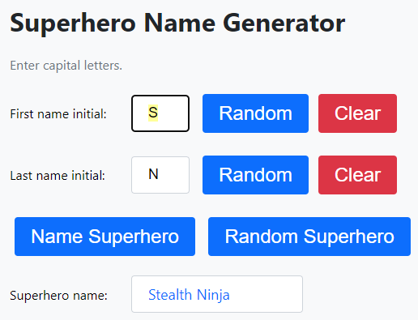
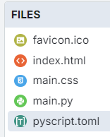

====================================================
Superheroes
====================================================

| Demo app is at: `<https://gmc_ps.pyscriptapps.com/superheroes/latest/>`_

| The appearance is controlled via custom css.
| The user interactions with the interface are controlled via python.

----

Files
-------------

The files used are listed below..

The favicon.ico is optional. It shows as a small icon in the browser tab when the app is run.

----

toml configuration file
-------------------------------

| The toml configuration file contents is shown below.
| The name and description entries are metadata only and are for documentation purposes.

.. code-block:: toml

    name = "Superheroes"
    description = "A superhero name generator"

----

index.html
---------------------

| Custom css is provided by: ``<link rel="stylesheet" href="main.css">``

| The body tag has the user interface for the web app.
| ``
`` is an html element that is used to group related form elements together. It is used here to keep the labels and input fields and buttons together.
| ``

`` has no text between the tags. It will be filled via python code when the button is clicked.
| ``<link rel="icon" href="favicon.ico" type="image/x-icon">`` uses the favicon.ico placed in the files section in the pyscript editor so it shows in a browser tab.

.. code-block:: html

    <!-- GMC Dec 2024 -->
    <!DOCTYPE html>
    <html lang="en">
    <head>
        <title>Superhero</title>
        <!-- Recommended meta tags -->
        <meta charset="UTF-8">
        <meta name="viewport" content="width=device-width,initial-scale=1.0">

        <!-- favicon to appear in browser tab -->
        <link rel="icon" href="favicon.ico" type="image/x-icon">

        <!-- PyScript CSS -->
        <link rel="stylesheet" href="https://pyscript.net/releases/2025.11.2/core.css">

        <!-- This script tag bootstraps PyScript -->
        

        <!-- custom CSS -->
        <link rel="stylesheet" href="main.css">
    </head>

    <body>
        <h1>Superhero Name Generator</h1>
        
Enter capital letters.

        

            <label for="firstinitial">First name initial:</label>
            <input type="text" id="firstinitial" name="firstinitial" title="Enter first initial" tabindex="1">
            <button id="random_firstinitial">Random</button>
            <button class="clear-button" id="clear_firstinitial">Clear</button>
        

        

            <label for="lastinitial">Last name initial:</label>
            <input type="text" id="lastinitial" name="lastinitial" title="Enter last initial" tabindex="2">
            <button id="random_lastinitial">Random</button>
            <button class="clear-button" id="clear_lastinitial">Clear</button>
        

        <button id="name_generator">Name Superhero</button>
        <button id="random_name">Random Superhero</button> 
        

            <label for="superhero">Superhero name:</label> 

        

        
    </body>
    </html>

----

main css:
--------------------

| The double colons (::) in ::selection are used to denote a CSS pseudo-element.
| Pseudo-elements are used to style specific parts of an element, such as the first letter, first line, or, in this case, the portion of text that is selected by the user.

| The brackets in the CSS selector input[type="text"] are used to create an attribute selector.
| The attribute selector targets HTML elements based on the presence and value of a specific attribute.
| In input[type="text"] targets <input> elements with the attribute type set to "text".

| **.form-group** and **.form-group label** create a form layout where each .form-group is a flex container.
| The labels within each .form-group are given a fixed width, ensuring that the input fields align neatly next to the labels.
| The vertical centering and bottom margin help maintain a clean and organized appearance.

.. code-block:: css

    body {
        font-family: "Segoe UI", Tahoma, Geneva, Verdana, sans-serif;
        padding: 20px;
        background-color: #f8f9fa; /* Bootstrap gray-100 */
        font-size: 16px;
    }

    h1,
    h2 {
        color: #212529; /* Bootstrap gray-900 */
    }

    p {
        margin-bottom: 20px;
        color: #6c757d; /* Bootstrap gray-600 */
    }

    .inline {
        display: inline;
    }

    .form-group {
        display: flex;
        flex-direction: row;
        align-items: center;
        margin-bottom: 1em;
    }
    .form-group label {
        width: 150px; /* adjust as needed */
    }

    #superhero {
        min-width: 170px; /* Increase the width */
        height: 24px; /* Increase the height */
        margin-right: 10px;
        padding: 10px 20px; /* Adjust padding as needed */
        border: 1px solid #ced4da; /* Bootstrap gray-400 */
        border-radius: 0.25rem;
        font-size: 18px; /* Increase the font size */
        background-color: white;
        color: #0d6efd; /* Bootstrap primary */
    }

    input[type="text"] {
        max-width: 30px; /* Increase the width */
        height: 24px; /* Increase the height */
        margin-right: 10px;
        padding: 10px 20px; /* Adjust padding as needed */
        border: 1px solid #ced4da; /* Bootstrap gray-400 */
        border-radius: 0.25rem;
        font-size: 18px; /* Increase the font size */
    }

    input[type="text"]::selection {
        background-color: #ffff99; /* Light yellow */
        color: #000000; /* Black */
    }

    button {
        background-color: #0d6efd; /* Bootstrap primary */
        border: none;
        color: white;
        padding: 10px 20px; /* Adjust padding as needed */
        text-align: center;
        text-decoration: none;
        display: inline-block;
        font-size: 24px; /* Adjust font size as needed */
        margin: 0.375rem 0.375rem;
        cursor: pointer;
        border-radius: 0.25rem;
        transition: background-color 0.15s ease-in-out;
    }

    button:hover {
        background-color: #0a58ca; /* Bootstrap primary-dark */
    }

    .clear-button {
        background-color: #dc3545; /* Bootstrap danger */
        color: white;
    }

    .clear-button:hover {
        background-color: #b02a37; /* Bootstrap danger-dark */
    }

----

main.py
------------------

| The code is a program that generates and displays a superhero name based on user-provided initials or randomly selected initials.

- **Random Initial Generation**: Generates random initials for the first and last name.
- **Input Validation**: Ensures that only valid alphabetical characters are used for initials.
- **Event Handling**: Responds to user interactions such as button clicks and text input.
- **Dynamic Display**: Updates the superhero name dynamically based on user input or random generation.

The main components of the script are:

- **Dictionaries for Names**: `first_names` and `last_names` dictionaries map initials to superhero first and last names.
- **Functions**:

  - `get_superhero(first_initial, last_initial)`: Combines initials to form a superhero name.
  - `ranAZ()`: Generates a random uppercase letter.
  - `set_firstinitial_input_text(value)`, `set_lastinitial_input_text(value)`: Update input fields.
  - `set_firstinitial_focus()`, `set_lastinitial_focus()`: Manage input field focus.

- **Event Handlers**:

  - `random_firstinitial(event)`, `random_lastinitial(event)`: Handle random initial generation.
  - `check_firstinitial(event)`, `check_lastinitial(event)`: Validate and update initials.
  - `clear_firstinitial(event)`, `clear_lastinitial(event)`: Clear input fields.
  - `name_generator(event)`, `random_name(event)`: Generate and display superhero names.

.. code-block:: python

    # import the document and display modules from pyscript
    from pyscript import document
    from pyscript import display
    from pyscript import when
    import random
    # import the string module to access string constants
    import string

    # define a dictionary of possible first names for superheroes based on their initials
    first_names = {
        "A": "Atomic", "B": "Blazing", "C": "Cosmic",
        "D": "Daring", "E": "Electric", "F": "Furious",
        "G": "Galactic", "H": "Hyper", "I": "Invincible",
        "J": "Justice", "K": "Kinetic", "L": "Legendary",
        "M": "Mighty", "N": "Noble", "O": "Omega",
        "P": "Polaris", "Q": "Quantum", "R": "Radiant",
        "S": "Stealth", "T": "Titan", "U": "Unstoppable",
        "V": "Vigilant", "W": "Warrior", "X": "Xeno",
        "Y": "Yieldless", "Z": "Zephyr",
    }

    # define a dictionary of possible last names for superheroes based on their initials
    last_names = {
        "A": "Avenger", "B": "Blade", "C": "Crusader",
        "D": "Defender", "E": "Eagle", "F": "Falcon",
        "G": "Guardian", "H": "Hawk", "I": "Inferno",
        "J": "Jaguar", "K": "Knight", "L": "Lion",
        "M": "Marvel", "N": "Ninja", "O": "Oracle",
        "P": "Phantom", "Q": "Quicksilver", "R": "Ranger",
        "S": "Specter", "T": "Thunder", "U": "Ultra",
        "V": "Viper", "W": "Wolf", "X": "Xiphos",
        "Y": "Youngstorm", "Z": "Zoom",
    }

    def get_superhero(first_initial, last_initial):
        superhero_name = first_names[first_initial] + " " + last_names[last_initial]
        return superhero_name

    def ranAZ():
        # use the random module to choose a random letter from the string constant of uppercase letters
        return random.choice(string.ascii_uppercase)

    @when('click', '#random_firstinitial')
    def random_firstinitial(event):
        # get a random first initial by calling the ranAZ function
        first_initial = ranAZ()
        # set the value of the input element with id "firstinitial" to the random first initial
        set_firstinitial_input_text(first_initial)
        # set the focus back to the input element with id "firstinitial"
        set_firstinitial_focus()

    @when('input', '#firstinitial')
    def check_firstinitial(event):
        # select the input element with id "firstinitial"
        firstinitial_element = document.querySelector("#firstinitial")
        # check if the value of the input element is not empty
        if firstinitial_element.value:
            # get the first character of the value and convert it to uppercase
            first_initial = firstinitial_element.value.upper()[0]
            # check if the first character is a letter
            if first_initial.isalpha():
                # set the value of the input element to the first character
                set_firstinitial_input_text(first_initial)
            else:
                # clear the value of the input element
                set_firstinitial_input_text("")
        # set the focus back to the input element with id "firstinitial"
        set_firstinitial_focus()

    @when('click', '#clear_firstinitial')
    def clear_firstinitial(event):
        set_firstinitial_input_text("")
        set_firstinitial_focus()

    @when('click', '#random_lastinitial')
    def random_lastinitial(event):
        # get a random last initial by calling the ranAZ function
        last_initial = ranAZ()
        set_lastinitial_input_text(last_initial)
        set_lastinitial_focus()

    @when('input', '#lastinitial')
    def check_lastinitial(event):
        # display random initials
        lastinitial_element = document.querySelector("#lastinitial")
        # select the element with id "lastinitial"
        # Check if the value is not empty
        if lastinitial_element.value:
            last_initial = lastinitial_element.value.upper()[0]
            # get the value of the last initial and convert it to uppercase
            if last_initial.isalpha():
                # check if the last initial is a letter
                set_lastinitial_input_text(last_initial)
            else:
                set_lastinitial_input_text("")
        # rest focus back to last initial
        set_lastinitial_focus()

    @when('click', '#clear_lastinitial')
    def clear_lastinitial(event):
        set_lastinitial_input_text("")
        set_lastinitial_focus()

    @when('click', '#name_generator')
    def name_generator(event):
        firstinitial_element = document.querySelector("#firstinitial") # select the element with id "firstinitial"
        lastinitial_element = document.querySelector("#lastinitial") # select the element with id "lastinitial"
        # add validation for letters A to Z (or a to z)
        validAZ = True # a flag to indicate if the input initials are valid
        first_initial = firstinitial_element.value.upper() # get the value of the first initial and convert it to uppercase
        last_initial = lastinitial_element.value.upper() # get the value of the last initial and convert it to uppercase
        if not first_initial.isalpha(): # check if the first initial is not a letter
            validAZ = False # set the flag to False
        if not last_initial.isalpha(): # check if the last initial is not a letter
            validAZ = False # set the flag to False
        # output_div_text = document.querySelector("#superhero") # select the element with id "superhero"
        if validAZ: # if the input initials are valid
            display(get_superhero(first_initial, last_initial), target="#superhero", append=False)
            # output_div_text.innerText = get_superhero(first_initial, last_initial) # assign the text of the element to the superhero name generated by the function
        else: # if the input initials are not valid
            display("Enter initials.", target="#superhero", append=False)
            # output_div_text.innerText = "Enter initials." # assign the text of the element to a message asking the user to enter initials
        # rest focus back to first initial
        set_firstinitial_focus()

    @when('click', '#random_name')
    def random_name(event):
        # get random inititals
        first_initial = ranAZ()
        last_initial = ranAZ()
        # display random initials
        set_firstinitial_input_text(first_initial)
        set_lastinitial_input_text(last_initial)
        # place random name
        display(get_superhero(first_initial, last_initial), target="#superhero", append=False)
        # rest focus back to first initial
        set_firstinitial_focus()

    def set_lastinitial_input_text(value):
        element = document.querySelector("#lastinitial")
        element.value = value

    def set_firstinitial_input_text(value):
        element = document.querySelector("#firstinitial")
        element.value = value

    def set_focus():
        set_firstinitial_focus()

    def set_firstinitial_focus():
        firstinitial_element = document.querySelector("#firstinitial")
        firstinitial_element.focus()
        firstinitial_element.select()

    def set_lastinitial_focus():
        lastinitial_element = document.querySelector("#lastinitial")
        lastinitial_element.focus()
        lastinitial_element.select()

    def main():
        # code to run when the page is loaded
        set_focus()

    main()
