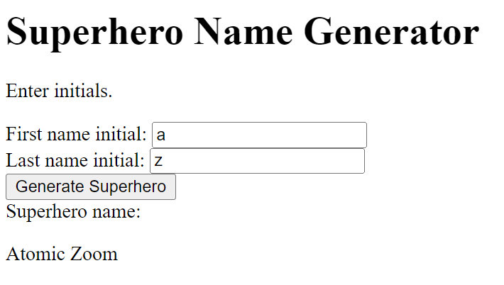
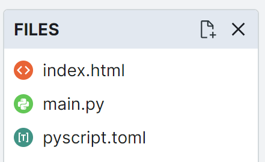
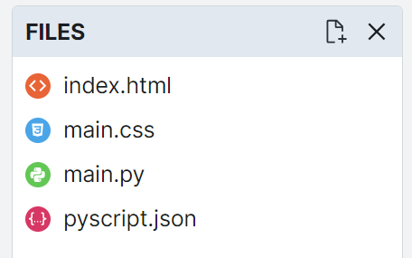

====================================================
Superheroes
====================================================

| The details below are for a simple superhero name generator using initials as input.
| Demo app is at: https://gmc_ps.pyscriptapps.com/superhero1/latest/

----

Superhero Name Generator: simple version
-------------------------------------------

Making a new project in pyscript starts with 3 files.

| The **index.html** file is served to your browser. It has the interface elements and links to python code.
| The **main.py** is for python code that defines how your application works.
| The **pyscript.toml** file is used to configure the project. e.g specifying python modules via   ``packages = ["numpy"]``

----

pyscript.toml
------------------

| This file will be empty, since there are no needed modules in this simple version.

----

index.html
-----------------

| The body tag has the user interface for the web app.
| `
` is an HTML element that is used to group related form elements together. It is used here to the labels and input fields together.
| `

` has no text between the tags. It will be filled via python code when the button is clicked.
| `<py-script src="./main.py"></py-script>` links to the `main.py` file. `main` could be renamed to suit.

.. code-block::

    <!-- GMC Nov 2023; no css; no custom js-->
    <!DOCTYPE html>
    <html lang="en">
    <head>
        <title>Superhero Name</title>
        <meta charset="UTF-8">
        <meta name="viewport" content="width=device-width,initial-scale=1">
        <link rel="stylesheet" href="https://pyscript.net/releases/2023.11.1/pyscript.css" />
        
    </head>
    <body>
        <h1>Superhero Name Generator</h1>
        
Enter initials.

        

            <label for="firstinitial">First name initial:</label>
            <input type="text" id="firstinitial" name="firstinitial"">
        

        

            <label for="lastinitial">Last name initial:</label>
            <input type="text" id="lastinitial" name="lastinitial">
        

        <button py-click="namegenerator">Generate Superhero</button> 
        

            <label for="superhero">Superhero name:</label>
            

        

        <py-config src="./pyscript.toml"></py-config>
        <py-script src="./main.py"></py-script>
    </body>
    </html>

----

main.py
------------

| The code is a program that generates and displays a superhero name based on the user input. It uses two dictionaries to store the possible first and last names for superheroes, and a function that returns a superhero name based on the first and last initials. It also uses another function that handles the user input and displays the superhero name or an error message if the input is not valid. The code uses the pyscript module to interact with the HTML elements of the web page. 

.. code-block:: python

    from pyscript import document

    # Define two dictionaries to store the possible first and last names for superheroes
    first_names = {
        "A": "Atomic", "B": "Blazing", "C": "Cosmic",
        "D": "Daring", "E": "Electric", "F": "Furious",
        "G": "Galactic", "H": "Hyper", "I": "Invincible",
        "J": "Justice", "K": "Kinetic", "L": "Legendary",
        "M": "Mighty", "N": "Noble", "O": "Omega",
        "P": "Polaris", "Q": "Quantum", "R": "Radiant",
        "S": "Stealth", "T": "Titan", "U": "Unstoppable",
        "V": "Vigilant", "W": "Warrior", "X": "Xeno",
        "Y": "Yieldless", "Z": "Zephyr",
    }

    last_names = {
        "A": "Avenger", "B": "Blade", "C": "Crusader",
        "D": "Defender", "E": "Eagle", "F": "Falcon",
        "G": "Guardian", "H": "Hawk", "I": "Inferno",
        "J": "Jaguar", "K": "Knight", "L": "Lion",
        "M": "Marvel", "N": "Ninja", "O": "Oracle",
        "P": "Phantom", "Q": "Quicksilver", "R": "Ranger",
        "S": "Specter", "T": "Thunder", "U": "Ultra",
        "V": "Viper", "W": "Wolf", "X": "Xiphos",
        "Y": "Youngstorm", "Z": "Zoom",
    }

    # Define a function that takes two initials as parameters and returns a superhero name
    def get_superhero(first_initial, last_initial):
        """Returns a superhero name based on the first and last initials.

        Args:
            first_initial (str): The first initial of the superhero name.
            last_initial (str): The last initial of the superhero name.

        Returns:
            str: The superhero name composed of the first and last names corresponding to the initials.
        """
        superhero_name = first_names[first_initial] + " " + last_names[last_initial]
        return superhero_name

        
    # Define a function that handles the user input and displays the superhero name
    def namegenerator(event):
        """Generates and displays a superhero name based on the user input.

        Args:
            event (Event): The event object that triggered the function.

        Returns:
            None
        """
        # Get the input elements for the first and last initials
        firstinitial_element = document.querySelector("#firstinitial")
        lastinitial_element = document.querySelector("#lastinitial")
        # Add validation for letters A to Z; random if empty
        validAZ = True
        first_initial = firstinitial_element.value.upper()
        last_initial = lastinitial_element.value.upper()
        # Check if the inputs are alphabetic characters
        if not first_initial.isalpha():
            validAZ = False
        if not last_initial.isalpha():
            validAZ = False
        # Get the output element for the superhero name
        output_div_text = document.querySelector("#superhero")
        # If the inputs are valid, generate and display the superhero name
        if validAZ:
            output_div_text.innerText = get_superhero(first_initial, last_initial)
        # Otherwise, display an error message
        else:
            output_div_text.innerText = "Enter initials."

----

Notes on getting and setting input and output elements
--------------------------------------------------------------------

| In general, you should use `.value` to get or set the value of an input element, and `.innerText` to get or set the text content of other types of elements.
| `.value` is used to get or set the value of an input element, such as a text input or a select element. For example, if you have an input element with an id of myInput, you can get its value using document.getElementById('myInput').value.
| `.innerText` is used to get or set the text content of an element, such as a 
 or a 
 element. For example, if you have a 
 element with an id of myDiv, you can get its text content using document.getElementById('myDiv').innerText.

----

Javascript improvements
----------------------------

| The appearance can be improved via custom css.
| The user interactions with the interface can be improved.
| Demo app is at: https://gmc_ps.pyscriptapps.com/superhero/latest/

----

Improved index.html
---------------------

| Custom css has been added: `<link rel="stylesheet" href="main.css">`
| `<body onload="setFocus()">` and its inline scirpt were added to cause the insertion to be in hte first input ready for typing so that clicking there by the user is not needed.
| In the `input type="text"` tag, `pattern="[A-Z]"` was added to restrict input to capital letters.
| In the `input type="text"` tag, `oninput="this.value = this.value.replace(/[^A-Z]/g, '').slice(0, 1)"` was added to remove entered text that is not a capital letter.
| `tabindex="1"` and `tabindex="2"` were added to elements to control the navigation order via the tab key. 
| `<button py-click="random_firstinitial">Random</button>` provides quick placement of a random letter.
| `<button class="clear-button" py-click="clear_firstinitial">Clear</button>` provides convenient clearing of the input.

.. code-block::

    <!-- GMC Nov 2023; css, js, 2023.11.1/core.js -->
    <!DOCTYPE html>
    <html lang="en">
    <head>
        <title>Superhero Name Generator</title>
        <meta charset="UTF-8">
        <meta name="viewport" content="width=device-width,initial-scale=1">
        <link rel="stylesheet" href="https://pyscript.net/releases/2023.11.1/pyscript.css" />
        <!-- CSS only -->
        <link rel="stylesheet" href="main.css">
        <!-- script only -->
        
    </head>
        
    <body onload="setFocus()">
        <h1>Superhero Name Generator</h1>
        
Enter capital letters.

        

            <label for="firstinitial">First name initial:</label>
            <input type="text" id="firstinitial" name="firstinitial" pattern="[A-Z]" 
                title="Enter first initial" required 
                oninput="this.value = this.value.replace(/[^A-Z]/g, '').slice(0, 1)" autocomplete="off" tabindex="1">
            <button py-click="random_firstinitial">Random</button>
            <button class="clear-button" py-click="clear_firstinitial">Clear</button>
        

        

            <label for="lastinitial">Last name initial:</label>
            <input type="text" id="lastinitial" name="lastinitial" pattern="[A-Z]" 
                title="Enter last initial" required 
                oninput="this.value = this.value.replace(/[^A-Z]/g, '').slice(0, 1)" autocomplete="off" tabindex="2">
            <button py-click="random_lastinitial">Random</button>
            <button class="clear-button" py-click="clear_lastinitial">Clear</button>
        

        <button py-click="name_generator">Name Superhero</button>
        <button py-click="random_name">Random Superhero</button> 
        

            <label for="superhero">Superhero name:</label> 

        

        
        
    </body>
    </html>

----

Custom css:
--------------------

.. code-block::

    body {
        font-family: 'Segoe UI', Tahoma, Geneva, Verdana, sans-serif;
        padding: 20px;
        background-color: #f8f9fa; /* Bootstrap gray-100 */
    }

    h1, h2 {
        color: #212529; /* Bootstrap gray-900 */
    }

    p {
        margin-bottom: 20px;
        color: #6c757d; /* Bootstrap gray-600 */
    }

    .inline {
        display: inline;
    }

    .form-group {
        display: flex;
        align-items: center;
        margin-bottom: 1em;
    }
    .form-group label {
        width: 150px; /* adjust as needed */
    }

    #superhero {
        min-width: 170px; /* Increase the width */
        height: 24px; /* Increase the height */
        margin-right: 10px;
        padding: 10px 20px; /* Adjust padding as needed */
        border: 1px solid #ced4da; /* Bootstrap gray-400 */
        border-radius: .25rem;
        font-size: 18px; /* Increase the font size */
        background-color: white;
        color: #0d6efd; /* Bootstrap primary */
    }

    input[type="text"] {
        max-width: 30px; /* Increase the width */
        height: 24px; /* Increase the height */
        margin-right: 10px;
        padding: 10px 20px; /* Adjust padding as needed */
        border: 1px solid #ced4da; /* Bootstrap gray-400 */
        border-radius: .25rem;
        font-size: 18px; /* Increase the font size */
    }

    /* Move the ::selection pseudo-element outside the input[type="text"] selector */
    input[type="text"]::selection, ::selection {
        background-color: #ffff99; /* Light yellow */
        color: #000000; /* Black */
    }

    button {
        background-color: #0d6efd; /* Bootstrap primary */
        border: none;
        color: white;
        padding: 10px 20px; /* Adjust padding as needed */
        text-align: center;
        text-decoration: none;
        display: inline-block;
        font-size: 24px; /* Adjust font size as needed */
        margin: .375rem .375rem;
        cursor: pointer;
        border-radius: .25rem;
        transition: background-color 0.15s ease-in-out;
    }

    button:hover {
        background-color: #0a58ca; /* Bootstrap primary-dark */
    }

    .clear-button {
        background-color: #dc3545; /* Bootstrap danger */
        color: white;
    }

    .clear-button:hover {
        background-color: #b02a37; /* Bootstrap danger-dark */
    }

----

Improved main.py
------------------

| The python code has neew code for random letters and input clearing.

.. code-block:: python

    from pyscript import document # import the document module from pyscript library
    import random # import the random module to generate random values
    import string # import the string module to access string constants

    # define a dictionary of possible first names for superheroes based on their initials
    first_names = {
        "A": "Atomic", "B": "Blazing", "C": "Cosmic",
        "D": "Daring", "E": "Electric", "F": "Furious",
        "G": "Galactic", "H": "Hyper", "I": "Invincible",
        "J": "Justice", "K": "Kinetic", "L": "Legendary",
        "M": "Mighty", "N": "Noble", "O": "Omega",
        "P": "Polaris", "Q": "Quantum", "R": "Radiant",
        "S": "Stealth", "T": "Titan", "U": "Unstoppable",
        "V": "Vigilant", "W": "Warrior", "X": "Xeno",
        "Y": "Yieldless", "Z": "Zephyr",
    }

    # define a dictionary of possible last names for superheroes based on their initials
    last_names = {
        "A": "Avenger", "B": "Blade", "C": "Crusader",
        "D": "Defender", "E": "Eagle", "F": "Falcon",
        "G": "Guardian", "H": "Hawk", "I": "Inferno",
        "J": "Jaguar", "K": "Knight", "L": "Lion",
        "M": "Marvel", "N": "Ninja", "O": "Oracle",
        "P": "Phantom", "Q": "Quicksilver", "R": "Ranger",
        "S": "Specter", "T": "Thunder", "U": "Ultra",
        "V": "Viper", "W": "Wolf", "X": "Xiphos",
        "Y": "Youngstorm", "Z": "Zoom",
    }

    def get_superhero(first_initial, last_initial):
        """Returns a superhero name based on the given initials.

        Args:
            first_initial (str): The first initial of the superhero name.
            last_initial (str): The last initial of the superhero name.

        Returns:
            str: The superhero name composed of the first and last names from the dictionaries.
        """
        superhero_name = first_names[first_initial] + " " + last_names[last_initial]
        return superhero_name

    def ranAZ():
        """Returns a random uppercase letter from A to Z.

        Returns:
            str: A random uppercase letter from A to Z.
        """
        return random.choice(string.ascii_uppercase)

    def random_firstinitial(event):
        """Generates and displays a random first initial for the superhero name.

        Args:
            event (Event): The event object that triggered this function.
        """
        # get random inititals
        first_initial = ranAZ()
        # display random initials
        firstinitial_element = document.querySelector("#firstinitial") # select the element with id "firstinitial"
        firstinitial_element.value = first_initial # assign the value of the element to the random initial
        # rest focus back to first initial
        firstinitial_element.focus() # focus on the element
        firstinitial_element.select() # select the text in the element

    def clear_firstinitial(event):
        """Clears and displays an empty first initial for the superhero name.

        Args:
            event (Event): The event object that triggered this function.
        """
        # get random inititals
        first_initial = ""
        # display random initials
        firstinitial_element = document.querySelector("#firstinitial") # select the element with id "firstinitial"
        firstinitial_element.value = first_initial # assign the value of the element to the empty string
        # rest focus back to first initial
        firstinitial_element.focus() # focus on the element
        firstinitial_element.select() # select the text in the element

    def random_lastinitial(event):
        """Generates and displays a random last initial for the superhero name.

        Args:
            event (Event): The event object that triggered this function.
        """
        # get random inititals
        last_initial = ranAZ()
        # display random initials
        lastinitial_element = document.querySelector("#lastinitial") # select the element with id "lastinitial"
        lastinitial_element.value =  last_initial # assign the value of the element to the random initial
        # rest focus back to first initial
        lastinitial_element.focus() # focus on the element
        lastinitial_element.select() # select the text in the element

    def clear_lastinitial(event):
        """Clears and displays an empty last initial for the superhero name.

        Args:
            event (Event): The event object that triggered this function.
        """
        # get random inititals
        last_initial = ""
        # display random initials
        lastinitial_element = document.querySelector("#lastinitial") # select the element with id "lastinitial"
        lastinitial_element.value =  last_initial # assign the value of the element to the empty string
        # rest focus back to first initial
        lastinitial_element.focus() # focus on the element
        lastinitial_element.select() # select the text in the element
        
    def name_generator(event):
        """Generates and displays a superhero name based on the user input initials.

        Args:
            event (Event): The event object that triggered this function.
        """
        firstinitial_element = document.querySelector("#firstinitial") # select the element with id "firstinitial"
        lastinitial_element = document.querySelector("#lastinitial") # select the element with id "lastinitial"
        # add validation for letters A to Z (or a to z)
        validAZ = True # a flag to indicate if the input initials are valid
        first_initial = firstinitial_element.value.upper() # get the value of the first initial and convert it to uppercase
        last_initial = lastinitial_element.value.upper() # get the value of the last initial and convert it to uppercase
        if not first_initial.isalpha(): # check if the first initial is not a letter
            validAZ = False # set the flag to False
        if not last_initial.isalpha(): # check if the last initial is not a letter
            validAZ = False # set the flag to False
        output_div_text = document.querySelector("#superhero") # select the element with id "superhero"
        if validAZ: # if the input initials are valid
            output_div_text.innerText = get_superhero(first_initial, last_initial) # assign the text of the element to the superhero name generated by the function
        else: # if the input initials are not valid
            output_div_text.innerText = "Enter initials." # assign the text of the element to a message asking the user to enter initials
        # rest focus back to first initial
        firstinitial_element.focus() # focus on the first initial element
        firstinitial_element.select() # select the text in the first initial element

    def random_name(event):
        """Generates and displays a random superhero name.

        Args:
            event (Event): The event object that triggered this function.
        """
        # get random inititals
        first_initial = ranAZ() # get a random first initial
        last_initial = ranAZ() # get a random last initial
        # display random initials
        firstinitial_element = document.querySelector("#firstinitial") # select the element with id "firstinitial"
        firstinitial_element.value = first_initial # assign the value of the element to the random first initial
        lastinitial_element = document.querySelector("#lastinitial") # select the element with id "lastinitial"
        lastinitial_element.value =  last_initial # assign the value of the element to the random last initial
        # place random name
        output_div_text = document.querySelector("#superhero") # select the element with id "superhero"
        output_div_text.innerText = get_superhero(first_initial, last_initial) # assign the text of the element to the superhero name generated by the function
        # rest focus back to first initial
        firstinitial_element.focus() # focus on the first initial element
        firstinitial_element.select() # select the text in the first initial element
