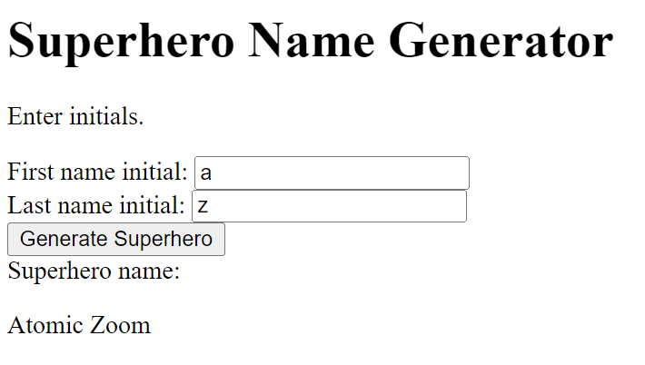
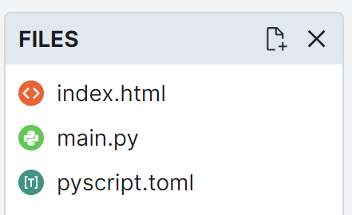

====================================================
Superheroes 1
====================================================

| The details below are for a simple superhero name generator using initials as input.
| Demo app is at: https://gmc_ps.pyscriptapps.com/superhero1/latest/

----

Superhero Name Generator: simple version
-------------------------------------------

Making a new project in pyscript starts with 3 files.

| The **index.html** file is served to your browser. It has the interface elements and links to python code.
| The **main.py** is for python code that defines how your application works.
| The **pyscript.toml** file is used to configure the project. e.g specifying python modules via   ``packages = ["numpy"]``

----

pyscript.toml
------------------

| This file will be empty, since there are no needed modules in this simple version.

----

index.html
-----------------

| The body tag has the user interface for the web app.
| ``
`` is an HTML element that is used to group related form elements together. It is used here to the labels and input fields together.
| ``

`` has no text between the tags. It will be filled via python code when the button is clicked.
| ```` links to the ``main.py`` file. ``main`` could be renamed to suit.

.. code-block::

    <!-- GMC Nov 2023; no css; no custom js-->
    <!DOCTYPE html>
    <html lang="en">
    <head>
        <title>Superhero</title>
        
        <!-- Recommended meta tags -->
        <meta charset="UTF-8">
        <meta name="viewport" content="width=device-width,initial-scale=1.0">

        <!-- PyScript CSS -->
        <link rel="stylesheet" href="https://pyscript.net/releases/2024.5.2/core.css">

        <!-- This script tag bootstraps PyScript -->
        
        
    </head>
    <body>
        <h1>Superhero Name Generator</h1>
        
Enter initials.

        

            <label for="first_initial">First name initial:</label>
            <input type="text" id="first_initial" name="first_initial"">
        

        

            <label for="last_initial">Last name initial:</label>
            <input type="text" id="last_initial" name="last_initial">
        

        <button py-click="name_generator">Generate Superhero</button> 
        

            <label for="superhero">Superhero name:</label>
            

        

        
    </body>
    </html>

----

main.py
------------

| The code is a program that generates and displays a superhero name based on the user input. It uses two dictionaries to store the possible first and last names for superheroes, and a function that returns a superhero name based on the first and last initials. It also uses another function that handles the user input and displays the superhero name or an error message if the input is not valid. The code uses the pyscript module to interact with the HTML elements of the web page. 

.. code-block:: python

    from pyscript import document, display

    # Define two dictionaries to store the possible first and last names for superheroes
    first_names = {
        "A": "Atomic", "B": "Blazing", "C": "Cosmic",
        "D": "Daring", "E": "Electric", "F": "Furious",
        "G": "Galactic", "H": "Hyper", "I": "Invincible",
        "J": "Justice", "K": "Kinetic", "L": "Legendary",
        "M": "Mighty", "N": "Noble", "O": "Omega",
        "P": "Polaris", "Q": "Quantum", "R": "Radiant",
        "S": "Stealth", "T": "Titan", "U": "Unstoppable",
        "V": "Vigilant", "W": "Warrior", "X": "Xeno",
        "Y": "Yieldless", "Z": "Zephyr",
    }

    last_names = {
        "A": "Avenger", "B": "Blade", "C": "Crusader",
        "D": "Defender", "E": "Eagle", "F": "Falcon",
        "G": "Guardian", "H": "Hawk", "I": "Inferno",
        "J": "Jaguar", "K": "Knight", "L": "Lion",
        "M": "Marvel", "N": "Ninja", "O": "Oracle",
        "P": "Phantom", "Q": "Quicksilver", "R": "Ranger",
        "S": "Specter", "T": "Thunder", "U": "Ultra",
        "V": "Viper", "W": "Wolf", "X": "Xiphos",
        "Y": "Youngstorm", "Z": "Zoom",
    }

    # Define a function that takes two initials as parameters and returns a superhero name
    def get_superhero(first_initial, last_initial):
        """Returns a superhero name based on the first and last initials.

        Args:
            first_initial (str): The first initial of the superhero name.
            last_initial (str): The last initial of the superhero name.

        Returns:
            str: The superhero name composed of the first and last names corresponding to the initials.
        """
        superhero_name = first_names[first_initial] + " " + last_names[last_initial]
        return superhero_name

        
    # Define a function that handles the user input and displays the superhero name
    def name_generator(event):
        """Generates and displays a superhero name based on the user input.

        Args:
            event (Event): The event object that triggered the function.

        Returns:
            None
        """
        # Get the input elements for the first and last initials
        first_initial_element = document.querySelector("#first_initial")
        last_initial_element = document.querySelector("#last_initial")
        # Add validation for letters A to Z; random if empty
        validAZ = True
        first_initial = first_initial_element.value.upper()
        last_initial = last_initial_element.value.upper()
        # Check if the inputs are alphabetic characters
        if not first_initial.isalpha():
            validAZ = False
        if not last_initial.isalpha():
            validAZ = False
        # If the inputs are valid, generate and display the superhero name
        if validAZ:
            display(get_superhero(first_initial, last_initial), target="#superhero", append=False)
        # Otherwise, display an error message
        else:
            display("Enter initials.", target="#superhero", append=False)

