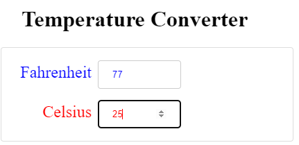
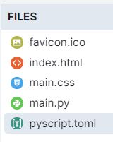

====================================================
Temperature converter
====================================================

| The details below are for a simple Temperature converter.
| Demo app is at: `<https://gmc_ps.pyscriptapps.com/temp-converter/latest/>`_

----

Files
---------

The files used are listed below.

The favicon.ico is optional. It shows as a small icon in the browser tab when the app is run.

----

toml configuration file
-------------------------------

| The toml configuration file contents is shown below.
| The name and description entries are metadata only and are for documentation purposes.

.. code-block:: toml

    name = "Temp converter"
    description = "Fahrenheit <-> Celsius converter with integer values"

----

index.html
---------------------

| The html is below.

.. code-block:: html

    <!-- GMC Dec 2024-->
    <!DOCTYPE html>
    <html lang="en">
    <head>
        <title>Temp converter</title>
        <!-- Recommended meta tags -->
        <meta charset="UTF-8">
        <meta name="viewport" content="width=device-width,initial-scale=1.0">

        <!-- favicon to appear in browser tab -->
        <link rel="icon" href="favicon.ico" type="image/x-icon>

        <!-- PyScript CSS -->
        <link rel="stylesheet" href="https://pyscript.net/releases/2025.11.2/core.css">

        <!-- This script tag bootstraps PyScript -->
        

        <!-- custom CSS only -->
        <link rel="stylesheet" href="main.css">
    </head>

    <body>
        

        <h1>Temperature Converter</h1>
        

        <!-- Use a container to wrap the content -->
    

        

            

                <label for="f_temp" class="fah">Fahrenheit</label>
                <!-- Use a form-control class for the input -->
                <input id="f_temp" class="form-control fah" type="number" min="-459" max="6177" placeholder="32">
            

            

                <label for="c_temp" class="cel">Celsius</label>
                <!-- Use a form-control class for the input -->
                <input id="c_temp" class="form-control cel" type="number" min="-273" max="3414"placeholder="0">
            

        

    <!-- Include your custom script -->
    
    </body>

    </html>

----

main css:
--------------------

| The css is below.

.. code-block:: css

    body {
    font-family: 'Segoe UI', Tahoma, Geneva, Verdana, sans-serif;
    font-size: 16px;
    margin: 5px; /* Override margin */
    padding: 5px;
    /*   background-color: #f8f9fa; */
    }

    h1 {
        text-align: left;
        font-size: 2rem;
        color: #00f;
        margin: 12px 20px;
    }

    /* Card Styling */
    .card {
        width: 400px;
        border: 1px solid #ddd;
        border-radius: 4px;
        padding: 10px;
    }

    /* Label Styling */
    label {
        display: inline-block; /* Set the label as an inline-block element */
        min-width: 120px;
        font-size: 1.5em;
        color: #333;
        text-align: right;
        margin-bottom: 5px; /* Add some spacing below the label */
        margin-right: 5px;
    }

    /* Input Field Styling */
    .form-control {
        width: 120px;
        padding: 12px 20px;
        margin: 8px 0;
        box-sizing: border-box;
        border: 1px solid #ccc;
        border-radius: 4px;
    }

    .fah {
        color: #00f;
    }

    .cel {
        color: #f00;
    }

    .cel {
        color: #f00;
    }

----

main.py
------------------

| The python code is below.

.. code-block:: python

    '''
    mod GMC dec 2024
    '''
    from pyscript import document
    from pyscript import display
    from pyscript import when

    write_in_progress = False

    def validate_f(f_temp_input):
        try:
            f_temp = float(f_temp_input.value)
            if f_temp < -459 or f_temp > 6177:
                if f_temp < -459:
                    f_temp = -459
                    f_temp_input.value = -459
                elif f_temp > 6177:
                    f_temp = 6177
                    f_temp_input.value = 6177
        except ValueError:
            f_temp = 0
            f_temp_input.value = 0
        return f_temp

    def validate_c(c_temp_input):
        try:
            c_temp = float(c_temp_input.value)
            if c_temp < -273 or c_temp > 3414:
                if c_temp < -273:
                    c_temp = -273
                    c_temp_input.value = -273
                elif c_temp > 3414:
                    c_temp = 3414
                    c_temp_input.value = 3414
        except ValueError:
            c_temp = 0
            c_temp_input.value = 0
        return c_temp

    @when('input', '#f_temp')
    def _f(self, *args, **kwargs):
        global write_in_progress
        if write_in_progress:
            return
        else:
            write_in_progress = True
            f_input = document.getElementById("f_temp")
            c_output = document.getElementById("c_temp")
            input_value = validate_f(f_input)
            c_output.value = round((int(float(input_value)) - 32) * (5/9), 1)
            write_in_progress = False

    @when('input', '#c_temp')
    def _c(self, *args, **kwargs):
        global write_in_progress
        if write_in_progress:
            return
        else:
            write_in_progress = True
            c_input = document.getElementById("c_temp")
            f_output = document.getElementById("f_temp")
            input_value = validate_c(c_input)
            f_output.value = round((int(float(input_value)) * (9/5)) + 32, 1)
            write_in_progress = False
