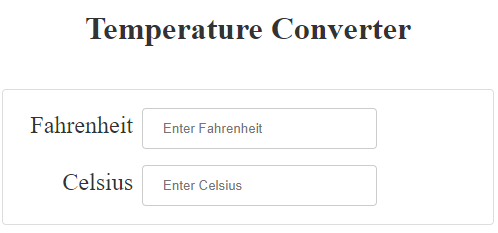

====================================================
Temperature converter
====================================================

| The details below are for a simple Temperature converter.
| Demo app is at: https://gmc_ps.pyscriptapps.com/temp-converter/latest/

----

index.html
---------------------

.. code-block::

    <!-- GMC Nov 2023; css, js, 2024.5.2/core.js -->
    <!DOCTYPE html>
    <html lang="en">
    <head>
        <title>Temp converter</title>
        <!-- Recommended meta tags -->
        <meta charset="UTF-8">
        <meta name="viewport" content="width=device-width,initial-scale=1.0">

        <!-- PyScript CSS -->
        <link rel="stylesheet" href="https://pyscript.net/releases/2024.5.2/core.css">

        <!-- This script tag bootstraps PyScript -->
        
        
        <!-- custom CSS only -->
        <link rel="stylesheet" href="main.css">
    </head>
    </head>
   
    <body>
    <!-- Use a container to wrap the content -->
    

        <!-- Use a jumbotron component for the title -->
        

        <h1>Temperature Converter</h1>
        

        <!-- Use a card class for the temperatures -->
        

            

                <label for="f_temp">Fahrenheit</label>
                <!-- Use a form-control class for the input -->
                <input id="f_temp" class="form-control" type="number" min="-459" max="6177" placeholder="Enter Fahrenheit"">
            

            

                <label for="c_temp">Celsius</label>
                <!-- Use a form-control class for the input -->
                <input id="c_temp" class="form-control" type="number" min="-273" max="3414"placeholder="Enter Celsius">
            

        

    <!-- Include your custom script -->
    
    </body>

    </html>

----

main css:
--------------------

.. code-block::

    /* Jumbotron Styling */
    .jumbotron {
        text-align: center;
        padding: 20px;
    }

    .jumbotron h1 {
        font-size: 2rem;
        color: #333;
    }

    /* Card Styling */
    .card {
        border: 1px solid #ddd;
        border-radius: 4px;
        padding: 10px;
    }

    /* Label Styling */
    label {
        display: inline-block; /* Set the label as an inline-block element */
        min-width: 120px;
        font-size: 1.5em; 
        color: #333;
        text-align: right;
        margin-bottom: 5px; /* Add some spacing below the label */
        margin-right: 5px;
    }

    /* Input Field Styling */
    .form-control {
        width: 50%;
        padding: 12px 20px;
        margin: 8px 0;
        box-sizing: border-box;
        border: 1px solid #ccc;
        border-radius: 4px;
    }

----

main.py
------------------

| The python code.
| For info on using the decorator ``@when``, See: https://jeff.glass/post/whats-new-pyscript-2023-05-1/

.. code-block:: python

    '''
    updated from using @when instead of proxy/eventlisterners
    no working on mobile
    https://eugenkiss.github.io/7guis/tasks/#temp
    https://jeff.glass/project/the-7-guis-pyscript/
    https://jeff.glass/post/whats-new-pyscript-2023-05-1/
    '''
    from pyscript import document
    from pyscript import display 
    from pyscript import when

    write_in_progress = False

    def isTemp(input_temp):
        try:
            _ = float(input_temp)
        except Exception as err:
            return False
        return True
        
    @when('input', '#f_temp')
    def _f(self, *args, **kwargs):
        global write_in_progress
        if write_in_progress:
            return
        else:
            write_in_progress = True
            f_input = document.getElementById("f_temp")
            c_output = document.getElementById("c_temp")
            input_value = f_input.value
            if isTemp(input_value):
                c_output.value = round((int(float(input_value)) - 32) * (5/9), 2)
            else:
                c_output.value = ""
            write_in_progress = False
            
    @when('input', '#c_temp')
    def _c(self, *args, **kwargs):
        global write_in_progress
        if write_in_progress:
            return
        else:
            write_in_progress = True
            c_input = document.getElementById("c_temp")
            f_output = document.getElementById("f_temp")
            input_value = c_input.value
            if isTemp(input_value):
                f_output.value = round((int(float(input_value)) * (9/5)) + 32, 2)
            else:
                f_output.value = ""
            write_in_progress = False
