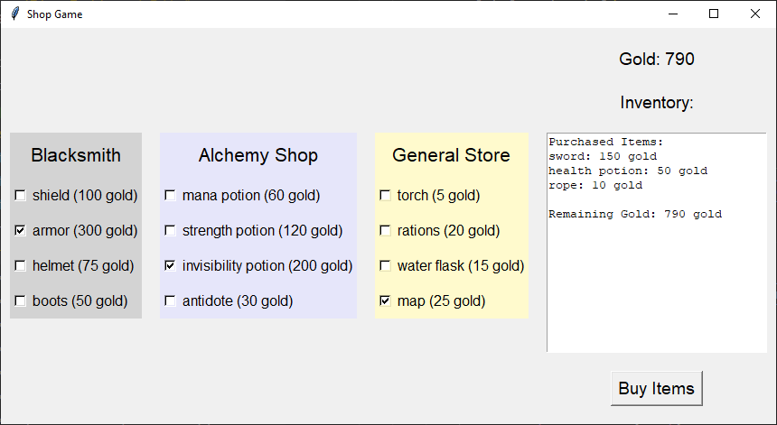

====================================================
RPG inventory
====================================================

Python terminal game
-------------------------

This Python script implements some code for buying inventory in an RPG game.

1. **Define Shops**:

   Three shop dictionaries are defined (`blacksmith`, `alchemy_shop`, and `general_store`), each with a variety of items and their prices.

2. **Initialize Variables**:

   An empty shopping cart (`cart`) and a purse with 1000 gold pieces are initialized.

3. **Display Initial Inventory**:

   The initial inventory of each shop is printed so the user knows what they can buy.

4. **Shopping**:

   - The player visits each shop one by one:
   - The available items in the current shop are displayed.
   - The player can type the name of an item to buy it or type 'exit' to leave the shop.
   - If the player buys an item, the item's price is deducted from the purse, and the item is added to the cart.
   - If the player doesn't have enough gold or types an invalid item, they are prompted accordingly.

5. **Display Final Inventory and Purchases**:

   After visiting all shops, the final inventory of each shop and the items purchased are printed, along with the total cost and remaining gold.

Code:

.. code-block:: python

    import random

    # Define the shops with more diverse items
    blacksmith = {'name': 'Blacksmith',
                'sword': 150,
                'shield': 100,
                'armor': 300,
                'helmet': 75,
                'boots': 50}

    alchemy_shop = {'name': 'Alchemy Shop',
                    'health potion': 50,
                    'mana potion': 60,
                    'strength potion': 120,
                    'invisibility potion': 200,
                    'antidote': 30}

    general_store = {'name': 'General Store',
                    'rope': 10,
                    'torch': 5,
                    'rations': 20,
                    'water flask': 15,
                    'map': 25}

    stores = [blacksmith, alchemy_shop, general_store]

    # Create an empty shopping cart and set initial gold
    cart = {}
    purse = 1000

    # Function to display the inventory of a store
    def display_inventory(store):
        return ', '.join([f'{item} ({price} gold)' for item, price in store.items() if item != 'name'])

    # Print initial inventory
    print("Initial Inventory:")
    for store in stores:
        print(f"{store['name']}: {display_inventory(store)}")

    # Loop through stores
    for store in stores:
        while True:
            # Input box to show what you can buy
            buy_item = input(f"Welcome to {store['name']}! What do you want to buy (type 'exit' to leave): ").lower()
            if buy_item == 'exit':
                break
            if buy_item in store:
                if purse >= store[buy_item]:
                    purse -= store[buy_item]
                    cart[buy_item] = store.pop(buy_item)
                    print(f"You bought {buy_item} for {cart[buy_item]} gold. You have {purse} gold left.")
                    break
                else:
                    print("You don't have enough gold for that item.")
            else:
                print("Item not found. Exiting store.")
                break

    # Print final inventory and purchases
    print("\nFinal Inventory:")
    for store in stores:
        print(f"{store['name']}: {display_inventory(store)}")

    print("\nItems Purchased:")
    for item, price in cart.items():
        print(f"{item}: {price} gold")

    print(f"\nTotal cost: {sum(cart.values())} gold")
    print(f"Gold left: {purse} gold")

----

.. admonition:: Task

    #. Convert the terminal version to a tkinter version.

----

Python tkinter version
-------------------------

This program simulates a shop game where the player can visit different stores, view items for sale, and buy items using their available gold.

1. **Shops Definition**:

   - Three shops are defined: "Blacksmith", "Alchemy Shop", and "General Store".
   - Each shop has a set of items with prices.

2. **Game Logic**:

   - The player starts with an initial amount of gold (`1000`).
   - The player can select one item from each store at a time. Only one item per store can be selected due to the use of checkboxes that deselect other options in the same store.

3. **UI Elements**:

   - A Tkinter GUI is created with separate frames for each store.
   - Each store's background color is set to a specific shade to distinguish them (light gray for Blacksmith, lavender for Alchemy Shop, and lemon chiffon for General Store).
   - A label displays the current amount of gold.

4. **Functions**:

   - **deselect_others**: Ensures only one item is selected from a store by deselecting other checkboxes in the same store.
   - **create_deselect_command**: Creates a function that ensures only one item can be selected per store by deselecting other checkboxes when one is selected.
   - **update_store**: Updates the store display to reflect current available items and their selection states.
   - **buy_items**: Handles the purchasing of selected items, updates the player's gold, and removes purchased items from the store's inventory and displays a summary of the items purchased, total cost, and remaining gold.

5. **Tkinter Widgets**:

   - **Checkbuttons**: Used to select items from stores.
   - **Buttons**: "Buy Item" to purchase the selected items and "End Game" to display a summary of purchases.
   - **Labels**: Display the current store name, item prices, and player's gold.

.. code-block:: python

    import tkinter as tk

    # Define the shops with more diverse items
    blacksmith = {"name": "Blacksmith", "items": {"sword": 150,
                                                "shield": 100, "armor": 300, "helmet": 75, "boots": 50}}

    alchemy_shop = {"name": "Alchemy Shop", "items": {"health potion": 50,
                                                    "mana potion": 60, "strength potion": 120, "invisibility potion": 200, "antidote": 30}}

    general_store = {"name": "General Store", "items": {
        "rope": 10, "torch": 5, "rations": 20, "water flask": 15, "map": 25}}

    stores = [blacksmith, alchemy_shop, general_store]

    # Create an empty shopping cart and set initial gold
    cart = {}
    purse = 1000

    def deselect_others(store_name, selected_index):
        """Ensure only one item can be selected per store."""
        for i, var in enumerate(selected_items[store_name]):
            if i != selected_index:
                var.set(False)

    def create_deselect_command(store_name, index):
        """Creates a command to deselect other checkboxes in the same store."""
        def deselect_others():
            for i, var in enumerate(selected_items[store_name]):
                if i != index:
                    var.set(False)
        return deselect_others

    def update_store():
        # Refresh the store frames
        for i in range(len(stores)):
            store = stores[i]
            frame = store_frames[i]

            # Destroy all existing widgets in the frame
            for widget in frame.winfo_children():
                widget.destroy()

            # Create store label with background color matching the frame
            store_label = tk.Label(frame, text=store["name"], font=("Helvetica", 16), bg=store_colors[store["name"]])
            store_label.pack(pady=10)

            # Create checkboxes for each item in the store
            for index, (item, price) in enumerate(store["items"].items()):
                var = tk.BooleanVar(value=False)
                selected_items[store["name"]][index] = var

                # Call function to deselect other checkboxes in the store
                deselect_command = create_deselect_command(store["name"], index)

                item_check = tk.Checkbutton(
                    frame,
                    text=f"{item} ({price} gold)",
                    variable=var,
                    font=("Helvetica", 12),
                    command=deselect_command,  # Use the deselect function
                    bg=store_colors[store["name"]],  # Set background color to match store frame
                )
                item_check.pack(anchor="w", pady=5)

    def update_inventory_display():
        """Update the inventory display to show the current cart and remaining gold."""
        inventory_text.delete(1.0, tk.END)  # Clear the existing content

        # Display purchased items
        inventory_text.insert(tk.END, "Purchased Items:\n")
        for item, price in cart.items():
            inventory_text.insert(tk.END, f"{item}: {price} gold\n")

        # Display remaining gold
        inventory_text.insert(tk.END, f"\nRemaining Gold: {purse} gold")

    def buy_items():
        global purse
        for store in stores:
            store_name = store["name"]
            items_to_remove = []  # Track items to remove after purchase
            for i, (item, price) in enumerate(store["items"].items()):
                if selected_items[store_name][i].get():  # Check if this item was selected
                    if purse >= price:
                        purse -= price
                        cart[item] = price
                        # Mark item for removal from the store
                        items_to_remove.append(item)
                        purse_label.config(text=f"Gold: {purse}")
                    else:
                        # Insufficient gold, just skip this item
                        continue

            # Remove bought items from the store's inventory
            for item in items_to_remove:
                store["items"].pop(item)

        update_store()  # Refresh the store display to remove purchased items
        update_inventory_display()  # Update the inventory display with purchased items

    # Initialize the Tkinter root window
    root = tk.Tk()
    root.title("Shop Game")

    # Define colors for each store
    store_colors = {"Blacksmith": "#D3D3D3",
                    "Alchemy Shop": "#E6E6FA", "General Store": "#FFFACD"}

    # Create frames for each store (left side)
    store_frames = []
    for store in stores:
        frame = tk.Frame(root, bg=store_colors[store["name"]])
        frame.pack(side=tk.LEFT, padx=10, pady=10)
        store_frames.append(frame)

    # Create a dictionary of BooleanVars for each store
    selected_items = {}
    for store in stores:
        selected_items[store["name"]] = []
        for _ in store["items"]:
            selected_items[store["name"]].append(tk.BooleanVar(value=False))

    # Create a right side frame for displaying inventory and remaining gold
    right_frame = tk.Frame(root)
    right_frame.pack(side=tk.LEFT, padx=10, pady=10)

    # Label to display current gold
    purse_label = tk.Label(right_frame, text=f"Gold: {purse}", font=("Helvetica", 14))
    purse_label.pack(pady=10)

    # Label to display the shopping cart and purchased items
    inventory_label = tk.Label(right_frame, text="Inventory:", font=("Helvetica", 14))
    inventory_label.pack(pady=10)

    inventory_text = tk.Text(right_frame, height=15, width=30, wrap=tk.WORD)
    inventory_text.pack(pady=10)

    # Button to buy item
    buy_button = tk.Button(right_frame, text="Buy Items", command=buy_items, font=("Helvetica", 14))
    buy_button.pack(pady=10)

    update_store()

    root.mainloop()

----

Functions in more detail
---------------------------

These functions work together to create an interactive shopping experience where users can select items from different stores, purchase them, and see their remaining gold and purchased items.

1. **deselect_others(store_name, selected_index)**:

    - This function ensures that only one item can be selected per store.
    - It iterates through all the items in the specified store (`store_name`).
    - If the current item's index (`i`) is not the same as the `selected_index`, it sets the corresponding BooleanVar to `False`, effectively deselecting it.

2. **create_deselect_command(store_name, index)**:

    - This function creates a command to deselect other checkboxes in the same store.
    - It returns a function (`deselect_others`) that, when called, will deselect all other items in the specified store except the one at the given `index`.
    - `deselect_command = create_deselect_command(store["name"], index)` avoids the use of parameters in `command=deselect_command` for the Checkbox creation.

3. **update_store()**:

    - This function refreshes the store frames and creates checkboxes for each item.
    - It iterates through each store and its corresponding frame.
    - It destroys all existing widgets in the frame to ensure a fresh start.
    - It creates a label for the store with a background color matching the frame.
    - For each item in the store, it creates a checkbox with a command to deselect other checkboxes in the same store.

4. **update_inventory_display()**:

    - This function updates the inventory display to show the current cart and remaining gold.
    - It clears the existing content in the `inventory_text` widget.
    - It inserts the purchased items and their prices into the `inventory_text`.
    - It also displays the remaining gold.

5. **buy_items()**:

    - This function handles the purchase of selected items and updates the store and inventory.
    - It iterates through each store and checks if an item has been selected.
    - If the item is selected and there is enough gold (`purse`), it deducts the item's price from the purse, adds the item to the cart, and marks the item for removal from the store.
    - After processing all items, it removes the bought items from the store's inventory.
    - It then calls `update_store()` to refresh the store display and `update_inventory_display()` to update the inventory display with the purchased items.

