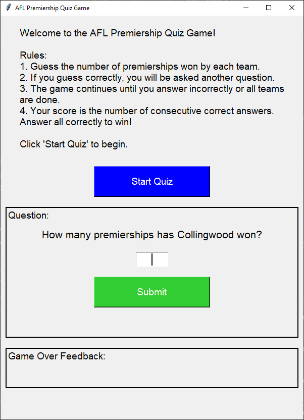

====================================================
AFL premiers
====================================================

Python terminal game
-------------------------

This Python script implements a quiz game about AFL premierships, written for the terminal. Below is a summary of its key components:

- **Imports**:

  - `random`: For selecting a random team.
  - `os`: For clearing the terminal screen.

- **Functions**:

  - `clear_screen()`: Clears the terminal screen. Uses `cls` for Windows and `clear` for macOS/Linux.

- **Data**:

  - `premiers`: A dictionary containing AFL teams and their respective number of premierships.

- **Main Program**:

  - Displays the list of AFL premiers.
  - Prompts the user to start the quiz.
  - If the user agrees, the screen is cleared, and the quiz begins.
  - The quiz randomly selects a team and asks the user to guess the number of premierships.
  - The user's guess is checked against the correct number.
  - The user is informed if their guess is correct or incorrect.
  - The user can choose to continue or exit the quiz.
  - Finally, the program prints the list of teams and their premierships.

Code:

.. code-block:: python

    import random
    import os

    # Function to clear the terminal screen
    def clear_screen():
        # For Windows
        if os.name == 'nt':
            _ = os.system('cls')
        # For macOS and Linux
        else:
            _ = os.system('clear')

    # Dictionary of premiers with full team names
    premiers = {
        "Essendon": 16,
        "Collingwood": 16,
        "Carlton": 16,
        "Melbourne": 13,
        "Richmond": 13,
        "Hawthorn": 13,
        "Geelong": 10,
        "Sydney Swans": 5,  # Linked to South Melbourne
        "Brisbane Lions": 4,  # Linked to Fitzroy
        "West Coast Eagles": 4,
        "North Melbourne": 4,
        "Western Bulldogs": 2,
        "Adelaide": 2,
        "Port Adelaide": 1,
        "St Kilda": 1,
        "Fremantle": 0,
        "Greater Western Sydney": 0,
        "Gold Coast": 0,
        "Fitzroy": 8,
        "South Melbourne": 3
    }

    # Display the list of premiers for study
    print("List of AFL Premiers:\n")
    for team, premierships in premiers.items():
        print(f"{team}: {premierships} premierships")

    # Prompt to start the quiz
    start_quiz = input("\nDo you want to start the quiz? (Y/N): ").strip().upper()

    if start_quiz == "Y":
        clear_screen()  # Clear the terminal screen before starting the quiz
        while True:
            # Randomly select a team
            team = random.choice(list(premiers.keys()))

            # Ask the user to guess the number of premierships
            user_guess = input(f"How many premierships has {team} won? ").strip()

            # Get the correct number of premierships
            correct_premierships = premiers[team]

            # Check if the user's guess is correct
            if user_guess.isdigit() and int(user_guess) == correct_premierships:
                print("Correct!\n")
            else:
                print(f"Incorrect. {team} has won {correct_premierships} premierships.\n")

            # Ask the user if they want to continue or exit
            user_input = input("Press Enter to continue or any other key to exit: ").strip()
            if user_input != "":
                print("Exiting the program.\n")
                break

    print("\nFinal list of teams and their premierships:\n", premiers,"\n")

----

.. admonition:: Task

    #. Convert the terminal game above to a tkinter quiz game.

----

Python tk game
-------------------------

This Python script creates a graphical quiz game using the `tkinter` library. Below is a summary of its key components:

- **Imports**:

  - `tkinter`: For creating the graphical user interface (GUI).
  - `random`: For shuffling the list of teams.

- **Data**:

  - `premiers`: A dictionary containing AFL teams and their respective number of premierships.

- **Functions**:

  - `on_return_key(event)`: Calls `check_answer()` when the Return key is pressed.
  - `start_quiz()`: Initializes the quiz, resets the score, and starts the first question.
  - `next_question()`: Displays the next question or ends the game if all questions are answered.
  - `check_answer()`: Checks the user's answer, updates the score, and provides feedback.
  - `end_game()`: Displays the final score and feedback.

- **GUI Setup**:

  - Creates the main window with a title and specific dimensions.
  - Displays a welcome message and rules.
  - Includes a "Start Quiz" button to begin the quiz.
  - Sets up frames and labels for displaying questions, user input, and feedback.
  - Binds the Return key to submit answers.

- **Game Flow**:

  - The user is prompted to guess the number of premierships won by randomly selected teams.
  - Correct answers allow the user to continue; incorrect answers end the game.
  - The final score is displayed at the end of the game.

Code:

.. code-block:: python

    import tkinter as tk
    import random

    # Dictionary of premiers with full team names
    premiers = {
        "Essendon": 16,
        "Collingwood": 16,
        "Carlton": 16,
        "Melbourne": 13,
        "Richmond": 13,
        "Hawthorn": 13,
        "Geelong": 10,
        "Sydney Swans": 5,  # Linked to South Melbourne
        "Brisbane Lions": 4,  # Linked to Fitzroy
        "West Coast Eagles": 4,
        "North Melbourne": 4,
        "Western Bulldogs": 2,
        "Adelaide": 2,
        "Port Adelaide": 1,
        "St Kilda": 1,
        "Fremantle": 0,
        "Greater Western Sydney": 0,
        "Gold Coast": 0,
        "Fitzroy": 8,
        "South Melbourne": 3,
    }

    def on_return_key(event):
        check_answer()

    def start_quiz():
        global score, current_team_index
        score = 0
        current_team_index = 0
        feedback_label.config(text="")  # Clear the feedback field
        next_question()

    def next_question():
        if current_team_index < len(teams):
            team_label.config(text=f"How many premierships has {teams[current_team_index]} won?")
            entry.delete(0, tk.END)
            entry.focus()  # Set focus to the entry field
            result_label.config(text="")
        else:
            end_game()

    def check_answer():
        global score, current_team_index
        user_guess = entry.get().strip()
        correct_premierships = premiers[teams[current_team_index]]

        if user_guess.isdigit() and int(user_guess) == correct_premierships:
            result_label.config(text="Correct!", fg="green")
            score += 1
            current_team_index += 1
            root.after(1000, next_question)
        else:
            result_label.config(text=f"Incorrect. {teams[current_team_index]} has won {correct_premierships} premierships.", fg="red")
            root.after(2000, end_game)

    def end_game():
        if score == len(teams):
            feedback_label.config(
                text=f"Winner! You answered all {score} questions correctly!",
                fg="green")
        else:
            feedback_label.config(
                text=f"You answered {score} questions correctly in a row.",
                fg="blue")
        team_label.config(text="")
        entry.delete(0, tk.END)
        result_label.config(text="")

    root = tk.Tk()
    root.title("AFL Premiership Quiz Game")
    score = 0
    teams = list(premiers.keys())
    random.shuffle(teams)
    current_team_index = 0

    # Set the window size to 600x800 pixels
    root.geometry("600x800")

    # Make the window resizable
    root.resizable(True, True)

    welcome_text = "Welcome to the AFL Premiership Quiz Game!\n\nRules:\n1. Guess the number of premierships won by each team.\n2. If you guess correctly, you will be asked another question.\n3. The game continues until you answer incorrectly or all teams are done.\n4. Your score is the number of consecutive correct answers. Answer all correctly to win!\n\nClick 'Start Quiz' to begin."

    label = tk.Label(root, text=welcome_text, wraplength=550, anchor="w", justify="left", font=("Helvetica", 14))
    label.pack(pady=20)

    start_button = tk.Button(root, text="Start Quiz", command=start_quiz, bg="blue", fg="white", width=20, height=2, font=("Helvetica", 14))
    start_button.pack(pady=10)

    question_frame = tk.Frame(root, bd=2, relief="solid")
    question_frame.pack(pady=10, padx=10, fill="x")

    question_label = tk.Label(question_frame, text="Question:", font=("Helvetica", 14))
    question_label.pack(anchor="w")

    team_label = tk.Label(question_frame, text="", font=("Helvetica", 16))
    team_label.pack(pady=10)

    entry = tk.Entry(question_frame, width=5, font=("Helvetica", 16), justify="center")
    entry.pack(pady=10)
    entry.bind("<Return>", on_return_key)

    submit_button = tk.Button(question_frame, text="Submit", command=check_answer, bg="lime green", fg="white", width=20, height=2, font=("Helvetica", 14))
    submit_button.pack(pady=10)

    result_label = tk.Label(question_frame, text="", font=("Helvetica", 14))
    result_label.pack(pady=10)

    feedback_frame = tk.Frame(root, bd=2, relief="solid")
    feedback_frame.pack(pady=10, padx=10, fill="x")

    feedback_label_title = tk.Label(feedback_frame, text="Game Over Feedback:", font=("Helvetica", 14))
    feedback_label_title.pack(anchor="w")

    feedback_label = tk.Label(feedback_frame, text="", font=("Helvetica", 14))
    feedback_label.pack(pady=10)

    root.mainloop()

