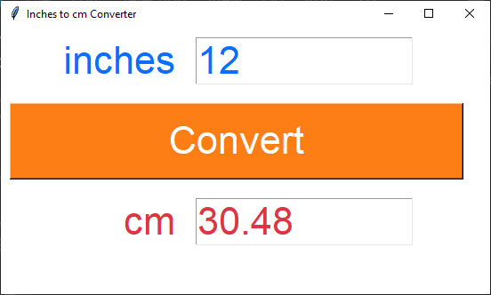
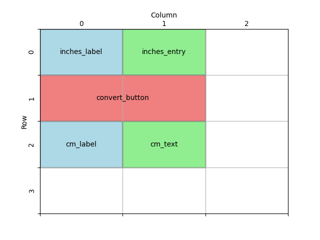

====================================================
Inches to cm
====================================================

| This code converts inches to cm.
| This code creates a simple GUI application using the Tkinter library.
| It displays a window with Label, Entry, Text and Button widgets
| Users can input inches, click the "Convert" button, and see the corresponding centimeters displayed.

----

Create the Main Window
-----------------------------------

 First, import the `tkinter` module and create the main application window using `tk.Tk()`. Set the window title, size, and background color:

.. code-block:: python

    import tkinter as tk

    # Create the main window
    window = tk.Tk()
    window.title("Inches to cm Converter")
    window.geometry("550x300")
    window.configure(bg="#ffffff")

    window.mainloop()

----

Create Widgets
--------------------------------

Now create the widgets (GUI elements) that will be displayed in the window:

.. code-block:: python

    # Create widgets
    inches_label = tk.Label(window, text="inches")
    inches_entry = tk.Entry(window, width=10)
    cm_label = tk.Label(window, text="cm")
    # height of 1 is one text row
    cm_text = tk.Text(window, height=1, width=10)
    convert_button = tk.Button(window, text="Convert", width=20)

----

Place Widgets in the Window
-------------------------------------------------

Design the grid positions:

Position the widgets using the `grid()` method:

.. code-block:: python

    # Place widgets in the window
    inches_label.grid(row=0, column=0, sticky="e", padx=10, pady=10)
    inches_entry.grid(row=0, column=1, sticky="w", padx=10, pady=10)
    cm_label.grid(row=2, column=0, sticky="e", padx=10, pady=10)
    cm_text.grid(row=2, column=1, sticky="w", padx=10, pady=10)
    convert_button.grid(row=1, column=0, columnspan=2, padx=10, pady=10)

----

Define Constants for formatting
------------------------------------------

| Next, define some constants for colors and font settings.
| You can customize these values as needed:

.. code-block:: python

    # Constants
    WINDOW_BG_COLOR = "#ffffff"
    INPUT_BG_COLOR = "#ffffff"
    INPUT_FG_COLOR = "#0d6efd"
    BUTTON_BG_COLOR = "#fd7e14"
    BUTTON_FG_COLOR = "#ffffff"
    OUTPUT_BG_COLOR = "#ffffff"
    OUTPUT_FG_COLOR = "#dc3545"
    FONT_STYLE = ("Arial", 32)

Update the window colour using the constant:

.. code-block:: python

    window.configure(bg=WINDOW_BG_COLOR)

----

Format Widgets
--------------------------------

Now format the widgets (GUI elements) that will be displayed in the window:

.. code-block:: python

    # Create widgets
    inches_label = tk.Label(window, text="inches", bg=INPUT_BG_COLOR, fg=INPUT_FG_COLOR, font=FONT_STYLE)
    inches_entry = tk.Entry(window, width=10, bg=INPUT_BG_COLOR, fg=INPUT_FG_COLOR, font=FONT_STYLE)
    cm_label = tk.Label(window, text="cm", bg=OUTPUT_BG_COLOR, fg=OUTPUT_FG_COLOR, font=FONT_STYLE)
    # height of 1 is one text row
    cm_text = tk.Text(window, height=1, width=10, bg=OUTPUT_BG_COLOR, fg=OUTPUT_FG_COLOR, font=FONT_STYLE)
    convert_button = tk.Button(window, text="Convert", width=20, bg=BUTTON_BG_COLOR,
                                fg=BUTTON_FG_COLOR, font=FONT_STYLE)

----

Define the Conversion Function
----------------------------------------------

| Create a function called `convert_inches_to_cm()` that performs the conversion and updates the result in the `cm_text` widget.
| ``convert_inches_to_cm()`` uses a try and except block to catch errors due to non numeric entries.
| See: https://www.w3schools.com/python/python_try_except.asp

| The delete method of a Text widget requires the line.column as the first argument. e.g. ``1.0`` is the line.column in ``c_text.delete(1.0, 'end')``
| ``tk.END`` or ``'end'`` can be used as the second argument to cause the deletion to go to the end of the widget.
| The insert method of a Text widget requires the line.column as the first argument. e.g. ``1.0`` is the line.column in ``cm_text.insert(1.0, f'{cm:.2f}')``

 ``cm_text.insert(1.0, f'{cm:.2f}')`` uses ``:.2f`` to format the celsius float to 2 decimal places.
| For string formatting see: https://www.w3schools.com/python/ref_string_format.asp

.. code-block:: python

    def convert_inches_to_cm():
        try:
            inches = float(inches_entry.get())
            cm = inches * 2.54
            cm_text.delete(1.0, "end")  # Clear any previous result
            cm_text.insert(1.0, f"{cm:.2f}")
        except ValueError:
            cm_text.delete(1.0, "end")
            cm_text.insert(1.0, "Invalid input.")

----

Connect the Button to the Function
---------------------------------------------

.. code-block:: python

    convert_button = tk.Button(window, text="Convert", width=20, bg=BUTTON_BG_COLOR,
                                fg=BUTTON_FG_COLOR, font=FONT_STYLE, command=convert_inches_to_cm)

----

Full code
------------

.. code-block:: python

    import tkinter as tk

    # Constants
    WINDOW_BG_COLOR = "#ffffff"
    INPUT_BG_COLOR = "#ffffff"
    INPUT_FG_COLOR = "#0d6efd"
    BUTTON_BG_COLOR = "#fd7e14"
    BUTTON_FG_COLOR = "#ffffff"
    OUTPUT_BG_COLOR = "#ffffff"
    OUTPUT_FG_COLOR = "#dc3545"
    FONT_STYLE = ("Arial", 32)

    def convert_inches_to_cm():
        """
        Converts inches to cm and displays the result in the GUI.

        Reads the inches value from the input field, performs the conversion to cm,
        and updates the result in the output text widget.

        Raises:
            ValueError: If the input is not a valid float.
        """
        try:
            inches = float(inches_entry.get())
            cm = inches * 2.54
            cm_text.delete(1.0, "end")  # Clear any previous result
            cm_text.insert(1.0, f"{cm:.2f}")
        except ValueError:
            cm_text.delete(1.0, "end")
            cm_text.insert(1.0, "Invalid input.")

    # Create the main window
    window = tk.Tk()
    window.title("Inches to cm Converter")
    window.geometry("550x300")
    window.configure(bg=WINDOW_BG_COLOR)

    # Create widgets
    inches_label = tk.Label(window, text="inches", bg=INPUT_BG_COLOR, fg=INPUT_FG_COLOR, font=FONT_STYLE)
    inches_entry = tk.Entry(window, width=10, bg=INPUT_BG_COLOR, fg=INPUT_FG_COLOR, font=FONT_STYLE)
    cm_label = tk.Label(window, text="cm", bg=OUTPUT_BG_COLOR, fg=OUTPUT_FG_COLOR, font=FONT_STYLE)
    # height of 1 is one text row
    cm_text = tk.Text(window, height=1, width=10, bg=OUTPUT_BG_COLOR, fg=OUTPUT_FG_COLOR, font=FONT_STYLE)
    convert_button = tk.Button(window, text="Convert", width=20, bg=BUTTON_BG_COLOR,
                                fg=BUTTON_FG_COLOR, font=FONT_STYLE, command=convert_inches_to_cm)

    # Place widgets in the window
    inches_label.grid(row=0, column=0, sticky="e", padx=10, pady=10)
    inches_entry.grid(row=0, column=1, sticky="w", padx=10, pady=10)
    cm_label.grid(row=2, column=0, sticky="e", padx=10, pady=10)
    cm_text.grid(row=2, column=1, sticky="w", padx=10, pady=10)
    convert_button.grid(row=1, column=0, columnspan=2, padx=10, pady=10)

    # Start the main event loop
    window.mainloop()

----

Inches to Centimeters Test Table
------------------------------------

.. list-table:: Test Cases for Inch-to-Centimeter Converter
   :header-rows: 1
   :widths: 15 25

   * - **Inches**
     - **Expected Output (cm)**
   * - 0
     - 0
   * - 1
     - 2.54
   * - one
     - Invalid input

| The code rounds to 2 decimal places so it doesn't handle numbers smaller than 0.01.
| The text fields have limited width so can't handle numbers with more that 9 digits.

