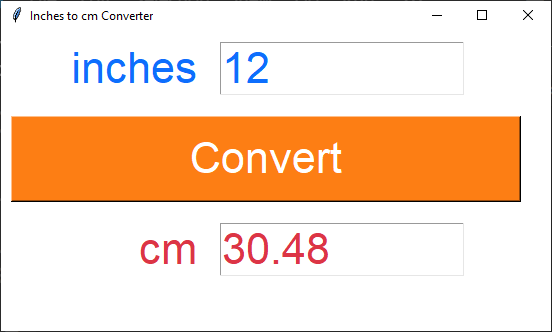
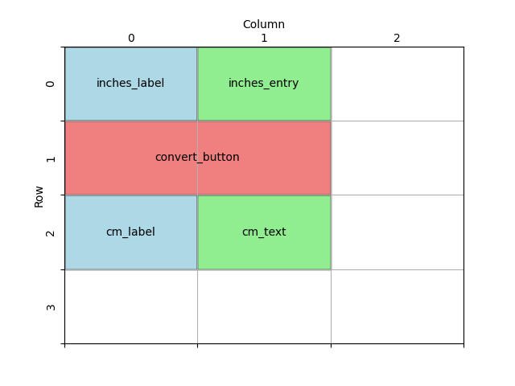

====================================================
Inches to cm
====================================================

| This code converts inches to cm.
| This code creates a simple GUI application using the Tkinter library.
| It displays a window with Label, Entry, Text and Button widgets
| Users can input inches, click the "Convert" button, and see the corresponding centimeters displayed.

----

Create the Main Window
-----------------------------------

| First, import the `tkinter` module and create the main application window using `tk.Tk()`.
| Set the window title, size, and background color:
| See `color-hex <https://www.color-hex.com/>`_ for more hex color values.

.. code-block:: python

    import tkinter as tk

    # Create the main window
    root = tk.Tk()
    root.title("Inches to cm Converter")
    root.geometry("550x300")
    root.configure(bg="#ffffff")

    root.mainloop()

----

Create Widgets
--------------------------------

Now create the widgets (GUI elements) that will be displayed in the window:

.. code-block:: python

    # Create widgets
    inches_label = tk.Label(root, text="inches")
    inches_entry = tk.Entry(root, width=10)
    cm_label = tk.Label(root, text="cm")
    # height of 1 is one text row
    cm_text = tk.Text(root, height=1, width=10)
    convert_button = tk.Button(root, text="Convert", width=20)

----

Place Widgets in the Window
-------------------------------------------------

Design the grid positions:

Position the widgets using the `grid()` method:

.. code-block:: python

    # Place widgets in the window
    inches_label.grid(row=0, column=0, sticky="e", padx=10, pady=10)
    inches_entry.grid(row=0, column=1, sticky="w", padx=10, pady=10)
    cm_label.grid(row=2, column=0, sticky="e", padx=10, pady=10)
    cm_text.grid(row=2, column=1, sticky="w", padx=10, pady=10)
    convert_button.grid(row=1, column=0, columnspan=2, padx=10, pady=10)

----

Define Constants for formatting
------------------------------------------

| Next, define some constants for colors and font settings.
| You can customize these values as needed:

.. code-block:: python

    # Constants
    WINDOW_BG_COLOR = "#ffffff"
    INPUT_BG_COLOR = "#ffffff"
    INPUT_FG_COLOR = "#0d6efd"
    BUTTON_BG_COLOR = "#fd7e14"
    BUTTON_FG_COLOR = "#ffffff"
    OUTPUT_BG_COLOR = "#ffffff"
    OUTPUT_FG_COLOR = "#dc3545"
    FONT_STYLE = ("Arial", 32)

Update the window colour using the constant:

.. code-block:: python

    root.configure(bg=WINDOW_BG_COLOR)

----

Format Widgets
--------------------------------

Now format the widgets (GUI elements) that will be displayed in the window:

.. code-block:: python

    # Create widgets
    inches_label = tk.Label(root, text="inches", bg=INPUT_BG_COLOR, fg=INPUT_FG_COLOR, font=FONT_STYLE)
    inches_entry = tk.Entry(root, width=10, bg=INPUT_BG_COLOR, fg=INPUT_FG_COLOR, font=FONT_STYLE)
    cm_label = tk.Label(root, text="cm", bg=OUTPUT_BG_COLOR, fg=OUTPUT_FG_COLOR, font=FONT_STYLE)
    # height of 1 is one text row
    cm_text = tk.Text(root, height=1, width=10, bg=OUTPUT_BG_COLOR, fg=OUTPUT_FG_COLOR, font=FONT_STYLE)
    convert_button = tk.Button(root, text="Convert", width=20, bg=BUTTON_BG_COLOR,
                                fg=BUTTON_FG_COLOR, font=FONT_STYLE)

----

Define the Conversion Function
----------------------------------------------

| Create a function called `convert_inches_to_cm()` that performs the conversion and updates the result in the `cm_text` widget.
| ``convert_inches_to_cm()`` uses a try and except block to catch errors due to non numeric entries.
| See: `<https://www.w3schools.com/python/python_try_except.asp>`_

| The delete method of a Text widget requires the line.column as the first argument. e.g. ``1.0`` is the line.column in ``c_text.delete(1.0, 'end')``
| ``tk.END`` or ``'end'`` can be used as the second argument to cause the deletion to go to the end of the widget.
| The insert method of a Text widget requires the line.column as the first argument. e.g. ``1.0`` is the line.column in ``cm_text.insert(1.0, f'{cm:.2f}')``

 ``cm_text.insert(1.0, f'{cm:.2f}')`` uses ``:.2f`` to format the celsius float to 2 decimal places.
| For string formatting see: `<https://www.w3schools.com/python/ref_string_format.asp>`_

.. code-block:: python

    def convert_inches_to_cm():
        try:
            inches = float(inches_entry.get())
            cm = inches * 2.54
            cm_text.delete(1.0, "end")  # Clear any previous result
            cm_text.insert(1.0, f"{cm:.2f}")
        except ValueError:
            cm_text.delete(1.0, "end")
            cm_text.insert(1.0, "Invalid input.")

----

Connect the Button to the Function
---------------------------------------------

.. code-block:: python

    convert_button = tk.Button(root, text="Convert", width=20, bg=BUTTON_BG_COLOR,
                                fg=BUTTON_FG_COLOR, font=FONT_STYLE, command=convert_inches_to_cm)

----

Full code
------------

.. code-block:: python

    import tkinter as tk

    # Constants
    WINDOW_BG_COLOR = "#ffffff"
    INPUT_BG_COLOR = "#ffffff"
    INPUT_FG_COLOR = "#0d6efd"
    BUTTON_BG_COLOR = "#fd7e14"
    BUTTON_FG_COLOR = "#ffffff"
    OUTPUT_BG_COLOR = "#ffffff"
    OUTPUT_FG_COLOR = "#dc3545"
    FONT_STYLE = ("Arial", 32)

    def convert_inches_to_cm():
        """
        Converts inches to cm and displays the result in the GUI.

        Reads the inches value from the input field, performs the conversion to cm,
        and updates the result in the output text widget.

        Raises:
            ValueError: If the input is not a valid float.
        """
        try:
            inches = float(inches_entry.get())
            cm = inches * 2.54
            cm_text.delete(1.0, "end")  # Clear any previous result
            cm_text.insert(1.0, f"{cm:.2f}")
        except ValueError:
            cm_text.delete(1.0, "end")
            cm_text.insert(1.0, "Invalid input.")

    # Create the main window
    root = tk.Tk()
    root.title("Inches to cm Converter")
    root.geometry("550x300")
    root.configure(bg=WINDOW_BG_COLOR)

    # Create widgets
    inches_label = tk.Label(root, text="inches", bg=INPUT_BG_COLOR, fg=INPUT_FG_COLOR, font=FONT_STYLE)
    inches_entry = tk.Entry(root, width=10, bg=INPUT_BG_COLOR, fg=INPUT_FG_COLOR, font=FONT_STYLE)
    cm_label = tk.Label(root, text="cm", bg=OUTPUT_BG_COLOR, fg=OUTPUT_FG_COLOR, font=FONT_STYLE)
    # height of 1 is one text row
    cm_text = tk.Text(root, height=1, width=10, bg=OUTPUT_BG_COLOR, fg=OUTPUT_FG_COLOR, font=FONT_STYLE)
    convert_button = tk.Button(root, text="Convert", width=20, bg=BUTTON_BG_COLOR,
                                fg=BUTTON_FG_COLOR, font=FONT_STYLE, command=convert_inches_to_cm)

    # Place widgets in the window
    inches_label.grid(row=0, column=0, sticky="e", padx=10, pady=10)
    inches_entry.grid(row=0, column=1, sticky="w", padx=10, pady=10)
    cm_label.grid(row=2, column=0, sticky="e", padx=10, pady=10)
    cm_text.grid(row=2, column=1, sticky="w", padx=10, pady=10)
    convert_button.grid(row=1, column=0, columnspan=2, padx=10, pady=10)

    # Start the main event loop
    root.mainloop()

----

Inches to Centimeters Test Table
------------------------------------

.. list-table:: Test Cases for Inch-to-Centimeter Converter
   :header-rows: 1
   :widths: 15 25

   * - **Inches**
     - **Expected Output (cm)**
   * - 0
     - 0
   * - 1
     - 2.54
   * - one
     - Invalid input

| The code rounds to 2 decimal places so it doesn't handle numbers smaller than 0.01.
| The text fields have limited width so can't handle numbers with more that 9 digits.

----

Inches to cm Converter - Multiple Choice Quiz
====================================================

.. mcqgroup::
    :nav_position: both
    :show-instant-feedback:
    :enable-instant-feedback:
    :shuffle_questions:
    :num_questions: 5

    .. multichoice::

        What method is used to create the main application window in Tkinter?

        [ ] tk.Window() | Incorrect. Tkinter uses tk.Tk() to initialize the root window.
        [x] tk.Tk() | Correct. tk.Tk() initializes and creates the main Tkinter root window object.
        [ ] tk.Main() | Incorrect. tk.Tk() is the correct class name.
        [ ] tk.App() | Incorrect. tk.Tk() is the standard constructor for the main window.

    .. multichoice::

        Which parameter in the grid() layout manager allows a widget to span across multiple columns?

        [ ] rowspan | Incorrect. rowspan allows a widget to span across multiple rows.
        [ ] colspan | Incorrect. The parameter name in Tkinter is columnspan.
        [x] columnspan | Correct. The columnspan=2 argument tells grid to let the widget stretch over two columns.
        [ ] width | Incorrect. width sets the widget dimensions, not the column span.

    .. multichoice::

        What height setting is applied to the cm_text Text widget, and what does it represent?

        [ ] height=1, representing 1 pixel height | Incorrect. Height in a Text widget is measured in lines of text, not pixels.
        [x] height=1, representing 1 line of text | Correct. In a Tkinter Text widget, height refers to the number of text lines (rows).
        [ ] height=10, representing 10 pixels height | Incorrect. The height was set to 1 line, not 10 pixels.
        [ ] height=10, representing 10 characters height | Incorrect. The width parameter handles character counts, while height handles line rows.

    .. multichoice::

        In the delete(1.0, 'end') method of a Text widget, what does 1.0 specify?

        [ ] Delete 1 character starting from column 0 | Incorrect. 1.0 is an index position, not a count.
        [x] Line 1, column 0 as the starting point for deletion | Correct. Text widget indexing follows the format line.column, where 1.0 means row 1, character offset 0.
        [ ] Line 0, column 1 as the starting point for deletion | Incorrect. Tkinter Text widget lines are 1-indexed and columns are 0-indexed.
        [ ] Deletion speed factor of 1.0 | Incorrect. 1.0 is a position index in the text widget.

    .. multichoice::

        Which error type is caught by the try...except block when converting user input to a float?

        [ ] TypeError | Incorrect. Passing a non-numeric string to float() raises a ValueError.
        [ ] InputError | Incorrect. InputError is not a standard built-in Python exception for float conversion.
        [x] ValueError | Correct. Trying to convert non-numeric string inputs via float() raises a ValueError.
        [ ] ZeroDivisionError | Incorrect. ZeroDivisionError occurs when dividing by zero, not during string-to-float parsing.

    .. multichoice::

        What mathematical conversion factor is used in the code to convert inches to centimeters?

        [ ] 1.61 | Incorrect. 1.61 is roughly the conversion factor for miles to kilometers.
        [x] 2.54 | Correct. 1 inch is defined as exactly 2.54 centimeters.
        [ ] 0.39 | Incorrect. 0.3937 is roughly centimeters to inches.
        [ ] 12.0 | Incorrect. 12 is the number of inches in a foot.

    .. multichoice::

        How is the floating-point result formatted to 2 decimal places when inserted into the text widget?

        [ ] f"{cm:2f}" | Incorrect. This misses the decimal point in the format specifier.
        [x] f"{cm:.2f}" | Correct. Python f-string formatting syntax :.2f specifies a fixed-point number rounded to 2 decimal places.
        [ ] round(cm, 2) | Incorrect. While round() works in Python, the code specifically used the string format specifier f"{cm:.2f}".
        [ ] f"{cm:%2f}" | Incorrect. % is used for formatting percentages, not standard float representation.

    .. multichoice::

        Which parameter connects the convert_button to the convert_inches_to_cm function?

        [ ] action=convert_inches_to_cm | Incorrect. Tkinter uses command to bind functions to buttons.
        [ ] onClick=convert_inches_to_cm | Incorrect. onClick is common in JavaScript, but Tkinter uses command.
        [x] command=convert_inches_to_cm | Correct. The command attribute assigns a callback function to execute when a Button is clicked.
        [ ] target=convert_inches_to_cm | Incorrect. target is not a valid Tkinter Button option.

    .. multichoice::

        What string is displayed in the cm_text widget when non-numeric input (such as "one") is entered?

        [ ] Error | Incorrect. The exception handler outputs a full message, not just "Error".
        [ ] ValueError | Incorrect. ValueError is the exception class, not the user display string.
        [x] Invalid input. | Correct. The except ValueError block catches invalid inputs and inserts "Invalid input." into cm_text.
        [ ] 0.00 | Incorrect. Non-numeric input triggers the except block, showing "Invalid input.".

    .. multichoice::

        What does the method root.mainloop() do?

        [ ] Runs a loop to continuously calculate conversion values | Incorrect. Calculations only run when triggered by event commands.
        [x] Starts the Tkinter event loop to keep the window open and responsive | Correct. root.mainloop() listens for events (like button clicks) and keeps the application running.
        [ ] Imports all necessary GUI components automatically | Incorrect. Imports are handled at the top of the file.
        [ ] Resets the window layout back to its default state | Incorrect. mainloop() runs the GUI event handling cycle.

