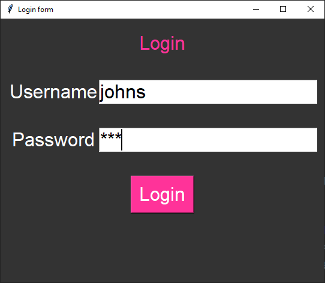

====================================================
Login form
====================================================

| See: https://www.youtube.com/watch?v=MeMCBdnhvQs&list=PLs3IFJPw3G9KL3huzPS7g-0PCbS7Auc7I&index=5

| This code outputs a message box is response to attempts to login.    
| This code creates a simple GUI application using the Tkinter library. 
| It displays a window with Label, Entry and Button widgets

----

Code summary
-------------------

| Enter the correct username and password to see the success message.

Step 1: Import Tkinter
--------------------------------

First, import the `tkinter` module. This provides the necessary functions and classes for creating GUI elements.

.. code-block:: python

    import tkinter as tk
    from tkinter import messagebox

Step 2: Define Constants
--------------------------------

Next, define some constants for the GUI. These include background color, font style, and login credentials.

.. code-block:: python

    BG_COLOR = "#333333"
    FG_COLOR = "#FFFFFF"
    BUTTON_COLOR = "#FF3399"
    FONT_STYLE = ("Arial", 24)
    USERNAME = "johns"
    PASSWORD = "123"

Step 3: Create the Login Function
------------------------------------------

| Create a function called `login()` that checks if the entered username and password match the predefined credentials. 
| If they do, a success message will be displayed; otherwise, an error message will appear.

.. code-block:: python

    def login():
        entered_username = username_entry.get()
        entered_password = password_entry.get()
        if entered_username == USERNAME and entered_password == PASSWORD:
            messagebox.showinfo("Login", "Logged in successfully!")
        else:
            messagebox.showerror("Login Error", "Invalid login")

Step 4: Create the Main Window
------------------------------------

Create the main window for the application. Set its title, size, and background color.

.. code-block:: python

    window = tk.Tk()
    window.title("Login form")
    window.geometry("540x440")
    window.configure(bg=BG_COLOR)

Step 5: Create Widgets
------------------------------

| Inside the main window, create a frame to hold the widgets. 
| Then create labels, entry fields, and a login button.
| ``show="*"``: The show option specifies how the entered characters should be displayed. 
| In this case, it shows an asterisk (*) for each character typed. 
| This is commonly used for password fields to hide the actual characters.

.. code-block:: python

    frame = tk.Frame(bg=BG_COLOR)

    login_label = tk.Label(frame, text="Login", bg=BG_COLOR, fg=BUTTON_COLOR, font=FONT_STYLE)
    username_label = tk.Label(frame, text="Username", bg=BG_COLOR, fg=FG_COLOR, font=FONT_STYLE)
    password_label = tk.Label(frame, text="Password", bg=BG_COLOR, fg=FG_COLOR, font=FONT_STYLE)
    username_entry = tk.Entry(frame, font=FONT_STYLE)
    password_entry = tk.Entry(frame, show="*", font=FONT_STYLE)
    login_button = tk.Button(frame, text="Login", bg=BUTTON_COLOR, fg=FG_COLOR, font=FONT_STYLE, command=login)

Step 6: Arrange Widgets
------------------------------

| Use the `grid()` method to arrange the widgets within the frame.
| ``columnspan=2``: This parameter indicates that the widget should span across 2 columns so it occupies both the first and second columns.
| ``sticky="news"``: The `sticky` parameter determines how the widget should stick to its cell. 
| The value `"news"` means that the widget should expand to fill the entire cell both horizontally and vertically.

| So, the `login_label` widget is positioned in the first row and spans two columns. 
| It expands to fill the available space within its cell. 
| The vertical padding ensures some spacing around the label.

.. code-block:: python

    login_label.grid(row=0, column=0, columnspan=2, sticky="news", pady=20)
    username_label.grid(row=1, column=0)
    password_label.grid(row=2, column=0)
    username_entry.grid(row=1, column=1, pady=20)
    password_entry.grid(row=2, column=1, pady=20)
    login_button.grid(row=3, column=0, columnspan=2, pady=20)

Step 7: Pack the Frame
---------------------------------

| Finally, pack the frame into the main window.
| This causes the frame to stay centered horizontally as the window is resized.

.. code-block:: python

    frame.pack()

    window.mainloop()

----

Full code
------------

.. code-block:: python

    # https://www.youtube.com/watch?v=MeMCBdnhvQs&list=PLs3IFJPw3G9KL3huzPS7g-0PCbS7Auc7I&index=5

    import tkinter as tk
    from tkinter import messagebox

    # Constants
    BG_COLOR = "#333333"
    FG_COLOR = "#FFFFFF"
    BUTTON_COLOR = "#FF3399"
    FONT_STYLE = ("Arial", 24)
    USERNAME = "johns"
    PASSWORD = "123"

    def login():
        entered_username = username_entry.get()
        entered_password = password_entry.get()
        if entered_username == USERNAME and entered_password == PASSWORD:
            messagebox.showinfo("Login", "Logged in successfully!")
        else:
            messagebox.showerror("Login Error", "Invalid login")

    # Create the main window
    window = tk.Tk()
    window.title("Login form")
    window.geometry("540x440")
    window.configure(bg=BG_COLOR)

    #  create frame widget for other widgets
    frame = tk.Frame(bg=BG_COLOR)

    #  create widgets in frame
    login_label = tk.Label(frame, text="Login", bg=BG_COLOR, fg=BUTTON_COLOR, font=FONT_STYLE)
    username_label = tk.Label(frame, text="Username", bg=BG_COLOR, fg=FG_COLOR, font=FONT_STYLE)
    password_label = tk.Label(frame, text="Password", bg=BG_COLOR, fg=FG_COLOR, font=FONT_STYLE)
    username_entry = tk.Entry(frame, font=FONT_STYLE)
    password_entry = tk.Entry(frame, show="*", font=FONT_STYLE)
    login_button = tk.Button(frame, text="Login", bg=BUTTON_COLOR, fg=FG_COLOR, font=FONT_STYLE, command=login)

    # place widgets in frame
    login_label.grid(row=0, column=0, columnspan=2, sticky="news", pady=20)
    username_label.grid(row=1, column=0)
    password_label.grid(row=2, column=0)
    username_entry.grid(row=1, column=1, pady=20)
    password_entry.grid(row=2, column=1, pady=20)
    login_button.grid(row=3, column=0, columnspan=2, pady=20)

    # place frame
    frame.pack()

    window.mainloop()
