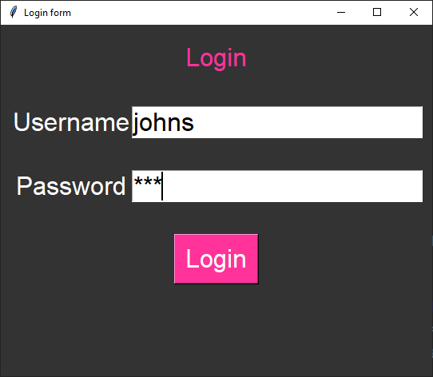

====================================================
Login form task
====================================================

| See: https://www.youtube.com/watch?v=MeMCBdnhvQs&list=PLs3IFJPw3G9KL3huzPS7g-0PCbS7Auc7I&index=5

| This code outputs a message box in response to attempts to login.
| It displays a window with Label, Entry and Button widgets.
| The widgets are placed within a frame using grid.
| The frame is packed so the widgets appear to be responsive to window resizing, staying centrally aligned.

----

Special features
----------------------

| For the password entry widget use the parameter: ``show="*"``.
| The show option specifies how the entered characters should be displayed.
| In this case, it shows an asterisk (*) for each character typed.
| This is commonly used for password fields to hide the actual characters.

| The login widgets are responsive to window resizing, such that they stay vertically centered.
| To achieve this, first place a centered frame and position widgets within that using grid.

.. code-block:: python

    # Constants
    BG_COLOR = "#333333"  # dark grey

    USERNAME = "johns"
    PASSWORD = "123"

    # login to use a messagebox
    def login():
        entered_username = username_entry.get()
        entered_password = password_entry.get()
        if entered_username == USERNAME and entered_password == PASSWORD:
            messagebox.showinfo("Login", "Logged in successfully!")
        else:
            messagebox.showerror("Login Error", "Invalid login")

    # create window

    # create frame widget for other widgets
    frame = tk.Frame(root, bg=BG_COLOR)
    frame.place(relx=0.5, rely=0.5, anchor='center')  # Centering the frame inside the window

    # create other widgets with frame as the parent instead of root.

