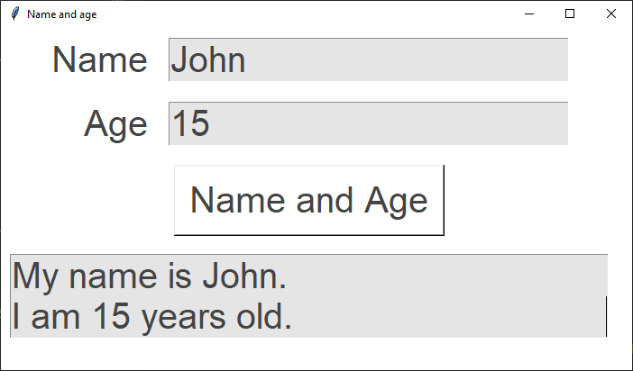
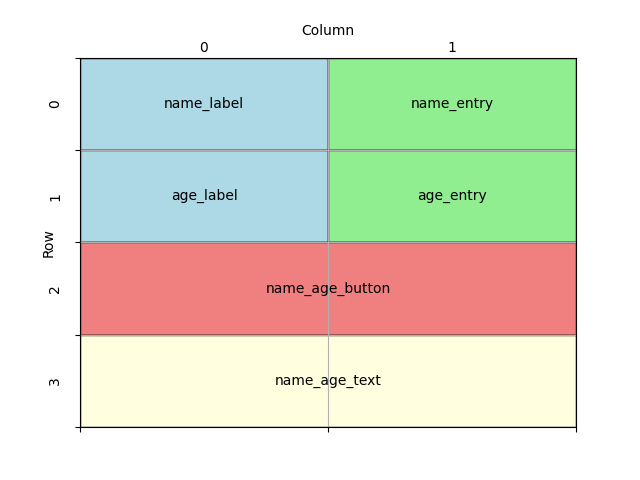

====================================================
Name and age
====================================================

| This code outputs the user name and age in sentence form.
| This code creates a simple GUI application using the Tkinter library.
| It displays a window with Label, Entry, Text and Button widgets

----

Code summary
-------------------

| Overall, this code sets up a simple GUI where users can input their name and age, click a button,
| and see the result displayed in a text widget.

----

Create the main window:
---------------------------------

    - ``window = tk.Tk()`` creates the main application window.
    - ``window.title("Name and age")`` sets the title of the window to "Name and age".
    - ``window.geometry('700x380')`` specifies the initial size of the window (700 pixels wide and 380 pixels tall).
    - ``window.configure(bg="#ffffff")`` sets the background color of the window to white.

    .. code-block:: python

        import tkinter as tk

        window = tk.Tk()
        window.title("Name and age")
        window.geometry("700x380")
        window.configure(bg="#ffffff")

        window.mainloop()

----

Create the widgets
------------------------------

- Define some constants for colors and font style for the GUI.

.. code-block:: python

    BG_COLOR = "#ffffff"
    FG_COLOR = "#444444"
    BG_TEXT_COLOR = "#e5e5e5"
    FONT_STYLE = ("Arial", 30)

Update the window colour using the constant:

.. code-block:: python

    window.configure(bg=BG_COLOR)

- Create several widgets (GUI elements) that will be displayed in the window:
- The Labels ``name_label`` and ``age_label`` display the text "Name" and "Age".
- The Entry fields ``name_entry`` and ``age_entry`` allow users to input their name and age.
- The "Name and Age" button ``name_age_button`` triggers the ``place_name_age`` function.
- A text widget ``name_age_text`` displays the resulting sentences with the name and age.

.. code-block:: python

    name_label = tk.Label(window, text="Name", bg=BG_COLOR, fg=FG_COLOR, font=FONT_STYLE)
    age_label = tk.Label(window, text="Age", bg=BG_COLOR, fg=FG_COLOR, font=FONT_STYLE)
    name_entry = tk.Entry(window, bg=BG_TEXT_COLOR, fg=FG_COLOR, font=FONT_STYLE)
    age_entry = tk.Entry(window, bg=BG_TEXT_COLOR, fg=FG_COLOR, font=FONT_STYLE)
    name_age_button = tk.Button(window, text="Name and Age", bg=BG_COLOR, fg=FG_COLOR,
                                font=FONT_STYLE, command=place_name_age)
    name_age_text = tk.Text(window, height=2, width=30, bg=BG_TEXT_COLOR, fg=FG_COLOR, font=FONT_STYLE)

Grid Placement of widgets on the window:
---------------------------------------------------

Design the grid positions:

- Use the `grid` method to place the widgets in rows and columns in the window.
- The `row` and `column` parameters determine the position of each widget.
- The labels and entry fields are placed in rows 0 and 1.
- The button and text widget are placed in row 2 and 3.
- The sticky='e' option specifies that the widget should stick to the east (right) side of its grid cell.
- This means that if the cell is larger than the widget, the widget will be right-aligned within the cell.

.. code-block:: python

    name_label.grid(row=0, column=0, sticky="e", padx=10, pady=10)
    name_entry.grid(row=0, column=1, sticky="w", padx=10, pady=10)
    age_label.grid(row=1, column=0, sticky="e", padx=10, pady=10)
    age_entry.grid(row=1, column=1, sticky="w", padx=10, pady=10)
    name_age_button.grid(row=2, column=0, columnspan=2, padx=10, pady=10)
    name_age_text.grid(row=3, column=0, columnspan=2, padx=10, pady=10)

----

Define the place_name_age function:
-------------------------------------------------

- This function is called when the "Name and Age" button is clicked.
- It retrieves the values entered in the name and age entry fields.
- ``name = name_entry.get()`` uses the ``get()`` method to get the text value of the Entry widget.
- If no name is entered, it defaults to "John". If no age is entered, it defaults to "16".
- It clears the existing text in the ``name_age_text`` widget.
- The delete method of a Text widget requires the line.column as the first argument.
- e.g. line 1, character 0 using ``1.0`` in ``name_age_text.delete(1.0, 'end')``.
- ``tk.END`` or ``'end'`` can be used as the second argument to cause the deletion to go to the end of the widget.
- It inserts a formatted string (f-string) into the ``name_age_text`` widget, displaying the name and age.
- The insert method of a Text widget requires the line.column as the first argument.
- e.g. ``1.0`` in ``name_age_text.insert(1.0, 'new text')``.
- ``f'My name is {name}. \nI am {age} years old.'`` uses ``\n`` for a line break so the 2 sentences are on two lines.

.. code-block:: python

    def place_name_age():
        name = name_entry.get()
        # use a default name if no name is given
        if name == "":
            name = "John Smith"
        # get age
        age = age_entry.get()
        # use a default age if no age is given
            if age == "":
            age = "16"
        name_age_text.delete(1.0, "end")
        name_age_text.insert(1.0, f"My name is {name}. \nI am {age} years old.")

----

Full code
------------

.. code-block:: python

    import tkinter as tk

    # Constants
    BG_COLOR = "#FFFFFF"
    FG_COLOR = "#444444"
    BG_TEXT_COLOR = "#e5e5e5"
    FONT_STYLE = ("Arial", 30)

    def place_name_age():
        """
        Retrieves the name and age from the respective entry widgets and displays them
        in a formatted message within the text widget. If no name or age is provided,
        default values are used.

        The function performs the following steps:
        1. Retrieves the name from the name_entry widget. If empty, defaults to "John Smith".
        2. Retrieves the age from the age_entry widget. If empty, defaults to "16".
        3. Clears the content of the name_age_text widget.
        4. Inserts a formatted message into the name_age_text widget, displaying the name and age.

        Example output:
        "My name is John Smith.
        I am 16 years old."
        """
        # get name
        name = name_entry.get()
        # use a default name if no name is given
        if name == "":
            name = "John Smith"
        # get age
        age = age_entry.get()
        # use a default age if no age is given
        if age == "":
            age = "16"
        # clear name_age_text 1.0 represents line.column or line 1 character 0, tk.END or 'end' can be used.
        name_age_text.delete(1.0, "end")
        # insert name age using f string, \n is a line break;
        name_age_text.insert(1.0, f"My name is {name}. \nI am {age} years old.")

    # Create the main window
    window = tk.Tk()
    window.title("Name and age")
    window.geometry("700x380")
    window.configure(bg=BG_COLOR)

    #  create widgets
    name_label = tk.Label(window, text="Name", bg=BG_COLOR, fg=FG_COLOR, font=FONT_STYLE)
    age_label = tk.Label(window, text="Age", bg=BG_COLOR, fg=FG_COLOR, font=FONT_STYLE)
    name_entry = tk.Entry(window, bg=BG_TEXT_COLOR, fg=FG_COLOR, font=FONT_STYLE)
    age_entry = tk.Entry(window, bg=BG_TEXT_COLOR, fg=FG_COLOR, font=FONT_STYLE)
    name_age_button = tk.Button(window, text="Name and Age", bg=BG_COLOR,
                                fg=FG_COLOR, font=FONT_STYLE, command=place_name_age)
    # Text widget height=2 where height is in text rows.
    name_age_text = tk.Text(window, height=2, width=30, bg=BG_TEXT_COLOR, fg=FG_COLOR, font=FONT_STYLE)

    # place widgets on window
    name_label.grid(row=0, column=0, sticky="e", padx=10, pady=10)
    name_entry.grid(row=0, column=1, sticky="w", padx=10, pady=10)
    age_label.grid(row=1, column=0, sticky="e", padx=10, pady=10)
    age_entry.grid(row=1, column=1, sticky="w", padx=10, pady=10)
    name_age_button.grid(row=2, column=0, columnspan=2, padx=10, pady=10)
    name_age_text.grid(row=3, column=0, columnspan=2, padx=10, pady=10)

    # Start the main event loop
    window.mainloop()

----

Test Table
------------------------------------

| What user inputs should be tested?
| What user inputs would be regarded as invalid, yet still result in text being displayed?
| Where in the code would it be best to make changes in order to indicate to the user that that have not made a valid entry.

