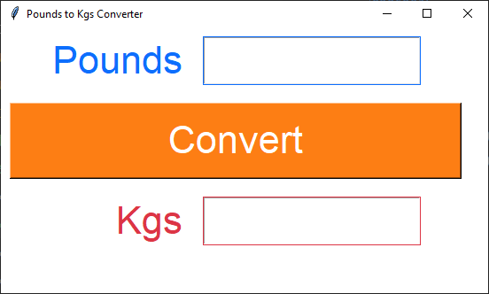
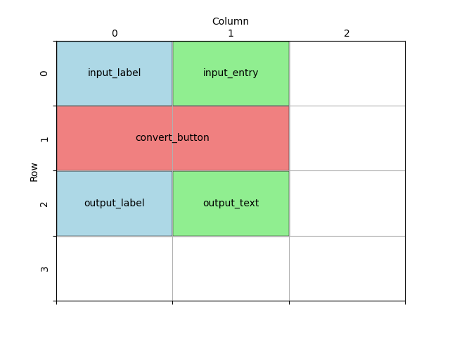

====================================================
Pounds to kgs
====================================================

| This code converts pounds to kgs.
| This code creates a simple GUI application using the Tkinter library.
| It displays a window with Label, Entry, Text and Button widgets
| Users can input pounds, click the "Convert" button, and see the corresponding kilograms displayed.

----

Create the Main Window
----------------------------------------

Create the main application window using `tk.Tk()`. Set the window title, size, and background color:

.. code-block:: python

    import tkinter as tk

    # Create the main window
    root = tk.Tk()
    root.title("Pounds to Kgs Converter")
    root.geometry("550x300")
    root.configure(bg="#ffffff")

    root.mainloop()

----

Define Formatting Constants
------------------------------------

| Next, define some constants for colors, and font style.
| You can customize these values as needed:

.. code-block:: python

    # Constants
    WINDOW_BG_COLOR = "#ffffff"
    INPUT_BG_COLOR = "#ffffff"
    INPUT_FG_COLOR = "#0d6efd"
    BUTTON_BG_COLOR = "#fd7e14"
    BUTTON_FG_COLOR = "#ffffff"
    OUTPUT_BG_COLOR = "#ffffff"
    OUTPUT_FG_COLOR = "#dc3545"
    FONT_STYLE = ("Arial", 32)

Update the window colour:

.. code-block:: python

    root.configure(bg=WINDOW_BG_COLOR)

----

Create Widgets
--------------------------------

| Now create the widgets (GUI elements) that will be displayed in the window:
| **highlightcolor**, **highlightbackground** and **highlightthickness** are used to colour the entry and text widget borders the same colour as their text colour.
| **highlightbackground** is applied when not clicking in the widget.
| **highlightcolor** is applied when clicking in the widget.

.. code-block:: python

    # Create widgets
    input_label = tk.Label(root, text="Pounds", bg=INPUT_BG_COLOR, fg=INPUT_FG_COLOR, font=FONT_STYLE)
    input_entry = tk.Entry(root, width=10, bg=INPUT_BG_COLOR, fg=INPUT_FG_COLOR, highlightcolor=INPUT_FG_COLOR,
                            highlightbackground=INPUT_FG_COLOR, highlightthickness=1, font=FONT_STYLE)
    output_label = tk.Label(root, text="Kgs", bg=OUTPUT_BG_COLOR, fg=OUTPUT_FG_COLOR, font=FONT_STYLE)
    output_text = tk.Text(root, height=1, width=10, fg=OUTPUT_FG_COLOR, highlightcolor=OUTPUT_FG_COLOR,
                            highlightbackground=OUTPUT_FG_COLOR, highlightthickness=1, font=FONT_STYLE)
    convert_button = tk.Button(root, text="Convert", width=20, bg=BUTTON_BG_COLOR,
                            fg=BUTTON_FG_COLOR, font=FONT_STYLE)

----

Place Widgets in the Window
-------------------------------------------------

Design the grid positions:

Position the widgets using the `grid()` method:

.. code-block:: python

    # Place widgets in the window
    input_label.grid(row=0, column=0, sticky="e", padx=10, pady=10)
    input_entry.grid(row=0, column=1, sticky="w", padx=10, pady=10)
    output_label.grid(row=2, column=0, sticky="e", padx=10, pady=10)
    output_text.grid(row=2, column=1, sticky="w", padx=10, pady=10)
    convert_button.grid(row=1, column=0, columnspan=2, padx=10, pady=10)

----

Define the Conversion Function
----------------------------------------------

| Create a function called `convert_pounds_to_kgs()` that performs the conversion and updates the result in the `output_text` widget.
| ``convert_pounds_to_kgs()`` uses a try and except block to catch errors due to non numeric entries.
| See: https://www.w3schools.com/python/python_try_except.asp
| The delete method of a Text widget requires the line.column as the first argument. e.g. ``1.0`` in ``c_text.delete(1.0, 'end')``
| ``tk.END`` or ``'end'`` can be used as the second argument to cause the deletion to go to the end of the widget.
| The insert method of a Text widget requires the line.column as the first argument. e.g. ``1.0`` in ``output_text.insert(1.0, f'{kilograms:.2f}')``
| ``output_text.insert(1.0, f'{kilograms:.2f}')`` uses ``:.2f`` to format the celsius float to 2 decimal places.
| For string formatting see: https://www.w3schools.com/python/ref_string_format.asp

.. code-block:: python

    def convert_pounds_to_kgs():
        try:
            pounds = float(input_entry.get())
            kilograms = pounds * 0.45359237
            output_text.delete(1.0, "end")  # Clear any previous result
            output_text.insert(1.0, f"{kilograms:.2f}")
        except ValueError:
            output_text.delete(1.0, "end")
            output_text.insert(1.0, "Invalid input.")

----

Connect the Button to the Function
---------------------------------------------

.. code-block:: python

    convert_button = tk.Button(root, text="Convert", width=20, bg=BUTTON_BG_COLOR,
                            fg=BUTTON_FG_COLOR, font=FONT_STYLE, command=convert)

----

Full code
------------

.. code-block:: python

    import tkinter as tk

    # Constants
    WINDOW_BG_COLOR = "#ffffff"
    INPUT_BG_COLOR = "#ffffff"
    INPUT_FG_COLOR = "#0d6efd"
    BUTTON_BG_COLOR = "#fd7e14"
    BUTTON_FG_COLOR = "#ffffff"
    OUTPUT_BG_COLOR = "#ffffff"
    OUTPUT_FG_COLOR = "#dc3545"
    FONT_STYLE = ("Arial", 32)

    def convert():
        """
        Converts Pounds to Kgs and displays the result in the GUI.

        Reads the Pounds value from the input field, performs the conversion,
        and updates the result in the output text widget.

        Raises:
            ValueError: If the input is not a valid float.
        """
        try:
            pounds = float(input_entry.get())
            kilograms = pounds * 0.45359237
            output_text.delete(1.0, "end")  # Clear any previous result
            output_text.insert(1.0, f"{kilograms:.2f}")
        except ValueError:
            output_text.delete(1.0, "end")
            output_text.insert(1.0, "Invalid input.")

    # Create the main window
    root = tk.Tk()
    root.title("Pounds to Kgs Converter")
    root.geometry("550x300")
    root.configure(bg=WINDOW_BG_COLOR)

    # Create widgets
    input_label = tk.Label(root, text="Pounds", bg=INPUT_BG_COLOR, fg=INPUT_FG_COLOR, font=FONT_STYLE)
    input_entry = tk.Entry(root, width=10, bg=INPUT_BG_COLOR, fg=INPUT_FG_COLOR,
    highlightcolor=INPUT_FG_COLOR, highlightbackground=INPUT_FG_COLOR, highlightthickness=1, font=FONT_STYLE)
    output_label = tk.Label(root, text="Kgs", bg=OUTPUT_BG_COLOR, fg=OUTPUT_FG_COLOR, font=FONT_STYLE)
    output_text = tk.Text(root, height=1, width=10, fg=OUTPUT_FG_COLOR, highlightcolor=OUTPUT_FG_COLOR, highlightbackground=OUTPUT_FG_COLOR, highlightthickness=1, font=FONT_STYLE)
    convert_button = tk.Button(root, text="Convert", width=20, bg=BUTTON_BG_COLOR,
                            fg=BUTTON_FG_COLOR, font=FONT_STYLE, command=convert)

    # Place widgets on window
    input_label.grid(row=0, column=0, sticky="e", padx=10, pady=10)
    input_entry.grid(row=0, column=1, sticky="w", padx=10, pady=10)
    output_label.grid(row=2, column=0, sticky="e", padx=10, pady=10)
    output_text.grid(row=2, column=1, sticky="w", padx=10, pady=10)
    convert_button.grid(row=1, column=0, columnspan=2, padx=10, pady=10)

    # Start the main event loop
    root.mainloop()

----

Lbs-to-Kg Test Table
---------------------------------------

.. list-table:: Test Cases for Lbs-to-Kg Converter
   :header-rows: 1
   :widths: 20 25

   * - **Weight (lbs)**
     - **Expected Output (kg)**
   * - 0
     - 0
   * - 1
     - 0.4536
   * - 2.2
     - 1.00
   * - "one"
     - Invalid input
