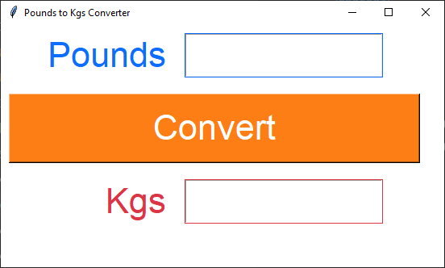

====================================================
Pounds to kgs task
====================================================

| Write code that converts pounds to kgs.
| Users can input pounds, click the "Convert" button, and see the corresponding kilograms displayed.

Hint:
--------

| Use **highlightcolor**, **highlightbackground** and **highlightthickness** are used to colour the entry and text widget borders the same colour as their text colour.
| **highlightbackground** is applied when not clicking in the widget.
| **highlightcolor** is applied when clicking in the widget.

