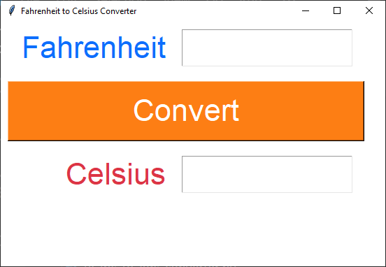
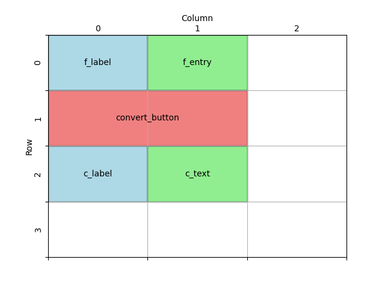

====================================================
Fahrenheit to Celsius
====================================================

| This code converts Fahrenheit to Celsius temperatures.
| This code creates a simple GUI application using the Tkinter library.
| It displays a window with Label, Entry, Text and Button widgets

This tutorial will guide you through developing a Fahrenheit to Celsius converter using Tkinter in Python. We'll start with a basic setup and gradually add components to build the final application.

----

Basic window setup
-------------------

Start with the basic setup of the Tkinter window and start the main event loop.

.. code-block:: python

    import tkinter as tk

    # Create the main window
    root = tk.Tk()
    root.title("Fahrenheit to Celsius Converter")
    root.geometry("550x350")
    root.configure(bg="#ffffff")

    # Start the main event loop
    root.mainloop()

----

Create Widgets
----------------------

Add the widgets for the input and output fields, and the convert button.

.. code-block:: python

    # Create widgets
    f_label = tk.Label(root, text="Fahrenheit")
    f_entry = tk.Entry(root, width=10)
    c_label = tk.Label(root, text="Celsius")
    c_text = tk.Text(root, height=1, width=10)
    convert_button = tk.Button(root, text="Convert", width=20)

----

Position the Widgets
-----------------------

Design the grid positions:

Now, place the widgets on the window using the grid layout.

.. code-block:: python

    # Place widgets on window
    f_label.grid(row=0, column=0, sticky="e", padx=10, pady=10)
    f_entry.grid(row=0, column=1, sticky="w", padx=10, pady=10)
    c_label.grid(row=2, column=0, sticky="e", padx=10, pady=10)
    c_text.grid(row=2, column=1, sticky="w", padx=10, pady=10)
    convert_button.grid(row=1, column=0, columnspan=2, padx=10, pady=10)

----

Add Widget formatting
------------------------------------

Next, add formatting to the widgets, storing colours and font settings in constants for reuse.

.. code-block:: python

    # Constants
    WINDOW_BG_COLOR = "#ffffff"
    INPUT_BG_COLOR = "#ffffff"
    INPUT_FG_COLOR = "#0d6efd"
    BUTTON_BG_COLOR = "#fd7e14"
    BUTTON_FG_COLOR = "#ffffff"
    OUTPUT_BG_COLOR = "#ffffff"
    OUTPUT_FG_COLOR = "#dc3545"
    FONT_STYLE = ("Arial", 32)

    # Create widgets
    f_label = tk.Label(root, text="Fahrenheit", bg=INPUT_BG_COLOR, fg=INPUT_FG_COLOR, font=FONT_STYLE)
    f_entry = tk.Entry(root, width=10, bg=INPUT_BG_COLOR, fg=INPUT_FG_COLOR, font=FONT_STYLE)
    c_label = tk.Label(root, text="Celsius", bg=OUTPUT_BG_COLOR, fg=OUTPUT_FG_COLOR, font=FONT_STYLE)
    c_text = tk.Text(root, height=1, width=10, bg=OUTPUT_BG_COLOR, fg=OUTPUT_FG_COLOR, font=FONT_STYLE)
    convert_button = tk.Button(root, text="Convert", width=20, bg=BUTTON_BG_COLOR,
                                fg=BUTTON_FG_COLOR, font=FONT_STYLE)

Update the window colour:

.. code-block:: python

    root.configure(bg=WINDOW_BG_COLOR)

----

Define the Conversion Function
--------------------------------------

Next, we'll add the function to convert Fahrenheit to Celsius.

.. code-block:: python

    def convert_f_to_c():
        """
        Converts Fahrenheit to Celsius and displays the result in the GUI.

        Reads the Fahrenheit value from the input field, performs the conversion,
        and updates the result in the output text widget.

        Raises:
            ValueError: If the input is not a valid float.
        """
        try:
            fahrenheit = float(f_entry.get())
            celsius = (fahrenheit - 32) / 1.8
            c_text.delete(1.0, "end")  # Clear any previous result
            c_text.insert(1.0, f"{celsius:.1f}")
        except ValueError:
            c_text.delete(1.0, "end")
            c_text.insert(1.0, "Invalid input.")

| ``convert_f_to_c()`` uses a try and except block to catch errors due to non numeric entries.
| See: `<https://www.w3schools.com/python/python_try_except.asp>`_
| The delete method of a Text widget requires the line.column as the first argument. e.g. ``1.0`` in ``c_text.delete(1.0, 'end')``
| ``tk.END`` or ``'end'`` can be used as the second argument to cause the deletion to go to the end of the widget.
| The insert method of a Text widget requires the line.column as the first argument. e.g. ``1.0`` in ``c_text.insert(1.0, f'{celsius:.1f}')``
| ``c_text.insert(1.0, f'{celsius:.1f}')`` uses ``:.1f`` to format the celsius float with 1 decimal place.
| For string formatting see: `<https://www.w3schools.com/python/ref_string_format.asp>`_

----

Connect the Button to the Function
-----------------------------------------------

Finally, we'll connect the convert button to the `convert_f_to_c` function.

.. code-block:: python

    convert_button = tk.Button(root, text="Convert", width=20, bg=BUTTON_BG_COLOR,
                                fg=BUTTON_FG_COLOR, font=FONT_STYLE, command=convert_f_to_c)

----

Full Code
----------------

.. code-block:: python

    import tkinter as tk

    # Constants
    WINDOW_BG_COLOR = "#ffffff"
    INPUT_BG_COLOR = "#ffffff"
    INPUT_FG_COLOR = "#0d6efd"
    BUTTON_BG_COLOR = "#fd7e14"
    BUTTON_FG_COLOR = "#ffffff"
    OUTPUT_BG_COLOR = "#ffffff"
    OUTPUT_FG_COLOR = "#dc3545"
    FONT_STYLE = ("Arial", 32)

    def convert_f_to_c():
        """
        Converts Fahrenheit to Celsius and displays the result in the GUI.

        Reads the Fahrenheit value from the input field, performs the conversion,
        and updates the result in the output text widget.

        Raises:
            ValueError: If the input is not a valid float.
        """
        try:
            fahrenheit = float(f_entry.get())
            celsius = (fahrenheit - 32) / 1.8
            c_text.delete(1.0, "end")  # Clear any previous result
            c_text.insert(1.0, f"{celsius:.1f}")
        except ValueError:
            c_text.delete(1.0, "end")
            c_text.insert(1.0, "Invalid input.")

    # Create the main window
    root = tk.Tk()
    root.title("Fahrenheit to Celsius Converter")
    root.geometry("550x350")
    root.configure(bg=WINDOW_BG_COLOR)

    # Create widgets
    f_label = tk.Label(root, text="Fahrenheit", bg=INPUT_BG_COLOR, fg=INPUT_FG_COLOR, font=FONT_STYLE)
    f_entry = tk.Entry(root, width=10, bg=INPUT_BG_COLOR, fg=INPUT_FG_COLOR, font=FONT_STYLE)
    c_label = tk.Label(root, text="Celsius", bg=OUTPUT_BG_COLOR, fg=OUTPUT_FG_COLOR, font=FONT_STYLE)
    c_text = tk.Text(root, height=1, width=10, bg=OUTPUT_BG_COLOR, fg=OUTPUT_FG_COLOR, font=FONT_STYLE)
    convert_button = tk.Button(root, text="Convert", width=20, bg=BUTTON_BG_COLOR,
                                fg=BUTTON_FG_COLOR, font=FONT_STYLE, command=convert_f_to_c)

    # Place widgets on window
    f_label.grid(row=0, column=0, sticky="e", padx=10, pady=10)
    f_entry.grid(row=0, column=1, sticky="w", padx=10, pady=10)
    c_label.grid(row=2, column=0, sticky="e", padx=10, pady=10)
    c_text.grid(row=2, column=1, sticky="w", padx=10, pady=10)
    convert_button.grid(row=1, column=0, columnspan=2, padx=10, pady=10)

    # Start the main event loop
    root.mainloop()

----

Fahrenheit to Celsius Test Table
---------------------------------------

.. list-table:: Test Cases for Fahrenheit-to-Celsius Converter
   :header-rows: 1
   :widths: 20 25

   * - **Fahrenheit (°F)**
     - **Expected Output (°C)**
   * - 32
     - 0
   * - 212
     - 100
   * - 0
     - -17.78
   * - -459.67 (absolute zero)
     - -273.15
   * - one
     - Invalid input

| The code rounds to 1 decimal place so its accuracy is limited by that.
| The text fields have limited width so can't handle numbers with more that 9 digits.

