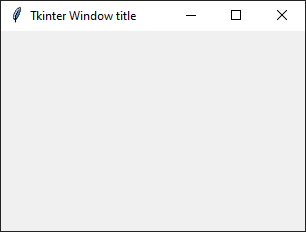
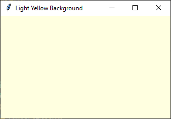
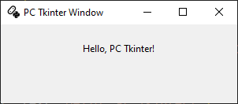

====================================================
tk window
====================================================

| See: `<https://tkdocs.com/tutorial/windows.html>`_
| See: `<https://tcl.tk/man/tcl8.6/TkCmd/wm.htm>`_
| See: `<https://www.pythontutorial.net/tkinter/tkinter-window/>`_

----

Simple window
-----------------

| By convention, the main window in tKinter is referred to a root.

.. py:function:: tkinter.Tk()

    | Create the main application root.
    | Common usage is **root = tk.Tk()**.

.. py:function:: root.mainloop()

    | Runs an infinite loop that continuously processes events (such as button clicks, keypresses, and mouse movements) and updates the GUI accordingly.
    | While the main loop is active, any code after the mainloop() call will not execute until the window is closed.
    | Essentially, it keeps the GUI alive and responsive.

| Below is the code to create a simple empty root.

.. code-block:: python

    import tkinter as tk

    # Create the main application window
    root = tk.Tk()

    # Start the main event loop
    root.mainloop()

----

Window title
-----------------

.. py:function:: root.title('window_title')

    | The method root.title() sets the title of the root.
    | The argument 'window_title' specifies the text that will appear in the title bar of the root.

.. code-block:: python

    import tkinter as tk

    # Create the main application window
    root = tk.Tk()
    # set the window title
    root.title('Tkinter Window title')

    # Start the main event loop
    root.mainloop()

----

Window size
-----------------------------

.. py:function:: root.geometry(widthxheight)

    | set the size of a tkinter window
    | width: The desired width of the window in pixels.
    | height: The desired height of the window in pixels.

| The code below sets the window size.

.. code-block:: python

    import tkinter as tk

    # Create the main window
    root = tk.Tk()
    root.title('Tkinter Window - size')
    root.geometry("600x400")

    # Start the main event loop
    root.mainloop()

----

Background color
--------------------

| Online color picker see: `<https://www.w3schools.com/colors/colors_picker.asp>`_
| See: `<https://pickcoloronline.com/>`_
| See: `<https://htmlcolorcodes.com/color-chart/>`_
| See: `<https://www.w3schools.com/colors/colors_names.asp>`_

.. py:function:: root.configure(bg=color)

    | Sets the background color of the root.
    | `color` is a color name (e.g. "white"), hexadecimal value (e.g. "#FFFFFF").

| The code below sets the window background color to a light yellow color.

.. code-block:: python

    import tkinter as tk

    # Create the main application window
    root = tk.Tk()
    root.title("Light Yellow Background")
    # Set the background color to light yellow
    root.configure(bg="light yellow")

    # Start the main event loop
    root.mainloop()

----

| This will usually be all that is needed in setting up a tkinter root.
| Various more advanced features are given below for reference purposes.

----

Window size and position
-----------------------------

.. py:function:: root.geometry(widthxheight±x±y)

    | set the size and top left of a window
    | width: The desired width of the window in pixels.
    | height: The desired height of the window in pixels.
    | x: The horizontal position (+ for distance from the left edge of the screen; - from right) in pixels.
    | y: The vertical position (+ for distance from the top edge of the screen; - from bottom) in pixels.

.. py:function:: root.attributes('-topmost', True)

    | Use the root.attributes('-topmost', True) to make the window always stay on top.

.. py:function:: root.resizable(width_boolean,height_boolean)

    | Determines whether the window can be resized by the user.
    | To create a fixed-size window, disable resizing by calling `root.resizable(False, False)`
    | The default, `root.resizable(True, True)`, makes the window both horizontally and vertically resizable.

| The code below sets the window size and position, sets the window to stay on top of others and prevents resizing.

.. code-block:: python

    import tkinter as tk

    root = tk.Tk()
    root.title('Tkinter Window - size and position')
    window_width = 400
    window_height = 300
    left_x = 200
    top_y = 50
    # set the size and position of the window
    root.geometry(f'{window_width}x{window_height}+{left_x}+{top_y}')
    # set window to stay topmost
    root.attributes('-topmost', True)
    # set window size to be static or un resizable
    root.resizable(False, False)

    root.mainloop()

----

Window centered
-----------------------

.. py:function:: root.winfo_screenwidth()

    | returns the width of the screen (or monitor) where the specified widget (usually a Tkinter window) is located.

.. py:function:: root.winfo_screenheight()

    | returns the height of the screen (or monitor) where the specified widget (usually a Tkinter window) is located.

.. code-block:: python

    import tkinter as tk

    root = tk.Tk()
    root.title('Tkinter Window - Centered')

    window_width = 600
    window_height = 400

    # get the screen dimension
    screen_width = root.winfo_screenwidth()
    screen_height = root.winfo_screenheight()

    # find the center point
    center_x = int(screen_width/2 - window_width/2)
    center_y = int(screen_height/2 - window_height/2)

    # set the position of the window to the center of the screen, using top left position
    root.geometry(f'{window_width}x{window_height}+{center_x}+{center_y}')

    root.mainloop()

----

Window width and height
--------------------------

.. py:function:: root.winfo_width()

    | returns the width of the Tkinter root.

.. py:function:: root.winfo_height()

    | returns the height of the Tkinter root.

.. py:function:: update_idletasks()

    | The `update_idletasks()` method is used to process pending idle tasks in a Tkinter window without handling other events.
    | `update_idletasks()` focuses solely on idle tasks which typically involve geometry management and widget redrawing.
    | It's particularly useful when you want to refresh the window's appearance without triggering additional event processing.

| The code below has definitions to set the width or height of the root.

.. code-block:: python

    import tkinter as tk

    def window_set_height(root, height):
        # Wait for the window to be fully initialized
        root.update_idletasks()
        root.geometry(f"{root.winfo_width()}x{height}")

    def window_set_width(root, width):
        # Wait for the window to be fully initialized
        root.update_idletasks()
        root.geometry(f"{width}x{root.winfo_height()}")

    root = tk.Tk()
    root.title("Tkinter Window - set width or height")

    # set the top left position to 250,50
    root.geometry(f"+{250}+{50}")
    window_set_width(root, 1000)
    window_set_height(root, 250)

    root.mainloop()

----

Min Max window size
--------------------------

.. py:function:: root.minsize(width, height)

    | Set the minimum size `(width, height)`.

.. py:function:: root.maxsize()

    | Set the maximum size `(width, height)`.

| The code below sets the minimum and maximum size of the root.

.. code-block:: python

    import tkinter as tk

    # Create the main application window
    root = tk.Tk()
    root.title("Resizable Window - Min Max Example")

    # Set the minimum size (width, height)
    root.minsize(200, 100)
    # Set the maximum size (width, height)
    root.maxsize(500, 500)

    # Start the main event loop
    root.mainloop()

----

Window options
-------------------

Here are the descriptions for each option in Tkinter's window options.

.. py:attribute:: attributes

    | Syntax: ``root.attributes("-attribute", value)``
    | Description: Configures advanced window attributes, such as making the window always on top, transparent, or fullscreen.
    | Example:
    | ``root.attributes("-topmost", True)``  (Keeps window on top)
    | ``root.attributes("-fullscreen", True)``  (Enables fullscreen mode)
    | ``root.attributes("-alpha", 0.8)``  (Sets window transparency)

.. py:attribute:: bg

    | Syntax: ``root.configure(bg="color")``
    | Description: Sets the background color of the root.
    | Default: SystemButtonFace RGB: (240, 240, 240)
    | Example: ``root.configure(bg="light yellow")``

.. py:attribute:: bd

    | Syntax: ``root.configure(bd=value)``
    | Description: Sets the border width around the root.
    | Default: 2
    | Example: ``root.configure(bd=5)``

.. py:attribute:: colormap

    | Syntax: ``root.configure(colormap="new_colormap")``
    | Description: Specifies a different colormap for the window, useful for advanced color manipulation.
    | Default: None
    | Example: ``root.configure(colormap="new_map")``

.. py:attribute:: container

    | Syntax: ``root.configure(container=boolean)``
    | Description: Specifies whether the window is a container. Containers can be used to embed other applications.
    | Default: False
    | Example: ``root.configure(container=True)``

.. py:attribute:: cursor

    | Syntax: ``root.configure(cursor="cursor_type")``
    | Description: Changes the appearance of the mouse cursor when it is over the root.
    | Default: None
    | Example: ``root.configure(cursor="arrow")``

    **Available Cursors:**

    - ``"arrow"`` - Standard arrow cursor.
    - ``"circle"`` - Small circle cursor.
    - ``"clock"`` - Clock or watch icon.
    - ``"cross"`` - Crosshair cursor.
    - ``"dotbox"`` - Small dot inside a box.
    - ``"exchange"`` - Cursor with arrows pointing in four directions.
    - ``"fleur"`` - Four-directional arrows, typically for moving objects.
    - ``"heart"`` - Heart-shaped cursor.
    - ``"man"`` - Small icon representing a person.
    - ``"mouse"`` - Icon resembling a computer mouse.
    - ``"pirate"`` - Skull and crossbones.
    - ``"plus"`` - Plus sign.
    - ``"shuttle"`` - Small shuttle icon (rarely used).
    - ``"sizing"`` - Double arrow for resizing.
    - ``"spider"`` - Small spider icon.
    - ``"spraycan"`` - Spray can icon.
    - ``"star"`` - Star-shaped cursor.
    - ``"target"`` - Target symbol.
    - ``"tcross"`` - Thin crosshair cursor.
    - ``"trek"`` - Star Trek "badge" symbol.
    - ``"watch"`` - Watch or waiting icon.

    **Standard OS Cursors:**

    - ``"X_cursor"`` - Standard "X" cursor.
    - ``"arrow"`` - Standard arrow cursor.
    - ``"based_arrow_down"`` - Downward arrow.
    - ``"based_arrow_up"`` - Upward arrow.
    - ``"boat"`` - Boat icon.
    - ``"bogosity"`` - Square with an "X" (often used as an error indicator).
    - ``"bottom_left_corner"`` - Corner-resizing cursor for bottom-left.
    - ``"bottom_right_corner"`` - Corner-resizing cursor for bottom-right.
    - ``"bottom_side"`` - Vertical resize for bottom edge.
    - ``"bottom_tee"`` - Tee (T) pointing down.
    - ``"box_spiral"`` - Spiral in a box.
    - ``"center_ptr"`` - Cursor at the center pointer.
    - ``"circle"`` - Circle cursor.
    - ``"clock"`` - Clock or watch icon.
    - ``"coffee_mug"`` - Coffee mug icon.
    - ``"cross"`` - Crosshair cursor.
    - ``"cross_reverse"`` - Reversed crosshair.
    - ``"crosshair"`` - Thin crosshair.
    - ``"diamond_cross"`` - Diamond with a cross inside.
    - ``"dot"`` - Small dot cursor.
    - ``"dotbox"`` - Dot inside a box.
    - ``"double_arrow"`` - Double-ended arrow.
    - ``"draft_large"`` - Drafting icon (large).
    - ``"draft_small"`` - Drafting icon (small).
    - ``"draped_box"`` - Draped box.
    - ``"exchange"`` - Cursor with arrows in four directions.
    - ``"fleur"`` - Four-directional arrow, usually for moving items.
    - ``"gobbler"`` - Gobbler icon.
    - ``"gumby"`` - Gumby icon.
    - ``"hand1"`` - Left-pointing hand.
    - ``"hand2"`` - Right-pointing hand.
    - ``"heart"`` - Heart icon.
    - ``"icon"`` - Standard icon.
    - ``"iron_cross"`` - Cross icon, similar to "crosshair".
    - ``"left_ptr"`` - Standard left pointer.
    - ``"left_side"`` - Resize cursor for left edge.
    - ``"left_tee"`` - Tee (T) pointing left.
    - ``"leftbutton"`` - Icon representing the left mouse button.
    - ``"ll_angle"`` - Lower-left angle.
    - ``"lr_angle"`` - Lower-right angle.
    - ``"man"`` - Icon of a person.
    - ``"middlebutton"`` - Icon representing the middle mouse button.
    - ``"mouse"`` - Icon resembling a computer mouse.
    - ``"pencil"`` - Pencil icon.
    - ``"pirate"`` - Skull and crossbones icon.
    - ``"plus"`` - Plus sign.
    - ``"question_arrow"`` - Arrow with a question mark.
    - ``"right_ptr"`` - Right pointer.
    - ``"right_side"`` - Resize cursor for right edge.
    - ``"right_tee"`` - Tee (T) pointing right.
    - ``"rightbutton"`` - Icon representing the right mouse button.
    - ``"rtl_logo"`` - RTL (radio telegraph logo).
    - ``"sailboat"`` - Sailboat icon.
    - ``"sb_down_arrow"`` - Scroll bar down arrow.
    - ``"sb_h_double_arrow"`` - Horizontal resize for scroll bar.
    - ``"sb_left_arrow"`` - Scroll bar left arrow.
    - ``"sb_right_arrow"`` - Scroll bar right arrow.
    - ``"sb_up_arrow"`` - Scroll bar up arrow.
    - ``"sb_v_double_arrow"`` - Vertical resize for scroll bar.
    - ``"shuttle"`` - Shuttle icon.
    - ``"sizing"`` - Resize cursor for resizing windows.
    - ``"spider"`` - Spider icon.
    - ``"spraycan"`` - Spray can icon.
    - ``"star"`` - Star icon.
    - ``"target"`` - Target icon.
    - ``"tcross"`` - Thin cross cursor.
    - ``"top_left_arrow"`` - Arrow pointing to the top-left.
    - ``"top_left_corner"`` - Resize cursor for top-left corner.
    - ``"top_right_corner"`` - Resize cursor for top-right corner.
    - ``"top_side"`` - Resize cursor for top edge.
    - ``"top_tee"`` - Tee (T) pointing up.
    - ``"trek"`` - Star Trek badge icon.
    - ``"ul_angle"`` - Upper-left angle.
    - ``"umbrella"`` - Umbrella icon.
    - ``"ur_angle"`` - Upper-right angle.
    - ``"watch"`` - Watch or waiting icon.
    - ``"xterm"`` - Text cursor, often used for text input.

.. py:attribute:: geometry

    | Syntax: ``root.geometry("widthxheight+X+Y")``
    | Description: Sets the dimensions and position of the window on the screen.
    | Default: Automatically sized based on content.
    | Example: ``root.geometry("800x600+100+50")``

.. py:attribute:: height

    | Syntax: ``root.configure(height=value)``
    | Description: Sets the height of the root.
    | Default: Size based on content.
    | Example: ``root.configure(height=400)``

.. py:attribute:: highlightbackground

    | Syntax: ``root.configure(highlightbackground="color")``
    | Description: Sets the color of the highlight border when the window does not have focus.
    | Default: SystemButtonFace RGB: (240, 240, 240)
    | Example: ``root.configure(highlightbackground="gray")``

.. py:attribute:: highlightcolor

    | Syntax: ``root.configure(highlightcolor="color")``
    | Description: Specifies the color of the highlight border when the window has focus.
    | Default: SystemHighlight RGB: (0, 120, 215)
    | Example: ``root.configure(highlightcolor="blue")``

.. py:attribute:: highlightthickness

    | Syntax: ``root.configure(highlightthickness=value)``
    | Description: Sets the thickness of the highlight border.
    | Default: 1
    | Example: ``root.configure(highlightthickness=2)``

.. py:attribute:: iconbitmap

    | Syntax: ``root.iconbitmap("path_to_icon.ico")``
    | Description: Sets the icon for the window, usually displayed in the title bar and taskbar.
    | Default: Default Tkinter icon.
    | Example: ``root.iconbitmap("my_icon.ico")``

.. py:attribute:: maxsize

    | Syntax: ``root.maxsize(width, height)``
    | Description: Sets the maximum size of the root.
    | Default: No maximum limit.
    | Example: ``root.maxsize(1200, 800)``

.. py:attribute:: menu

    | Syntax: ``root.configure(menu=menu_widget)``
    | Description: Sets a menu widget as the menu for this root.
    | Default: None
    | Example: ``root.configure(menu=my_menu)``

.. py:attribute:: minsize

    | Syntax: ``root.minsize(width, height)``
    | Description: Sets the minimum size of the root.
    | Default: No minimum limit.
    | Example: ``root.minsize(300, 200)``

.. py:attribute:: padx

    | Syntax: ``root.configure(padx=value)``
    | Description: Adds horizontal padding inside the root.
    | Default: 0
    | Example: ``root.configure(padx=10)``

.. py:attribute:: pady

    | Syntax: ``root.configure(pady=value)``
    | Description: Adds vertical padding inside the root.
    | Default: 0
    | Example: ``root.configure(pady=10)``

.. py:attribute:: relief

    | Syntax: ``root.configure(relief="style")``
    | Description: Defines the border style of the window (e.g., flat, raised, sunken, groove, ridge).
    | Default: flat
    | Example: ``root.configure(relief="sunken")``

.. py:attribute:: resizable

    | Syntax: ``root.resizable(width=True/False, height=True/False)``
    | Description: Controls whether the window can be resized horizontally or vertically.
    | Default: Both width and height are resizable (True, True).
    | Example: ``root.resizable(width=False, height=True)``

.. py:attribute:: screen

    | Syntax: ``root.configure(screen="screen_name")``
    | Description: Specifies the screen on which the window should be displayed. This is useful in multi-monitor setups where you want to control which screen the window appears on.
    | Default: The default screen of the display.
    | Example: ``root.configure(screen=":0.1")``

.. py:attribute:: state

    | Syntax: ``root.state("state")``
    | Description: Sets the window's state to either normal, icon (minimized), or zoomed (maximized).
    | Default: normal
    | Example: ``root.state("zoomed")``

.. py:attribute:: takefocus

    | Syntax: ``root.configure(takefocus=True/False)``
    | Description: Indicates whether the window can receive focus when tabbed to.
    | Default: True for most windows.
    | Example: ``root.configure(takefocus=False)``

.. py:attribute:: title

    | Syntax: ``root.title("title_text")``
    | Description: Sets the title of the window displayed in the title bar.
    | Default: Usually empty or "tk" for `Tk` windows.
    | Example: ``root.title("My Application")``

.. py:attribute:: use

    | Syntax: ``root.configure(use="window_id")``
    | Description: Embeds the Tkinter window inside another window specified by the window ID. This is useful for embedding Tkinter applications within other applications.
    | Default: None
    | Example: ``root.configure(use="0x12345")``

.. py:attribute:: width

    | Syntax: ``root.configure(width=value)``
    | Description: Sets the width of the root.
    | Default: Size based on content.
    | Example: ``root.configure(width=500)``

----

Window attributes
-------------------

Here are the descriptions for each setting in Tkinter's window attributes.

.. py:attribute:: root.attributes

    | Syntax: ``root.attributes("-attribute", value)``
    | Description: Configures advanced window attributes, such as making the window always on top, transparent, or fullscreen.
    | Example:
    | ``root.attributes("-topmost", True)``  (Keeps window on top)
    | ``root.attributes("-fullscreen", True)``  (Enables fullscreen mode)
    | ``root.attributes("-alpha", 0.8)``  (Sets window transparency)

.. py:attribute:: -alpha

    | Syntax: ``root.attributes("-alpha", value)``
    | Description: Sets the transparency level of the root. Values range from 0 (fully transparent) to 1 (fully opaque).
    | Default: 1 (fully opaque)
    | Example: ``root.attributes("-alpha", 0.8)``

.. py:attribute:: -fullscreen

    | Syntax: ``root.attributes("-fullscreen", True/False)``
    | Description: Enables or disables fullscreen mode for the root.
    | Default: False
    | Example: ``root.attributes("-fullscreen", True)``

.. py:attribute:: -topmost

    | Syntax: ``root.attributes("-topmost", True/False)``
    | Description: Keeps the window on top of all other windows if set to True.
    | Default: False
    | Example: ``root.attributes("-topmost", True)``

.. py:attribute:: -disabled

    | Syntax: ``root.attributes("-disabled", True/False)``
    | Description: Disables user interaction with the window when set to True, making it unresponsive.
    | Default: False
    | Example: ``root.attributes("-disabled", True)``

.. py:attribute:: -toolwindow

    | Syntax: ``root.attributes("-toolwindow", True/False)``
    | Description: Configures the window to be displayed as a tool window with a smaller title bar (Windows only).
    | Default: False
    | Example: ``root.attributes("-toolwindow", True)``

.. py:attribute:: -transparentcolor

    | Syntax: ``root.attributes("-transparentcolor", "color")``
    | Description: Sets a specific color to be transparent in the window, creating a "cutout" effect for that color (Windows only).
    | Default: None
    | Example: ``root.attributes("-transparentcolor", "white")``

.. py:attribute:: -zoomed

    | Syntax: ``root.attributes("-zoomed", True/False)``
    | Description: Opens the window in a maximized (zoomed) state if set to True (Windows only).
    | Default: False
    | Example: ``root.attributes("-zoomed", True)``

