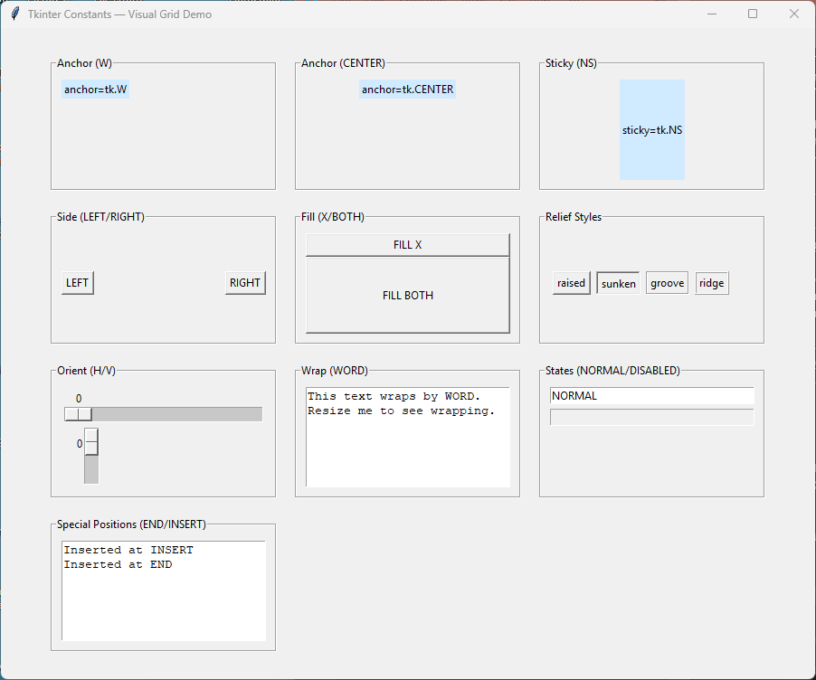

====================================================
tkinter constants
====================================================

Useful constants
----------------------------------------

| The common tkinter constants and their lowercase string equivalents are below.
| The lowercase versions are simpler to use.
| The constants require a reference to the tkinter module. e.g. tk.CENTER
| A full list of tkinter constants can be found at `<https://github.com/python/cpython/blob/main/Lib/tkinter/constants.py>`_

| The main ones used in this resource are `end` and the sticky constants: `n`, `s`, `e`, `w`, `center` and the sides: `left`, `right`, `top`, `bottom`.

----

Booleans
--------

- tk.NO=tk.FALSE=tk.OFF=0
- tk.YES=tk.TRUE=tk.ON=1

-anchor and -sticky
-------------------

- tk.N='n'
- tk.S='s'
- tk.W='w'
- tk.E='e'
- tk.NW='nw'
- tk.SW='sw'
- tk.NE='ne'
- tk.SE='se'
- tk.NS='ns'
- tk.EW='ew'
- tk.NSEW='nsew'
- tk.CENTER='center'

-fill
-----

- tk.NONE='none'
- tk.X='x'
- tk.Y='y'
- tk.BOTH='both'

-side
-----

- tk.LEFT='left'
- tk.TOP='top'
- tk.RIGHT='right'
- tk.BOTTOM='bottom'

-relief
-------

- tk.RAISED='raised'
- tk.SUNKEN='sunken'
- tk.FLAT='flat'
- tk.RIDGE='ridge'
- tk.GROOVE='groove'
- tk.SOLID='solid'

-orient
-------

- tk.HORIZONTAL='horizontal'
- tk.VERTICAL='vertical'

-tabs
----

- tk.NUMERIC='numeric'

-wrap
----

- tk.CHAR='char'
- tk.WORD='word'

-align
------

- tk.BASELINE='baseline'

-bordermode
-----------

- tk.INSIDE='inside'
- tk.OUTSIDE='outside'

Special tags, marks, and insert positions
-----------------------------------------

- tk.SEL='sel'
- tk.SEL_FIRST='sel.first'
- tk.SEL_LAST='sel.last'
- tk.END='end'
- tk.INSERT='insert'
- tk.CURRENT='current'
- tk.ANCHOR='anchor'
- tk.ALL='all' (e.g., Canvas.delete(ALL))

Text widget and button states
-----------------------------

- tk.NORMAL='normal'
- tk.DISABLED='disabled'
- tk.ACTIVE='active'

Canvas state
------------

- tk.HIDDEN='hidden'

----

Example usage
-----------------

| This script displays a visual grid demonstrating the most commonly used ``tkinter`` constants. Each constant is shown inside its own grid cell, together with a small widget that visually illustrates how the constant behaves.
| The grid includes demonstrations of:

- **Anchor constants**: ``N``, ``S``, ``E``, ``W``, ``CENTER``
  (controls text alignment inside a widget)

- **Sticky constants**: ``N``, ``S``, ``E``, ``W``, ``NSEW``
  (controls how widgets stretch inside a grid cell)

- **Side constants**: ``LEFT``, ``RIGHT``, ``TOP``, ``BOTTOM``
  (controls packing direction)

- **Fill constants**: ``X``, ``Y``, ``BOTH``
  (controls how widgets expand when packed)

- **Relief constants**: ``RAISED``, ``SUNKEN``, ``RIDGE``, ``GROOVE``,
  ``SOLID``, ``FLAT``
  (controls border style)

- **Orient constants**: ``HORIZONTAL``, ``VERTICAL``
  (used by widgets such as `Scale` and `Scrollbar`)

- **Wrap constants**: ``WORD``, ``CHAR``
  (controls text wrapping in `Text` widgets)

- **State constants**: ``NORMAL``, ``DISABLED``
  (controls widget interactivity)

- **Special text positions**: ``END``, ``INSERT``
  (used when inserting text into widgets such as `Text` and `Entry`)

----

Syntax
---------

.. py:data:: anchor=<tk.ANCHOR_CONSTANT or "anchor_string">

    | Controls internal alignment of text or content inside a widget.
    | Formal values: ``tk.N``, ``tk.S``, ``tk.E``, ``tk.W``, ``tk.NE``, ``tk.NW``,
      ``tk.SE``, ``tk.SW``, ``tk.CENTER``.
    | Informal string values: ``"n"``, ``"s"``, ``"e"``, ``"w"``, ``"ne"``, ``"nw"``,
      ``"se"``, ``"sw"``, ``"center"``.
    | Example (formal): ``Label(root, anchor=tk.W)``
    | Example (informal): ``Label(root, anchor="w")``

.. py:data:: sticky=<tk.STICKY_CONSTANT or "sticky_string">

    | Controls how a widget expands to fill its grid cell.
    | Formal values: ``tk.N``, ``tk.S``, ``tk.E``, ``tk.W``, ``tk.NSEW``.
    | Informal string values: ``"n"``, ``"s"``, ``"e"``, ``"w"``, ``"ns"``, ``"ew"``,
      ``"nsew"``.
    | Example (formal): ``frame.grid(sticky=tk.NSEW)``
    | Example (informal): ``frame.grid(sticky="nsew")``

.. py:data:: side=<tk.SIDE_CONSTANT or "side_string">

    | Controls which side of the parent a widget is packed against.
    | Formal values: ``tk.LEFT``, ``tk.RIGHT``, ``tk.TOP``, ``tk.BOTTOM``.
    | Informal string values: ``"left"``, ``"right"``, ``"top"``, ``"bottom"``.
    | Example (formal): ``button.pack(side=tk.LEFT)``
    | Example (informal): ``button.pack(side="left")``

.. py:data:: fill=<tk.FILL_CONSTANT or "fill_string">

    | Controls how a widget expands when packed.
    | Formal values: ``tk.X``, ``tk.Y``, ``tk.BOTH``, ``tk.NONE``.
    | Informal string values: ``"x"``, ``"y"``, ``"both"``, ``"none"``.
    | Example (formal): ``button.pack(fill=tk.X)``
    | Example (informal): ``button.pack(fill="x")``

.. py:data:: relief=<tk.RELIEF_CONSTANT or "relief_string">

    | Controls the 3D border style of a widget.
    | Formal values: ``tk.FLAT``, ``tk.RAISED``, ``tk.SUNKEN``, ``tk.GROOVE``,
      ``tk.RIDGE``, ``tk.SOLID``.
    | Informal string values: ``"flat"``, ``"raised"``, ``"sunken"``, ``"groove"``,
      ``"ridge"``, ``"solid"``.
    | Example (formal): ``Frame(root, relief=tk.RIDGE)``
    | Example (informal): ``Frame(root, relief="ridge")``

.. py:data:: orient=<tk.ORIENT_CONSTANT or "orient_string">

    | Controls orientation of directional widgets such as ``Scale`` or ``Scrollbar``.
    | Formal values: ``tk.HORIZONTAL``, ``tk.VERTICAL``.
    | Informal string values: ``"horizontal"``, ``"vertical"``.
    | Example (formal): ``Scale(root, orient=tk.VERTICAL)``
    | Example (informal): ``Scale(root, orient="vertical")``

.. py:data:: wrap=<tk.WRAP_CONSTANT or "wrap_string">

    | Controls text wrapping behavior in ``Text`` widgets.
    | Formal values: ``tk.WORD``, ``tk.CHAR``, ``tk.NONE``.
    | Informal string values: ``"word"``, ``"char"``, ``"none"``.
    | Example (formal): ``Text(root, wrap=tk.WORD)``
    | Example (informal): ``Text(root, wrap="word")``

.. py:data:: state=<tk.STATE_CONSTANT or "state_string">

    | Controls widget interactivity.
    | Formal values: ``tk.NORMAL``, ``tk.DISABLED``, ``tk.ACTIVE`` (some widgets),
      ``tk.READONLY`` (Entry only).
    | Informal string values: ``"normal"``, ``"disabled"``, ``"active"``,
      ``"readonly"``.
    | Example (formal): ``Entry(root, state=tk.DISABLED)``
    | Example (informal): ``Entry(root, state="disabled")``

.. py:data:: index=<tk.TEXT_INDEX or "index_string">

    | Special text positions used when inserting or deleting text.
    | Formal values: ``tk.END``, ``tk.INSERT``.
    | Informal string values: ``"end"``, ``"insert"``, or explicit positions like ``"1.0"``.
    | Example (formal): ``text.insert(tk.END, "Hello")``
    | Example (informal): ``text.insert("end", "Hello")``

----

| Each constant is demonstrated using a small widget placed inside a labelled frame, arranged in a multi-column grid for easy comparison.

.. literalinclude:: python/tk_constants.py
   :language: python
   :linenos:
