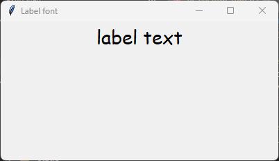
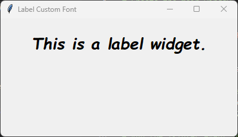

====================================================
Custom font
====================================================

| Fonts can be customized using the font attribute of a widget.
| There are two types of fonts: simple and complex.
| Simple fonts are created using the font attribute of a widget.
| Complex fonts are created using the font object from the tkinter.font module.

Simple Font
-------------

.. py:function:: label_widget  = tk.Label(parent, font=(font_type, font_size, font_style))

   - font_type is a font name. e.g "Arial"
   - font_size is the size of the font.  eg. 12
   - font_style can be bold, italic, underline or a space separated combination
   - Default Value: System-dependent (usually a default font)
   - Description: Specifies the font family, size, and style for the label text.
   - Example: To use a 12-point Arial font, use `font=("Arial", 12)`.
   - Example: To use a bold 12-point Arial font, use `font=("Arial", 12, "bold")`.
   - Example: To use a bold underlines 12-point Arial font, use `font=("Arial", 12, "bold underline")`.

font example
~~~~~~~~~~~~~~~~~~

.. code-block:: python

    import tkinter as tk

    # Create the main window
    root = tk.Tk()
    root.geometry("300x200")  # Set window size
    root.title("Label font")  # Set window title

    # Create the label widget with options
    label = tk.Label(root, text="label text", font=("Arial", 24))

    # Pack the label into the window
    label.pack()

    # Run the main event loop
    root.mainloop()

----

Custom Font
------------

| Creating a font object is useful when there are multiple widgets sharing the same font.
| This can be done by creating a font object and passing it to the font attribute of the widget.
| The font object can then be used to style multiple widgets.

| **font.Font** is a constructor from the ``tkinter.font`` module that is used to create a new font object.
| **from tkinter import font** is required.

.. py:function:: custom_font = font.Font(family=v_family, size=v_size, weight=v_weight, slant=v_slant)

    **Parameters**

      - **family=v_family** Specifies the font family to use. e.g. **family="Comic Sans MS"**
      - **size=v_size** Sets the font size in points.e.g. **size=20**:
      - **weight=v_weight** Sets the font weight. e.g. **weight="bold"**. e.g. **weight="normal"**.
      - **slant=v_slant** Makes the font italic or normal. e.g **slant="italic"**. Other possible values include "roman" (normal, upright text).

custom font example
~~~~~~~~~~~~~~~~~~~~~

This code below uses a font object to style text in a Tkinter Label.

.. code-block:: python

    import tkinter as tk
    from tkinter import font

    # Create the main window
    root = tk.Tk()
    root.geometry("300x200")  # Set window size
    root.title("Label Custom Font")

    # Define the custom font
    custom_font = font.Font(family="Comic Sans MS", size=20, weight="bold", slant="italic")

    # Create a Label widget using the custom font
    label = tk.Label(root, text="This is a label widget.", font=custom_font)
    label.pack(padx=20, pady=20)

    # Run the Tkinter event loop
    root.mainloop()

