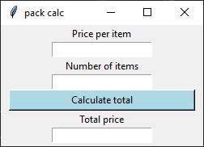
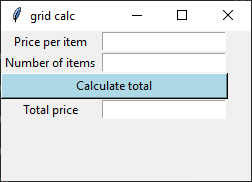
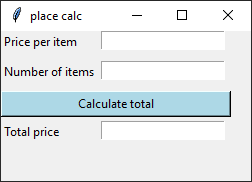

====================================================
tkinter geometry Cost Calculator
====================================================

| The cost calculator below has 3 versions which use the pack, grid and place geometry managers.
| See: https://www.youtube.com/watch?v=OKfra37r4D0&list=PLs3IFJPw3G9KL3huzPS7g-0PCbS7Auc7I&index=4

----

Cost Calculator - pack
---------------------------

.. py:function:: widget.pack()

    | pack() positions widgets relative to each other.
    | By default, widgets are stacked vertically from the top of the container.

| Below is a sample cost calculator using the pack layout.
| The calculate_price() function computes the total price based on the user input for price per item and number of items.
| Inside the try block: it retrieves the user input from the price_per_item_entry and number_of_items_entry widgets using the .get() method.
| It converts these input values to integers using int().
| If any exceptions occur (e.g., invalid input), the except block catches them and does nothing (using pass).
| Updating the GUI: the total_price_entry widget is used to display the calculated total.
| It first clears any existing content using .delete(0, "end").
| Then, it inserts the new total value (converted to a string) using .insert(0, string=str(total)).

| ``calculate_button.pack(fill="x", padx=10)`` stretches out the button and adds a small padding to the left and right.

.. code-block:: python

    import tkinter as tk

    def calculate_price():
        try:
            total = int(price_per_item_entry.get()) * int(number_of_items_entry.get())
            total_price_entry.delete(0, "end")
            total_price_entry.insert(0, string=str(total))
        except:
            pass

    # Create the main window
    root = tk.Tk()
    root.title("pack calc")
    root.geometry("250x150")

    #  create widgets in frame
    price_per_item_label = tk.Label(root, text="Price per item")
    price_per_item_entry = tk.Entry(root)

    number_of_items_label = tk.Label(root, text="Number of items")
    number_of_items_entry = tk.Entry(root)

    total_price_label = tk.Label(root, text="Total price")
    total_price_entry = tk.Entry(root)

    calculate_button = tk.Button(root, text="Calculate total", bg="light blue", command=calculate_price)

    # # place widgets
    price_per_item_label.pack()
    price_per_item_entry.pack()
    number_of_items_label.pack()
    number_of_items_entry.pack()
    # fill the horizontal space; x axis
    calculate_button.pack(fill="x", padx=10)
    total_price_label.pack()
    total_price_entry.pack()

    # Start the main event loop
    root.mainloop()

----

Cost Calculator - grid
----------------------------

.. py:function:: widget.grid(row=row_index,column=column_index)

    | The `grid()` method is used to position widgets within a container using a grid-based layout.
    | Widgets are placed in rows and columns.
    | Specify the row and column indices where the widget should appear.

| Below is a sample Cost Calculator using grid layout.
| ``calculate_button.grid(row=2, column=0, columnspan=2, ipadx=70)`` uses ipadx to stretch the button.

.. code-block:: python

    import tkinter as tk

    def calculate_price():
        try:
            total = int(price_per_item_entry.get()) * int(number_of_items_entry.get())
            total_price_entry.delete(0, "end")
            total_price_entry.insert(0, string=str(total))
        except:
            pass

    # Create the main window
    root = tk.Tk()
    root.title("grid calc")
    root.geometry("250x150")

    #  create widgets in frame
    price_per_item_label = tk.Label(root, text="Price per item")
    price_per_item_entry = tk.Entry(root)

    number_of_items_label = tk.Label(root, text="Number of items")
    number_of_items_entry = tk.Entry(root)

    total_price_label = tk.Label(root, text="Total price")
    total_price_entry = tk.Entry(root)

    calculate_button = tk.Button(root, text="Calculate total", bg="light blue", command=calculate_price)

    # # place widgets
    price_per_item_label.grid(row=0, column=0)
    price_per_item_entry.grid(row=0, column=1)
    number_of_items_label.grid(row=1, column=0)
    number_of_items_entry.grid(row=1, column=1)
    # fill the horizontal space; x axis
    calculate_button.grid(row=2, column=0, columnspan=2, ipadx=70)
    total_price_label.grid(row=3, column=0)
    total_price_entry.grid(row=3, column=1)

    # Start the main event loop
    root.mainloop()

----

Cost Calculator - place
-------------------------

.. py:function:: widget.place(x=x_value, y=y_value)

    | The `place()` method is used to precisely position widgets within a container using the (x, y) coordinate system. Here's how it works:
    | In absolute positioning, specify the exact x and y coordinates of the widget using the `x` and `y` parameters.

| Below is a sample Cost Calculator using place method to position widgets.
| ``calculate_button.place(x=0, y=60, width=230)`` uses a width of 230 to stretch out the button.

.. code-block:: python

    import tkinter as tk

    def calculate_price():
        try:
            total = int(price_per_item_entry.get()) * int(number_of_items_entry.get())
            total_price_entry.delete(0, "end")
            total_price_entry.insert(0, string=str(total))
        except:
            pass

    # Create the main window
    root = tk.Tk()
    root.title("place calc")
    root.geometry("250x150")

    #  create widgets in frame
    price_per_item_label = tk.Label(root, text="Price per item")
    price_per_item_entry = tk.Entry(root)

    number_of_items_label = tk.Label(root, text="Number of items")
    number_of_items_entry = tk.Entry(root)

    total_price_label = tk.Label(root, text="Total price")
    total_price_entry = tk.Entry(root)

    calculate_button = tk.Button(root, text="Calculate total", bg="light blue", command=calculate_price)

    # place widgets
    price_per_item_label.place(x=0, y=0)
    price_per_item_entry.place(x=100, y=0)
    number_of_items_label.place(x=0, y=30)
    number_of_items_entry.place(x=100, y=30)
    calculate_button.place(x=0, y=60, width=230)
    total_price_label.place(x=0, y=90)
    total_price_entry.place(x=100, y=90)

    # Start the main event loop
    root.mainloop()
