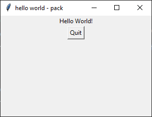
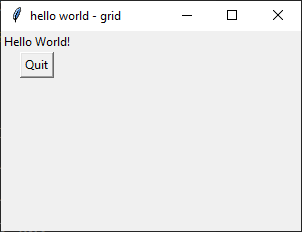
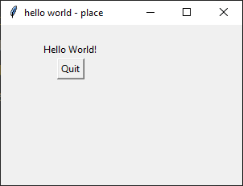

====================================================
tkinter geometry Hello World
====================================================

| The geometry managers allows you to arrange widgets within a root.
| The Hello World example below has 3 versions which use the pack, grid and place geometry managers.
| See: `<https://tkdocs.com/tutorial/grid.html>`_
| See: `<https://www.geeksforgeeks.org/python-pack-method-in-tkinter/?ref=lbp>`_

----

Hello World - pack
-------------------

.. py:function:: widget.pack()

    | positions widgets relative to each other.
    | By default, widgets are stacked vertically from the top of the container.

| Below is a sample Hello World using the pack layout.

.. code-block:: python

    import tkinter as tk

    # Create the main application window
    root = tk.Tk()
    root.title("hello world - pack")
    root.geometry('300x200')

    # define widgets
    label = tk.Label(root, text="Hello World!")
    button = tk.Button(root, text="Quit", command=root.destroy)

    # place widgets using pack
    label.pack()
    button.pack()

    # Start the main event loop
    root.mainloop()

Code details
~~~~~~~~~~~~~~~~

| Overall, this code creates a simple **Tkinter** application with a window,
| a label displaying "Hello World!", and a button that allows the user to quit the application.

| ``import tkinter as tk``: imports the **Tkinter** library and assigns it an alias (``tk``).
| By doing this, you can use the ``tk`` prefix to access various **Tkinter** classes and functions throughout your code.

| ``root = tk.Tk()``: Here, the ``Tk()`` constructor initializes the main application root.
| You can customize this window by setting properties such as its title, size, and other attributes.

| ``root.title("hello world - pack")``: sets the title of the application window to "hello world - pack".
| You can replace this string with any other title you'd like for your application.

| ``root.geometry('300x200')``: The ``geometry()`` method defines the initial size of the root.
| In this case, the window will be 600 pixels wide and 400 pixels tall.

| ``label = tk.Label(root, text="Hello World!")``: A label widget is created with the text "Hello World!".
| Labels are used to display static text or messages in the GUI.
| The ``label`` variable holds a reference to this widget.

| ``button = tk.Button(root, text="Quit", command=root.destroy)``: A button widget is created with the label "Quit".
| When this button is clicked, the ``root.destroy()`` method is called, which closes the application root.
| The ``button`` variable holds a reference to this widget.

| ``label.pack()``: The ``pack()`` method is used to put the ``label`` widget into the root.

| ``button.pack()``: The ``pack()`` method is used to add the ``button`` widget vertically into the root.

| ``root.mainloop()``: starts the main event loop, which keeps the application running and responsive.
| It listens for user interactions (such as button clicks) and updates the GUI accordingly.
| Any code after it will not run until the tkinter window is closed.

----

Hello World - grid
-------------------

.. py:function:: widget.grid(row=row_index,column=column_index)

    | The `grid()` method is used to position widgets within a container using a grid-based layout.
    | Widgets are placed in rows and columns.
    | Specify the row and column indices where the widget should appear.

| Below is a sample Hello World using grid layout.

.. code-block:: python

    import as tk

    # Create the main application window
    root = tk.Tk()
    root.title("hello world - grid")
    root.geometry('300x200')

    # define widgets
    label = tk.Label(root, text="Hello World!")
    button = tk.Button(root, text="Quit", command=root.destroy)

    # place widgets
    label.grid(row=0,column=0)
    button.grid(row=1,column=0)

    # Start the main event loop
    root.mainloop()

Code details
~~~~~~~~~~~~~~~~~~

| Overall, this code creates a simple **Tkinter** application with a window,
| a label displaying "Hello World!", and a button that allows the user to quit the application.

| ``label.grid(row=0, column=0)``: The ``grid()`` method is used to place the ``label`` widget
|  in the first row (row 0) and first column (column 0) of the window's grid layout.

| ``button.grid(row=1, column=0)``: Similarly, the ``button`` widget is placed
| in the second row (row 1) and first column (column 0) of the grid layout.

----

Hello World - place
-------------------

.. py:function:: widget.place(x=x_value, y=y_value)

    | The `place()` method is used to precisely position widgets within a container using the (x, y) coordinate system. Here's how it works:
    | In absolute positioning, specify the exact x and y coordinates of the widget using the `x` and `y` parameters.

| Below is a sample Hello World using place method to position widgets.

.. code-block:: python

    import tkinter as tk

    # Create the main application window
    root = tk.Tk()
    root.title("hello world - place")
    root.geometry("300x200")

    # Define widgets
    label = tk.Label(root, text="Hello World!")
    button = tk.Button(root, text="Quit", command=root.destroy)

    # Place widgets using x and y coordinates
    label.place(x=50, y=20)
    button.place(x=70, y=42)

    # Start the main event loop
    root.mainloop()

Code details
~~~~~~~~~~~~~~~~~

| Overall, this code creates a simple **Tkinter** application with a window,
| a label displaying "Hello World!", and a button that allows the user to quit the application.

| ``label.place(x=250, y=0)``: The ``place()`` method is used to place the ``label`` widget
|  at (x, y) = (250, 0) in the root.

| ``button.place(x=270, y=22)``: The ``place()`` method is used to place the ``label`` widget
|  at (x, y) = (270, 22) in the root.

